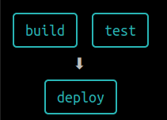

GitHub Actions es una herramienta potente, puedes ejecutar pruebas, construir tu aplicación, desplegarla, incluso [minar bitcoins](https://github.blog/2021-04-22-github-actions-update-helping-maintainers-combat-bad-actors/) :pensive:

Cuando estás creando una acción o un flujo de trabajo (workflow) en GitHub Actions, es muy común la necesidad de probarlo, verificar si todo funciona como necesitas y, si algo no es correcto, corregirlo; en otras palabras, al igual que otro software, GitHub Actions necesita ser iterado.

Hacerlo en GitHub tiene desventajas:

- Desperdicio de tiempo de ejecución: incluso si usas un plan gratuito, tienes un límite de 2000 minutos al mes.
- Llenar el historial de tu repositorio con commits "basura": Como la definición de la acción está en el repositorio, cada cambio es un nuevo commit. Si estás probando algo, es muy común llenar el historial de tu repositorio con los commits de cada cambio. Puedes [combinar estos commits (squash)](https://www.internalpointers.com/post/squash-commits-into-one-git) en uno solo, pero es un paso extra.
- Es lento.

# ACT

[ACT](https://github.com/nektos/act) viene a ayudarnos; esta herramienta nos permite ejecutar GitHub Actions en nuestra computadora local.

Crea un entorno igual al que proporciona GitHub, utiliza imágenes de Docker para ejecutar las acciones, y las variables de entorno y el sistema de archivos están configurados para coincidir con lo que ofrece GitHub.

## Instalación

Act está disponible para Linux, Windows y MacOS. Las instrucciones de instalación (y dependencias) dependen de tu sistema operativo. Me voy a centrar en Ubuntu, pero puedes consultar la [documentación oficial](https://github.com/nektos/act#installation) para saber cómo instalarlo en tu sistema operativo.

En Ubuntu, necesitas Go 1.16+ como dependencia y ejecutar:

```bash
go install github.com/nektos/act@latest
```

Es muy útil añadir la ruta de los binarios de Go a tu PATH.
Por ejemplo, si usas **zsh** como shell:

```bash
echo "export PATH=$PATH;~/go/bin/" >> ~/.zshrc
```

## Ejecutando tu acción

Ejecutar una acción en tu computadora es tan simple como ir a la carpeta raíz de tu repositorio y ejecutar:

```bash
act
```

En la primera ejecución, Act te pedirá que elijas la imagen por defecto para ejecutar la acción. La imagen a elegir depende de tu acción, pero te recomiendo elegir la _medium image_, porque la imagen _micro_, por ejemplo, no puede instalar Python.

Si tu acción necesita "secrets" (secretos), fallará. Debemos configurar los secretos y eso es tan fácil como pasar un argumento a _act_:

```bash
act -s GITHUB_TOKEN=<your_token> -s OTHER_SECRET=<value>
```

Es importante tener en cuenta que GitHub siempre inyecta el secreto `GITHUB_TOKEN`, pero en nuestro entorno local, debemos proporcionar el valor.
Si tu acción necesita este valor (por ejemplo, para desplegar en GHPages después de la construcción), debes proporcionarlo.
Para crear un token en GitHub solo necesitas navegar a _Settings > Developer settings > Personal access tokens_ o simplemente https://github.com/settings/tokens

## Disparando eventos personalizados

Por defecto, act ejecuta la acción configurada con "on: push" en tu archivo de workflow, pero tal vez quieras ejecutar otro workflow dependiendo de otros disparadores (triggers), y puedes hacerlo; solo necesitas pasar el nombre del evento como argumento:

```bash
act pull_request
act workflow_dispatch
act release
...
```

## Usar un workflow específico

A veces tienes más de un archivo de workflow; usualmente no se ejecutan con el mismo disparador, pero de todos modos, puedes establecer el archivo de workflow a usar.

```bash
act -W <path to workflow file>
```

## Listar las acciones

Ejecutando `act -l` o `act release -l` puedes listar las acciones que se ejecutarán.

## Dibujar el workflow

A veces puede ser interesante ver el árbol de dependencias de la acción; usando el flag `-g` obtendrás una salida como esta:



## Ejecutar un job específico

Si quieres probar un trabajo (job) específico dentro del workflow, puedes pasar el nombre del job usando el argumento `-j`, por ejemplo:

```bash
act -j deploy
```

Hay más flags. Puedes consultar la lista completa [aquí](https://github.com/nektos/act#flags)

## GitHub Enterprise

Act puede iniciar sesión en servidores privados de GitHub Enterprise de forma tan simple como añadir `--github-instance <your-company-ghe-server>` en el comando.

# Resumen

_Act_ es una herramienta maravillosa para ejecutar GH Actions en local cuando las estás creando o iterando, evitando usar el repositorio real para probarlas.
Pero _Act_ es algo más: también puedes usarlo como un ejecutor de tareas local utilizando todo el potencial y las acciones del marketplace de GitHub Actions para crear tus tareas locales, y estas tareas pueden moverse fácilmente a la nube si lo necesitas.
