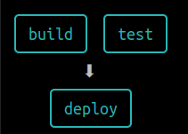

GitHub Actions is a powerful tool, you can run tests, build your app, deploy it, even [mining bitcoins](https://github.blog/2021-04-22-github-actions-update-helping-maintainers-combat-bad-actors/) :pensive:

When you are creating an action or workflow in GitHub Actions, it is very common the needing of test it, check if all works as you need and if something is not correct, fix it, in other works as other software GitHub Actions need to be iterated.

Doing it in GitHub have disadvantages:

- Waste running time: even if you are using a free plan you have a 2000 minutes per month limit
- Fill your repository history with "trash" commit: As the action definition is in the repo, every change is a new commit, if you are testing something that is very common to fill your repo history with the commits of every change. You can [squash these commits](https://www.internalpointers.com/post/squash-commits-into-one-git) into one, but is an extra step
- Is slow

# ACT

[ACT](https://github.com/nektos/act) comes to help us, this tool allows us to run GitHub Actions on our local computer.

It creates an environment equal to GitHub provides, uses Docker images to run the actions, the environment variables and filesystem are all configured to match what GitHub provides.

## Install

Act is available for Linux, Windows and MacOS, the installation instructions (and dependencies) depend on your OS, I'm going to focus on Ubuntu, but you can check the [official docs](https://github.com/nektos/act#installation) to know how to install in your OS.

In Ubuntu, you need Go 1.16+ as a dependency and run

```bash
go install github.com/nektos/act@latest
```

Is very useful to add the Go bin path to your PATH
For example, if you are using **zsh** as shell

```bash
echo "export PATH=$PATH;~/go/bin/" >> ~/.zshrc
```

## Running your action

Running an action on your computer is simple as go to your repo root folder and run:

```bash
act
```

In the first run, Act will ask you to choose the default image to run the action. The image to choose depends on your action, but I recommend you to choose, the _medium image_, because the _micro_ image for example can't install Python

If your action needs "secrets" will fail. We must set the secrets and that is easy as pass an argument to _act_

```bash
act -s GITHUB_TOKEN=<your_token> -s OTHER_SECRET=<value>
```

It's important to bear in mind that GitHub always injects the `GITHUB_TOKEN` secret, but in our local environment, we must provide the value.
If your action needs this value (for example, after build, deploy to GHPages) you must provide it.
To create a token in GitHub you only need to navigate to _Settings > Developer settings > Personal access tokens_ or just https://github.com/settings/tokens

## Dispatching custom events

By default, act runs the "on: push" configured action in your workflow file, but maybe you want to run another workflow depending on other triggers, and you can, only need to pass the event name as an argument

```bash
act pull_request
act workflow_dispatch
act release
...
```

## Use a specific workflow

Sometimes you have more than workflow files, usually, they don't run on the same dispatcher, but anyway, you can set the workflow file to use.

```bash
act -W <path to workflow file>
```

## Listing the actions

Running `act -l` or `act release -l` you can list the action that will run

## Draw workflow

Sometimes can be interesting to see the action's dependency tree, using the `-g` flag you will get an exit like that



## Run a specific job

If you want to test a specific job into the workflow you can pass the job name using `-j` argument, for example

```bash
act -j deploy
```

There are more flags. You can check the full list [here](https://github.com/nektos/act#flags)

## GitHub Enterprise

Act can login to private GitHub Enterprise servers as simple as add `--github-instance <your-company-ghe-server>` in the command

# Summary

_Act_ it's a wonderful tool to run GH Action in local when you are creating or iterating it, avoiding using the real repo to test it.
But _Act is_ something more, you can also use it as a local task runner using all the power, and the actions in the GitHub Actions marketplace to create your local task, and this task can easily move to the cloud if you need it.
