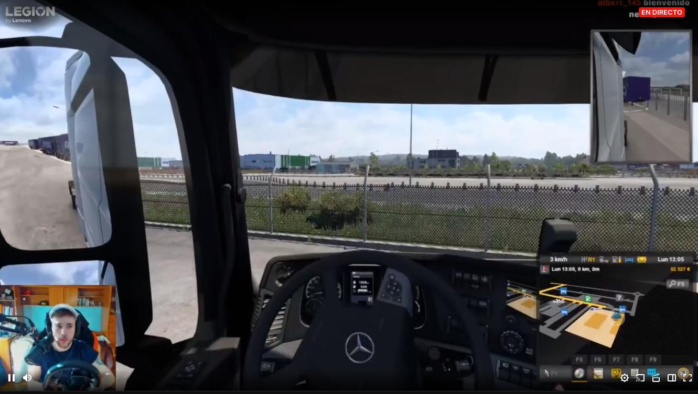
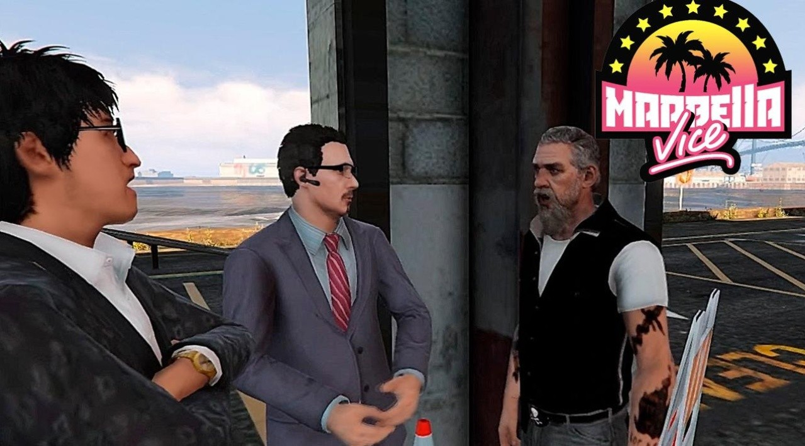
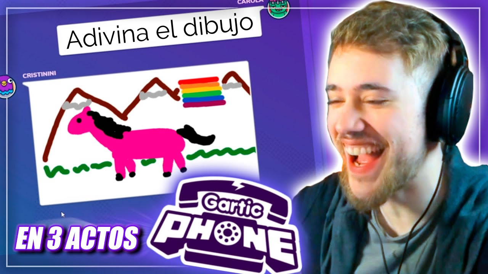
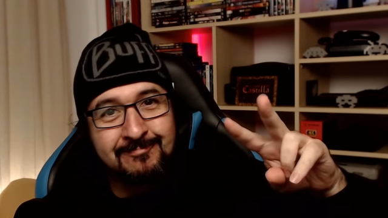
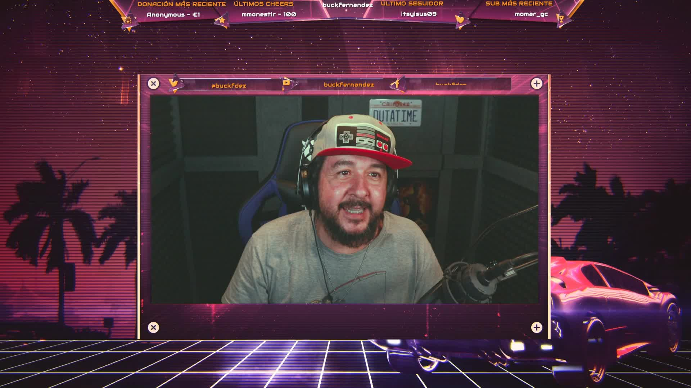
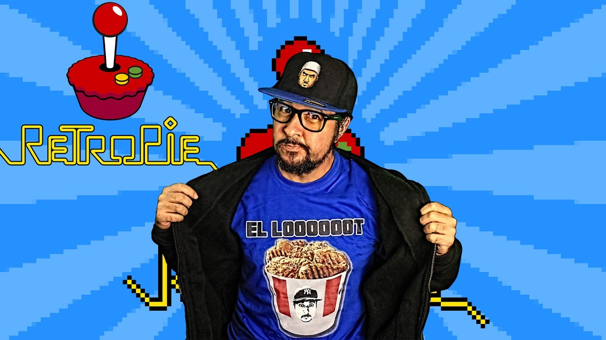
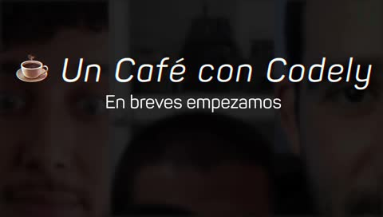
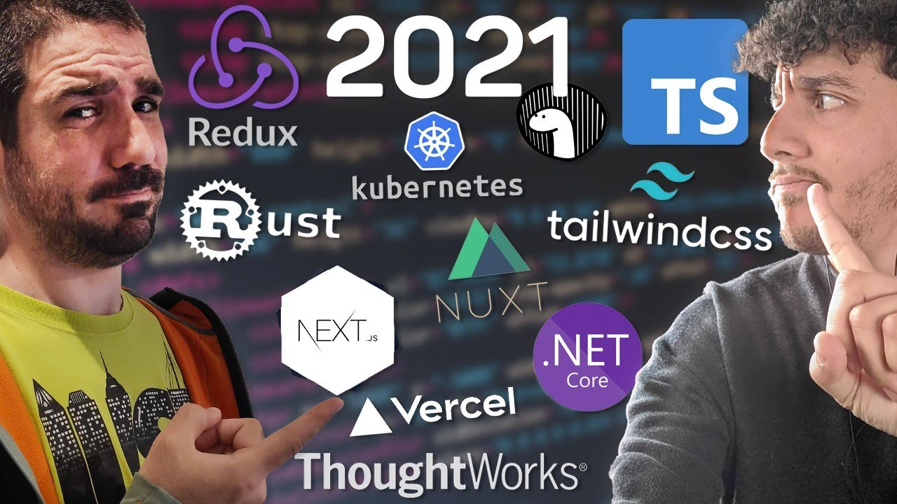
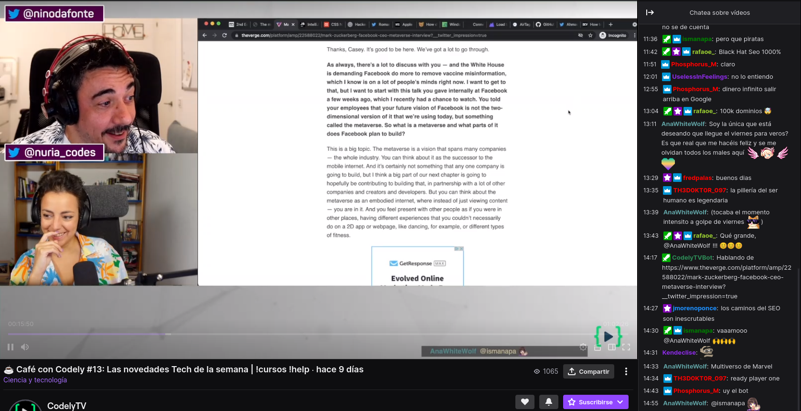

---

> Disclaimer: This is my first post in Spanish in quite a while; the reason is that the content I'm going to talk about is mostly in Spanish and it would be a bit weird to do it in English.

As the title says, I'm already almost a boomer, which according to many stereotypes would make me the typical television consumer during my entertainment hours, but for about 4-5 years now I've been gradually reducing my TV consumption to practically zero.

I'm not going to go too deep into the reasons for this change, but I can summarize it as: **Low quality content** and **excessive advertising**.

At first, my entertainment consumption habits moved to YouTube, because YT offered me entertainment and learning resources. I wrote a couple of posts talking about my favorite channels:
:astro-ref[2020 version]{path="blog/2020/my-favourite-youtube-channels-2020"} and
:astro-ref[2018 version]{path="blog/2018/Mis-canales-favoritos-de-YouTube"}, and some of them are still there.

When I was receiving :astro-ref[chemotherapy treatment]{path="blog/2018/Como-es-uno-de-mis-ciclos-de-quimioterapia"} at the beginning of 2019, and since I had time during recovery to, among many other things, watch entertainment, I started discovering Twitch because one of the YouTubers I already knew also _streamed_, and from there I started following the trail of other streamers.

And then came 2020, the year of the pandemic and lockdowns, and this really took off. In fact, I'm no longer just a Twitch consumer, but also a creator since we've used it as a platform to broadcast talks from technical communities like [PHPVigo](https://www.twitch.tv/phpvigo?lang=es-ES) and especially [LaretasGeek](https://www.twitch.tv/laretasgeek).

# What is Twitch?

For those who don't know Twitch (if there's anyone left who doesn't know it at this point), it's a live video broadcasting platform (streams); each channel has a chat that can interact with the streamer (since most streams are managed by a single person). The difference with other platforms is that the videos only remain available after the broadcast for a few days, meaning they are intended to be consumed live.

Anyone can follow a channel for free (so they notify us when the streams start).

## How do streamers make money on Twitch?

Additionally, you can _subscribe_ to the channel, which involves payment—currently, with the changes introduced by Twitch, €4/month in Spain (of which the streamer takes between 50% and 70%)—and you can also gift subscriptions to others.

Normally, streamers use tools that show an overlay on the stream when someone subscribes or gifts subscriptions to others. This reinforces the act of becoming a subscriber.

Although most subscriptions have no direct cost for followers because if you have Amazon Prime, you can make one free subscription per month.

Direct donations (bits) can also be made.

## What content is on Twitch?

Twitch was born as a platform for broadcasting video game matches, which are still the majority, but there are also many other types of content not related to video games, such as "Just Chatting," where the streamer talks to their audience, and "Science and Technology Broadcasting." In reality, any type of live video is susceptible to being broadcast on Twitch; in fact, this year Spanish league football matches have been broadcast (legally) and more recently, Ibai has [broadcast the Copa América](https://www.youtube.com/watch?v=AFFq0gLd2Uo).

# My favorite Twitch channels

### Carola: https://www.twitch.tv/carola

This streamer is the one we are watching the most right now at home. He started mainly playing GTA5 Roleplay, creating very interesting characters and knowing how to manage improvisation and character planning very well, in my opinion. He is also Galician and his humor is also very Galician at times, and above all, because he makes us laugh almost every time we watch him, and that's worth a lot.
In the last 2 years, he has formed a group with MenosTrece, Ricoy, and Agustabell (other streamers) mainly to play survival games, like Escape From Tarkov.

### BuckFernandez: https://www.twitch.tv/buckfernandez

This streamer and YouTuber, who must be close to my age, is a music producer, rapper, etc.
His streams are not as massive as others, but he bases them on creating quality content that he and his regulars like. You can find him composing music, playing retro games with real consoles (not just emulators), or making humorous summaries of 80s B-movies.

### MenosTrece https://www.twitch.tv/menostrece

I think he was one of the first entertainment YouTubers I started following. On Twitch, he plays alone or with other players like Carola, Agus, or Ricoy, and mostly games like Escape from Tarkov, Rust, 7 Days to Die, Day by Daylight, etc.

> In the following ones, I won't go into as much detail because I watch them more casually.

### Agustabell212 https://www.twitch.tv/agustabell212

### Ricoy23 https://www.twitch.tv/ricoy23

Agus and Ricoy are cousins and usually play together; they are very good at Rust.

### Silithur https://www.twitch.tv/silithur

He is a streamer who plays a bit of everything, and often interacts with others mentioned above; he has the ability to transmit peace and relaxation.

### Angel Martin https://www.twitch.tv/angelmartin

I admire his capacity for criticism, his irony, and the fact that he has known how to reinvent himself: coming from the world of TV and now creating a stream with quite a few followers and, for my taste, very good quality.

### Ibai https://www.twitch.tv/ibai

Ibai is the revelation of 2020; previously he _casted_ (broadcasted esports, or things as crazy as [marble races](https://www.youtube.com/watch?v=bJgfisVKe6w)) and has broken audience records on Twitch, for example, when he broadcasted the New Year's Eve countdown. What I like mainly are the relaxed "interviews" he does with people who don't go to other platforms.

### Auronplay https://www.twitch.tv/auronplay

What can I say about Auronplay? He must be the streamer with the best numbers in the Spanish-speaking world right now. I'm not a big consumer of all his content, but sometimes I put it on in the background and it's fun.

### Outconsumer https://www.twitch.tv/outconsumer

Another streamer who seems to be from my generation, and who talks about basketball, other sports, and plays, but always with a calm message and an educational background.

### IamCristinini https://www.twitch.tv/iamcristinini

She is another one of the greats of roleplay.

# Technical and educational stream channels

### CodelyTv https://www.twitch.tv/codelytv

Little more to say about CodelyTV that you probably don't already know. Apart from the online course platform they have, they disseminate technology every week on Twitch for all of us to enjoy. With interesting, entertaining content that generates debates and funny situations.

### DotCSV https://www.twitch.tv/dotcsv

Channel dedicated mainly to news about AI and ML.

### LaHiperActina https://www.twitch.tv/lahiperactina

Channel dedicated to the dissemination of biomedicine.

### Alva Majo https://www.twitch.tv/5ro4

Dedicated to talking about video game creation with a very particular style and a lot of sarcasm.

### Salva Spin https://www.twitch.tv/salvaespin

Salva is a professional cartoonist; he works for DC drawing Deadpool. In some of his streams, he shows how he works while creating the drawings.

There are many other [streamers I follow](https://www.twitch.tv/directory/following/channels) and others I know and have watched very occasionally, such as [elxokas](https://www.twitch.tv/elxokas), [elisawavess](https://www.twitch.tv/elisawavess), [gtv_genesis](https://www.twitch.tv/gtv_genesis), [sarinha_3](https://www.twitch.tv/sarinha_3), [Little Mary](https://www.twitch.tv/little_mary), [JuanGuarnizo](https://www.twitch.tv/juansguarnizo), etc...

We can leave for another post the opinion on whether the content is always appropriate for audiences of certain ages. Spoiler: Not always; as on all platforms, unfortunately, there is toxic content or examples that in my opinion are not good.

I hope you liked my first post in Spanish, which as you can see was published in August, a month in which most of us are thinking about vacations, hence why I didn't write anything technical.

If you want to share any channel you know or like, don't hesitate to leave it in the comments.