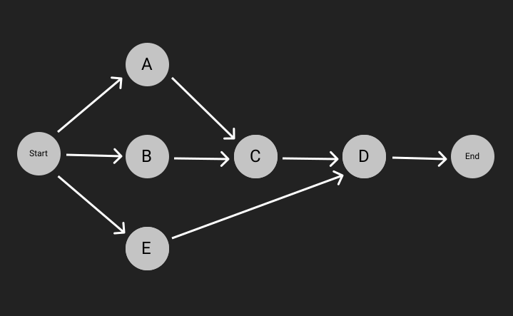
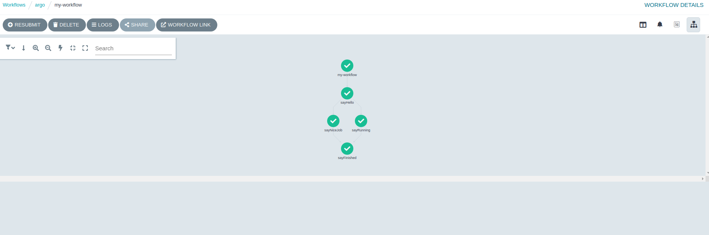
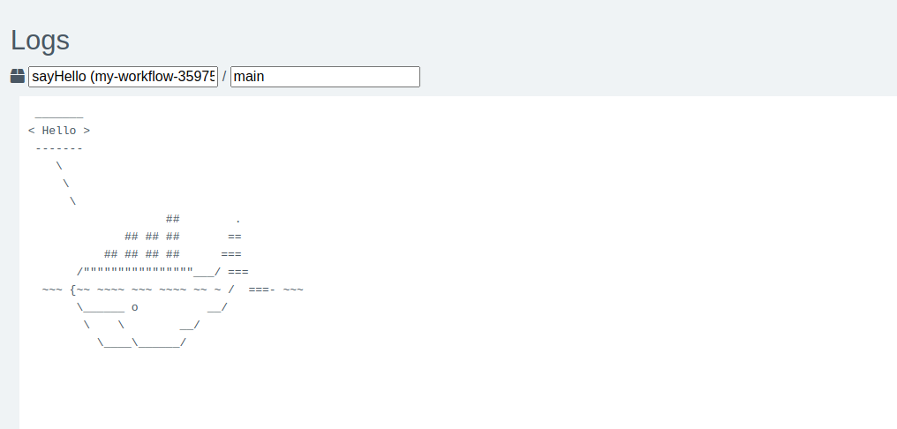

Simplificándolo, un workflow es una lista de tareas para ejecutar en cierto orden y/o cumpliendo algunas dependencias, por ejemplo, si tenemos 5 tareas para ejecutar: `A`, `B`, `C`, `D`, `E`.
La tarea `C` depende de que finalicen las tareas `A` y `B`, la tarea `D` depende de que finalicen `C` y `E`.

Algo como esto:



Existen varias herramientas para orquestar eso, pero nos centraremos en _[Argo Workflows](https://argoproj.github.io/argo-workflows/)_

_Argo Workflows es un motor de workflows nativo de contenedores y de código abierto para orquestar trabajos paralelos en *Kubernetes*._

Ejecutarse sobre Kubernetes es una de las cosas más características de Argo que lo diferencia de otros.

Cada tarea que definas se ejecutará en un contenedor o, en otras palabras, debes crear un contenedor para ejecutar las tareas, y todo ello se ejecutará en tu clúster de Kubernetes.

## Instalar Argo Workflows

Instalar Argo Workflows es muy fácil, solo necesitas aplicar un manifiesto en tu clúster para configurar los servicios de Argo en el clúster:

Por ejemplo: https://raw.githubusercontent.com/argoproj/argo-workflows/master/manifests/quick-start-postgres.yaml

<small>Más info: https://argoproj.github.io/argo-workflows/quick-start/</small>

Argo Workflows también proporciona una URL para acceder a una interfaz de usuario (UI) para gestionar Workflows, Eventos, Informes, Usuarios, Documentación, etc...

Para llevar el seguimiento de los workflows, etc., Argo necesita persistencia, por ejemplo: Postgres, MySQL, etc...

Como se indica en la documentación oficial, es muy recomendable crear un namespace (ej. argo) en el clúster para "instalar" en él todos los servicios de Argo.

## Workflows

Hay dos tipos de workflows: _Regular workflows_ y _Cron Workflows_

Ambos son básicamente lo mismo, pero un _cron workflow_ crea un _Regular workflow_ automáticamente cuando debe ejecutarse según la sintaxis de cron, ej. _/3 * * * *_. Ten en cuenta que puede crear más de un workflow.

Los workflows se definen como manifiestos de Kubernetes que deben aplicarse al mismo namespace que los servicios de Argo.

Este manifiesto define todas las tareas y sus dependencias.

```yaml
apiVersion: argoproj.io/v1alpha1
kind: Workflow
metadata:
  name: my-workflow
apiVersion: argoproj.io/v1alpha1
kind: Workflow
metadata:
  generateName: my-workflow
spec:
  entrypoint: tasksDependencies # This is the name of the template to run first
  templates:
    - name: exampleTask
      inputs:
        parameters:
          - name: msg
      container:
        image: docker/whalesay
        command: [cowsay]
        args: [{{ inputs.parameters.msg }}]
    - name: tasksDependencies
      dag:
        tasks:
          - name: sayHello
            template: exampleTask
            arguments:
              parameters:
                - name: text
                  value: "Hello"
          - name: sayNiceJob
            template: exampleTask
            dependencies: [ sayHello ]
            arguments:
              parameters:
                - name: text
                  value: "Nice Job"
          - name: sayRunning
            template: exampleTask
            dependencies: [ sayHello ]
            arguments:
              parameters:
                - name: text
                  value: "Running"
          - name: sayFinished
            template: exampleTask
            dependencies: [ sayRunning, sayNiceJob]
            arguments:
              parameters:
                - name: text
                  value: "It's over"
spec:
  entrypoint: exampleTask # This is the name of the template to run first
  templates:
    - name: exampleTask
      inputs:
        parameters:
          - name: msg
      container:
        image: docker/whalesay
        command: [cowsay]
        args: ["{{ inputs.parameters.msg }}"]
    - name: tasksDependencies
      dag:
        tasks:
          - name: sayHello
            template: exampleTask
            arguments:
              parameters:
                - name: msg
                  value: "Hello"
          - name: sayNiceJob
            template: exampleTask
            dependencies: [ sayHello ]
            arguments:
              parameters:
                - name: msg
                  value: "Nice Job"
          - name: sayRunning
            template: exampleTask
            dependencies: [ sayHello ]
            arguments:
              parameters:
                - name: msg
                  value: "Running"
          - name: sayFinished
            template: exapleTask
            dependencies: [ sayRunning, sayNiceJob]
            arguments:
              parameters:
                - name: msg
                  value: "It's over"
```

Expliquemos este ejemplo, aunque a primera vista ya se puede ver el potencial de Argo.

Una plantilla (template) define un trabajo a realizar, puede ser un [container](https://argoproj.github.io/argo-workflows/workflow-concepts/#container) (como en nuestro ejemplo), un [script](https://argoproj.github.io/argo-workflows/workflow-concepts/#script), un [resource](https://argoproj.github.io/argo-workflows/workflow-concepts/#resource) (para realizar operaciones en los recursos del clúster directamente desde el workflow) y [suspend](https://argoproj.github.io/argo-workflows/workflow-concepts/#suspend), que sirve simplemente para esperar el tiempo definido.

En nuestro ejemplo, definimos una plantilla llamada `exampleTask` (este nombre debe ser único y puede usarse para referirse a esta plantilla).

Para la tarea, definimos un parámetro de entrada, un msg para imprimir. Este valor puede ser referenciado más tarde.

Esta tarea utiliza un contenedor con la imagen `docker/whalesay` del registro de Docker, pero puedes usar tu propio registro privado. Argo ejecuta el comando `[cowsay]` y utiliza los valores de entrada definidos anteriormente como argumentos del comando `[{{inputs.parameters.text}}]`.

Las plantillas también pueden definir [Template Invocators](https://argoproj.github.io/argo-workflows/workflow-concepts/#template-invocators), que se utilizan para llamar a otras plantillas y realizar el control de ejecución. En nuestro ejemplo estamos usando DAG ((Directed Acyclic Graph)[https://airflow.apache.org/docs/apache-airflow/1.10.12/concepts.html#:~:text=In%20Airflow%2C%20a%20DAG%20%E2%80%93%20or,and%20their%20dependencies)%20as%20code.]), pero también podemos usar steps, aunque el primero nos permite crear mejores dependencias.

En nuestro caso estamos definiendo 3 tareas, todas usan la misma plantilla con diferentes parámetros (pero podemos usar diferentes plantillas para diferentes tareas), el punto de entrada es `sayHello`, luego `sayNiceJob` y `sayRunning`, y finalmente `sayFinished` solo se ejecutará después de `sayNiceJob` y `sayRunning`.

Y tras aplicar el manifiesto: `kubectl -n argo -f workflow.yml`, Argo lo ejecuta.
Así es como se ve el workflow después de ejecutarlo:



Al hacer clic sobre una tarea podemos obtener información sobre la ejecución: el resumen, las entradas y salidas, el contenedor involucrado en la ejecución, y los logs de la misma.



En resumen, si tienes un clúster de Kubernetes y necesitas ejecutar workflows, Argo es una muy buena opción.

Escribiré más entradas en el blog en el futuro sobre Argo, por ejemplo, cómo configurar la seguridad de acceso.
