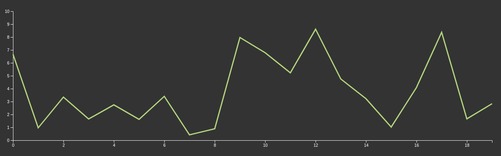
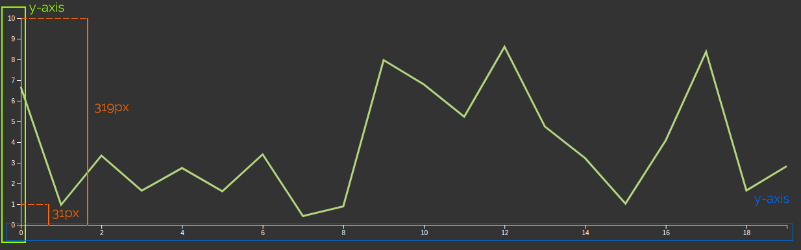

Antes de empezar, es importante decir que **d3.js no es una librería de gráficos, es una librería para crear gráficos**; si esperas pasar los datos a la librería y configurar 4, 5... 10 parámetros para obtener el gráfico renderizado, d3.js no es tu librería.

[d3.js](https://d3js.org/) es más que eso, es una librería muy flexible para gestionar datos (documentos orientados a datos) y crear la representación de esos datos (no solo gráficos). **d3.js** te proporciona las diferentes piezas para crear tus visualizaciones de datos personalizadas (por ejemplo, gráficos).

Empecemos creando un gráfico de líneas sencillo:



# Escalas, dominio y rango

Simplificando, hay dos piezas en el gráfico: el Eje (Axis) y la línea. Hablemos del eje.
En el ejemplo del gráfico tenemos dos ejes: X e Y, pero podemos tener más o menos, dependiendo del tipo de gráfico.

Un eje es una de las líneas de referencia de un sistema de coordenadas; cada punto representa un valor en el sistema de coordenadas y también una posición en el canvas que muestra el gráfico.

En nuestro ejemplo, en el eje y, el valor '1' del gráfico se dibuja en la posición 31px desde el inicio del eje, pero en SVG o canvas el origen del sistema de coordenadas comienza en la esquina superior izquierda, e 'y' crece en dirección a la parte inferior del monitor. Entonces, para imprimir el valor 1 en nuestro gráfico, debemos usar 319 - 31 (288) como posición y.


Eso es complicado, y puede serlo aún más si la relación entre las coordenadas de la pantalla y las coordenadas del gráfico no es lineal, por ejemplo, en un gráfico logarítmico.

**d3.js** nos trae un componente para ayudarnos a abstraer la conversión entre las coordenadas de la pantalla y las del gráfico:

## d3-scale

[**d3-scale**](https://github.com/d3/d3-scale) es nuestro componente.
Hay muchos tipos diferentes de escalas: Continuas (Linear, Power, log, identity, time, radial), Secuenciales, Ordinales, etc... Para nuestro gráfico de ejemplo, usaremos Linear.

Antes de continuar con _scale_, voy a introducir 2 conceptos importantes: **domain** (dominio) y **range** (rango).

**Domain** es el conjunto completo de valores que el gráfico puede usar; en nuestro caso, son todos los valores entre 0 y 10.

**Range** son las coordenadas (en la pantalla) donde el gráfico puede dibujar, en este caso de 0 a 319.

Poniéndolo todo junto:

```js
const xScale = d3.scaleLinear().domain([0, 10]).range([319, 0]);
```

> Nota que el rango está entre `319` y `0`, no entre `0` y `319`.

Esto devuelve una función que vincula los valores en el gráfico (domain) y los valores en el 'canvas' (range).

```js
xScale(0); // 319
xScale(5); // 159.5
xScale(10); // 0
```

Scale también proporciona algunos métodos para realizar acciones adicionales; por ejemplo, si quieres obtener el valor en el gráfico a partir de las coordenadas del 'canvas' (el caso de uso típico es obtener el valor del gráfico en la posición del ratón), podemos usar:

```js
xScale.invert(159.5); // 5
```

> Probablemente estés pensando lo mismo que yo la primera vez que vi eso: ¿Es una función que tiene métodos? ¡WTF!. Si quieres puedes profundizar más, pero en resumen, si la función tiene argumentos devuelve el valor 'principal', si no, devuelve un objeto de funciones.

Podemos hacer lo mismo para el eje y:

```js
const yScale = d3.scaleLinear().domain([0, 20]).range([0, 700]);
```

Bien, tenemos todas las herramientas para gestionar los datos y el canvas, ahora debemos renderizar los datos y el eje.

# Renderizando el gráfico

**d3.js** puede renderizar gráficos en **SVG** y **Canvas**, pero nos centraremos en el renderizado SVG porque es lo suficientemente rápido para la mayoría de los gráficos y facilita la interacción y el estilo.
Para renderizar nuestro gráfico de líneas, primero debemos preparar nuestro contenedor (placeholder).

```html
<html>
  <body>
    <div class="chart"></div>
  </body>
</html>
```

Para nuestra comodidad, voy a definir los márgenes del gráfico y el ancho (width) y alto (height). Los márgenes son necesarios para renderizar el eje, porque el tamaño del gráfico se refiere al área de dibujo.

```js
const margin = { top: 10, right: 10, bottom: 50, left: 50 };
const width = 1280 - margin.left - margin.right;
const height = 420 - margin.top - margin.bottom;
const n = 20; // Number of points in x axis
const maxY = 10; // Max y value
```

Ahora usaremos _d3_ para añadir nuestro gráfico SVG:

```js
const svg = d3
  .select('.chart')
  .append('svg')
  .attr('width', width + margin.left + margin.right)
  .attr('height', height + margin.top + margin.bottom);
```

Línea por línea:

- `.select('.chart')` selecciona el elemento DOM que definimos previamente.
- `.append('svg')` añade un elemento `<svg>` al `<div class='chart'>`.
- `.attr('width', width + margin.left + margin.right)` añade un atributo `width` al elemento `<svg>`.
- `.attr('height', height + margin.top + margin.bottom)` añade un atributo `height` al elemento `<svg>`.

Definimos las escalas anteriormente, pero lo haremos de nuevo, ahora usando nuestras variables para que el gráfico sea más reutilizable:

```js
const xScale = d3
  .scaleLinear()
  .domain([0, n - 1])
  .range([0, width]);
const yScale = d3.scaleLinear().domain([0, maxY]).range([height, 0]);
```

### Renderizando el eje x

Para renderizar el eje X, crearemos un nuevo grupo SVG que contenga el eje:

```js
svg
  .append('g')
  .attr('class', 'x axis')
  .attr('transform', 'translate(' + margin.left + ',' + (height + margin.top) + ')')
  .call(d3.axisBottom(xScale));
```

Línea por línea:

- `.append('g')` añade el nuevo grupo para el eje.
- `.attr('class', 'axis x-axis')` añade 2 clases al grupo (esto nos permite darle estilo usando CSS).
- `.attr('transform', 'translate(' + margin.left + ',' + height + ')')` mueve el grupo del eje debajo del área de dibujo del gráfico y le da espacio.
- `.call(d3.axisBottom(xScale))` llama a la función `d3.axisBottom`. Esta función se encarga de renderizar el eje; _axisBottom_ significa que las marcas (ticks) del eje se renderizarán debajo de la línea del eje. Hay 3 funciones más: `d3.axisTop`, `d3.axisLeft`, `d3.axisRight` para renderizar el eje en diferentes orientaciones.

> Sobre el método [`call`](https://github.com/d3/d3-selection/blob/v2.0.0/README.md#selection_call): Este método llama a la función pasada como argumento y la utiliza como primer argumento para la función del elemento seleccionado. En este caso es lo mismo que ejecutar: `d3.axisBottom(xScale)(svg.select('.xaxis'))` (Recuerda que d3.axisBottom devuelve una función). La ventaja de usar `call` es que puedes concatenar métodos porque call devuelve la selección, no el resultado de la función.

Después de eso podemos ver nuestro eje x :tada:

### Renderizando el eje y

Renderizar el eje Y es casi lo mismo que el eje X:

```js
svg
  .append('g')
  .attr('class', 'y axis')
  .attr('transform', 'translate(' + margin.left + ',' + margin.top + ')')
  .call(d3.axisLeft(yScale));
```

## Renderizando la línea

Antes de realizar el renderizado del gráfico necesitamos los datos; en este caso, usaremos valores aleatorios:

```js
const dataset = d3.range(n).map((d) => {
  return { x: d, y: d3.randomUniform(yMax)() };
});
/*
[
  { x: 0, y: 2.679771859053788 },
  { x: 1, y: 5.447777017888336 },
  ...
  { x: 19, y: 0.083980807899251 }
]
*/
```

Ahora crearemos el generador de líneas, que es una función que devuelve un:

```js
const line = d3
  .line()
  .x((d) => xScale(d.x))
  .y((d) => yScale(d.y));
```

Línea por línea:

- `.line()` es el generador de líneas básico.
- `.x((d) => xScale(d.x))` función que para cada punto en el conjunto de datos devuelve la posición x en el área de dibujo; esta es la razón por la que estamos usando la función de escala. _d_ representa cada punto del dataset.
- `.y((d) => xScale(d.y)` lo mismo que la línea anterior pero referido al eje y.

También podemos añadir una llamada extra al generador de líneas para configurar el comportamiento de la interpolación, por ejemplo: `.curve(d3.curveMonotoneX)` que hace que la curva sea más suave. Pero por ahora, una interpolación simple (lineal) es suficiente.

Bien, ahora tenemos el generador de líneas y es hora de dibujar la línea en nuestro gráfico.

Primero, añadimos un grupo SVG para la línea que vamos a dibujar:

```js
const lineWrapper = svg
  .append('g')
  .attr('transform', 'translate(' + margin.left + ',' + margin.top + ')');
```

Línea por línea:

- `.append('g')` añade un elemento de grupo SVG (`g`) al elemento `svg`. Este grupo contendrá el área de dibujo del gráfico.
- `.attr('transform', 'translate(' + margin.left + ',' + margin.top + ')')` establece el atributo transform para mover el grupo; esto facilita la gestión del dibujo porque no necesitamos preocuparnos por la posición real; para el área de dibujo, el sistema de coordenadas comienza en (0, 0).

Y renderizamos la línea:

```js
lineWrapper.append('path').datum(dataset).attr('class', 'line').attr('d', line);
```

Línea por línea:

- `.append('path')` añade un elemento path (para dibujar la línea).
- `.datum(dataset)` asigna el dataset al elemento path (lo usaremos en las siguientes líneas).
- `.attr('class', 'line')` añade la clase `line` al elemento path para facilitar el estilo CSS.
- `.attr('d', line)` añade el atributo `d`; para generarlo, llama al generador de líneas pasando el elemento y el `datum`.

> Usamos `datum` porque los datos son estáticos, pero d3 proporciona otros métodos para vincular datos dinámicos a los elementos del dom, pero hablaré de eso en el futuro.

Y esto es todo por el momento. _d3_ es una herramienta potente pero requiere que conozcas algunos conceptos antes de empezar a crear gráficos. El ejemplo que hicimos en este post es muy, muy simple, pero creo que es un buen punto de partida.

Mi idea es escribir más posts sobre _d3_ profundizando en el concepto actual y en cómo configurar y personalizar los componentes actuales (por ejemplo, configurar el eje, las etiquetas, etc.).
::iframe[]{src="https://codesandbox.io/embed/sharp-water-bmk3t?fontsize=14&hidenavigation=1&theme=dark&view=preview" width="100%" height="400px"}
