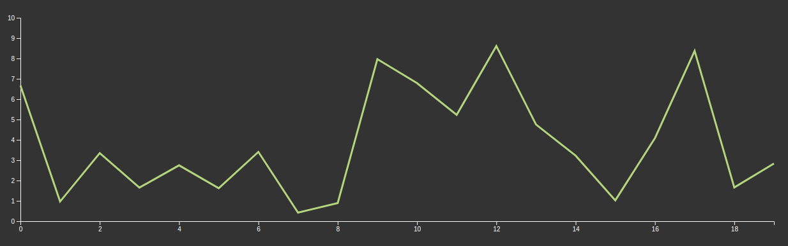
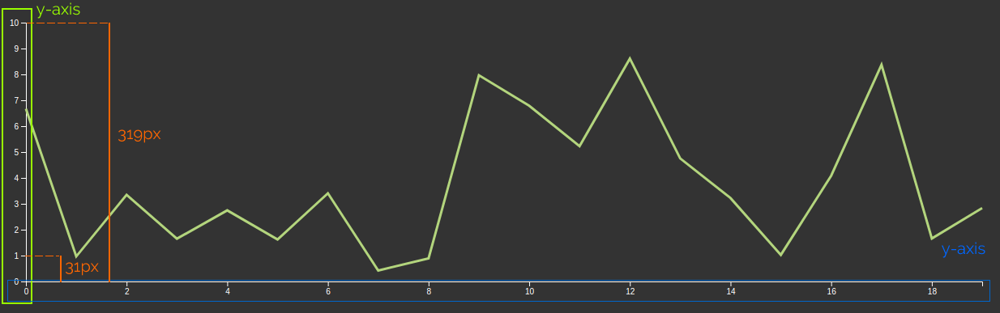

Before starting is important to say that **d3.js is not a chart library is a library for making charts**, if you are expecting to pass the data to the library and set 4, 5,... 10 params and get the chart to render, d3.js is not your library.

[d3.js](https://d3js.org/) is more than that, is a very flexible library to manage data (data-driven documents) and create the representation of that data (not only charts). **d3.js** provides you the different pieces to create your customized data visualizations (for example charts)

Let's start creating a simple line chart:



# Scales, domain, and range

Simplifying, there are two pieces in the chart: Axis and line. Let's talk about the axis.
In the example the chart we have two axes: X and Y, but we can have more or less, depending on the chart type.

Axis is one of the reference lines of a coordinate system, every single point represents a value in the coordinate system and also a position in the canvas which is displaying the chart.

In our example, in the y-axis the '1' value of the chart is drawn in the position 31px from the axis start, but in SVG or canvas the origin of the coordinate system start on the top left corner, and 'y' grows in the direction to monitor bottom. Then to print the 1 value in our chart we must use 319 - 31 (288) as y position.


That's complicated, and can be even more, if the relation between screen coordinates and chart coordinates aren't lineal, for example, a logarithmic chart.

**d3.js** brings us a component to help us to abstract the conversion between screen coordinates and chart coordinates:

## d3-scale

[**d3-scale**](https://github.com/d3/d3-scale) is our component.
There are a lot of different types of scales: Continuous (Linear, Power, log, identity, time, radial), Sequential, Ordinal, etc... For our example chart, we will use Linear.

Before continuing with _scale_ I'm going to introduce 2 important concepts: **domain** and **range**

**Domain** is the complete set of values chart can use, in our case is all the values between 0 and 10

**Range** is the coordinates (in the screen) where the chart can draw, in this case from 0 to 319

Putting all together:

```js
const xScale = d3.scaleLinear().domain([0, 10]).range([319, 0]);
```

> Note the range is between `319` and `0` not between `0` and `319`

This returns a function that links the values in the chart (domain), and the values in the 'canvas' (range)

```js
xScale(0); // 319
xScale(5); // 159.5
xScale(10); // 0
```

Scale also provides some methods for do extra actions, for example, if you want to get the value in the chart from the 'canvas' coordinates (the typical use case is getting the chart value in the mouse position) we can use

```js
xScale.invert(159.5); // 5
```

> Probably you are thinking the same as me the first time I see that: It's a function that has methods? WTF!. If you want you can go farther but in swallow, if the function has arguments returns the 'main' value, if not returns an object of functions.

We can do the same for the y-axis:

```js
const yScale = d3.scaleLinear().domain([0, 20]).range([0, 700]);
```

Ok, we have all the tools to manage the data and the canvas, now we must render the data and the axis

# Rendering the chart

**d3.js** can render charts in **SVG** and **Canvas** but we will focus on the SVG rendering because is fast enough for most charts and makes easy interaction and styling.
To render our line chart, first, we must prepare our placeholder.

```html
<html>
  <body>
    <div class="chart"></div>
  </body>
</html>
```

For our comfort I'm going to define the chart margins and the width and height. The margins are necessary to render the axis, because the size of the chart refers to the draw area.

```js
const margin = { top: 10, right: 10, bottom: 50, left: 50 };
const width = 1280 - margin.left - margin.right;
const height = 420 - margin.top - margin.bottom;
const n = 20; // Number of points in x axis
const maxY = 10; // Max y value
```

Now we will use _d3_ to add our SVG chart

```js
const svg = d3
  .select('.chart')
  .append('svg')
  .attr('width', width + margin.left + margin.right)
  .attr('height', height + margin.top + margin.bottom);
```

Line by line:

- `.select('.chart')` selects the DOM element previously we defined
- `.append('svg')` appends a `<svg>` element to the `<div class='chart'>`
- `.attr('width', width + margin.left + margin.right)` adds an `width` attribute to the `<svg>` element
- `.attr('height', height + margin.top + margin.bottom)` adds an `hight` attribute to the `<svg>` element

We defined the scales above, but we will do it again, now using our variables to make the chart more reusable

```js
const xScale = d3
  .scaleLinear()
  .domain([0, n - 1])
  .range([0, width]);
const yScale = d3.scaleLinear().domain([0, maxY]).range([height, 0]);
```

### Rendering the x-axis

To render the X axis we will create a new SVG group that holds the axis

```js
svg
  .append('g')
  .attr('class', 'x axis')
  .attr('transform', 'translate(' + margin.left + ',' + (height + margin.top) + ')')
  .call(d3.axisBottom(xScale));
```

Line by line:

- `.append('g')` appends the new group for the axis
- `.attr('class', 'axis x-axis')` adds 2 classes to the group (this allows us to style it using CSS)
- `.attr('transform', 'translate(' + margin.left + ',' + height + ')')` moves the axis group bellow the chart draw area and gives space
- `.call(d3.axisBottom(xScale))` call the `d3.axisBottom` function. This function is in charge of rendering the axis, the _axisBottom_ means that the ticks of the axis will be rendered bellow the axis line. There are 3 more functions: `d3.axisTop`, `d3.axisLeft`, `d3.axisRight` to render the axis in different orientations.

> About the [`call`](https://github.com/d3/d3-selection/blob/v2.0.0/README.md#selection_call) method: This method call the function passed as argument and uses as first argument for the function of the selected element. In this case is the same as execute: `d3.axisBottom(xScale)(svg.select('.xaxis'))` (Remember that d3.axisBottom returns a function). The advantage of using `call` is you can concatenate methods because call returns the selection, not the result of the function

After that we can see our x-axis :tada:

### Rendering the y-axis

Rendering the Y axis is almost the same as X axis:

```js
svg
  .append('g')
  .attr('class', 'y axis')
  .attr('transform', 'translate(' + margin.left + ',' + margin.top + ')')
  .call(d3.axisLeft(yScale));
```

## Rendering the line

Before do the chart rendering we need the data, in this case, we will use random values

```js
const dataset = d3.range(n).map((d) => {
  return { x: d, y: d3.randomUniform(yMax)() };
});
/*
[
  { x: 0, y: 2.679771859053788 },
  { x: 1, y: 5.447777017888336 },
  ...
  { x: 19, y: 0.083980807899251 }
]
*/
```

Now we will create the line generator that is a function that returns a

```js
const line = d3
  .line()
  .x((d) => xScale(d.x))
  .y((d) => yScale(d.y));
```

Line by line:

- `.line()` is the basic line generator
- `.x((d) => xScale(d.x))` function that for every point in data set returns the x position in the draw area, this is the reason why we are using the scale function. _d_ represent every dataset point
- `.y((d) => xScale(d.y)` same as previous line but referred to y-axis

We can also add an extra call to the line generator to configure the interpolation behavior, for example: `.curve(d3.curveMonotoneX)` that makes the curve softer. But for now, a simple interpolation (linear) is enough.

Ok, now we have the line generator, and it's time to draw the line in our chart.

First, we add a SVG group for the line we will draw

```js
const lineWrapper = svg
  .append('g')
  .attr('transform', 'translate(' + margin.left + ',' + margin.top + ')');
```

Line by line:

- `.append('g')` appends a SVG group element (`g`) to the `svg` element. This group will contain the chart draw area
- `.attr('transform', 'translate(' + margin.left + ',' + margin.top + ')')` set the transform attribute to move the group, this makes easy managing the draw, because we don't need to take care of the real position, for the draw area the coordinate system starts on (0, 0)

And the render the line

```js
lineWrapper.append('path').datum(dataset).attr('class', 'line').attr('d', line);
```

Line by line:

- `.append('path')` appends a path element (to draw the line)
- `.datum(dataset)` assigns the dataset to the path element (we will use it in the next lines)
- `.attr('class', 'line')` add the class `line` to the path element to make asy the css styling
- `.attr('d', line)` add the `d` attribute, to generate it class to the line generator passing the element, and the `datum`

> We used `datum` because data is static, but d3 provides other methods to link dynamic data to the dom elements, but I will talk about that in the future

And this is all for the moment. _d3_ is a powerful tool but needs you to know some concepts before starting to create charts. The example we did in this post is very, very simple but I think is a good starting point.

My idea is to write more post about _d3_ going deeper into the current concept and how to configure and customize the current components (for example configure the axis, the labels, etc)
::iframe[]{src="https://codesandbox.io/embed/sharp-water-bmk3t?fontsize=14&hidenavigation=1&theme=dark&view=preview" width="100%" height="400px"}
