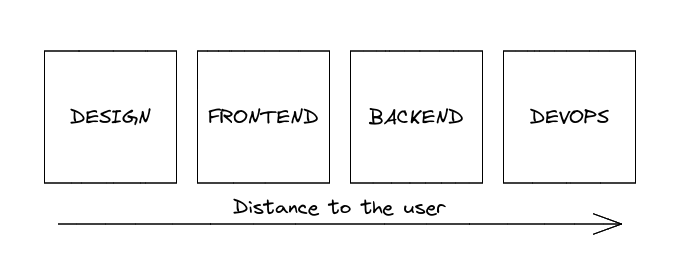
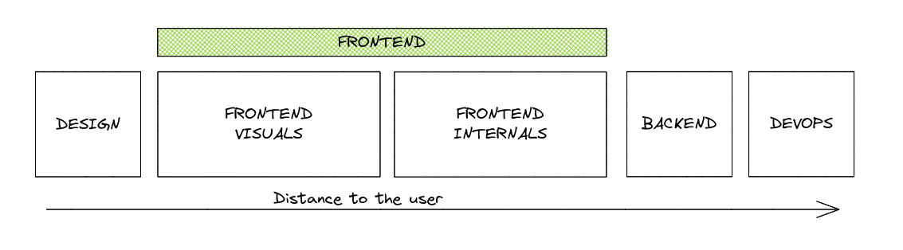
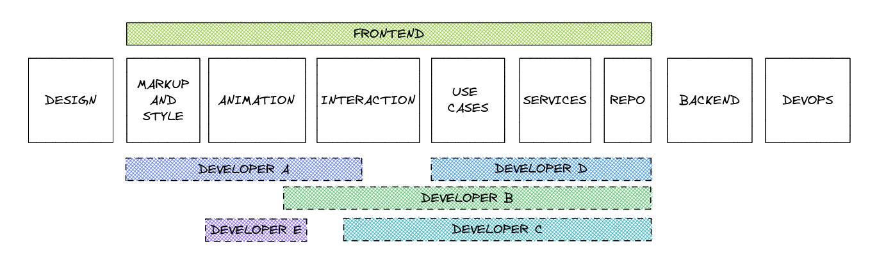
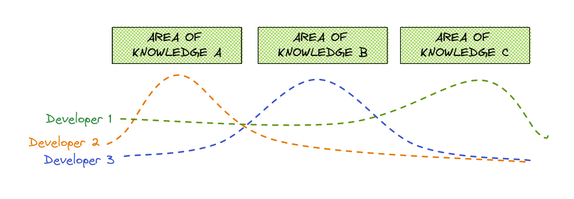

Hace 15-20 años, los desarrolladores de aplicaciones web tenían el conocimiento y las habilidades técnicas necesarias para crear una aplicación: HTML, CSS, JS, PHP/Python/ASP, gestión de Web Server, MySQL/Postgres (tanto la gestión de datos como del servicio), etc.

Con el tiempo, las aplicaciones web se volvieron más complejas y con mayores requisitos. Nuevas tecnologías, frameworks y paradigmas irrumpieron en el desarrollo y empujaron a los desarrolladores a especializarse en algunas áreas, surgiendo nuevos roles a partir de esta especialización.

Hoy en día, los roles típicos equivalentes para una aplicación web que cubren las tareas/habilidades expuestas y los requisitos habituales son: Designer, Frontend developer, Backend developer, Platform engineer y, en una empresa orientada a datos: Data engineer, Data scientist, etc.

Quiero centrar este post en los tres primeros roles: **Designer**, **Frontend developer** y **Backend developer**.

Podrías pensar que cometí un error porque el título del post dice _tech roles_, e incluí el rol del Designer. Bueno, para mí es un rol técnico; tal vez sea difuso, pero es el rol más cercano al usuario de la aplicación y actúan como una especie de puente entre los usuarios (y el producto) y el equipo o equipos de frontend.

Permíteme representar los roles o los equipos según la distancia al usuario de la aplicación (esta representación puede variar dependiendo de la aplicación, pero cubre muchos casos).

Voy a hacer **algunas simplificaciones** para explicar esto:

- el **design team** se encarga de lo primero que el usuario ve en una aplicación: lo visual,
- el **frontend team** se encarga de implementar esos visuales y la interacción del usuario,
- el **backend** gestiona las interacciones del usuario con los datos e implementa la business logic,
- el **devops (platform)** crea el contexto (servers, databases, networking) para que todo funcione.

# Interfaces y fronteras del rol de Frontend

Para definir las responsabilidades del rol (o equipo) de frontend, empecemos definiendo las fronteras: voy a hacerlo en el lado derecho de la imagen:

La interfaz natural entre el frontend y el **backend** es un contrato: una API. Podría ser una REST HTTP API, gRPC API, GraphQL API, o incluso un internal controller de la aplicación, etc. Esta frontera parece una frontera rígida, pero veremos que no es tan rígida como podrías pensar.

Después de definir la frontera derecha, hagamos lo mismo con la frontera izquierda, la que limita con el **design**. Esto suele ser un diseño estático de los elementos, layouts y pantallas de la aplicación, un documento de Figma o algo similar.

_Esto es una simplificación, soy consciente de que existen otras herramientas, formas de definir los requisitos visuales y funcionales, etc._

# Responsabilidades del equipo de Frontend

Conociendo las fronteras, definamos las responsabilidades de alto nivel en el equipo de frontend:

- Convertir el diseño a HTML/CSS
  - App layouts
  - Crear y mantener los componentes de la aplicación
- Añadir y mantener animaciones en los componentes y transiciones
- Gestionar la interacción del usuario
- Cargar y enviar datos a la API
- Gestionar y mostrar mensajes de error del backend
- Validación de formularios/entidades
- Implementar y mantener la business logic
- Implementar y mantener la UI logic

Estas responsabilidades (y más) son bastante diferentes y requieren distintas habilidades para gestionarlas. Como mencioné antes, en el pasado era muy común que un solo desarrollador se encargara de todo esto y resolviera las tareas relacionadas sin pensar en esta separación; lo mismo ocurrió mucho antes con la separación entre backend y frontend, que no existía y ahora es muy común tener Frontend y backend developers.

Hoy en día, podemos tener roles más especializados para cada responsabilidad en el frontend. Podemos agruparlos de nuevo en 2 subgrupos: **Frontend visuals and interactions** y **Frontend internals**. Suelo llamar a esto **"the backend of the frontend"**.

El **Frontend visuals and interactions** asume la responsabilidad de convertir los diseños en código que el navegador pueda entender (HTML y CSS), implementa las animaciones, los layouts, la interacción del usuario (ej. emitir un evento al hacer clic) y renderiza los datos. Todo esto **normalmente dentro de un componente** de un framework como Vue, React, etc. **Este grupo de responsabilidades requiere más conocimientos de HTML, CSS (SCSS), SVG y browser events**.

El **Frontend internals** asume las responsabilidades más cercanas al backend: conectarse al backend para obtener los datos, prepararlos para una vista, validar los formularios e implementar los requisitos de negocio relacionados con el flujo de datos, restricciones, etc. **Este grupo requiere más conocimientos de Typescript, browser's API, HTTP y async**.

Es importante decir que las fronteras no son rígidas, y eso es bueno, ya que, como veremos, permite la movilidad, la expansión y la mejora.

Ambos grupos requieren entender el business domain, pero de diferentes maneras: _visuals_ requiere una mejor comprensión de cómo el usuario interactuará con el dominio y cómo reacciona el dominio a esas interacciones, e _internals_ requiere una mejor comprensión de los flujos de datos, domain, eventos, etc. De nuevo, debemos entender que las fronteras son difusas.

Podríamos ir incluso más allá y crear grupos más especializados dentro de los grupos de _frontend visuals_ y _frontend internals_, pero la lógica detrás de esta separación es la misma que expuse anteriormente.

## Segmentación de roles, granularidad y solapamiento

Volviendo al escenario _simple_, teníamos un único rol: _frontend developer_, pero ahora, considerando la agrupación anterior, podemos definir diferentes roles en nuestro equipo de frontend, roles que cubren las habilidades y responsabilidades de múltiples subgrupos de responsabilidades.

Esta segmentación de roles **facilita encontrar personas que encajen mejor en el equipo**. Cuanto más amplio es el rol, más difícil es encontrar a una persona que lo cubra con todas las habilidades necesarias para el puesto, y no se trata de reducir los requisitos del puesto, sino de que el mismo puesto (ej: Frontend developer) hoy en día suele requerir más conocimientos que hace 5 años.

Por ejemplo, si la empresa necesita un especialista en css/svg animation, creo que no tiene sentido exigir conocimientos de GraphQL para este puesto; si la persona los tiene, perfecto, pero si no, puede aprenderlos.

Es importante que encaje en el puesto al principio y comience a compartir conocimientos sobre animación; más adelante podrá ampliar sus conocimientos a otras áreas de responsabilidad, haciendo que el proceso de onboarding y el proceso de adaptación sean más fluidos.

Solo otro ejemplo: normalmente (no es una regla general), las personas que vienen de un frontend bootcamp tienen más habilidades y se sienten más cómodas en los roles visuales que en los roles más cercanos al backend. **¿Deberíamos descartar ese talento solo porque no cubre todas las _frontend skills_?** No lo creo; a medida que adquieran más experiencia, ampliarán sus áreas de conocimiento y asumirán tareas de otros roles.

## Movilidad entre roles

Una ventaja de no tener fronteras rígidas entre estos roles es que facilita la movilidad. Los desarrolladores pueden empezar a involucrarse en nuevos roles, aumentando sus conocimientos de forma orgánica; por ejemplo, un desarrollador en un _visual's role_ podría necesitar cambiar un use case, corregir un bug fix o implementar una pequeña feature, pero seguir estando en su burbuja de confort, simplemente ampliándola poco a poco y, después de un tiempo, empezar a realizar cada vez más tareas en los internals y lo contrario: un desarrollador del grupo de internals puede realizar una tarea en los visuals.

Otra ventaja es que las áreas de solapamiento facilitan la comprensión y la empatía con los demás y sus tareas, entendiendo qué "**podría hacer yo para facilitar el trabajo del otro**".

## Solapamiento de roles

En esta situación de definiciones de roles estrechas y difusas, tener habilidades de desarrollador que se solapen con las de otro no es un problema, es una ventaja: pueden dividirse las tareas, trabajar juntos y compartir conocimientos en las áreas en las que no se solapan.

# Rompiendo las fronteras

Pero todavía tenemos fronteras rígidas entre _design_, _frontend_ y _backend_, **¿por qué no romperlas?**

Todo lo que mencioné antes sobre movilidad, solapamiento y especialización se aplica a las fronteras con el diseño y el backend; obviamente, podemos hacer este análisis profundo y segmentación en los roles de diseño y backend.

¿Quién no conoce a un diseñador que aprendió HTML, CSS y JS, tal vez por curiosidad, para hacer realidad su diseño o buscando una mejor oportunidad laboral? ¿Por qué ignorar estas habilidades de diseño? Dejemos que colabore con el equipo de diseño o simplemente ayudémosles a entender las posibilidades técnicas del frontend.

"Cruzar" la frontera derecha es más común, los llamamos full-stack, pero siguiendo lo anterior, existen diferentes tipos de desarrolladores full-stack, dependiendo de dónde pongan sus límites de áreas de conocimiento a la izquierda y a la derecha. En mi opinión, permitir que los desarrolladores frontend, aquellos cuyos roles o áreas de conocimiento están más a la derecha, "crucen la frontera" y participen en las tareas del backend, al menos en las más relacionadas con el frontend, siempre es productivo e incrementa la comunicación y colaboración entre equipos; este desarrollador no necesita conocer todos los detalles e internos del backend; por ejemplo, si el backend utiliza hexagonal architecture, esta persona podría implementar o mantener controladores y application use cases, utilizando servicios y entidades ya implementados.

And the opposite, un desarrollador backend podría implementar el frontend repository que lee de la API y convierte los datos en entidades de dominio sin necesidad de conocer a fondo cómo funciona el frontend framework.

# Aprovechando las fortalezas de los miembros del equipo

Esta segmentación sobre la que escribí no trata de segmentar o dividir los equipos para crear más, ni de crear más estructuras en la organización, **se trata de identificar las fortalezas de los miembros del equipo y aprovecharlas**, potenciando la empatía laboral con otros equipos y miembros del equipo a través de una mejor comprensión de otras áreas de conocimiento y sus necesidades, y al mismo tiempo minimizando los silos de conocimiento mediante el solapamiento de estas áreas.

Creo que en los próximos años el conocimiento necesario para crear una gran aplicación web será mayor y probablemente veremos algún tipo de división entre el equipo de frontend visuals y el de frontend pure development, pero creo firmemente que esta es una división arbitraria, y las personas con especialización pero que puedan entrar en las tareas de otros roles serán muy útiles y productivas para cualquier organización.
