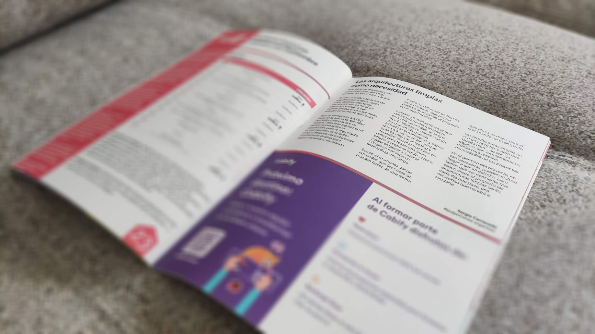

---

> This post was originally written and included in the magazine of [#pulpoCon22](https://pulpocon.es)

Everything has its moment, and the solutions that work today might not serve for tomorrow.

That's why, when we talk about clean architectures, clean code, decoupling from the framework, etc., in many cases it sounds like our product will be better just by the fact of applying them.

But it's not always like that; there are phases where code simplicity takes precedence over its “beauty,” where delivery speed takes precedence over abstraction, but the important thing is to be aware that sooner or later we will need clean architectures to continue growing and scaling.

**And this shouldn't be a trauma**; it is the maturity that the project you are working on is gradually reaching.

A moment will come when decoupling from the framework will be a necessity that you and your team will realize, because one day you'll want to update the framework and you know it's going to be a pain, because you want to improve testing and you need to spin up a database to test a simple task, because the team is growing, and starting to touch the code requires a very long onboarding.

That is the moment when you understand that things can be done differently, that it is now better for your project's growth.

Clean architectures are not a whim, or something that “looks good,” they are not a goal; they are simply a means to solve project needs.

At the project's inception, they are not necessary—they can even become a hindrance—but you have to be aware that as the project grows, clean architectures will become, with each passing day, a necessity that will come to help you.

---