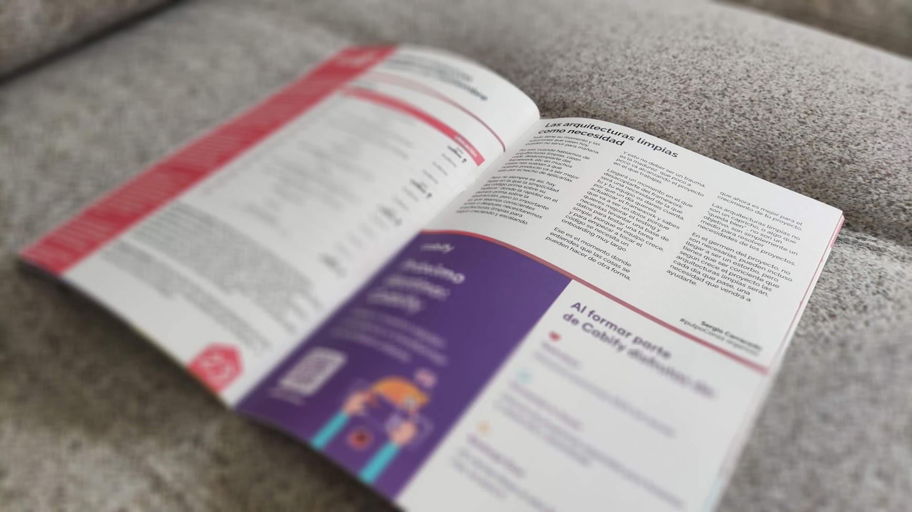

> Este post fue escrito originalmente e incluido en la revista de la [#pulpoCon22](https://pulpocon.es)

Todo tiene su momento y las soluciones que valen hoy, pueden no servir para mañana.

Por eso, cuando hablamos de arquitecturas limpias, clean code, desacomparte del framework, etc. en muchos casos nos suenan a que nuestro producto va a ser mejor solo por el hecho de aplicarlas.

Pero no siempre es así, hay fases en la que la simplicidad del código prima sobre su “belleza”, donde la rapidez en el delivery prima sobre la abstracción, pero lo importante es que seamos conscientes antes o despues necesitaremos arquitecturas limpias para seguir creciendo y escalando.

**Y esto no deber ser un trauma**, es la madurez que poco a poco va alcanzando el proyecto en el que trabajas.

Llegará un momento en el que desacoplarte del framework será una necesidad de la que tu y tu equipo os dareis cuenta, por que un dia quereis actualizar el framework y sabes que va a ser un dolor, porque quieres mejorar el testing y necesitas levantar una base de datos para testar una tarea simple, porque el equipo crece, y para empezar a tocar el código se necesita un onboarding muy largo

Ese es el momento donde entiendes que las cosas se pueden hacer de otra forma, que ahora es mejor para el crecimiento de tu proyecto.

Las arquitecturas limpias no son un capricho, o algo que “queda bien” , no son un objetivo, son simplemente un medio para resolver necesidades de los proyectos.

En el germen del proyecto, no son necesarias, pueden incluso llegar a ser un estorbo, pero tienes que ser conciente que según crece el proyecto las arquitecturas limpias serán, cada dia que pase, una necesidad que vendrá a ayudarte.

