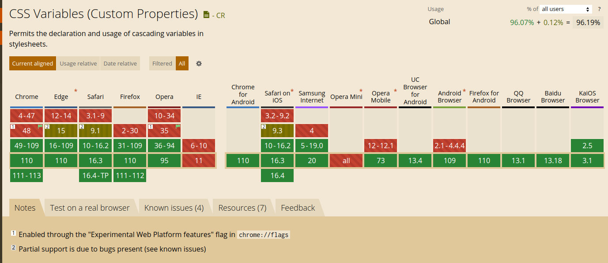

El nombre real de las _variables CSS_ es **CSS Custom Properties**; es un borrador de estándar (sí, mientras escribo estas líneas se encuentra en [Candidate Recommendation Snapshot](https://www.w3.org/standards/history/css-variables-1)), pero cuenta con un amplio soporte en los navegadores modernos.



Las variables CSS nos permiten, al igual que otros tipos de variables en otros lenguajes de programación, almacenar un valor que podemos reutilizar en todo nuestro documento.

Por ejemplo, si definimos una variable CSS para el color primario haciendo: `--primary-color: #f00;`, entonces podemos usarla en cualquier componente como:

```css
.my-component {
  color: var(--primary-color);
}
```

Normalmente "adjuntas" tu variable a `:root`, lo que significa que la variable estará disponible en todo el documento:

```css
:root {
  --primary-color: #f00;
}
```

En este ejemplo, `:root` es el alcance (scope) de la variable.

# Usándolo junto con SCSS

Si quieres asignar valores de variables SCSS a variables CSS, no puedes usar la notación "normal":

```scss
// ❌ Esto no funciona
$scss-var: #f00;
--my-var: $scss-var;
```

En el ejemplo, el valor de `--my-var` es literalmente `$scss-var`, no el valor que contiene `$scss-var`. Este comportamiento se definió así para proporcionar la máxima compatibilidad con CSS puro: https://sass-lang.com/documentation/breaking-changes/css-vars

Para que funcione, necesitas usar la sintaxis de [interpolación de Sass](https://sass-lang.com/documentation/interpolation) `#{mi código de script scss}`:

```scss
// ✅ Esto funciona
$scss-var: #f00;
--my-var: #{$scss-var};
```

# Alcance (Scope)

Las variables solo están disponibles en el elemento donde se definen y en sus hijos; ese es el alcance de la variable. Fuera de ahí, la variable no existe.

Si intentas acceder o usar una variable que no está en el alcance, no obtendrás un error, pero la propiedad que esté usando la variable inexistente será ignorada.

## Hoisting

Al igual que las variables de JS, las variables CSS se mueven a la parte superior (hoisting), por lo que puedes usarlas antes de definirlas.

```css
.my-element {
  color: var(--primary-color);
}
:root {
  --primary-color: #f00;
}
```

## Sobrescritura (Override)

Como mencioné antes, las variables tienen un alcance donde existen, pero: ¿qué pasa si una variable con el mismo nombre se define en 2 alcances? Ocurre lo mismo que con una variable de JS: el alcance local más cercano sobrescribe otros valores:

```css
:root {
  --color: #0f0;
}

.my-element {
  --color: #0ff;
  color: var(--color);
}
```

Este comportamiento es muy conveniente cuando trabajamos con componentes de UI que tienen diferentes estilos dependiendo de los modificadores.

# Variables CSS en componentes de UI

Imagina que tenemos un componente de botón simple, como este:

```html
<button class="ui-button">Button content</button>
```

```css
.ui-button {
  background: #333;
  color: #fff;
  font-size: 12px;
  padding: 4px 10px;
}
```

Este botón tiene diferentes variantes por color (por defecto, rojo y verde) y tamaño (por defecto, pequeño y grande). Usando BEM, podemos añadir una clase modificadora como `.ui-button--green` o `.ui-button--big` y usarla para sobrescribir los estilos, por ejemplo:

```scss
.ui-button {
  background: #333;
  color: #fff;
  font-size: 12px;
  padding: 4px 10px;

  &--green {
    background: #1f715f;
  }

  &--big {
    font-size: 16px;
    padding: 6px 20px;
  }
}
```

Esta forma funciona perfectamente, pero necesitamos saber qué propiedades sobrescribir y debemos hacerlo explícitamente para cada modificador, por lo que es fácil olvidar algo o, si necesitamos añadir una nueva propiedad afectada por los modificadores, tendríamos que añadirla en todos ellos.

Si reescribimos los estilos usando variables CSS, parametrizando los estilos del componente, podemos sobrescribir los valores de las variables CSS para cada modificador, sin cambiar los estilos CSS en sí para los modificadores, solo cambiando el valor de las variables:

```scss
.ui-button {
  --bg-color: #333;
  --text-color: #fff;
  --font-size: 12px;
  --padding: 4px 10px;

  background: var(--bg-color);
  color: var(--text-color);
  font-size: var(--font-size);
  padding: var(--padding);

  &--green {
    --bg-color: #1f715f;
  }

  &--red {
    --bg-color: #0ff;
  }

  &--big {
    --font-size: 16px;
    --padding: 6px 20px;
  }

  &--small {
    --font-size: 10px;
    --padding: 3px 5px;
  }
}
```

Puedes ver un ejemplo funcional en: https://codesandbox.io/s/autumn-bush-4i4iem?file=/index.html

## Prioridad del alcance de las variables

En CSS, los elementos pueden usar más de una clase, lo que significa que las variables CSS del elemento tienen múltiples alcances al mismo nivel. Por ejemplo, si aplicamos los modificadores verde y rojo al mismo tiempo:

```html
<button class="ui-button ui-button--green ui-button--red">Green + red</button>
```

Tanto `ui-button--green` como `ui-button--red` definen la misma variable `--bg-color`. ¿Qué valor se aplicará al elemento?

En casos como este, el orden de las clases es la prioridad, por lo que la última clase aplicada sobrescribe el valor al final y se aplica su valor. En el ejemplo, el botón será rojo, pero para `<button class="ui-button ui-button--red ui-button--green">`, el botón será verde.

# Resumen

El uso de variables CSS y alcances es una herramienta poderosa cuando estás desarrollando componentes en general, pero más aún si tus componentes tienen modificadores. Requiere un trabajo extra al principio para parametrizar el componente, pero después facilita la creación de variantes y modificadores.
