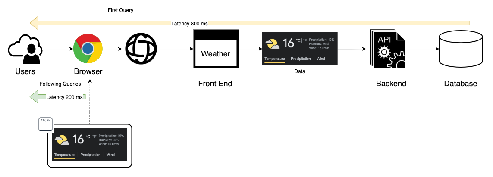
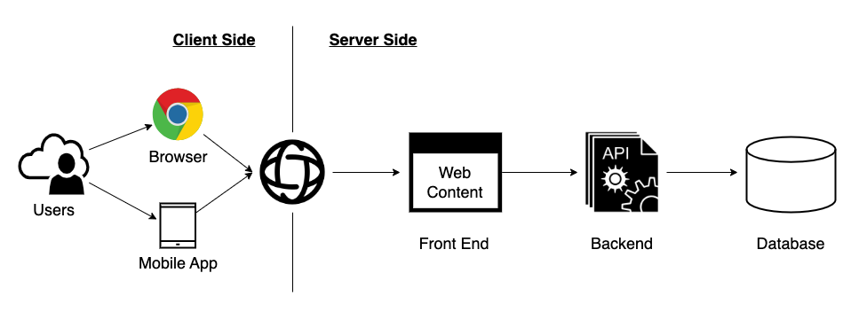
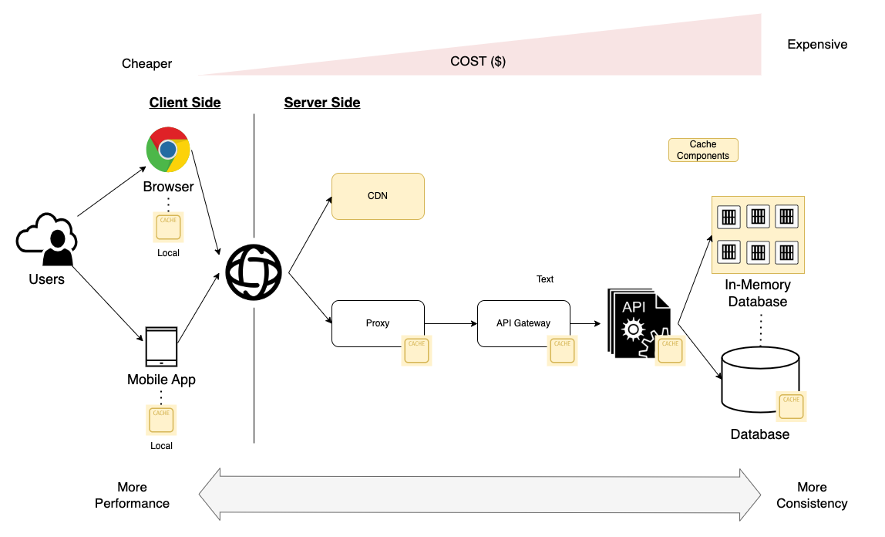
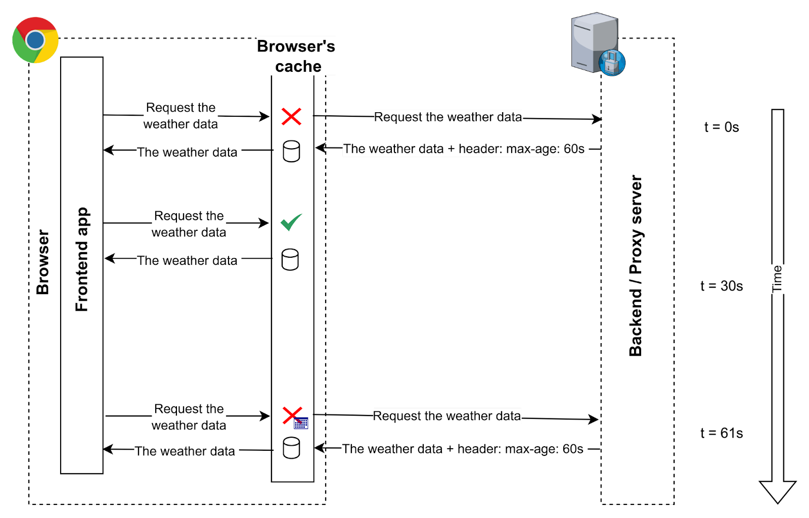
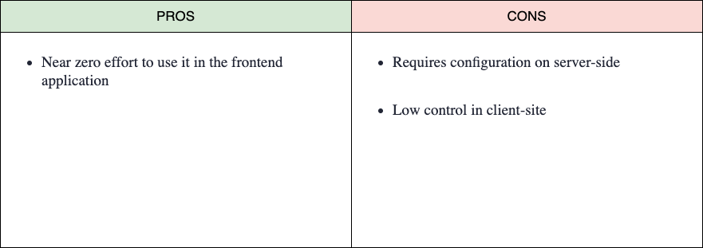
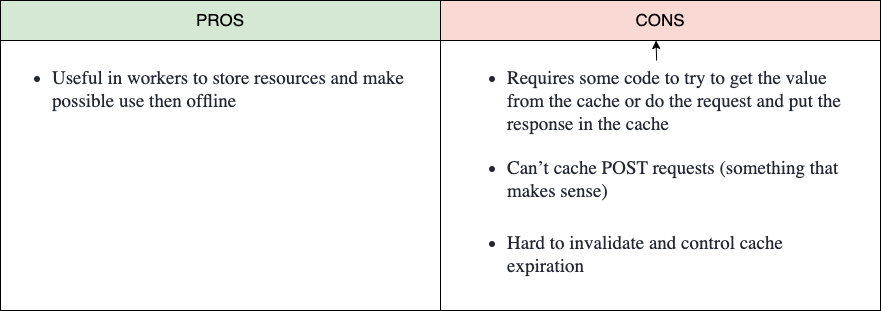
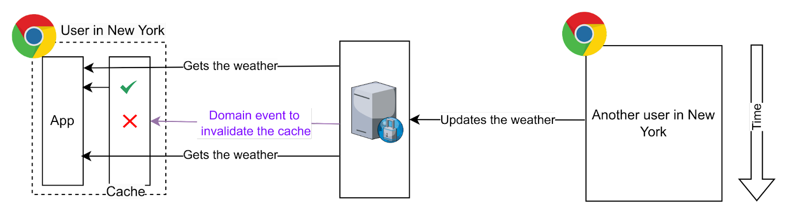
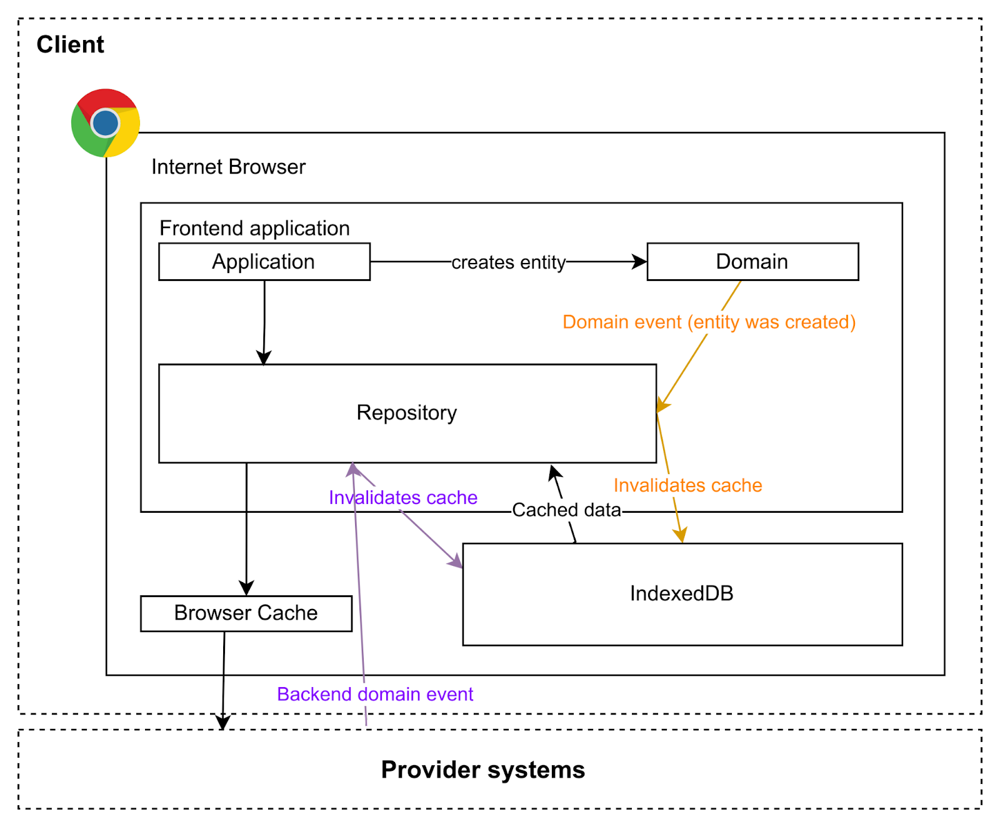
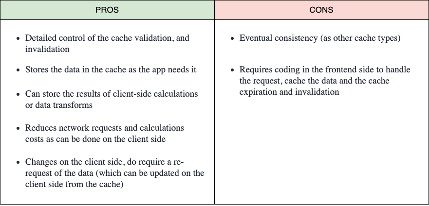

> Este artículo fue publicado originalmente en [DZone](https://dzone.com/articles/front-end-cache-strategies-you-should-know).
> Lo escribí junto a [Miguel García](https://www.linkedin.com/in/mgarlorenzo/)

Las [Caches](https://dzone.com/articles/introducing-amp-assimilating-caching-quick-read-fo) son componentes de software muy útiles que todos los ingenieros deben conocer. Es un componente transversal que se aplica a todas las áreas tecnológicas y capas de arquitectura, como sistemas operativos, plataformas de datos, backend, frontend y otros componentes. En este artículo, vamos a describir qué es una caché y explicar casos de uso específicos centrándonos en el frontend y el [client side](https://dzone.com/articles/web-caching-client-side).

# ¿Qué es una caché?

Una caché puede definirse de forma básica como **una memoria intermedia entre el consumidor de datos y el productor de datos** que almacena y proporciona los datos a los que accederán muchas veces los mismos o diferentes consumidores.

**Es una capa transparente para el consumidor de datos en términos de usabilidad del usuario, excepto para mejorar el rendimiento**. Por lo general, la reutilización de los datos proporcionados por el productor de datos es la clave para aprovechar los beneficios de una caché. El rendimiento es la otra razón para utilizar un sistema de caché, como las bases de datos en memoria (in-memory databases), para proporcionar una solución de alto rendimiento con baja latencia, alto rendimiento (throughput) y concurrencia.

Por ejemplo, ¿cuántas personas consultan el clima a diario y cuántas veces repiten la misma consulta? Supongamos que hay 1.000 personas en Nueva York consultando el clima y el 50% repite la misma consulta dos veces al día. En este escenario, si podemos almacenar la primera consulta lo más cerca posible del dispositivo del usuario, logramos dos beneficios: aumentamos la experiencia del usuario porque los datos se proporcionan más rápido y reducimos el número de consultas al productor de datos/lado del servidor. El resultado es una mejor experiencia de usuario y una solución que soportará más usuarios concurrentes utilizando la plataforma.



A alto nivel, existen dos estrategias de almacenamiento en caché que podemos aplicar de forma complementaria:

- **Client/Consumer Side**: Los datos almacenados en caché se guardan en el lado del consumidor o usuario, generalmente en la memoria del navegador cuando hablamos de soluciones web (también llamada caché privada).
- **[Server/Producer Side](https://dzone.com/articles/web-resource-caching-server-side)**: Los datos almacenados en caché se guardan en los componentes de la arquitectura del productor de datos.

- 

Las cachés, como cualquier otra solución, tienen una serie de ventajas que vamos a resumir:

- **Rendimiento de la aplicación**: Proporcionan tiempos de respuesta más rápidos porque pueden servir los datos con mayor celeridad.
- **Reducción de la carga en el lado del servidor**: Cuando aplicamos cachés al sistema anterior y reutilizamos un dato, estamos evitando consultas/peticiones a la siguiente capa.
- **Mejora de la escalabilidad y el coste**: A medida que el almacenamiento de datos en caché se acerca al consumidor, aumentamos la escalabilidad y el rendimiento de la solución a un coste menor.

- Los componentes más cercanos al lado del cliente son más escalables y económicos por tres razones principales:

- Estos componentes están **enfocados en el rendimiento** y la **disponibilidad**, pero **tienen una consistencia pobre**.
- Solo tienen parte de la información: los datos más utilizados por los usuarios.
- En el caso de la caché local del navegador, no hay coste para el productor de datos.



**Los grandes desafíos de la caché son la consistencia de los datos y la frescura de los datos (data freshness)**, lo que significa cómo se sincronizan y actualizan los datos en toda la organización. Dependiendo del caso de uso, tendremos más o menos restricciones de requisitos, ya que es muy diferente cachear imágenes que el stock de inventario o el comportamiento de las ventas.

# Cachés en el lado del cliente (Client-Side Caches)

Hablando de la caché del lado del cliente, podemos tener diferentes tipos de caché que vamos a analizar un poco en este artículo:

- **HTTP Caching**: Este tipo de almacenamiento en caché es un sistema de caché intermedio, ya que depende parcialmente del servidor.
- **Cache API**: Se trata de una API(s) del navegador que nos permite cachear peticiones en el navegador.
- **Custom Local Cache**: La aplicación front-end controla el almacenamiento, la expiración, la invalidación y la actualización de la caché.

## HTTP Caching

Cachea las peticiones HTTP para cualquier recurso (CSS, HTML, imágenes, vídeo, etc.) en los navegadores, y gestiona todo lo relacionado con el almacenamiento, la expiración, la validación, la obtención (fetch), etc., desde el front-end. El punto de vista de la aplicación es casi transparente, ya que realiza una petición de forma regular y el navegador hace toda la "magia".



La **forma de controlar el almacenamiento en caché es mediante el uso de** [HTTP Headers](https://dzone.com/articles/web-performance-101-http-headers); en el lado del servidor, se añaden cabeceras específicas de caché a la respuesta HTTP, por ejemplo: "Expires: Tue, 30 Jul 2023 05:30:22 GMT", entonces el navegador sabe que este recurso puede ser cacheado, y la próxima vez que el cliente (aplicación) solicite el mismo recurso, si el tiempo de la solicitud es anterior a la fecha de expiración, la solicitud no se realizará, el navegador devolverá la copia local del recurso.

Permite establecer la forma en que se distinguen las respuestas, ya que una misma URL puede generar diferentes respuestas (y su caché debe gestionarse de forma distinta). Por ejemplo, en un endpoint de API que devuelve algunos datos (p. ej., http://example.com/my-data) podríamos usar la cabecera de petición `Content-type` para especificar si queremos la respuesta en JSON o CSV, etc. Por lo tanto, la caché debe almacenarse con la respuesta dependiendo de la(s) cabecera(s) de la petición. Para ello, el servidor debe establecer la cabecera de respuesta `Vary: Accept-Language` para que el navegador sepa que la caché depende de ese valor. Hay muchas cabeceras diferentes para controlar el flujo y el comportamiento de la caché, pero no es el objetivo de este artículo profundizar en ello. Probablemente se abordará en otro artículo.

Como mencionamos antes, este tipo de caché necesita que el servidor establezca la expiración de los recursos, la validación, etc. Por lo tanto, este no es un método o tipo de caché puramente de frontend, pero es una de las formas más sencillas de cachear los recursos que utiliza la aplicación front-end, y es complementaria a la otra forma que mencionaremos más abajo.

Relacionado con este tipo de caché, al ser una caché intermedia, incluso podemos delegarla en una "pieza" entre el cliente y el servidor; por ejemplo, un CDN, un proxy inverso (por ejemplo Varnish), etc.



## Cache API

Es bastante **similar al método de HTTP caching**, pero en este caso, **nosotros controlamos qué peticiones se almacenan o se extraen de la caché. Tenemos que gestionar la expiración de la caché** (y no es fácil, porque estas cachés fueron pensadas para vivir "para siempre"). Aunque estas APIs están disponibles en contextos de ventana (windowed contexts), están muy orientadas a su uso en un contexto de worker.

Esta caché está muy orientada a su uso para aplicaciones offline. En la primera petición, podemos obtener y cachear todos los recursos necesarios (imágenes, CSS, JS, etc.), permitiendo que la aplicación funcione sin conexión. Es muy útil en aplicaciones móviles, por ejemplo con el uso de mapas para nuestros sistemas GPS además de los datos meteorológicos. Esto nos permite tener toda la información para nuestra ruta de senderismo incluso si no tenemos conexión con el servidor.

Un ejemplo de cómo funciona en un contexto de ventana:

```js
const url = ‘https://catfact.ninja/breeds’
caches.open('v1').then((cache) => {
    cache.match((url).then((res) => {
        if (res) {
            console.log('it is in cache')
            console.log(res.json())
        } else {
            console.log('it is NOT in cache')
            fetch(url) .then(res => {
                cache.put('test', res.clone())
            })
        }
    })
})
```



## Custom Local Cache

En algunos casos, **necesitaremos más control sobre los datos cacheados y la invalidación** (not just expiration). **La invalidación de la caché** es algo más que comprobar el `max-age` de una entrada de caché.

Imagina la aplicación del clima que mencionamos antes. Esta aplicación permite a los usuarios actualizar el clima para reflejar el tiempo real en un lugar. La aplicación necesita hacer una petición por ciudad y transformar los valores de temperatura de F a ºC (este es un ejemplo sencillo: los cálculos pueden ser más costosos en otros casos de uso).



Para evitar hacer peticiones al servidor (incluso si está cacheado), podemos hacer todas las peticiones la primera vez, juntar todos los datos en una estructura de datos conveniente para nosotros y almacenarla, por ejemplo, en el IndexedDB del navegador, en el LocalStorage, SessionStorage o incluso en memoria (no recomendado). La próxima vez que queramos mostrar los datos, podemos obtenerlos de la caché, no solo los datos del recurso (incluso el cálculo que hicimos), ahorrando tiempo de red y de computación.

Podemos controlar la expiración de las cachés añadiendo el tiempo de emisión junto a la API, y también podemos controlar la invalidación de la caché. Imagina ahora que el usuario añade un nuevo gato en su navegador. Podemos simplemente invalidar la caché y hacer las peticiones y cálculos la próxima vez, o ir más allá, actualizando nuestra caché local con los nuevos datos. O bien, otro usuario puede cambiar el valor y el servidor enviará un evento para notificar el cambio a todos los clientes. Por ejemplo, utilizando [WebSockets](https://dzone.com/articles/what-the-heck-are-websockets), nuestra aplicación front-end puede escuchar estos eventos e invalidar la caché o simplemente actualizarla.



Este tipo de caché requiere trabajo por nuestra parte para comprobar las cachés y gestionar los eventos que pueden invalidarla o actualizarla, etc., pero encaja muy bien en una arquitectura hexagonal donde los datos se consumen desde la API utilizando un adaptador de puerto (repositorio) que puede escuchar eventos de dominio para reaccionar a los cambios e invalidar o actualizar algunas cachés.



Esta no es una solución de caché genérica. Tenemos que pensar si se ajusta a nuestro caso de uso, ya que requiere trabajo en el lado de la aplicación front-end para invalidar las cachés o para emitir y gestionar eventos de cambio de datos. En la mayoría de los casos, el HTTP caching es suficiente.

# Conclusión

**Contar con una solución de caché** y una buena estrategia **debería ser imprescindible en cualquier arquitectura de software; de lo contrario, nuestra solución estará incompleta y probablemente no optimizada**. Las cachés son nuestras mejores aliadas, sobre todo en escenarios de alto rendimiento. Parece que el proceso técnico de invalidación de la caché es el desafío, pero **el mayor reto es entender los escenarios de negocio y los casos de uso para identificar cuáles son los requisitos en términos de frescura y consistencia de los datos** que nos permitan diseñar y elegir la mejor estrategia.
