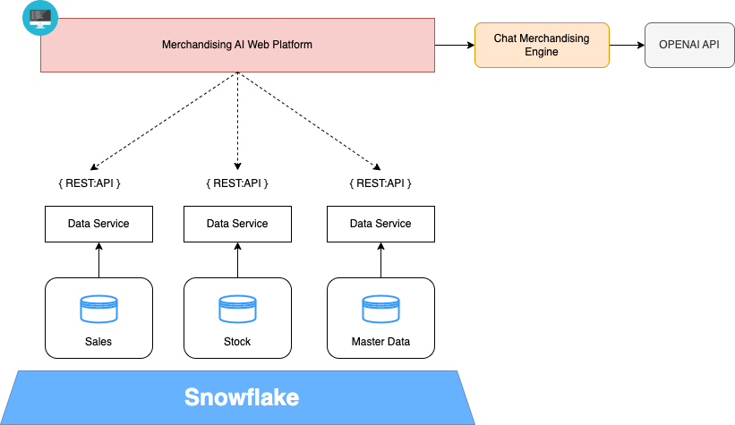
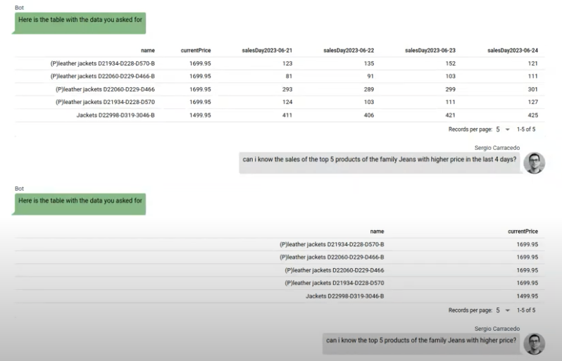
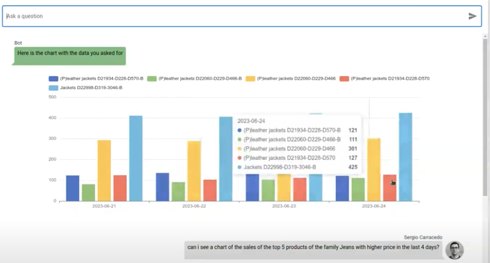
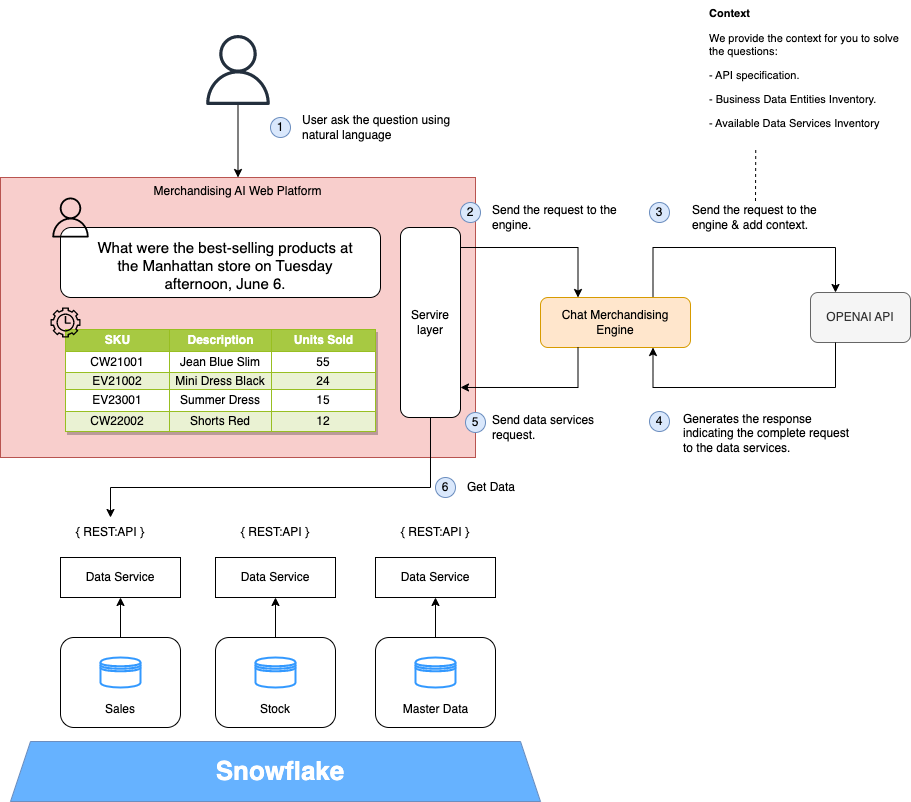

> Este artículo fue publicado originalmente en [DZone](https://dzone.com/articles/chatgpt-boosting-merchandising-user-experience).
> Lo escribí en colaboración con [Miguel García](https://www.linkedin.com/in/mgarlorenzo/)

En este artículo, explicaremos cómo el uso de los nuevos modelos de IA generativa ([LLM](https://en.wikipedia.org/wiki/Large_language_model)) puede mejorar la experiencia de los usuarios de negocio en nuestra [plataforma analítica](https://dzone.com/articles/business-analytics-tools-amp-use-cases). Supongamos que proporcionamos a nuestros gestores de merchandising de retail una aplicación web o móvil donde pueden analizar el comportamiento de las ventas y el stock en tiempo real utilizando lenguaje natural.

Estas aplicaciones suelen tener una serie de restricciones que muestran principalmente un tipo de análisis genérico, que los usuarios pueden filtrar o segmentar basándose en algunos filtros y proporcionan información como:

- Comportamiento de ventas
- Sell-through
- Stockouts (roturas de stock)
- Comportamiento del stock

Todos estos datos, con mayor o menor granularidad, responden a preguntas que alguien ha determinado previamente. El problema es que no todos los usuarios tienen las mismas preguntas y, a veces, el nivel de personalización es tan alto que convierte la solución en algo inmanejable. La mayoría de las veces, la información está disponible, pero no hay tiempo para incluirla en la aplicación web.

En los últimos años, han aparecido en el mercado soluciones low code que intentan acelerar el desarrollo de aplicaciones precisamente para responder lo más rápido posible a las necesidades de este tipo de usuarios. Todas estas plataformas requieren ciertos conocimientos técnicos. Los modelos LLM nos permiten interactuar en lenguaje natural con nuestros usuarios y traducir sus preguntas en código y llamadas a las APIs de nuestra plataforma que podrán proporcionarles información valiosa de forma ágil.

## Casos de uso de una plataforma de merchandising con IA generativa

Para mejorar nuestra plataforma de merchandising, podemos incluir dos casos de uso:

### 1. Preguntas analíticas de negocio iterativas

Permitir a los usuarios de negocio realizar preguntas iterativas sobre los datos que tenemos en nuestra plataforma de datos con las siguientes capacidades:

- Poder realizar preguntas en lenguaje natural. Puede ser interactivo, pero también debe permitir al usuario guardar sus preguntas personalizadas.
- Las respuestas se basarán en los datos actualizados.

### 2. Storytelling

Cuando se proporcionan datos al usuario de negocio sobre el reparto de la venta, una parte fundamental es el storytelling. Esto mejora la comprensión y convierte los datos en información valiosa. Sería genial si pudiéramos dar al usuario la capacidad de obtener esta explicación en lenguaje natural en lugar de que el usuario tenga que interpretar las métricas.

## Ejemplo práctico: Diseñando Chat Merchandising

### Descripción general

Es una idea muy sencilla de implementar y con mucho valor de negocio para los usuarios: vamos a entrenar nuestro modelo LLM para que, dada una pregunta, sepa qué servicio de datos proporciona la información. Para ello, nuestra arquitectura debe cumplir tres requisitos:

- Todos los datos están expuestos a través de APIs.
- Todas las entidades de datos están definidas y documentadas.
- Tenemos una capa de API estandarizada.
- El siguiente diagrama muestra la arquitectura de esta solución de alto nivel:



- **Merchandising AI Web Platform**: Canal web basado en Vue a través del cual los usuarios utilizan el chat merchandising.
- **Data Service**: Proporciona una API Rest para consumir las entidades de datos de negocio disponibles en la plataforma de datos.
- **Chat Merchandising Engine**: Servicio backend en Python que realiza la integración entre el front y el servicio LLM; en este caso, estamos utilizando la Open AI API.
- **Open AI**: Proporciona una API Rest para acceder a modelos de IA generativa.
- **Business Data Domain and Data Repository**: Un data warehouse de nueva generación, como Snowflake, modelado en dominios de datos en los que las entidades de negocio están disponibles.
- En esta PoC, hemos utilizado el servicio de OpenAI, pero podrías utilizar cualquier otro SaaS o desplegar tu propio LLM; otro punto importante es que en este caso de uso, **no enviamos ningún dato de negocio al servicio de OpenAI porque todo lo que hace el modelo LLM es traducir la solicitud realizada por el usuario en lenguaje natural en solicitudes a nuestros servicios de datos.**


::youtube[test]{id="CdQzcEDeiYA"}

### Merchandising AI Web Platform

Con el LLM y la UI generativa, el frontend adquiere una nueva relevancia: la forma en que el usuario interactúa con él y cómo el frontend responde a las interacciones. Ahora tenemos un nuevo actor, la IA generativa, que necesita interactuar con el frontend para gestionar la solicitud del usuario.

El frontend necesita proporcionar contexto a los mensajes del usuario y ser capaz de mostrar la respuesta de la forma que el usuario desea. En esta PoC, tendremos diferentes tipos de respuestas del modelo:

**Un array de datos para mostrar en una tabla:**



**Un array de datos para mostrar en un gráfico:**



El frontend necesita saber cómo el modelo o qué es lo que el usuario quiere ver en la respuesta para actuar según sea necesario; por ejemplo, si el usuario pide un gráfico, el frontend necesita renderizar un gráfico; si pide una tabla, el frontend debe renderizar una tabla; si es solo texto, entonces mostrar el texto (e incluso si hay un error, deberíamos mostrarlo de una manera diferente).

Tipamos la respuesta del Chat Merchandise Engine (tanto en el backend como en el frontend) en consecuencia:

```ts
export interface TextChatResponse {
  type: 'text';
  text: string;
}

export interface TableDataChatResponse {
  type: 'table-data';
  data: TableData;
}

export interface ChartChatResponse {
  type: 'chart';
  options: EChartOptions;
}

export interface ErrorChatResponse {
  type: 'error';
  error: string;
}

export type ChatResponse =
  | TextChatResponse
  | TableDataChatResponse
  | ErrorChatResponse
  | ChartChatResponse;
```

Y así es como decidimos qué componente mostrar:

```vue
<div class="chat-messages">
  <template v-for="(message, index) in messages" :key="index">
	<q-chat-message
      v-if="message.type === 'text'"
      :avatar="message.avatar"
      :name="message.name"
      :sent="message.sent"
      :text="message.text"
    />
    <div class="chart" v-if="message.type === 'chart'">
      <v-chart :option="message.options" autoresize class="chart"/>
    </div>
    <div class="table-wrapper"  v-if="message.type === 'table-data'">
	  <q-table :columns="getTableCols(message.data)" :rows="message.data" dense></q-table>
    </div>
  </template>
</div>
```

Con este enfoque, el frontend puede recibir los mensajes de forma estructurada y saber cómo mostrar los datos: como texto, como tabla, como gráfico o cualquier cosa que se te ocurra, y también es muy útil para el backend, ya que puede obtener datos para canales secundarios.

En cuanto a los gráficos, configuras todo lo relativo al gráfico en un objeto JS (para cualquier tipo de gráfico), por lo que en la siguiente iteración de la PoC, podrías pedirle al modelo este objeto y él podría decirnos cómo renderizar el gráfico, incluso el tipo de gráfico que mejor se adapta a los datos, etc.

### Chat Merchandising Engine

La lógica que tenemos en el motor es muy sencilla: su responsabilidad es únicamente actuar como pasarela entre el frontend, el servicio de Open AI y nuestros servicios de datos. Solo es necesario porque el modelo de Open AI no está entrenado en el contexto de nuestros servicios. Nuestro motor es responsable de proporcionar ese contexto. Si el modelo estuviera entrenado, la poca lógica que incluimos en este motor estaría en la capa de servicios del frontend.



Hemos implementado este servicio con Python ya que [Open AI](https://platform.openai.com/docs/api-reference/chat) proporciona una librería para facilitar la integración con sus APIs. Estamos utilizando la [chat completion API](https://platform.openai.com/docs/api-reference/chat) (modelo gpt-3.5-turbo), pero podríamos usar la nueva funcionalidad de [function-calling](https://platform.openai.com/docs/guides/gpt/function-calling) (modelo gpt-3.5-turbo-0613).

```python
# Initial context
messages=[
            {"role": "system", "content": API_description_context},
            {"role": "system", "content": load_openapi_specification_from_yaml_to_string()},
            {"role": "system", "content": entities},
        ]

# Add User Query to messages array
messages.append({"role": "user", "content": user_input})

# Call Open AI API
response = openai.ChatCompletion.create(
  model="gpt-3.5-turbo",
  messages=messages,
  temperature=0
)

# Get messages

generated_texts = [
            choice.message["content"].strip() for choice in response["choices"]
        ]
```

Hemos compuesto el contexto en una descripción en lenguaje natural que incluye algunos ejemplos, la especificación de la API y la definición de las APIs.

```
Merchandasing Data Service is an information query API, based on OPEN API 3,
this is an example of URL http://{business_domain}.retail.co/data/api/v1/{{entity}}.

Following parameters are included in the API: "fields" to specify the attributes of the entity that we want to get;
"filter" to specify the conditions that must satisfy the search;

For example to answer the question of retrieving the products that are not equal to the JEANS family a value
would be  products that are not equal to the JEANS family a value would be filter=familyName%%20ne%%20JEANS
```

Parseamos la respuesta y obtenemos la URL generada utilizando una expresión regular, aunque podríamos optar por otra estrategia utilizando algunas comillas especiales.

```python
def find_urls(model_message_response):
    # Patrón para encontrar URLs
    url_pattern = re.compile(r'http[s]?://(?:[a-zA-Z]|[0-9]|[$-_@.&+]|[!*\\(\\),]|(?:%[0-9a-fA-F][0-9a-fA-F]))+')
    urls = re.findall(url_pattern, model_message_response)
    return urls
```

También le pedimos al modelo que añadiera un fragmento (por ejemplo, #chart) a la URL, lo que nos permite saber qué espera ver el usuario en el frontend.

Esta solución es mucho mejor que buscar una cadena de texto en la entrada del usuario porque el usuario puede pedir un gráfico sin usar la palabra "gráfico"; es el modelo, que "entiende" la pregunta, quien decide usar la representación gráfica.

Finalmente, enviamos esta respuesta de vuelta al front porque la llamada a los servicios de datos se realiza desde el propio frontend, y esto nos permite consumir los servicios de datos utilizando los propios tokens JWT del usuario.

## Conclusiones

Durante los últimos años, muchas organizaciones y equipos han trabajado para tener una arquitectura ágil, un buen gobierno de datos y una estrategia de API que les permita adaptarse a los cambios de forma ágil. Los modelos de IA generativa pueden proporcionar un gran valor de negocio y se requiere muy poco esfuerzo para empezar a entregar valor.

Desarrollamos esta PoC que puedes ver en el vídeo en unas pocas horas, utilizando Vue3, Quasar Ui para los componentes básicos y la tabla, Echarts para renderizar los gráficos y Open AI. No hay duda de que los algoritmos son la nueva tendencia y también serán la clave de la estrategia data-driven; las organizaciones que parten de una arquitectura estandarizada y ágil tienen ventaja en este desafío.
