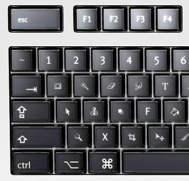
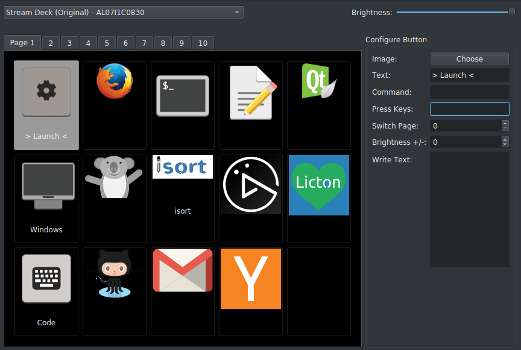
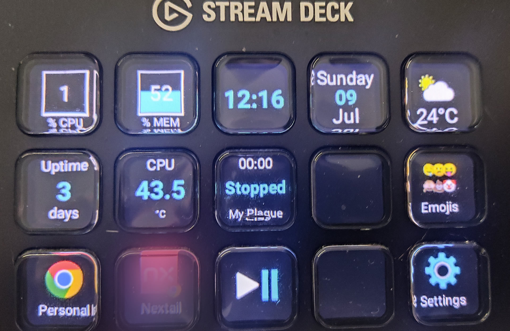
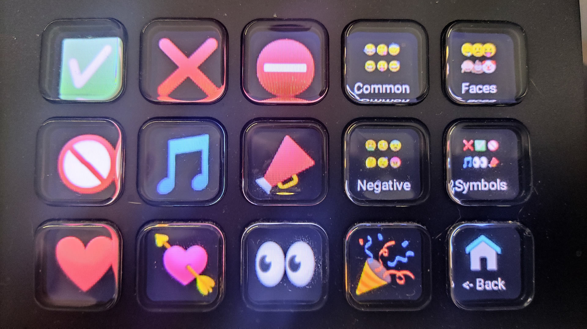
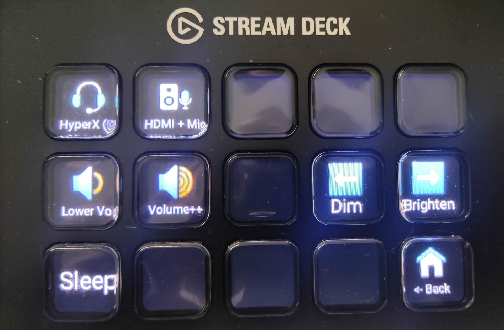

La Navidad pasada recibí un [Elgato Stream Deck](https://www.elgato.com/en/gaming/stream-deck) como regalo. Mis primeros pensamientos fueron: "No necesito esto, no conozco un caso de uso real para ello". Pero decidí quedármelo e intentar usarlo para algo.

# ¿Qué es un _Stream Deck_?

El _Stream Deck_ es un dispositivo con 15 botones (en mi caso), cada botón tiene una pequeña pantalla que puede mostrar un icono o un texto. El dispositivo se conecta a tu ordenador a través de USB y tiene un software que te permite configurar cada botón y la acción a realizar cuando lo presionas. Creo que se llama "stream" porque uno de los casos de uso típicos es cambiar las escenas de [OBS](https://obsproject.com/) cuando estás transmitiendo, pero en términos generales, puedes controlar lo que quieras. Puedes pensar en él como un teclado de macros con botones personalizables, tanto en la acción como en la visualización de la tecla.

## ¿El teclado Optimus es el "padre" del _Stream Deck_?

Lo primero que pensé cuando vi el _Stream Deck_ fue: "Esto es muy similar a algo que vi antes", y recordé el [teclado Optimus](https://en.wikipedia.org/wiki/Optimus_Maximus_keyboard), un proyecto de teclado nacido en 2007 con una pantalla en cada tecla, que te permitía cambiar la visualización de la tecla e incluso su función. Esto fue un gran vaporware y, hasta donde sé, no se produjeron muchas unidades. Pero se pueden ver las similitudes.

# Cómo funciona el _Stream Deck_

El _Stream Deck_ es un dispositivo USB; cuando lo conectas a tu ordenador, un software controla la visualización de cada tecla y la acción a realizar cuando la presionas. El software oficial está disponible para Windows y Mac, pero no para Linux.

 Tenía curiosidad sobre el funcionamiento interno del _Stream Deck_ y cómo trabaja. Empecé a buscar información al respecto y encontré muchas cosas interesantes.

- **Depende del ordenador**: El _Stream Deck_ es solo un dispositivo USB, no tiene ningún tipo de procesador o memoria, y toda la lógica la realiza el ordenador. El software del _Stream Deck_ es responsable de controlar la visualización de cada tecla y la acción a realizar al presionar. Si desconectas el _Stream Deck_, las teclas se quedarán en blanco, y si lo conectas a otro ordenador, las teclas también estarán en blanco. Eso significa que no se almacena ninguna configuración en el dispositivo, y el software es el responsable de controlar el aparato.

- **Las páginas múltiples son un artificio**: Puedes usar múltiples diseños (layouts) en el _Stream Deck_, como páginas de botones, pero esto está relacionado con lo anterior: el dispositivo no hace nada al respecto, el software simplemente cambia la imagen y las acciones cuando navegas a otra página.

- **Solo una pantalla**: Como puedes ver en el video a continuación, el _Stream Deck_ es solo una gran pantalla con una máscara para emular múltiples pantallas pequeñas (y botones).

::youtube[]{id="rOQu9_t2zOY"}

# ¿Usándolo en Linux?

El primer problema fue que no hay soporte oficial para Linux. Empecé a buscar proyectos de la comunidad y de código abierto relacionados con el _Stream Deck_ y encontré [Streamdeck UI](https://timothycrosley.github.io/streamdeck-ui/).

## Streamdeck UI

Es una aplicación con interfaz gráfica (GUI) escrita en Python que te permite configurar cada botón del Stream Deck, estableciendo el icono, la etiqueta y la acción a realizar al presionar la tecla. La acción puede ser un comando de CLI, emulación de pulsación de teclas (por ejemplo, emular alguna combinación de teclas o pulsaciones) o incluso escribir un texto por ti.

La aplicación es agradable y fácil de usar.

## Librería de golang para Streamdeck y Deckmaster

Intentando encontrar otras aplicaciones y cómo interactuar programáticamente con el _Stream Deck_, encontré esta excelente librería de Go: https://github.com/muesli/streamdeck

Esta librería permite detectar los Stream Decks conectados al ordenador e interactuar con ellos programáticamente o a través de la herramienta de CLI que proporciona.

La librería es muy interesante porque puedes entender cómo funciona el dispositivo, por ejemplo, cómo [lee las pulsaciones de teclas](https://github.com/muesli/streamdeck/blob/c719a8002f7a9ac63b1798c4a8308f6d3643fc7b/streamdeck.go#L255) usando la librería HID para interactuar con el dispositivo, o cómo [envía las imágenes de los botones al dispositivo](https://github.com/muesli/streamdeck/blob/c719a8002f7a9ac63b1798c4a8308f6d3643fc7b/streamdeck.go#L422).

El autor de esta librería también proporciona una aplicación completa para configurar el _Stream Deck_: [Deckmaster](https://github.com/muesli/deckmaster)

Esta es una aplicación de CLI que te permite configurar el _Stream Deck_ usando archivos _.toml_, algo que te permite añadir fácilmente control de versiones a la configuración. Incluso puedes tener diferentes diseños (decks) y navegar entre ellos usando los botones del _Stream Deck_ como las páginas originales del deck.

Esta aplicación también proporciona "widgets" especiales para los botones, por ejemplo, para mostrar el uso de la CPU, el uso de la memoria, la hora, el clima, etc.

Uno de los widgets (así es como llama a cada botón) que uso mucho es el que puede mostrar la salida de un comando en un botón del _Stream Deck_; por ejemplo, tengo un botón que muestra la canción actual que se está reproduciendo en el sistema, si está en pausa o reproduciéndose, y el tiempo de la canción. Otro es para mostrar la temperatura de la CPU, etc.

Es una aplicación estupenda y está publicada con una licencia de código abierto, lo que significa que puedes modificarla y adaptarla a tus necesidades.

# Encontrando casos de uso útiles para el _Stream Deck_

Uniendo Deckmaster con el poder de Linux para ejecutar acciones y tareas usando la línea de comandos, creo que ahora no podría vivir sin mi _Stream Deck_. Lo uso para muchas cosas, por ejemplo:

- **Cambiar entre las instancias de Chrome personal y de trabajo**. Puedo traer al frente de las ventanas la instancia que quiera con solo un botón.
- **Reproducir/pausar la música**: Mi teclado no tiene teclas multimedia, así que uso el _Stream Deck_ para reproducir/pausar la música.
- **Insertar emojis**: Tengo múltiples decks para insertar emojis en mi texto. Funciona como un acceso directo a algunos emojis.
- **Control de volumen**: Tengo un deck para controlar el volumen y otro para silenciar/activar el micrófono.
- **Selector de dispositivos de audio**: Normalmente uso auriculares y su micrófono, pero a veces quiero usar el micrófono de la cámara y los altavoces; en lugar de ir a la configuración de audio y cambiar ambos dispositivos de entrada y salida, tengo 2 botones que realizan ambos cambios con una sola pulsación.
- **Mostrar información del sistema**: Por ejemplo, el uso de CPU y memoria, la hora, el uptime, la temperatura de la CPU, etc.

Las siguientes imágenes son un par de mis decks:

# Conclusión

Creo que el _Stream Deck_ es un dispositivo genial, y es muy útil para proporcionar información y realizar acciones que podrían requerir múltiples clics o pulsaciones de teclas. Mi sensación es que lo estoy usando al 20% de su potencial.
