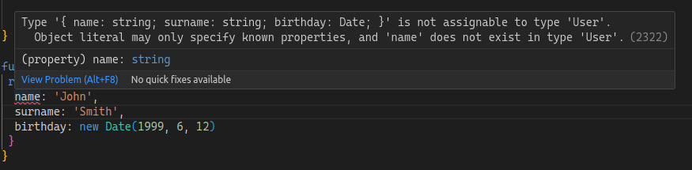

Cuando introduces TypeScript en un proyecto legacy, o estás usando una librería que no proporciona tipos, podrías sentir la tentación de usar `any` para los tipos que vas a necesitar. Pero esto no es una buena idea, porque estás perdiendo todos los beneficios de TypeScript. **`any` es algo que debes eliminar del código, y de tu mente**.

## Tipar una estructura progresivamente

Es muy común tener un objeto con muchas propiedades, e intentar tipar completamente la estructura (que es el objetivo final) de un objeto que no entiendes del todo puede ser una tarea abrumadora.

Pero puedes empezar creando el tipo desde el punto de vista del consumidor. En este enfoque, tipas los elementos del objeto que necesitas.

Esta estrategia te ofrece un punto de partida para definir una estructura con sencillez y evitando el tipo `any`.

Veamos un ejemplo:

Imagina que tu aplicación legacy te proporciona una función (que no tiene la definición de TypeScript) que obtiene una lista de usuarios de la API, y necesitas escribir una función para calcular la edad de un usuario.

```javascript

function getUser(id) {
  return {
    birthday: new Date('1980-01-01'),
    name: 'John',
    surname: 'Smith',
    role: 'user',
    accounts: ...
    ...
  }
}
```

La estructura de datos que devuelve la función es grande y compleja, y algunos usuarios tienen campos diferentes; por ejemplo, te das cuenta de que para los usuarios con el rol `admin` tienes un campo `level` que otros no tienen.

También te das cuenta de que todos los usuarios tienen el campo `birthdate`. Ese es un campo importante para ti. Con estos requisitos, tu función no necesita otros datos del usuario, así que puedes empezar a tipar tu estructura de usuario.

```ts
export interface User {
  birthday: Date;
}

function userAge(user: User): number {
  const diffMs = Date.now() - user.birthday.getTime();
  const ageDt = new Date(diffMs);
  return Math.abs(ageDt.getUTCFullYear() - 1970);
}
```

Vale, pero ahora quieres tipar el retorno de la función que devuelve el usuario. Pero al hacer `function getUser(id): User` obtendrás un error de tipo, ya que la función devuelve más campos que el campo birthday:



Necesitas hacerle saber a TypeScript que solo sabes que el usuario tiene el campo `birthday` y más campos, pero que no los conoces. Escribiendo eso en TypeScript:

```ts
interface User {
  [x: string]: unknown;
  birthday: Date;
}
```

Bueno, sigue siendo una especie de any, pero más restringido; por ejemplo, `const user2 = { name: 'Mike'}` no encaja con el tipo user ya que falta el campo `birthday`.

De nuevo, este es el punto de partida para tipar el objeto usuario sin entender el objeto completo y con el mínimo esfuerzo; esto es mucho mejor que simplemente usar `any`, ya que cuando conozcas el objeto por completo no necesitarás cambiar la función `userAge`.

Si tú o un compañero añadís una nueva función o método que proporcione más conocimiento del objeto, puedes simplemente seguir completando la interfaz. Por ejemplo, si descubres una función en el código legacy para obtener el nombre completo del usuario, y la función te permite saber (por ejemplo, por la comprobación que hace) que el nombre siempre está presente, pero no el apellido, puedes completar el tipo con:

```ts
interface User {
  [x: string]: unknown;
  name: string;
  surname?: string;
  birthday: Date;
}
```

Con el tiempo obtendrás un tipo completo para el objeto usuario, y podrás eliminar la parte `[x: string]: unknown`.

```ts
interface User {
  [x: string]: unknown;
  birthday: Date;
}

function getUser(): User {
  return {
    name: 'John',
    surname: 'Smith',
    birthday: new Date(1999, 6, 12),
  };
}

function userAge<T>(user: User): number {
  const diffMs = Date.now() - user.birthday.getTime();
  const ageDt = new Date(diffMs);
  return Math.abs(ageDt.getUTCFullYear() - 1970);
}

console.log(userAge(getUser()));
```

[Ejecuta el código en el playground](https://www.typescriptlang.org/play?ssl=2&ssc=3&pln=2&pc=23#code/JYOwLgpgTgZghgYwgAgKoGdrIN4ChnIDaAHgFzLphSgDmAuuQK4gDWIA9gO4j7IBGwKGAAWAEzgBPcgBE4kXAF9cuGMwRhg7EMhoQwGaAAoAlOQNQc+KHsZRteAiDgBbCOQDkAKXbCQ7gDS86LZOrh4Ays7AIgG8AkJikuQgEJzIspCGAIwAnHn+yABsBVkATMb4SkrKqiDqmtqMmFAAgroAPAAqAHyGTdBmzabIIIzOfFgOBAhalMiiwDAwALLoyAC86XIQAHQcnCbIALTI-VA78SLiEju6YJ3AriYA3LwzIHNwutJgGyOpW0yCyWq2MrwI1jAIWQyzkwh2cD46EMXwgP1uelQnQAwgAxRgAGwJAE0IHAoIcTrkAOwABjBBGQimU73Q7AJuwJ7BofWabQghju5hMxmMQA)

## Tipar la función, constantes, etc. que necesites

Hoy en día, la mayoría de las librerías de JS incluyen la definición de tipos; la librería puede exponerla directamente o a través de un paquete externo como [DefinitelyTyped](https://github.com/DefinitelyTyped/DefinitelyTyped).
Pero a veces los tipos no están disponibles, tal vez porque la librería es antigua y/o porque no es lo suficientemente popular como para tener una definición de tipos, o simplemente porque la librería es privada y solo está disponible en tu empresa (también conocida como librería legacy).

El objetivo es tipar (o declarar en este caso) completamente la librería, pero puedes simplemente tipar la función, constante, etc. que vayas a necesitar.
Para que TypeScript sepa que estás [declarando tu módulo o librería](https://www.typescriptlang.org/docs/handbook/modules.html#working-with-other-javascript-libraries), necesitas usar la palabra clave `declare` y el nombre del módulo (librería), por ejemplo:

```ts
declare module 'my-library' {
  export function theFunctionIUse(a: number, b: number): number;
  export const libraryConst: number;
  ...
}
```

Esto puede estar en cualquier archivo de tu proyecto y solo se aplica a él. Si quieres compartir la declaración con otros archivos, puedes crear un paquete con la definición de tipos ([mira un ejemplo en DefinitelyTyped](https://github.com/DefinitelyTyped/DefinitelyTyped/tree/master/types/chromecast-api)) y publicarlo en npm o en el registro de tu empresa.

## Resumen

El objetivo es tipar completamente el código legacy y las librerías, pero paso a paso. Puedes aplicar esta estrategia para mejorar el tipado "bajo demanda" y evitar el tipo `any`, teniendo en cuenta que esta no es la solución definitiva, sino un camino hacia la solución correcta.
