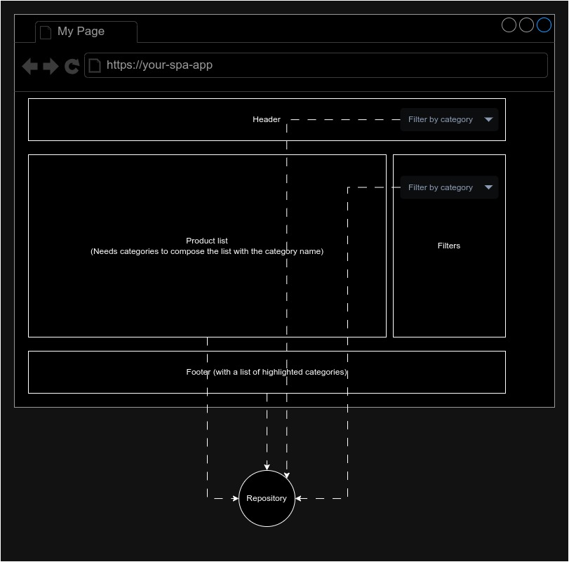
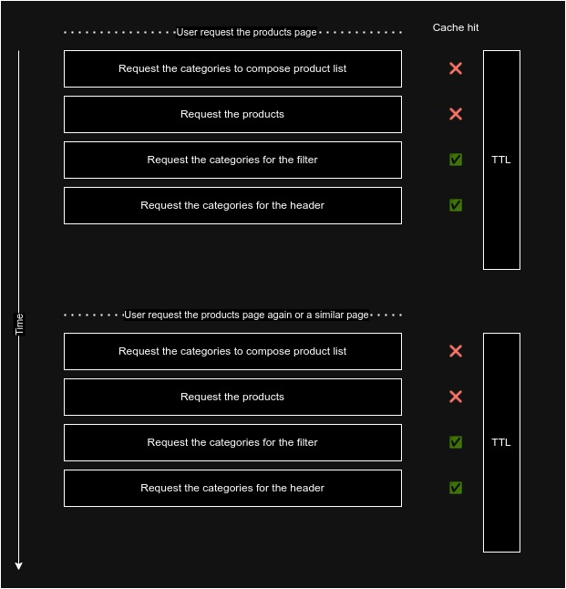

Podemos estar de acuerdo en que el desacoplamiento es una buena práctica que simplifica el código y la mantenibilidad del proyecto.

Una forma común de desacoplar el código es dividir las responsabilidades en diferentes capas; una división muy habitual es:

- **view layer (capa de vista)**: encargada de renderizar el HTML e interactuar con el usuario.
- **domain layer (capa de dominio)**: encargada de la lógica de negocio.
- **infra layer (capa de infraestructura)**: encargada de obtener los datos del backend y devolverlos a la capa de dominio (aquí es muy común usar el patrón repositorio, que es simplemente un contrato para obtener los datos. El contrato es único pero puedes tener múltiples implementaciones, por ejemplo, una para una API REST y otra para una API GraphQL; deberías poder cambiar la implementación sin cambiar otras piezas del código).

Veamos un par de ejemplos de casos de uso donde es muy típico priorizar el rendimiento sobre el desacoplamiento. (Spoiler: podemos tener ambos).

Imagina que tienes un endpoint que devuelve la lista de productos, y uno de los campos es el `category_id`. La respuesta puede ser algo como esto (he eliminado otros campos para simplificar el ejemplo):

```json
[
  { id: 1, name: "Product 1", category_id: 1 },
  { id: 2, name: "Product 2", category_id: 2 },
  ...
]
```

Necesitamos mostrar el nombre de la categoría en el frontend (no el id), por lo que necesitamos llamar a otro endpoint para obtener el nombre de la categoría. Ese endpoint devuelve algo como:

```json
[
  { id: 1, name: "Mobile" },
  { id: 2, name: "TVs" },
  { id: 3, name: "Keyboards" },
  ...
]
```

> Podrías pensar que el backend debería hacer el join y devolver todo en una sola petición, pero eso no siempre es posible.

Podemos hacer el join en el frontend, en la función o método encargado de recuperar los productos; podemos hacer ambas peticiones y combinar la información. Ejemplo:

```typescript
async function getProductList(): Promise<Product[]> {
  const products = await fetchProducts();
  const categories = await fetchCategories();
  return products.map((product) => {
    const category = categories.find((category) => category.id === product.category_id);
    return { ...product, category_name: category.name };
  });
}
```

Nuestra aplicación no necesita saber nada sobre el hecho de que necesitamos 2 llamadas para recuperar la información, y podemos usar el `category_name` en el frontend sin ningún problema.

Ahora imagina que necesitas mostrar la lista de categorías, por ejemplo en un desplegable (dropdown). Puedes reutilizar la función `fetchCategories`, ya que hace exactamente lo que necesitas.

En tu vista, el código sería algo como esto:

```vue
<template>
  <dropdown :options="categories" />
  <product-list :products="products" />
</template>
<script lang="ts" setup>
import { fetchCategories, getProductList } from '@/repositories';

const categories = await fetchCategories();
const products = await getProductList();
</script>
```

Y en ese punto, te das cuenta de que estás haciendo 2 llamadas al mismo endpoint para recuperar los mismos datos, datos que ya recuperaste para componer la lista de productos, y eso no es bueno en términos de rendimiento, carga de red, carga del backend, etc.

En este momento, empiezas a pensar en cómo reducir el número de llamadas al backend, en este caso, para simplemente reutilizar la lista de categorías. Puedes tener la tentación de mover las llamadas a la vista y hacer el join de los productos y las categorías allí.

```vue
// ❌❌❌ Solución no recomendada
<template>
  <dropdown :options="categories" />
  <product-list :products="products" />
</template>
<script lang="ts" setup>
import { fetchCategories, fetchProducts } from '@/repositories';

const categories = await fetchCategories();
const products = await fetchProducts().map((product) => {
  const category = categories.find((category) => category.id === product.category_id);
  return { ...product, category_name: category.name };
});
</script>
```

Con eso, has resuelto los problemas de rendimiento, pero has añadido otro GRAN problema: **acoplamiento entre infra, vista y dominio**. Ahora tu vista conoce la forma de los datos en la infra (backend), lo que dificulta la reutilización del código. Podemos profundizar en esto y empeorar las cosas: ¿qué pasa si tu barra de navegación (que está en otro componente) necesita la lista de categorías? Necesitas pensar en la aplicación de una manera global.

Imagina algo más complejo, un escenario donde necesitas las categorías en la cabecera, la lista de productos, los filtros y el pie de página.



Con el enfoque anterior, tu capa de aplicación (Vue, React, etc.) necesita pensar en cómo obtener los datos para minimizar las peticiones. Y eso no es bueno, ya que la capa de aplicación debería centrarse en la vista, no en la infraestructura.

## Usar un store global

Una solución a este problema es usar un store global (Vuex, Pinia, Redux, etc.) para delegar las peticiones y simplemente usar el store en la vista. El store solo debería cargar los datos si aún no están cargados, y la vista no debería preocuparse por cómo se cargan los datos. **Esto suena a caché, ¿verdad?** Resolvemos el problema de rendimiento, pero seguimos teniendo la infra y la vista acopladas.

## Caché de infra al rescate

Para desacoplar lo máximo posible la infra y la vista, deberíamos mover la caché a la capa de infraestructura (la capa encargada de obtener los datos del backend). Al hacer esto, podemos llamar a los métodos de infra en cualquier momento realizando una sola petición al backend, pero el concepto importante es que el dominio, la aplicación y la vista no saben nada sobre la caché, la velocidad de la red, el número de peticiones, etc.

La capa de infra es solo una capa para obtener los datos con un contrato (cómo pedir los datos y cómo se devuelven). Siguiendo los principios de desacoplamiento, deberíamos poder cambiar la implementación de la capa de infra sin cambiar las capas de dominio, aplicación o vista. Por ejemplo, podemos reemplazar el backend que usa REST por uno que usa GraphQL, y podemos obtener el producto con los nombres de las categorías sin hacer 2 peticiones. Pero de nuevo, **esto es algo de lo que debe encargarse la capa de infra, no la vista.**

Existen :astro-ref[diferentes estrategias que puedes seguir para implementar la caché]{path="/blog/2023/2023-05-07-frontend-cache-strategies"} en la capa de infra: caché HTTP (Proxy o caché interna del navegador), pero en estos casos, para una mejor flexibilidad al invalidar las cachés en el frontend, es mejor que nuestra aplicación (de nuevo, la capa de infra) gestione la caché.

Si estás usando axios, puedes usar [Axios Cache Interceptor](https://axios-cache-interceptor.js.org/) para gestionar la caché en la capa de infra. Esta librería hace que el almacenamiento en caché sea muy sencillo:

```typescript
// Ejemplo de la página de axios cache interceptor
import Axios from 'axios';
import { setupCache } from 'axios-cache-interceptor';

// mismo objeto, pero con tipados actualizados.
const axios = setupCache(Axios);

const req1 = axios.get('https://api.example.com/');
const req2 = axios.get('https://api.example.com/');

const [res1, res2] = await Promise.all([req1, req2]);

res1.cached; // false
res2.cached; // true
```

Solo necesitas envolver la instancia de axios con el interceptor de caché, y la librería se encargará del resto.

## TTL

[TTL](https://en.wikipedia.org/wiki/Time_to_live) (Time To Live) es el tiempo que la caché será válida; después de ese tiempo, la caché se invalidará y la siguiente petición se realizará al backend. El TTL es un concepto muy importante, ya que define qué tan frescos están los datos.

Cuando almacenas datos en caché, un problema desafiante es la inconsistencia de datos. En nuestro ejemplo, podemos pensar en un carrito de compras. Si está en caché y el usuario añade un nuevo producto, si tu aplicación hace una petición para obtener la versión actualizada del carrito, obtendrá la versión en caché y el usuario no verá el nuevo producto. Existen estrategias para invalidar la caché y resolver este problema, pero eso queda fuera del alcance de este post; sin embargo, debes saber que no es un problema trivial: diferentes casos de uso necesitan diferentes estrategias.

Cuanto más largo sea el TTL, mayor será el problema de inconsistencia de datos, ya que pueden ocurrir más eventos en ese tiempo.

Pero para el objetivo que buscamos (permitir desacoplar el código fácilmente), un TTL muy bajo (por ejemplo, 10 segundos) es suficiente para eliminar el problema de inconsistencia de datos.

### ¿Por qué un TTL bajo es suficiente?

Piensa en cómo interactúa el usuario con la aplicación:

- El usuario solicitará una URL (puede ser parte de una SPA o una página SSR).
- La aplicación creará el layout de la página, montando los componentes independientes: la cabecera, el pie de página, los filtros y el contenido (lista de productos en el ejemplo).
- Cada componente solicita los datos que necesita.
- La aplicación renderizará la página con los datos recuperados y la enviará al navegador (SSR) o la inyectará/actualizará en el DOM (SPA).



Todos esos procesos se repiten en cada cambio de página (quizás parcialmente en una SPA) y, lo más importante, se ejecutan en un corto período de tiempo (quizás milisegundos). Así que con un TTL bajo podemos estar bastante seguros de que solo haremos una petición al backend, y no tendremos problemas de inconsistencia de datos, ya que en el siguiente cambio de página o interacción del usuario la caché habrá expirado y obtendremos los datos frescos.

## Resumen

Esta estrategia de caché con un TTL bajo es una muy buena solución para desacoplar la infra y la vista:

- Los desarrolladores no necesitan pensar en cómo obtener los datos para minimizar las peticiones en la capa de vista. Si necesitas la lista de categorías en un subcomponente, la pides; no necesitas preocuparte por si otro componente está pidiendo los mismos datos.
- Evita mantener un estado global de la aplicación (stores).
- Hace que sea más natural realizar múltiples peticiones siguiendo el contrato en un patrón repositorio para obtener los datos que necesitas en la capa de repositorio, y hacer el join en la capa de infra.
- En términos generales, simplifica la complejidad del código.
- Sin desafíos de invalidación de caché (ya que el TTL es muy bajo) (excepto quizás para algunos casos de uso muy específicos).
