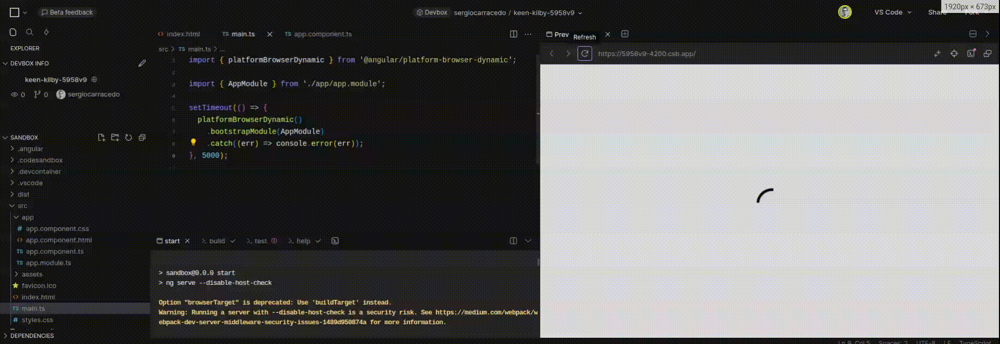

Cuanto más grande es una SPA, más recursos (javascript, css, imágenes, etc.) necesitan cargarse antes de empezar a funcionar (renderizar/mostrar la aplicación en el navegador del usuario).

Este tiempo, el que transcurre desde que la página comienza a cargarse hasta que el usuario puede interactuar con ella, es el TTI, [Time to Interactive](https://web.dev/articles/tti?hl=en). Esta es una métrica importante para tu aplicación. **Cuanto mayor sea el valor, menor será la experiencia de usuario** al utilizar la aplicación.

> El TTI es una métrica para cualquier aplicación, no solo para las SPA.

## Cómo mejorar el TTI

Mejorar el TTI (reducirlo) depende de varios factores:

- Red: latencia, ancho de banda, ...
- Host: carga del servidor, CPU, velocidad del disco, ...
- Tamaño de la aplicación: El tamaño y el número de recursos a obtener del host (recuerda que los navegadores modernos limitan el número de peticiones paralelas por host a 6).

Desde el punto de vista del Front-end, los elementos sobre los que puedes actuar son el tamaño de la aplicación y el número de recursos a obtener.

Puedes dividir tu aplicación en chunks y agrupar los recursos por página, cargando solo los recursos necesarios para la primera carga. Puedes consultar la documentación de tu module bundler sobre cómo hacerlo.

Esto requiere tiempo y esfuerzo y, a veces, no es posible invertir tiempo en ello, pero **hay algo sencillo que puedes hacer para mejorar la experiencia de usuario**.

## Cargador de la aplicación (App loader)

Con la configuración típica de una SPA, cuando el usuario llega a tu página, no se muestra nada antes de que la SPA se cargue y renderice el contenido. Este tiempo puede ser de solo un par de segundos, pero desde el punto de vista del usuario, no está pasando nada. No estamos proporcionando feedback y eso es frustrante. Probablemente tu aplicación mostrará un cargador (loader) cuando la SPA se haya cargado y montado en el DOM, pero deberíamos mostrar algo antes de eso.

Si revisas el archivo de entrada de tu framework de JS favorito, encontrarás un código que monta la aplicación en el DOM.

#### Vue

```typescript
// main.ts
import { createApp } from 'vue';
import App from './App.vue';
createApp(App).mount('#app');
```

#### React

```tsx
import { createRoot } from 'react-dom/client';

const domNode = document.getElementById('app');
const root = createRoot(domNode);

root.render(<App />);
```

#### Angular

```typescript
import { Component } from '@angular/core';
@Component({
  selector: 'app',
  templateslug: './app.component.html',
  styleUrls: ['./app.component.css'],
})
export class AppComponent {
  title = 'Test';
}
```

Podría seguir escribiendo ejemplos para otros frameworks, pero los conceptos básicos son los mismos: tu `index.html` incluye un elemento con el id `app` (`<div id="app"><div>`), y el framework montará la aplicación aquí después de cargarla y renderizarla.

Lo que hace la acción de "Montar" (Mount) es reemplazar el contenido del elemento del DOM (#app en los ejemplos) con el DOM que genera el framework; sabiendo esto, podemos usarlo a nuestra conveniencia.

Cualquier contenido dentro del *punto de montaje de la aplicación* se mostrará hasta que el framework lo reemplace, por lo que podemos mostrar nuestro cargador allí, y cuando la aplicación se monte, desaparecerá. Por ejemplo:

```html
<html></html>
<body>
  <div id="#app">Loading app...</div>
</body>
```

## Cómo mostrar el cargador lo antes posible: Consejos y recomendaciones para el cargador de la aplicación

Hay otra métrica que deberías conocer: FCP ([First Contentful Paint](https://web.dev/articles/fcp?hl=en)), que es el tiempo desde que la página comienza a cargarse hasta que se renderiza **cualquier** parte de la página.

Queremos que este tiempo sea lo más bajo posible; nuestro cargador de la aplicación será inútil si tarda "mucho" tiempo en cargarse, ya que reproduciremos lo mismo que intentamos evitar.

Recuerda que el navegador cargará primero el archivo HTML y cargará los enlaces (imágenes, CSS, JS, etc.) en paralelo (ten en cuenta que algunas de esas peticiones bloquean el renderizado).

Para lograrlo, puedes seguir las recomendaciones/consejos que aparecen a continuación:

### Usa CSS, JS e imágenes inline

Si tu cargador depende de una hoja de estilo externa `<link rel="stylesheep" type="text/css" href="style.css">`, de una imagen `` o de un archivo JS, el navegador tendrá que cargarlo antes, y esto lleva tiempo (y puede ser bloqueado por otra petición).

Usa CSS, JS e imágenes inline. Puedes incluir imágenes SVG como parte del documento HTML y para imágenes binarias (JPG, GIF, etc.) puedes usar [data urls](https://developer.mozilla.org/en-US/docs/Web/HTTP/Basics_of_HTTP/Data_URLs).

### Hazlo lo más sencillo posible

Recuerda que el objetivo de este cargador es proporcionar feedback al usuario para que sepa que la aplicación se está cargando; no es necesario crear el mejor cargador del mundo con animaciones, interactividad, etc.

### Evita conflictos de CSS con la aplicación

Si pones todo el código del cargador dentro del punto de montaje de la aplicación, este será reemplazado, por lo que cualquier clase CSS que estés aplicando se eliminará, evitando dolores de cabeza.

### Elimina los recursos que bloquean el renderizado

Algunas etiquetas HTML activan procesos del navegador que bloquean el renderizado hasta que el proceso finaliza; intenta eliminarlos en la medida de lo posible:

- No uses @import para CSS (usa la etiqueta `link`)
- Usa `defer` y `async` en javascript
- Más consejos en https://blog.logrocket.com/9-tricks-eliminate-render-blocking-resources/

## Ejemplo

He creado un ejemplo sencillo en Angular, pero el framework es irrelevante.

Consulta un ejemplo en [code sandbox](https://codesandbox.io/p/devbox/keen-kilby-5958v9?file=%2Fsrc%2Fmain.ts%3A10%2C1)

> El código de montaje tiene un retraso de entrega de 5 segundos para que puedas apreciar el cargador.

Como puedes ver en el gif de abajo, el cargador se muestra lo antes posible, en cuanto el navegador carga el HTML, y el cargador está presente hasta que la aplicación se monta, así el usuario sabe que algo está sucediendo.


En términos de usabilidad, no solo en sitios web, sino en cualquier aplicación (web, escritorio, móvil, CLI, etc.), debes proporcionar feedback al usuario para que sepa que algo está ocurriendo. Es muy frustrante esperar por algo sin saber si la aplicación se ha quedado colgada o no, o si está haciendo algo y el botón simplemente no funciona.

Con esta técnica puedes mejorar la experiencia de usuario de tu aplicación con un simple cambio de unos pocos bytes que no aumentan el tiempo de FCP más de unos pocos milisegundos.
