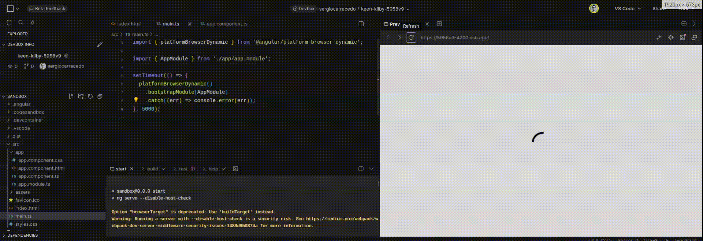

As big a SPA is, more resources (javascript, css, images, etc.) need to load before starting to work (render/show the application in the user's browser)

This, the time between the page starts to load and the user can interact with, is the TTI, [Time to Interactive](https://web.dev/articles/tti?hl=en). This is an important metric for your application. **As higher is the value lower is the user experience** using the application.

> TTI is a metric for any application, not only for SPAs.

## How to improve TTI

Improve the TTI (reduce it), depends on several factors:

- Network: latency, bandwidth, ...
- Host: Server load, CPU, disk speed, ...
- App size: The size and the number of resources to get from the host (remember the modern browsers limit the number of parallel request per host to 6)

From the Front-end point of view, the things you can act on are the app size and the number of resources to get.

You can split your application into chunks and group the resources by page, only loading the resources necessary for the first load. You can check your module bundler about how to do that.

This requires time and effort and sometimes is not possible to invest time in that, but **there is something simple you can do to improve the user experience**

## App loader

With the typical SPA configuration, when the user reaches your page, nothing is shown before the SPA loads and renders the content. This time can be just a couple of seconds, but from the user's point of view, nothing is happening. We are not providing feedback and that is frustrating. Probably your application will show a loader when the SPA will be loaded, and mounted in the DOM, but we should show something before that.

If you check your favorite js framework entry file, you will find a code that mounts the app into the DOM

#### Vue

```typescript
// main.ts
import { createApp } from 'vue';
import App from './App.vue';
createApp(App).mount('#app');
```

#### React

```tsx
import { createRoot } from 'react-dom/client';

const domNode = document.getElementById('app');
const root = createRoot(domNode);

root.render(<App />);
```

#### Angular

```typescript
import { Component } from '@angular/core';
@Component({
  selector: 'app',
  templateslug: './app.component.html',
  styleUrls: ['./app.component.css'],
})
export class AppComponent {
  title = 'Test';
}
```

I could continue writing examples for other frameworks, but the basics are the same, your `index.html` includes an element with the `app` id (`<div id="app"><div>`), and the framework, will mount the application here after load and render it

What "Mount" action does is to replace the DOM element content (#app in the examples) with the DOM the framework generates, knowing that we can use it at our convenience.

Any content inside the _app mount point_ will be shown until the framework replaces it, so we can display our loader there, and when the app is mounted it will disappear. For example:

```html
<html></html>
<body>
  <div id="#app">Loading app...</div>
</body>
```

## How to show the loader as soon as possible: Tips and recommendations for the app loader

There is another metric you should know: FCP ([First Contentful Paint](https://web.dev/articles/fcp?hl=en)), this is the time from the page starts to load and when **any** part of the page is rendered.

We want to make this time as low as possible, our app loader will be unuseful if it takes a "long" time to load as we will reproduce the same as we are trying to avoid.

Remember the browser will load the HTML file first and will load the links (images, CSS, JS, etc...) in parallel (bear in mind some of those requests block the render)

To achieve it you can follow the recommendations/tips down bellow:

### Use inline CSS, JS, and images

If your loader depends on an external stylesheet `<link rel="stylesheep" type="text/css" href="style.css">` file, on an image `` or in a js file the browser will need to load it before, and this takes time (and can be blocked by another request).

Use inline CSS, JS, and images. You can include SVG images as part of the HTML document and for binary images (JPG, GIF, etc) you can use [data urls](https://developer.mozilla.org/en-US/docs/Web/HTTP/Basics_of_HTTP/Data_URLs)

### Make it simple as possible

Remember the goal of this app loader is to provide feedback to the user to let her/him know the app is loading, no need to create the best loader in the world with animations, interactivity, etc...

### Avoid CSS conflicts with the app

If you put all the loader code inside the app mount point it will be replaced, so any css class you are applying will be removed avoiding headaches.

### Eliminate render-blocking resources

Some html tags trigger browser processes that blocks the rendering until the process will finish, try to remove it as much as possible:

- Don't use @import for CSS (use `link` tag)
- Use `defer` and `async` in javascript
- More tips at https://blog.logrocket.com/9-tricks-eliminate-render-blocking-resources/

## Example

I created a simple example in Angular, but the framework is irrelevant

Check an example in [code sandbox](https://codesandbox.io/p/devbox/keen-kilby-5958v9?file=%2Fsrc%2Fmain.ts%3A10%2C1)

> The mount code has a 5s delivery delay to let you appreciate the loader

As you can see in the gif bellow, the loader is shown as soon as possible, as soon as the browser loads the html, and the loader is present until the app is mounted, and the user know something is happening.


In terms of usability, not only in websites, in any app, (web, desktop, mobile, cli, etc) you must provide feedback to the user to let him/her know something is happening. It's very frustrating to wait for something without knowing if the app is frozen or not or if is doing something and the button just does not work.

With this technique you can improve the user experience of your app with a simple change of a few bytes that don't increase the FCP time more than a few milliseconds.
