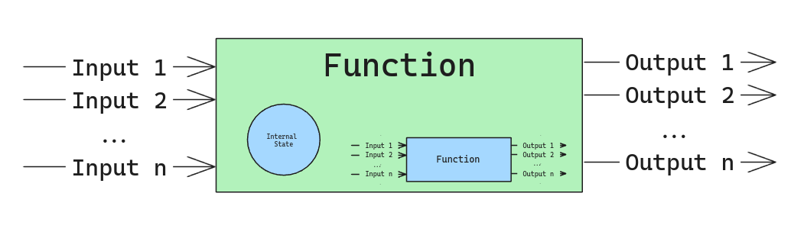
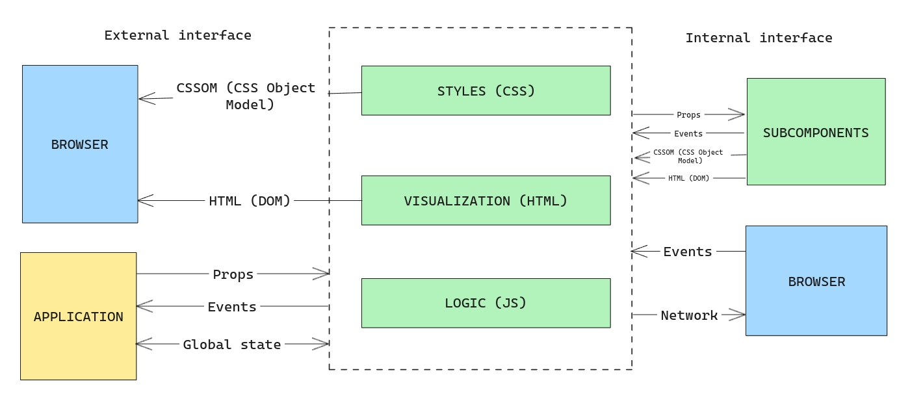

> Este es el segundo post de una serie sobre por qué y cómo crear una librería de componentes de UI. Me voy a centrar en los ejemplos de código en Vue.js, pero los conceptos son válidos para cualquier otro framework como React, Angular, LitElements, etc.
>
> :astro-ref[Capítulo I: Introducción]{path="/blog/2024/2023-12-02-ui-components-library"}

Antes de crear una librería de componentes, es importante entender la anatomía de un componente, sus interfaces y cómo crear una buena "API" para los componentes.

## Anatomía de un componente

Un componente es una pieza de software reutilizable que encapsula algunas partes de la interfaz de usuario.

Un componente es similar a una función o a un objeto. Todos ellos reciben alguna entrada y devuelven alguna salida. La función (si no es pura) o el objeto utilizarán otros valores como el estado interno y el entorno para ejecutar la acción cambiando la salida, pero básicamente, podemos pensar en una función como una caja negra que recibe unas entradas y produce unas salidas, y que puede cambiar el estado interno.

Si miramos dentro de la caja negra, probablemente esa función utilizará otras funciones para realizar parte del trabajo.

Lo mismo ocurre con un componente. Un componente es una caja negra que recibe unas entradas y produce unas salidas.

Las entradas pueden ser **datos** puros, por ejemplo, los datos a renderizar en una tabla, o **modificadores**, que cambian el **comportamiento** de los componentes (definen si la tabla a renderizar es ordenable), cambian la **visualización** (definen el color de la cabecera de la tabla), modifican la **salida** (definen el número de filas a renderizar) o modifican la **interacción** (definen el comportamiento cuando el usuario hace clic en una fila).

Las salidas pueden ser el HTML renderizado, los eventos emitidos por el componente, los valores almacenados en un store global, etc.

Dentro del componente, podemos tener otros componentes, y el componente puede mantener un estado interno y/o podría utilizar valores del entorno (como el store de estado global, el router, etc.).

En este punto, podemos definir las interfaces del componente o las superficies de la _caja negra_. Normalmente me gusta dividir esas interfaces en dos categorías, dependiendo del punto de vista del desarrollador:

### Interfaz externa

Es la interfaz que el desarrollador puede usar para interactuar con la _caja negra_ (componente) y para obtener los resultados. La interfaz podría no ser la misma para todos los frameworks, pero los conceptos son similares.

- **Props**: Los valores que el componente puede recibir del padre para modificar el comportamiento. Puedes pensar en las props como los argumentos de una función.
- **Events**: Los eventos **emitidos** por el componente.
- **HTML & CSS**: El objetivo de un componente: es renderizar HTML y CSS. El componente devuelve el HTML y CSS para ser renderizados en el navegador.
- **Store state**: El componente puede obtener valores de un store global (Pinia, Vuex, Redux, etc.) para modificar el comportamiento. (Esto no es recomendable ya que es difícil de rastrear, pero a veces es necesario).
- **[Slots](https://vuejs.org/guide/components/slots.html)**: En algunos frameworks como Vue, el componente puede recibir contenido del padre para renderizar un fragmento. Son similares a las props pero permiten pasar contenido aleatorio en lugar de valores.

### Interfaz interna

Esta es la interfaz que el componente utiliza internamente para interactuar con los subcomponentes, el navegador (obtener eventos, acceder a la API del navegador como la red), etc. El desarrollador no puede interactuar con esta interfaz directamente cuando está usando el componente. En esta categoría podemos encontrar:

- **Browser events**: El componente captura eventos del navegador como clic, mouseover, etc.
- **Subcomponents**: El componente puede utilizar otros componentes para realizar parte del trabajo. Los subcomponentes son como las funciones que el componente utiliza para hacer el trabajo. El componente interactúa con la interfaz externa. Esto es como una matrioska.
- **Browser API**: El componente puede usar la API del navegador para realizar algún trabajo. Por ejemplo, para obtener la ubicación actual, la hora actual, etc.
- **Network**: El componente realiza una petición de red para obtener o establecer datos. (Hablaremos de esto en otro post).

Es importante mencionar que la interfaz interna es transparente desde fuera del componente, y el desarrollador no puede interactuar con ella directamente. Esta interfaz puede cambiar en cualquier momento sin previo aviso, y el desarrollador no debería confiar en ella. Por ejemplo, el componente puede cambiar los subcomponentes, los eventos del navegador, etc., pero la interfaz externa debe ser estable.

Ahora podemos entender la anatomía de un componente y eso será útil para categorizarlos dependiendo de cómo interactúan con las interfaces externa e interna (por ejemplo, si el componente tiene acceso a la red o al store global). Pero este es un tema para discutir en profundidad en el próximo capítulo.
