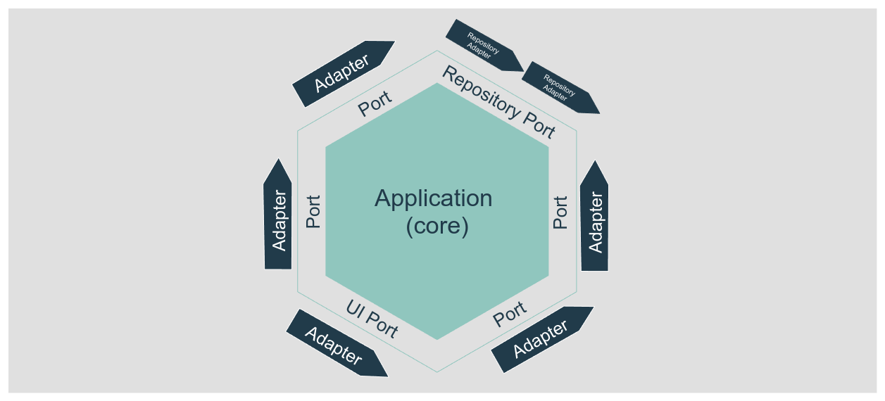
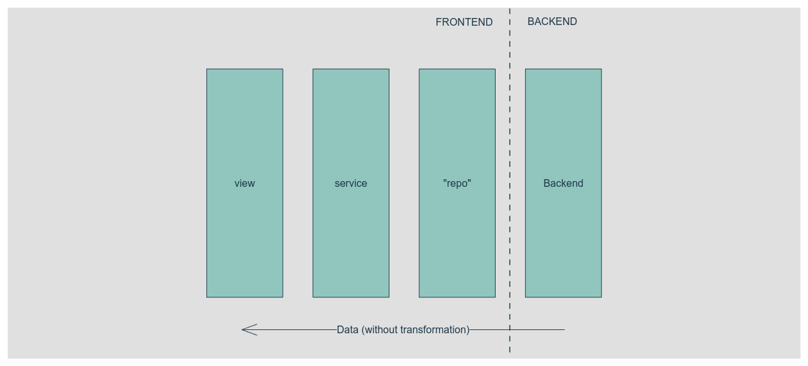

La hexagonal architecture es un patrón de diseño de software basado en la separación de responsabilidades. El objetivo es desacoplar la business logic (domain) y la aplicación de otras interfaces externas.

Simplificando, en hexagonal architecture comunicamos el core de la app (domain + application) con los elementos externos usando ports y adapters. Un **port** vive en el core, es la interfaz que cualquier código externo debe usar para interactuar con el core (o el core con el código externo), el **adapter** es la pieza externa de código que sigue la interfaz del port y ejecuta las tareas, obtiene los datos, etc.

> Puedes imaginar que el port es un espacio reservado solo para un tipo exacto de vessel. El vessel solo puede entrar al port y atracar si las puertas de carga/descarga son de un tamaño esperado y están en la posición correcta. Múltiples vessels pueden caber en un port y los vessels pueden ser reemplazados, pero los ports son únicos y no se pueden mover.



Un concepto clave es que el core no sabe nada sobre cómo son los internos externos. El port define las posiciones de las puertas del vessel pero no le importa cómo se almacena la carga en el vessel.

En este caso, también usaremos el [repository pattern](https://medium.com/@pererikbergman/repository-design-pattern-e28c0f3e4a30) (que encaja muy bien con hexagonal ya que define una forma centralizada y abstracta de acceder a los datos y es un patrón muy común), y el [dependency injection principle](https://en.wikipedia.org/wiki/Dependency_injection) que nos permite crear software desacoplado (o loosely coupled). Simplificando de nuevo, nos permite reemplazar un adapter con otro que siga la misma interfaz de port.

Veámoslo en acción con un pequeño (y típico) ejemplo:

Tu domain (core) necesita obtener una lista de usuarios con un nombre, así que defines el port que es un repository. El port define un método para hacer eso: `getUsersByName(name: string): User[]`. En palabras sencillas, define que el adapter debe proporcionar un método llamado `getUsersByName` que recibe un nombre y debe devolver la lista de los usuarios que coincidan con ese nombre.

> Si quieres profundizar en estos patrones, hay mucha documentación en internet. Quiero centrar el post en un caso real.

## Un caso real

### El contexto inicial

Tenemos una única aplicación web (frontend) que funciona para diferentes clientes (tenants), esa aplicación utiliza un backend que proporciona los datos del menú. El backend devuelve algo como esto:

```json
{
  "title": "Main Menu",
  "id": "main",
  "is_staff": false,
  "items": [
    {
      "title": "Home",
      "icon": "",
      "url": "/",
      "is_staff": false
    },
    {
      "title": "Dashboards",
      "icon": "dashboards",
      "id": "dashboards",
      "is_staff": false,
      "items": [
        {
          "title": "Home",
          "icon": "dashboards-home",
          "url": "/dashboards",
          "is_staff": false
        },
        {
          "title": "Config 🚫",
          "icon": "dashboards-config",
          "url": "/dashboards-config",
          "is_staff": true
        },
        {
          "title": "Advanced Reports",
          "icon": "",
          "id": "advanced_reports",
          "is_staff": false,
          "items": [
            {
              "title": "Sales Analysis",
              "icon": "",
              "url": "/sales_analysis",
              "is_staff": false
            },
            ...
          ]
        }
      ]
    }
  ]
}
```

El frontend implementa parcialmente el repository pattern, ya que simplemente devuelve los datos que proporciona el backend sin más manipulación que eliminar el primer nivel del árbol (el elemento del menú principal). La vista ejecuta la llamada al repository utilizando un servicio que, de nuevo, solo devuelve la misma información que obtiene del repository.



### Los problemas

Esta "arquitectura" funciona, pero tiene algunos inconvenientes que pueden crear problemas serios en el futuro:

- **La estructura de datos está acoplada a los datos del backend**: Todos los datos fluyen desde el backend hasta la vista usando las mismas interfaces; si el backend cambia solo el nombre de una propiedad, necesitamos seguir el flujo de datos en nuestro código hasta que la vista lo cambie en todos los lugares.
- **El string del título incluye un emoji para permitir a los usuarios visualizar cuándo un elemento del menú es solo para usuarios staff**: Esa información también se proporciona en la propiedad `is_staff`; si queremos exponer un elemento del menú a los usuarios regulares, necesitamos cambiarlo en 2 lugares, y eso nunca es una buena idea.
- **Los visuales se definen en el backend**: El nombre del icono a usar se define en el backend. A menos que el icono fuera un concepto global de la app (backend + frontend), no es una buena idea pasar ese valor desde el backend.
- **Sin domain**: no hay domain, o al menos no uno explícito. La lógica se aplica en la vista (lo cual no es malo *per se*, pero si la lógica está relacionada con las reglas de negocio, debe vivir en el domain).

### El problema

Debido a diferentes razones, la empresa decidió crear una nueva versión del backend. Este nuevo backend (llamado v2) no será retrocompatible con el legacy, pero representará semánticamente las mismas entidades.

El endpoint del menú devolverá el mismo menú (proporcionará más funcionalidades), pero la estructura de respuesta del nuevo endpoint es completamente diferente:

```json
[
    {
        "menuStateId": 3,
        "menuPosition": 1,
        "menuName": "Dashboards",
        "menuItemId": 9,
        "menuItemTitle": "Home",
        "menuItemPosition": 1,
        "menuItemLink": "/dashboards",
        "menuItemStateId": 3,
        "menuInternalName": "dashboard",
        "menuId": 12,
        "menuParentId": 1,
        "menuItemInternalName": "dashboard.home"
    },
    {
        "menuStateId": 3,
        "menuPosition": 1,
        "menuName": "Dashboards",
        "menuItemId": 9,
        "menuItemTitle": "Sales analysis",
        "menuItemPosition": 1,
        "menuItemLink": "/sales_analysis",
        "menuItemStateId": 3,
        "menuInternalName": "dashboard",
        "menuId": 12,
        "menuParentId": 1,
        "menuItemInternalName": "dashboard.sales_analysis"
    },
    {
        "menuStateId": 3,
        "menuPosition": 1,
        "menuName": "Dashboards",
        "menuItemId": 9,
        "menuItemTitle": "Config",
        "menuItemPosition": 1,
        "menuItemLink": "/dashboards-config",
        "menuItemStateId": 1,
        "menuInternalName": "dashboard",
        "menuId": 12,
        "menuParentId": 1,
        "menuItemInternalName": "dashboard.sales_analysis"
    },
    {
        "menuStateId": 3,
        "menuPosition": 1,
        "menuName": "Dashboards",
        "menuItemId": 9,
        "menuItemTitle": "Sales analysis",
        "menuItemPosition": 1,
        "menuItemLink": "/sales_analysis",
        "menuItemStateId": 3,
        "menuInternalName": "dashboard",
        "menuId": 12,
        "menuParentId": 1,
        "menuItemInternalName": "dashboard.sales_analysis"
    },
    {
        "menuStateId": 3,
        "menuPosition": 1,
        "menuName": "Main",
        "menuItemId": 11,
        "menuItemTitle": "Home",
        "menuItemPosition": 5,
        "menuItemLink": "/",
        "menuItemStateId": 3,
        "menuInternalName": "home",
        "menuId": 1,
        "menuParentId": 1,
        "menuItemInternalName": "home"
    },
    ...
]
```

El nuevo endpoint del backend devuelve los elementos del menú y los datos de su menú padre en la misma fila. La estructura es plana (sin elementos anidados). Otra diferencia es el `is_staff`, que sigue ahí, pero es un valor específico para la propiedad `menuItemStateId`. No hay nombre de icono, pero ahora tenemos un `internalName` como un id único semántico.

#### Las cosas pueden ponerse más difíciles

El nuevo backend no reemplazará al legacy, al menos no en los próximos meses; los clientes serán migrados lentamente al nuevo backend. Por lo tanto, algunos clientes usarán el backend legacy y otros usarán el nuevo. Eso significa que tendremos ambos backends funcionando al mismo tiempo durante meses.

Como los datos devueltos por ambos backends son muy diferentes, parece difícil usar el mismo código de frontend para renderizar el menú para todos los clientes, ¿verdad? (no realmente, como veremos más adelante).

Una posible solución es crear diferentes componentes relacionados con el menú, código, etc., dependiendo de la versión del backend, adaptando nuestra aplicación a ellos; esto puede funcionar, pero significa que necesitaremos duplicar mucho código, por ejemplo, las vistas, los servicios, etc., haciendo que el mantenimiento sea más difícil.

### Desacoplándonos del backend

Olvidémonos por un momento de cómo son los datos que devuelven los backends y pensemos en lo que queremos representar desde el punto de vista de nuestra aplicación.

Queremos representar un menú que puede tener elementos con hijos (y sin enlace) y elementos con enlaces y sin hijos. Entonces, creemos un modelo, modelos en nuestro caso, en nuestro domain como entities que representarán exactamente eso:

```ts
type State = 'disabled' | 'only_for_staff' | 'open'
class Menu {
  readonly id: number = 0
  readonly internalName: string = ''
  readonly title: string = ''
  readonly icon: string = ''
  readonly image: URL | undefined
  readonly state: State = 'open'
  readonly description: string = ''
  readonly position: number = 0
  readonly children: (Menu | MenuItem)[] = []

  constructor(values: MenuDto) {
    this.id = values.id
    this.internalName = values.internalName
    //...
    this.children = values.children
  }

  get onlyForStaff(): boolean {
    return this.state === 'only_for_staff'
  }
}

class MenuItem {
  readonly id: number = 0
  readonly internalName: string = ''
  readonly title: string = ''
  readonly icon: string = ''
  readonly slug: string = ''
  readonly state: State = 'open'
  readonly position: number = 0
  readonly menuId: number = 0

  private constructor(values: MenuItemDto) {
    // hydrate the entity
    this.id = values.
