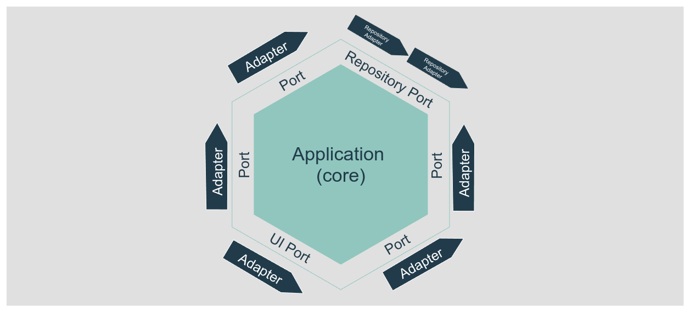
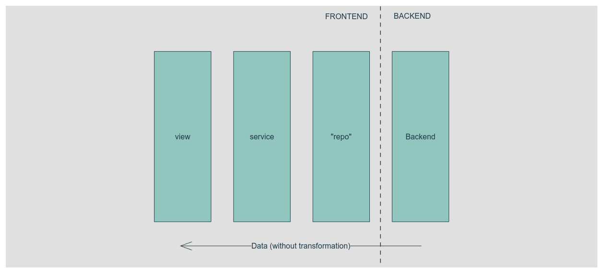

Hexagonal architecture is a software design pattern based on the separation of responsibilities. The goal is to decouple the business logic (domain) and the application from other external interfaces.

Simplifying in hexagonal architecture we communicate the core of the app (domain + application) with the external elements using ports and adapters. A **port** lives in the core, it is the interface any external code must use to interact with the core (or the core with the external code), the **adapter** is the external piece of code that follows the port interface and execute the tasks, get the data, etc.

> You can imagine the port is a space reserved only for an exact type of vessel. The vessel only can enter the port and dock if the load/unload doors are of an expected size and are in the correct position. Multiple vessels can fit in a port and vessels can be replaced, but ports are unique and can not be moved.



A key concept is that the core doesn't know anything about how are the external internals. The port defines the vessel doors positions but doesn't care about how the load is stored in the vessel.

In this case, we will also use the [repository pattern](https://medium.com/@pererikbergman/repository-design-pattern-e28c0f3e4a30) (that fits very well with hexagonal as defines a centralized and abstract way of accessing data and it is a very common pattern), and the [dependency injection principle](https://en.wikipedia.org/wiki/Dependency_injection) that allows us to create decoupled (or loosely coupled) software. Simplifying again, it allows us to replace an adapter with another one that follows the same port interface.

Let's see it in action with a small (and typical) example:

Your domain (core) needs to get a list of users with a name, so you define the port that is a repository. The port defined a method to do that: `getUsersByName(name: string): User[]` In English, defines that the adapter must provide a method called `getUsersByName' that gets a name and should return the list of the users that match that name.

> If you want to go further in those patterns, there is a lot of documentation on the internet. I want to focus the post on a real case

## A real case

### The initial context

We have a single web application (frontend) that works for different clients (tenants), that application uses a backend that provides the menu data. The backend returns something like this:

```json
{
  "title": "Main Menu",
  "id": "main",
  "is_staff": false,
  "items": [
    {
      "title": "Home",
      "icon": "",
      "url": "/",
      "is_staff": false
    },
    {
      "title": "Dashboards",
      "icon": "dashboards",
      "id": "dashboards",
      "is_staff": false,
      "items": [
        {
          "title": "Home",
          "icon": "dashboards-home",
          "url": "/dashboards",
          "is_staff": false
        },
        {
          "title": "Config 🚫",
          "icon": "dashboards-config",
          "url": "/dashboards-config",
          "is_staff": true
        },
        {
          "title": "Advanced Reports",
          "icon": "",
          "id": "advanced_reports",
          "is_staff": false,
          "items": [
            {
              "title": "Sales Analysis",
              "icon": "",
              "url": "/sales_analysis",
              "is_staff": false
            },
            ...
          ]
        }
      ]
    }
  ]
}
```

The front end implements partially the repository pattern as it just returns the data the backend provides without more manipulation than remove the first level in the tree (the main menu item). The view executes the repository call using a service, that again, just returns the same information that it gets from the repository.



### The issues

This "architecture" works, but have some issues can create serious problems in the future:

- **The data structure is coupled to the backend data**: All the data flows from the backend to the view using the same interfaces, if the backend changes just the name of a property we need to follow the data flow in our code until the view changes it in all the places.
- **The title string includes an emoji to allow users to visualize when a menu item is only for staff users**: That information is also provided in the `is_staff` property, if we want to expose a menu item to the regular users we need to change it in 2 places, and that is never a good idea.
- **Visuals are defined in the backend**: The name of the icon to use is defined in the backend. Unless the icon would be an app (backend + frontend) global concept it is not a good idea to pass that value front the backend.
- **No domain**: there is no domain, or at least no explicit one. Logic is applied in the view (that it is not bad _per se_, but if the logic is related to the business rules, it must live in the domain)

### The problem

Because of different reasons the company decided to create a new version of the backend. This new backend (called v2) will not be retro-compatible with the legacy one, but it will represent semantically the same entities.

The menu endpoint will return the same menu (it will provide more features) but the new endpoint response structure is completely different:

```json
[
    {
        "menuStateId": 3,
        "menuPosition": 1,
        "menuName": "Dashboards",
        "menuItemId": 9,
        "menuItemTitle": "Home",
        "menuItemPosition": 1,
        "menuItemLink": "/dashboards",
        "menuItemStateId": 3,
        "menuInternalName": "dashboard",
        "menuId": 12,
        "menuParentId": 1,
        "menuItemInternalName": "dashboard.home"
    },
    {
        "menuStateId": 3,
        "menuPosition": 1,
        "menuName": "Dashboards",
        "menuItemId": 9,
        "menuItemTitle": "Sales analysis",
        "menuItemPosition": 1,
        "menuItemLink": "/sales_analysis",
        "menuItemStateId": 3,
        "menuInternalName": "dashboard",
        "menuId": 12,
        "menuParentId": 1,
        "menuItemInternalName": "dashboard.sales_analysis"
    },
    {
        "menuStateId": 3,
        "menuPosition": 1,
        "menuName": "Dashboards",
        "menuItemId": 9,
        "menuItemTitle": "Config",
        "menuItemPosition": 1,
        "menuItemLink": "/dashboards-config",
        "menuItemStateId": 1,
        "menuInternalName": "dashboard",
        "menuId": 12,
        "menuParentId": 1,
        "menuItemInternalName": "dashboard.sales_analysis"
    },
    {
        "menuStateId": 3,
        "menuPosition": 1,
        "menuName": "Dashboards",
        "menuItemId": 9,
        "menuItemTitle": "Sales analysis",
        "menuItemPosition": 1,
        "menuItemLink": "/sales_analysis",
        "menuItemStateId": 3,
        "menuInternalName": "dashboard",
        "menuId": 12,
        "menuParentId": 1,
        "menuItemInternalName": "dashboard.sales_analysis"
    },
    {
        "menuStateId": 3,
        "menuPosition": 1,
        "menuName": "Main",
        "menuItemId": 11,
        "menuItemTitle": "Home",
        "menuItemPosition": 5,
        "menuItemLink": "/",
        "menuItemStateId": 3,
        "menuInternalName": "home",
        "menuId": 1,
        "menuParentId": 1,
        "menuItemInternalName": "home"
    },
    ...
]
```

The new backend endpoint returns the menu items and its parent menu data in the same row. The structure is flat (no nested items). Another difference is the `is_staff`, is still there, but it’s a specific value for the `menuItemStateId` property. No icon name, but now we have an `internalId` as a semantic unique id.

#### Things can become harder

The new backend will not replace the legacy one, at least not in the next months, clients will be migrated slowly to the new backend. So some clients will use the legacy backend and another will use the new one. That means we will have both backends working at the same time for months.

As the data returned by both backends is very different seems tough to use the same frontend code to render the menu for all the clients, right? (not really as we will see later)

A possible solution is to create different menu-related components, code, etc. depending on the backend version adapting our application to them, this can work, but means we will need to duplicate a lot of code, for example, the views, the services, etc making the maintenance harder.

### Decoupling us from the backend

Let's forget for a while how is the data the backend(s) returns, and think in what we want to represent from the point of view of our application.

We want to represent a menu that can have items with children items (and no link) and items with links a no children. Then let's create a model, models in our case, in our domain as entities which will represent exactly that:

```ts
type State = 'disabled' | 'only_for_staff' | 'open'
class Menu {
  readonly id: number = 0
  readonly internalName: string = ''
  readonly title: string = ''
  readonly icon: string = ''
  readonly image: URL | undefined
  readonly state: State = 'open'
  readonly description: string = ''
  readonly position: number = 0
  readonly children: (Menu | MenuItem)[] = []

  constructor(values: MenuDto) {
    this.id = values.id
    this.internalName = values.internalName
    //...
    this.children = values.children
  }

  get onlyForStaff(): boolean {
    return this.state === 'only_for_staff'
  }
}

class MenuItem {
  readonly id: number = 0
  readonly internalName: string = ''
  readonly title: string = ''
  readonly icon: string = ''
  readonly slug: string = ''
  readonly state: State = 'open'
  readonly position: number = 0
  readonly menuId: number = 0

  private constructor(values: MenuItemDto) {
    // hydrate the entity
    this.id = values.id
    //....
  }

  get isStaff(): boolean {
    return this.state === 'hidden'
  }

  public get external(): boolean {
    return (this.url.includes('http://')
  }
}

```

This is a simplified version of the entities, but you can see the idea. We have a `Menu` entity that can have children that can be `Menu` or `MenuItem` entities. The `MenuItem` entity has a `url` property that can be used to know if the item is a link or not.

We modeled the domain and our application layer (and views) can access to it.

> The key is: we modeled our menu independently of our backends' data structures, we can use any backend that represents that entity to get the data independently of the structure.

### The port

We should create the port that will allow us to get the menu's data from the backend(s).

```ts
interface MenuRepo {
  getMainMenu(states: State[]): Promise<(MenuItem | Menu)[]>;
}
```

The port defines how the repository should look like. In this case, we want a method that will return the main menu, filtered by state (`'disabled' | 'only_for_staff' | 'open'`).

### The adapter. The repositories will do the magic

We need to create the adapters that will get the data from the backend and transform it to our domain entities. We need an adapter, also called **repository implementation** for each backend (we could have even more for mocked data, stubs for testing, etc).

Remember, **the repository implementation (adapter) is the one that knows the "external to the core" internals**:

- **How to get the data** at the infrastructure level: REST, Graphql, local storage, etc
- **How to request the data**: for example for an XHR request: headers, query params, URL, etc
- **The returned data structure** and **how to transform it** to the domain entities
- How to **handle errors, retries**, etc
- How to cache the data

But again, the domain NEVER should not know about that.

For example, the domain **must not know** that to get items available only for staff users we need to pass the `menuItemStateId` param with the value`1`.

`menuItemStateId` is an implementation detail. it only makes sense in repository implementation, not in the domain, the domain should know about the `onlyForStaff` meaning and the adapter should know how to get that information from the backend.

In this case (for backend v2) we need to pass a query param called `menuItemStateId` with the value `1` to get the staff-only items, but that is different for the legacy backend. Or for another backend that can use a different value for that filter, but the argument that represents what we want is still the same: `onlyForStaff`.

From the point of view of the layers on the right side the port's line in the workflow (Image above) do not matter how the data is retrieved, the only thing that matters is the data is returned as a domain entity. That is our contract.

```ts
// menu.legacy.repo.ts
type Response = {
  // This type defines the shape of the data the backend returns. I do not include it here to put the focus on the data transformation into entities
};
class LegacyMenuRepo implements MenuRepo {
  async getMainMenu(states: State[]): Promise<(MenuItem | Menu)[]> {
    // 1️⃣
    const data = await fetch<Response>('tenant.company.com/get_menu');
    const backendMenu = await data.json();

    return backendMenu.map((item) => responseToEntity(backendMenu));
  }

  private responseToEntity(response: Response): MenuItem | Menu {
    // transform the response to the domain entities
    if ('items' in response) {
      return new Menu({
        id: response.id,
        internalName: response.id,
        title: response.title,
        icon: mapIcon(response.id), // 2️⃣
        image: mapImage(response.image), // 2️⃣
        state: mapState(response.state), // 3️⃣
        children: response.items.map((item) => responseToEntity(item)),
      });
    } else {
      return new MenuItem({
        id: response.id,
        internalName: response.id,
        title: response.title,
        icon: mapIcon(response.id), // 2️⃣
        slug: response.url,
        state: mapState(response.state), // 3️⃣
        menuId: response.menuId,
      });
    }
  }
}
```

Things to put focus on:

- 1️⃣: the method that receives the states' argument is not used in the code: This is because the backend does not accept any filter, the legacy backend does the filtering using the backend context. But it ensures will only return the items the user can have access to.
- 2️⃣: Those map functions are in charge of providing the correct icon and image, now the backend does not provide that information, so our repository implementation should provide it. Remember **the repository implementation (adapter) is the one that knows all the external internals** and for the images the adapter knows that if the id is "x" should return the image "y" and the icon "z"
- 3️⃣: The `mapState` function behavior is similar to 2️⃣ but in this case, the backend returns a number that represents the state, the adapter should know how to map that number to the domain state, and that function can be reversed to know with the state should be sent to the backend.

We need to implement the adapter for the "new" backend (v2):

```ts
// menu.v2.repo.ts
type Response = {
  // This type defines the shape of the data the backend v2 returns. I do not include it here to put the focus on the data transformation into entities
};

const stateMappings: Record<number, State> = {
  0: 'disabled',
  1: 'only-for-staff',
  2: 'open',
};

const stateMappingsReverse: Record<number, State> = {
  disabled: 0,
  'only-for-staff': 1,
  open: 2,
};

class V2MenuRepo implements MenuRepo {
  async getMainMenu(states: State[]): Promise<(MenuItem | Menu)[]> {
    const data = await fetch<Response>('menu.company.com/company/get', {
      // 1️⃣
      params: {
        menuItemStateId: states.map((state) => stateMappingsReverse[state]), // 2️⃣
      },
    });
    const backendMenu = await data.json();

    return backendMenu.map((item) => responseToEntity(backendMenu));
  }

  private responseToEntity(response: Response): MenuItem | Menu {
    //Here the transformations from flat to nested are more complex (require more code lines) so I'm going to ignore it in the example. Let's imagine it is done after this line
    // transform the response to the domain entities
    if ('items' in response) {
      return new Menu({
        id: response.id,
        internalName: response.internalName,
        title: response.title,
        icon: mapIcon(response.internalName), // 3️⃣
        image: mapImage(response.internalName), // 3️⃣
        state: stateMappings[response.menuStateId], // 4️⃣
        children: response.items.map((item) => responseToEntity(item)),
      });
    } else {
      return new MenuItem({
        id: response.id,
        internalName: response.id,
        title: response.title,
        icon: mapIcon(response.internalName), // 3️⃣
        slug: response.url,
        state: stateMappings[response.menuItemStateId], // 4️⃣
        menuId: response.menuId,
      });
    }
  }
}
```

Things to put the focus in the backend v2 repo implementation:

- 1️⃣: The endpoint (even the domain) is different from the other repo. That is expected as it is a different backend.
- 2️⃣: Get need to convert the meaning of the filters to the backend meaning. The adapter knows that the backend expects a query param called `menuItemStateId` with the values `0`, `1`, or `2` to get the items with the state `disabled`, `only-for-staff`, or `open`
- 3️⃣: We have mapping functions for the icons and images, but this function is different from the legacy one.
- 4️⃣: we convert the `menuItemStateId` and `menuStateId` to the domain state using the mappings.

After the changes, the architecture looks like this:


Now we have 2 different adapters (one per backend) for the same port.
Those adapters follow the contract and convert the backend data to the domain entities

The rest of the flow is the same: the domain does not know how the data is retrieved, only knows how to use it. This gives us a lot of flexibility, we can change the backend without changing the domain the application, or the views.

### The dependency injection

The last piece of the "puzzle" is the dependency injection, which allows us, to replace a repository implementation with another one that follows the same port interface, but instead of importing it from the code that will call the repository, we inject it from outside allows us to change it easily.

Let's suppose we have a `usecase` (or application service) that will use the repository to get the menu:

```ts
class GetMainMenuUseCase {
  constructor(private menuRepo: MenuRepo) {}

  async execute(states: State[]): Promise<(MenuItemDto | MenuDto)[]> {
    return this.menuRepo.getMainMenu(states).map((entity) => entity.toDto());
  }
}
```

We can use a factory to create the repository implementation:

```ts
function createMenuRepo(clientId: string): MenuRepo {
  if (['client123', 'client34'].includes(clientId)) {
    return new V2MenuRepo();
  } else {
    return new LegacyMenuRepo();
  }
}

const useCase = new GetMainMenuUseCase(createMenuRepo('client123'));

usecase.execute(['open', 'only-for-staff']);
```

## Summarizing

The hexagonal architecture, the repository pattern, and the dependency injection are very powerful tools that allow us to create decoupled software that works in independent pieces loosely coupled that can be easily changed and make the maintenance simpler.

Those pieces should define a contract for the actions (execute a method) and for the returned data, should not uses in other places, for example is a bad practice to pass the filters directly to the repository implementation and use them as is in the http request because you ara coupling your application code to the backend as we see in the example when we map the filter values

As you can see in the example, we can change the backend at any moment, it's just to change the repo implementation we inject into the use case without changing anything else.

This will work only if all the different backend returns the same business concepts, if not we are talking about different domain models and we need to create different ports and adapters for each one.

Achieve that can require time and knowledge of the domain and the business rules, but the benefits are worth it.
