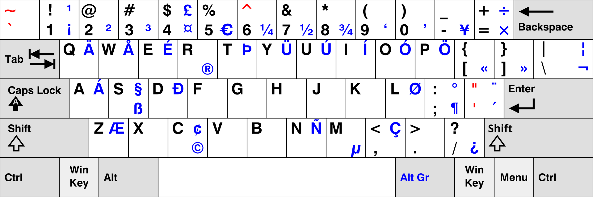
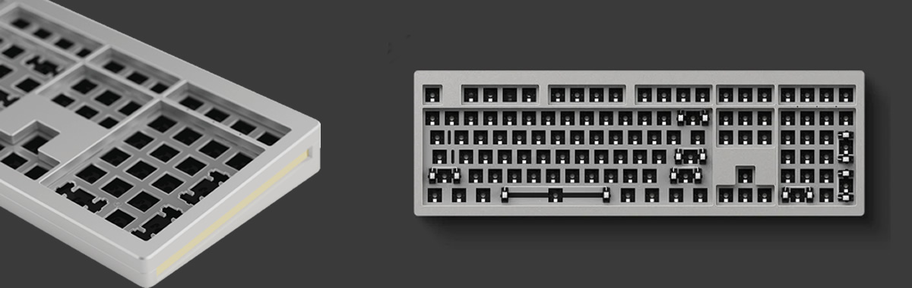
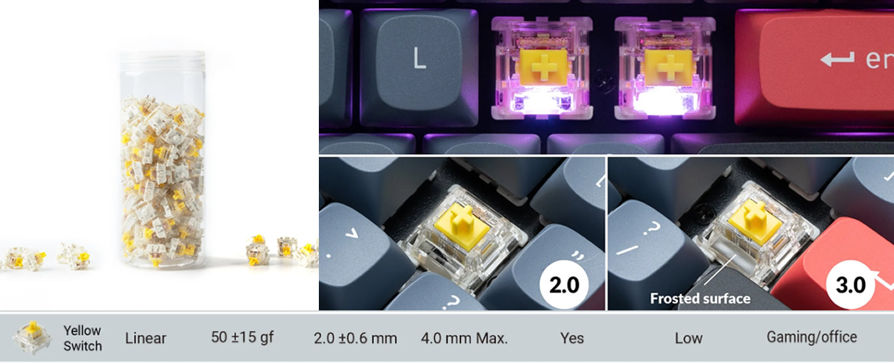
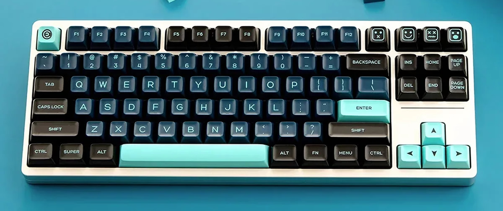
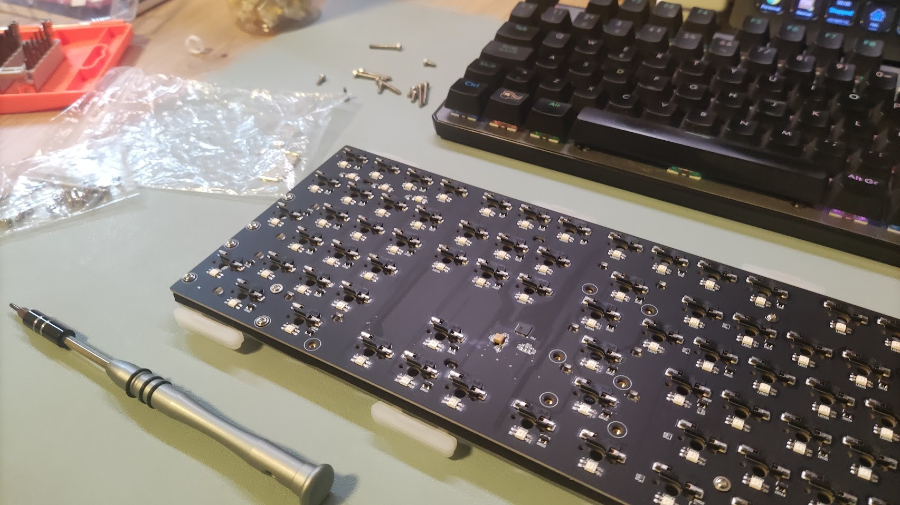
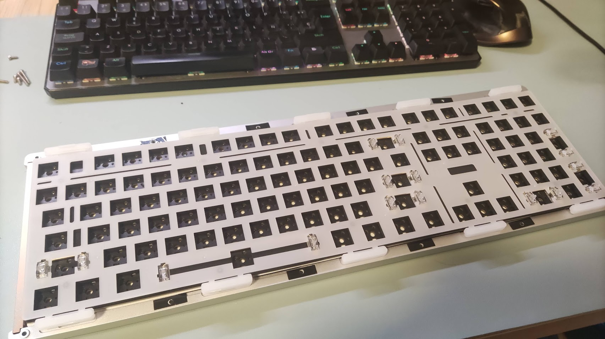
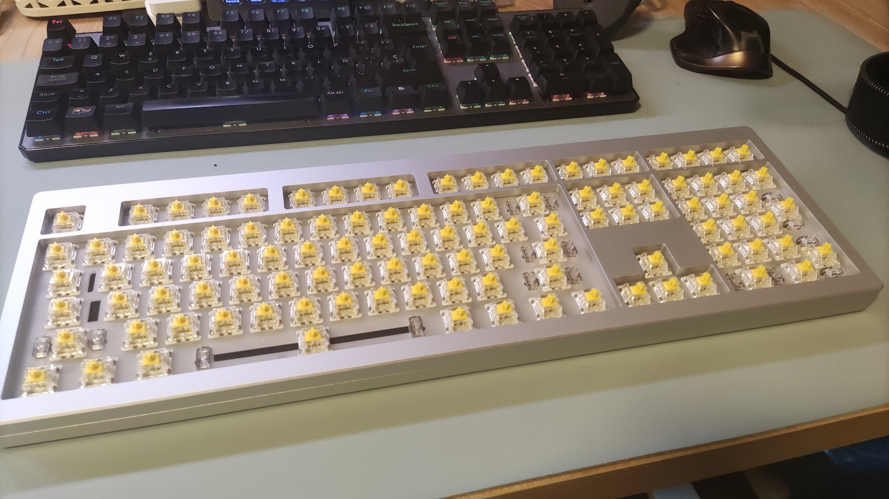
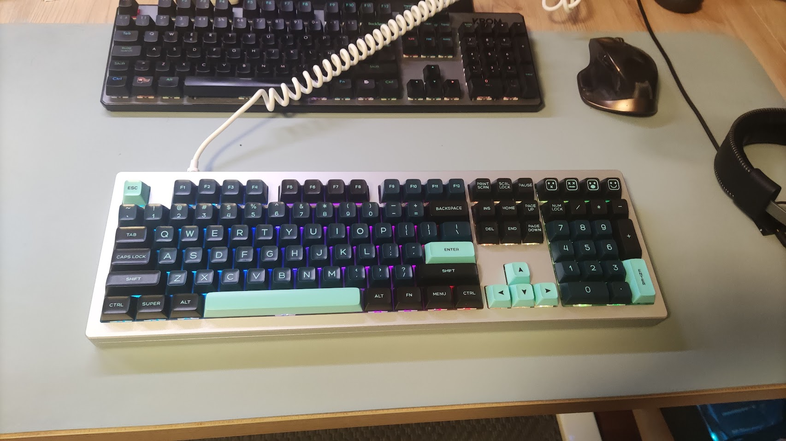

Five years ago, I bought my :astro-ref[first mechanical keyboard]{path="/blog/2019/Impresiones-tras-un-mes-de-uso-de-un-teclado-mecanico"}, a simple and affordable Krom Kernel. It was a full-sized (100%) keyboard with Outemu Red switches and a Spanish layout. During that time, I had to replace the space bar keycap twice because the plastic quality was poor; the part that connects to the switch was unreliable and eventually broke, leading to a poor typing experience. However, it was something I could fix by replacing all the keycaps with higher-quality ones.

After five years, some switches started failing randomly, so I decided it was time to look for a new keyboard.

My requirements and wishlist:

- High quality
- 100% or TKL size
- Silent switches (at least quieter than my previous keyboard)
- Hot-swappable switches (to easily change switch types or replace a broken one)
- Wired: I don't want to worry about charging batteries or having connection issues (it is very frustrating when a keystroke isn't registered randomly)

## The layout

I wanted the possibility of changing the keycaps in the future without replacing the entire keyboard. However, options for the Spanish layout are limited, so the first hurdle was moving to a US ANSI layout.

I wasn't sure if I could get used to the new layout, but following Félix Gómez's advice, I configured my previous keyboard with the US International (with dead keys) layout and practiced to get used to it. It wasn't easy because 30 years of muscle memory using a Spanish layout is strong, but with patience, I managed to adapt.

### US International layout with dead keys

This layout is the most widely used in the US and is very similar to the standard US layout, but with the addition of dead keys that allow you to write accents and special characters like the "ñ" naturally.

For example, to write `á`, you need to press the `'` key (next to Enter) and then `a`, just like on a Spanish layout. To write the `ñ`, you press the `~` key followed by the `n` key.

<cite>
  Source:
  https://en.wikipedia.org/wiki/British_and_American_keyboards#/media/File:KB_US-International.svg
</cite>

This has one downside: to write the characters assigned to the _dead keys_ themselves, you need to use the space bar. For example, to write `'`, you must type `'` and then the space bar. It’s not as direct as a single keypress, but you get used to it.

One of the advantages of this "international" layout is that you can easily write many characters specific to other languages.

## The size

I have used 100% keyboards all my life, and when I work on a laptop, I miss the numeric keypad a lot. Also, the positions of the `PageUp`, `PageDown`, `Home`, and `End` keys are not very comfortable on the laptop keyboards I've used. However, I was open to exploring TKL keyboards, which ruled out 75%, 65%, and other compact formats.

## The chosen one

I looked at many different keyboards and spent a lot of time on research. Eventually, I came across a YouTube video reviewing a Monsgeek keyboard, and after checking its specs and size variants, I decided to buy the M5, a 100% DIY keyboard kit.

This is not a pre-built keyboard; it is a kit to build your own. I had never built a custom keyboard before, but it was a challenge I wanted to take on.

The kit includes a robust aluminum case. In the case of the M5 (the largest size), it weighs around 2kg. It is quite heavy, but I like it because the keyboard doesn't slide on the table when you type.

<cite>Source: Monsgeek</cite>

The kit features a gasket-mounted design with RGB backlighting and various foam and plastic layers to improve the keyboard's feel and reduce switch echoes within the case for a purer sound. It uses QMK firmware with VIA support, which eliminates the need for separate software to configure the keyboard; you can simply use the VIA web configurator.

## The switches

<cite>Source: Gatheron</cite>

Following Félix's advice, I decided to use _Gateron G Pro 3.0 Prelubed_ switches. These are linear switches with a nice feel and low sound level, oriented toward both office work and gaming.

The feel is excellent—much better than the Outemu Red switches I used in my previous keyboard.

## The keycaps

My first idea was to find a keycap set similar to the Amstrad CPC464, but I couldn't find anything comparable (only custom sets that were far too expensive).

I looked at several keycap sets and finally chose this one: https://www.aliexpress.com/item/1005005975658627.html

I like the color combination, the typography, and the shape (QXA profile)—very modern and minimalist. I'm very happy with the result.

## Summary

I'm very happy with the outcome. I really enjoyed the process of mounting the stabilizers, switches, and keycaps. It was easier than I thought.

The keyboard is very solid, the case is robust, and the switches are amazing. I love the sound (which is similar to the one in [this video](https://www.youtube.com/watch?v=ZlWMhmBS9zY)) and the touch, and the overall look with the keycaps is beautiful.

It was more expensive than I expected, but I think it's a good value. I hope this keyboard will be a good companion for a long time. I might change the keycaps if I get bored of the current ones, or I might try other types of switches to see if I can find some that feel even more comfortable.

