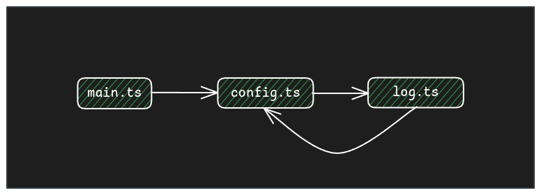
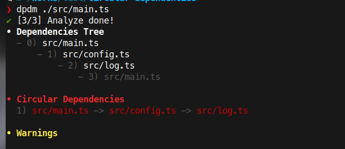
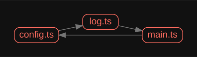
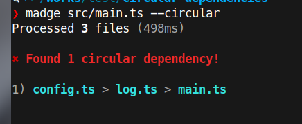

Las importaciones circulares (o dependencias circulares, o dependencias de ciclo, pero no lo mismo que las referencias circulares) son fáciles de tener en tu base de código, y más cuando el código crece. Pueden impactar en la generación del bundle o causar problemas (por ejemplo en HMR) y deberías evitarlas porque son un síntoma de una arquitectura o una organización del código incorrecta y es un gran code smell.

## Qué son las dependencias circulares

Las dependencias circulares ocurren cuando un paquete (A) depende de otro paquete (B) y B también depende de A. Las dependencias circulares pueden ser más complejas: A depende de B, B de C, C de D y D de A.

### Ejemplo

En un proyecto Javascript/Typescript tienes varios archivos para organizar el código y algunos de ellos dependen de las constantes, tipos, funciones, clases, etc. de otros archivos, lo cual es bueno ya que nos permite reutilizar código y hacerlo más comprensible.

Veamos un ejemplo sencillo con 3 archivos:

```ts
// log.ts
import { verbose } from './config';

export function log(...messages: string[]) {
  if (verbose) {
    console.log(...messages);
  }
}
```

```ts
// config.ts
import { log } from './log';

export const verbose = true;

// Try to get config.json file
export let globalConfig = {};

export async function getConfig() {
  try {
    globalConfig = (await fetch('http://myserver.com/config.json')).json();
  } catch (e) {
    log(e);
  }
}
```

```ts
// main.ts
import { getConfig, globalConfig } from './config';

getConfig();
```

Con este código `main.ts` importa `config.ts`, este importa `log.ts` y finalmente este vuelve a importar `config.ts` creando las dependencias circulares.



Otra causa típica de dependencia circular es cuando tienes una carpeta (por ejemplo, un componente) con múltiples archivos (ej. el componente, los tipos, subcomponentes, etc.) y tienes un archivo index que re-exporta el componente y los tipos, y tu componente en lugar de importar los tipos desde el archivo de tipos lo hace desde el archivo `index.ts`.

## Problemas de las dependencias circulares

En esta situación, no obtendrás ningún error y probablemente no pase nada especial y el código funcione.

Los bundlers como _Vite_, _Webpack_, etc., el transpilador de Typescript y otras herramientas pueden manejar dependencias circulares para evitar la recursión infinita al generar el árbol de dependencias.

**Esto no significa que todo esté resuelto**. Hay muchos problemas relacionados con las dependencias circulares:

- **Efectos secundarios inesperados**: El programa puede fallar aleatoriamente dependiendo de cuál fue el primer archivo que importó el paquete.
- **Problemas de HMR en Webpack y Vite**: Por ejemplo, antes de Vite 5, cualquier cambio que involucrara dependencias circulares activaba una recarga completa de la página; ahora ha mejorado pero sigue teniendo [problemas](https://github.com/vitejs/vite/blob/3b8f03d789ec3ef1a099c884759bd4e61b03ce7c/docs/blog/announcing-vite5-1.md?plain=1#L73).
- **Fugas de memoria (Memory leaks)**: [Ejemplo](https://github.com/nestjs/nest/issues/10548).
- **Build**: Puede ser más lento ya que las herramientas de bundler necesitan gestionarlas.
- **El código es difícil de entender**.
- **Es un code smell / anti-patrón**: Tener dependencias circulares significa que tu código y arquitectura no están bien definidos.

> Las dependencias circulares pueden ocurrir en otros lenguajes, no es un problema exclusivo de Javascript/Typescript, pero por ejemplo Golang o Cargo (Rust) no permiten dependencias de ciclo.

## Encontrar dependencias circulares

En el ejemplo anterior, detectar una dependencia circular es fácil ya que solo hay unos pocos archivos, pero en un proyecto real puede ser difícil ya que la cadena de dependencias puede ser grande:

```
 A -> B -> C -> D -> E -> F -> A
```

Necesitamos una herramienta para detectarlas y, afortunadamente, existen muchas herramientas para detectar las dependencias circulares.

### dpdm - https://github.com/acrazing/dpdm

Esta es mi favorita. Esta herramienta solo necesita un punto de entrada (entrypoint) o los archivos a escanear, y comenzará a analizar el código para encontrar dependencias circulares.

Para comprobar el ejemplo anterior podemos ejecutar: `dpdm ./src/main.ts`

El resultado será:



Detecta la dependencia circular y da información sobre el árbol de dependencias. `main.ts` importa `config.ts`, `config.ts` importa `log.ts` y (esto no está escrito, pero es implícito) `log.ts` importa de nuevo `main.ts`.

**dpdm** es muy rápido incluso con bases de código grandes y soporta CommonJS y ESM, y Javascript y Typescript.

Podemos ejecutar la herramienta en un pre-commit hook y/o en el CI para asegurar que el código no incluya dependencias circulares.

### Madge - https://github.com/pahen/madge

Madge es una herramienta para generar un gráfico visual de las dependencias de los módulos, y también puede encontrar dependencias circulares.

Ejecutarla con el flag por defecto devolverá el árbol de dependencias, y si añadimos el flag `--image`: `madge src/main.ts --image deptree.svg` obtendremos un archivo SVG que representa el árbol de dependencias.



Usando `madge src/main.ts --circular` obtenemos las dependencias circulares en una salida similar a la herramienta anterior.



### Plugins para bundlers

Hay plugins disponibles para bundlers como Webpack y Vite para detectar las dependencias circulares en tiempo de compilación (build time):

- https://www.npmjs.com/package/vite-plugin-circular-dependency
- https://www.npmjs.com/package/circular-dependency-plugin

### Eslint

El [eslint-plugin-import](https://github.com/import-js/eslint-plugin-import/blob/main/docs/rules/no-cycle.md) incluye la regla `import/no-cycle` para prohibir las importaciones de ciclo.

## Resolviendo dependencias circulares

Después de detectar una dependencia circular, existen múltiples estrategias para resolverla. Esto es algo sobre lo que escribiré en un futuro post, pero para el ejemplo, es tan fácil como mover la constante verbose a su propio archivo (por ejemplo `config-log.ts`) o simplemente al archivo de log.

¿Has tenido problemas en el pasado con dependencias circulares? Cuéntamelo en los comentarios.
