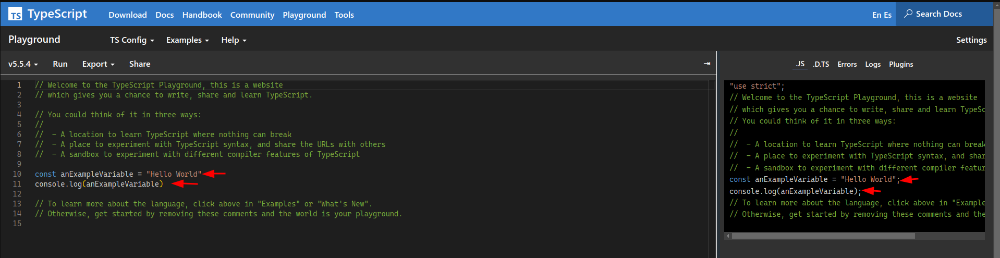

He estado usando [standardjs](https://standardjs.com/) (y [standardts](https://github.com/standard/ts-standard)) durante 5 años como conjunto de reglas de _lint_ en mis proyectos, y estoy muy contento con ello. Probé antes [Google config lint](https://github.com/google/eslint-config-google) y [eslint-config-airbnb](https://github.com/airbnb/javascript) y una de las principales diferencias que encontré entre esos conjuntos de reglas es relativa a los puntos y coma; Google y Airbnb requieren el uso de puntos y coma al final de las líneas, pero _standardjs_ no.

Trabajé hace mucho tiempo con PHP, que los requiere, pero me adapté muy rápido a no usarlos en JavaScript y Go. Ahora estoy trabajando en un proyecto con un conjunto de reglas que incluye la regla de los puntos y coma, y me resulta un poco incómodo en algunas situaciones.

Supongo que esta es una discusión como la de [tabs vs spaces](https://www.youtube.com/watch?v=SsoOG6ZeyUI), pero quiero compartir mis pensamientos y daros referencias a opiniones de la comunidad al respecto.

## Contexto

Antes de entrar en cosas subjetivas (opiniones), hablemos de si JavaScript necesita puntos y coma y sobre el ASI (Automatic semicolon insertion).

### ASI

JS (ECMAScript) nos permite no terminar las sentencias y declaraciones con un punto y coma, ya que el intérprete "insertará" un punto y coma automáticamente, por ejemplo "cuando el _offending token_ que no está permitido por ninguna producción de la gramática se separa del token anterior por al menos una línea (LineTerminator)".

Simplificando, eso significa que si el siguiente token no tiene sentido para el anterior, el intérprete añade un punto y coma automático. Por ejemplo:

```ts
myFunction() // se insertará un punto y coma automático aquí ya que otherFunction() no tiene sentido para myFunction()
otherFunction()

myFunction() // No se insertará punto y coma aquí ya que `.value` es válido para la gramática del lenguaje (acceder a la propiedad del resultado de myFunction())
.value

myFunction() // No se insertará punto y coma aquí ya que `[` es válido para la gramática del lenguaje
[1,2,3].forEach(...)
```

El último ejemplo es interesante ya que el intérprete no añade el punto y coma automático, sino que lanzará un error de sintaxis ya que el token `,` no es correcto ahí (veremos cómo solucionarlo más adelante).

(Puedes consultar la lista completa en https://tc39.es/ecma262/#sec-automatic-semicolon-insertion)

> Ten en cuenta que la especificación TC39 dice: "La mayoría de las sentencias y declaraciones de ECMAScript deben terminarse con un punto y coma. Tales puntos y coma siempre pueden aparecer explícitamente en el texto fuente. Sin embargo, por conveniencia, dichos puntos y coma pueden omitirse del texto fuente en ciertas situaciones. Estas situaciones se describen diciendo que los puntos y coma se insertan automáticamente en el flujo de tokens del código fuente en esas situaciones".

## Opiniones de la comunidad

Al igual que con el tema de tabs vs spaces, hay múltiples puntos de vista y opiniones en la comunidad, revisémoslos.

### A favor de no usarlos

En la [página de la lista de reglas de _standardjs_](https://standardjs.com/rules#semicolons) proporcionan múltiples enlaces sobre la motivación para no usarlos. También proporcionan una regla extra para evitar los problemas con tokens como `[`, `(` y <code>`</code>.

Te recomiendo leer la [Open letter to Javascript leaders regarding semicolons](https://blog.izs.me/2010/12/an-open-letter-to-javascript-leaders-regarding/) de [Isaac Z. Schlueter](https://x.com/izs?lang=es).

Su voz es muy relevante en la comunidad ya que es el creador de NPM, y en la carta (escrita hace 14 años), explica:

> "Sí, es bastante seguro y es JS perfectamente válido que todos los navegadores entienden. Closure compiler, yuicompressor, packer y jsmin pueden minificarlo correctamente. No hay impacto en el rendimiento en ninguna parte". -- Isaac Z. Schlueter

### En contra de no usarlos

- La voz más importante es la especificación TC39, que indica que "las sentencias y declaraciones deben terminarse con un punto y coma". Aún podemos cumplir con este requisito sin escribir puntos y coma, por favor sigue leyendo mis reflexiones para ver cómo.
- Algunos casos, como cuando la siguiente línea comienza con `[`, `(` y <code>`</code>, lo necesitan (pero se puede solucionar con una regla de lint como la que proporciona _standardjs_) o cuando intentas usar return en 2 líneas puede no ser obvio que lo estás haciendo mal sin puntos y coma. https://medium.com/free-code-camp/codebyte-why-are-explicit-semicolons-important-in-javascript-49550bea0b82
- El uso de puntos y coma es una práctica ampliamente aceptada en la comunidad de JavaScript y encontrarás mucho código que la sigue.

## Mis reflexiones

Probablemente esta sea la parte menos importante de este post, pero quiero compartirla con vosotros en cualquier caso.

### Los puntos y coma representan una sobrecarga visual

Creo que los puntos y coma añaden ruido al código y no son realmente necesarios (excepto en un par de casos), por ejemplo, cuando usas un array anónimo necesitas decirle explícitamente al intérprete que el `[` no intenta acceder al resultado de la línea anterior:

```ts
someFunction();
[1, 2].forEach((x) => console.log(x));
```

### Ediciones manuales

Cuando estás editando una sentencia multilínea y necesitas añadir una nueva línea, tienes que eliminar manualmente el punto y coma. Mira este ejemplo:

```ts
['z', 'd', 'C', 1, 9, 'a'].filter((char) => !isNaN(char));
```

Ahora quieres mapear el resultado a mayúsculas, añadiendo una línea extra; intuitivamente añades una nueva línea después de la última.

```ts
  ['z', 'd', 'C', 1, 9, 'a']
    .filter(char => !isNaN(char));
    .map(char => char.toLocaleUpperCase())
```

Esto fallará porque el punto y coma en la segunda línea rompe el código, debes eliminarlo y añadirlo en la última línea.

Esto es algo que _prettier_ o el `lint --fix` no pueden manejar como en una lista separada por comas y tienes que encargarte de ello.

### Los puntos y coma son obligatorios

Como menciona la especificación TC39, "las sentencias y declaraciones deben terminarse con un punto y coma", pero probablemente no estés escribiendo código que se pase directamente al intérprete; probablemente estés usando TypeScript y/o un bundler, o un minificador. Todos ellos añadirán los puntos y coma implícitos por ti.

Compruébalo tú mismo, abre el [Typescript playground](https://www.typescriptlang.org/play) y podrás ver que el código de ejemplo no incluye los puntos y coma, pero el transpìlado sí.



## Conclusión

Creo que hay buenos argumentos en ambas posiciones, y supongo que la posición más convencional y extendida es usar puntos y coma en JS, pero en TS parece muy extendido no usarlos. Creo que ambas posiciones son válidas, pero quizás puedas dedicar unos minutos a pensar en ello y en qué prefieres.

Me siento muy cómodo no usándolos, pero en cualquier caso no tengo grandes problemas trabajando con o sin puntos y coma, no es algo bloqueante ni molesto.

No quiero crear un flame, los flames son inútiles, solo quiero conocer las diferentes opiniones.

¿Qué usas y/o prefieres tú? Por favor, dímelo en los comentarios.
