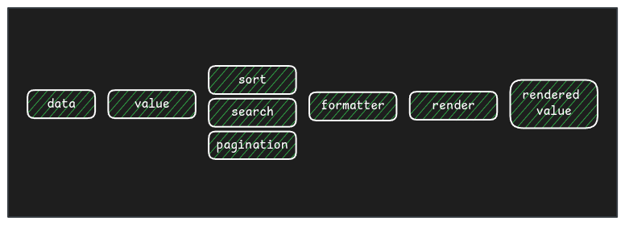

> Este post es parte de una serie: :astro-ref[Segunda parte]{path="/blog/2024/2024-10-21-table-component-ii"}, :astro-ref[Tercera parte]{path="/blog/2024/2024-10-27-table-component-iii"}, :astro-ref[Cuarta parte]{path="/blog/2024/2024-11-26-table-component-iv"}, y un post extra relacionado: :astro-ref[Escribiendo un generador de consultas para filtrar datos]{path="/blog/2024/2024-10-24-query-builder"}

Me encanta crear componentes de UI porque son los ladrillos fundamentales que sostienen una aplicación de interfaz de usuario. Cuando los componentes son lo suficientemente buenos, tanto la User Experience como la Developer Experience aumentan, haciendo que las aplicaciones sean consistentes, fáciles de implementar y fáciles de escalar.

Si la aplicación de UI muestra datos en listas, tarde o temprano necesitarás una tabla. Las tablas son componentes de UI que pueden volverse muy complejos dependiendo de sus características. El objetivo de este post no es decirte cómo programar funcionalidades, sino ayudarte a entender algunas necesidades y características típicas que las tablas deberían implementar para darte ideas útiles para la implementación de tu propio componente de tabla de UI personalizado.

He creado componentes de tabla de UI personalizados para 2 proyectos diferentes y aprendí mucho de esas experiencias.

## Qué es una tabla

Esta es una pregunta fundamental, pero también es importante porque basaremos la implementación del componente en ella.

> Una tabla es un conjunto de datos *normalized* (las **rows**) organizados en columnas (**cols**). Las filas contienen **cells**, que representan el cruce entre un elemento de fila y una columna.

"Normalized" es importante ya que en una tabla las filas comparten la misma estructura; esa estructura está definida por las **cols**. En otras palabras, si las **cols** de nuestra tabla son: `id`, `name` y `surname`, las **rows** (datos) deben proporcionar esos valores (o al menos la mayoría de ellos).

## Arquitectura del componente de tabla

Creo que un componente debería funcionar como una **black box**, que :astro-ref[recibe entradas y devuelve el DOM para renderizar los componentes]{path="/blog/2024/2023-12-02-ui-components-library"} por lo que los datos y la estructura de los datos deben pasarse al componente de tabla como propiedades y la tabla debe saber cómo renderizarlos basándose en eso (y en propiedades de configuración extra que discutiremos más adelante), y el desarrollador no debería conocer las interioridades del componente, solo cómo pasar los datos y la configuración.

Este enfoque tiene muchas ventajas, por ejemplo, la consistencia; si implementas un cambio en el componente de tabla, puedes hacerlo sin necesidad de refactorizar todos los usos, ya que la entrada es la misma.
Para nosotros, eso significa que un componente de tabla debe renderizar las filas, no delegarlo a un componente hijo en el uso de la tabla, como en el ejemplo de abajo.

```tsx
// ❌❌❌ Don´t do that
<MyTable rows={rows}>
  {rows.map((row) => (
    <MyTableRow row={row} />
  ))}
</MyTable>
```

Créeme, he visto eso antes, y es un ataque directo a la responsabilidad del componente.

```tsx
// ✅✅✅ Do that
<MyTable rows={rows} cols={cols} config={config} />
```

### Los datos

La primera entrada (propiedad) de la tabla a modelar son los datos. Los obtendrás de una API o los generarás en tu aplicación (te contaré más sobre paginación de datos, ordenación, búsqueda, etc., más adelante).

La entrada de datos suele ser un array, ya que representa una lista de filas, por ejemplo:

```ts
const data = [
  [1, 'Sergio', 'Carracedo', 'Spain'],
  [2, 'Manolito', 'Gafotas', 'Andorra'],
  ...
]
```

Pero también puede ser un array de objetos:

```ts
const data = [
    {id: 1, firstName: 'Sergio', lastName:'Carracedo', country: 'Spain'},
    {id: 2, firstName: 'Manolito', lastName:'Gafotas', country: 'Andorra'},
  ...
]
```

Incluso con valores anidados (debemos tener en cuenta estos casos si queremos crear un componente flexible):

```ts
const data = [
    {id: 1, names: { firstName: 'Sergio', lastName:'Carracedo' }, country: 'Spain'},
    {id: 2, names: { firstName: 'Manolito', lastName:'Gafotas' } , country: 'Andorra'},
  ...
]
```

Hay más casos, pero el punto que quiero destacar es que los datos pueden venir de diferentes maneras, y la forma de obtener el valor de la celda puede ser distinta.

### La definición de las cols

Las **cols** no son solo el título que mostraremos en el encabezado de la tabla; las **cols** definen mucho de lo relacionado con los datos, y hay muchos comportamientos que podemos modelar con la definición de las **cols**. Permíteme darte los que considero más relevantes e interesantes en una tabla para cada **col**.

#### `id`

Necesitamos una forma de referirnos a una columna, así que necesitamos un ID para ella, que puede ser simplemente un número o un string.

#### `title`

Este será el valor que renderizaremos en el encabezado.

#### `value`

Esto le dirá a nuestro componente de dónde debe obtener los datos para renderizar la **cell** de la columna para cada fila. Este campo es interesante. Déjame contarte más sobre él, hay más de lo que podrías pensar.

El proveedor más simple dependerá de los datos (**rows**). Para el primer caso que mencioné anteriormente (Array de arrays), el proveedor puede ser simplemente el índice de la fila; por ejemplo, `1` debería obtener `'Carracedo'` y `'Gafotas'`, y esos son los valores en el índice `1` de cada fila.

Si los datos son como en el segundo ejemplo (Array de objetos), el proveedor puede ser el nombre de la clave del valor; por ejemplo, `firstName`, para obtener los mismos valores. Pero para cubrir el tercer ejemplo (Array de objetos con valores anidados), podemos permitir pasar un string con **dot notation**, por ejemplo: `names.firstName`

Pero hay más proveedores que puedes implementar; puedes permitir pasar una función como proveedor de valor. Esta función recibe la fila y el índice de la fila como argumentos y debe devolver el valor para la **cell**.

Es importante notar que no hay una correlación fuerte entre las **cols** en la tabla y las **cols** en los datos. La tabla puede mostrar una **col** que sea un valor derivado de los datos originales, por ejemplo, el `fullName`, o la `age` (si `birthday` es un campo en la fuente de datos). Puedes usar esa función proveedora de `value` para crear valores derivados **on-fly**. Podrías hacerlo antes de pasar los datos a la tabla, pero te obliga a implementar un bucle para crear una nueva estructura con los valores derivados. Supongo que la función proveedora de valor es más simple y elegante. Veámoslo en un ejemplo:

```ts
const cols = [
 {
   id: 'identifier',
   value: 'id'
 },
 {
   id: 'fullName',
   value: (row) => `${row.firstName} ${row.lastName}`
 },
 ...
]
```

En el ejemplo para la **col** `identifier` la tabla obtendrá el valor de la propiedad `id` y lo renderizará en cada fila (que es un valor directo), pero para la **col** `fullName` la tabla llamará a la función en cada fila para renderizar la **cell**, y usará ese valor derivado.

Puedes usarlo para muchos casos:

- Crear la **col** del promedio de ventas anuales a partir del valor en las otras 12 **cols** que representan las ventas de cada mes
- Si el nombre contiene alguna letra, puedes renderizar el tratamiento
- etc

> No he mencionado ejemplos a propósito como convertir el nombre a mayúsculas, porque ese no es el objetivo de este campo. Recuerda que es solo un proveedor de datos; cómo se formatea el dato debe hacerse de otra manera.

#### `formatter`

A veces, los datos que renderizarás en una tabla necesitan ser transformados (formateados) antes de renderizarlos. Hay muchos casos comunes:

- Date-time: Tus datos proporcionan el datetime como un entero y quieres mostrarlo como un string, por ejemplo, 'YYYY-MM-DD'
- Numbers: Quieres mostrarlos con un número específico de decimales, separadores de miles o abreviaturas
- Not available values: Mostrar `N/A` si el valor es undefined
- ...

Como mencioné, el `value` debe ser solo una definición de cómo obtener los datos, el dato puro; si necesitas formatearlo antes de mostrarlo, este campo es tu respuesta.

¿Por qué deberíamos tener 2 campos en la definición de la **col** si podríamos hacerlo en el campo `value` usando la función proveedora que mencionaste?

Es cierto, puedes hacer la transformación y/o el formato con la función proveedora de valor, pero en este caso, estás perdiendo información útil, por ejemplo, para ordenar las **cols** o para buscar valores.

Imagina que los datos de tu tabla vienen de una API que no tiene paginación ni ordenación; la tabla puede encargarse de la ordenación y la paginación (escribiré sobre ordenación, búsqueda y paginación en un próximo post).

Tienes una **col** de date-time como **unix epoc** (valor entero) y quieres mostrarla en formato 'MM-DD-YYYY'. Si haces la transformación en el proveedor de valor, la tabla ordenará la **col** usando los valores formateados y los ordenará, por ejemplo: ['12-01-2024', '12-01-2010', '11-11-2025'] como ['11-11-2025', '12-01-2010', '12-01-2024'], lo cual no es el comportamiento esperado de la ordenación.

> Debemos ordenar los valores antes de formatearlos para permitirnos ordenarlos y/o buscarlos en la tabla

#### `render`

Lo último a tener en cuenta sobre cómo se muestran los datos en la tabla es el renderizado.
No siempre queremos mostrar los datos como texto; tal vez necesitemos renderizar una imagen, un **chip**, una barra de progreso, etc...

Cómo hacer eso dependerá del framework de UI que estés usando (asumiendo que estés usando uno):

- En Vue puedes usar [named slots](https://vuejs.org/guide/components/slots.html#named-slots) para cambiar la forma en que se renderiza el contenido de una **cell**
- En React puedes pasar un componente en la propiedad render de la **col**

En cualquier caso, esta "función de renderizado" obtendrá el valor después de formatearlo y realizará el renderizado.

Este es el flujo de los datos en el componente de tabla:



Definir esta arquitectura es vital para otras funcionalidades que la tabla puede implementar como ordenación de filas, paginación, ordenación de **cols**, visibilidad de **cols**, cambio de tamaño de **cols**, **cols** fijas, búsqueda, etc.

En el próximo post, entenderemos las diferentes formas en que los datos pueden ser ordenados y paginados (spoiler: externa o internamente) y las implicaciones que esto tiene en otras características.

> Si te gusta este post, por favor deja un comentario para hacerme saber tu interés.

:astro-ref[Lecciones que aprendí creando un componente de tabla (parte II)]{path="/blog/2024/2024-10-21-table-component-ii"}
