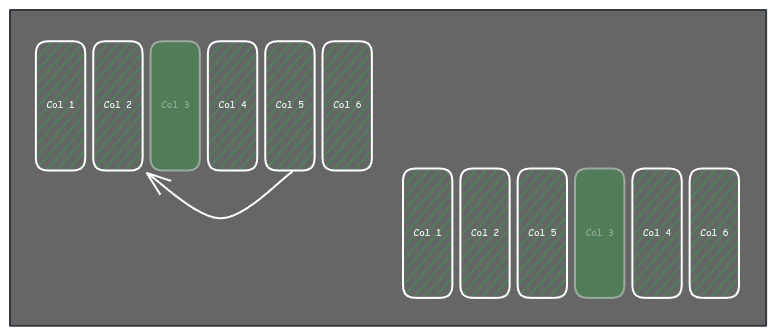
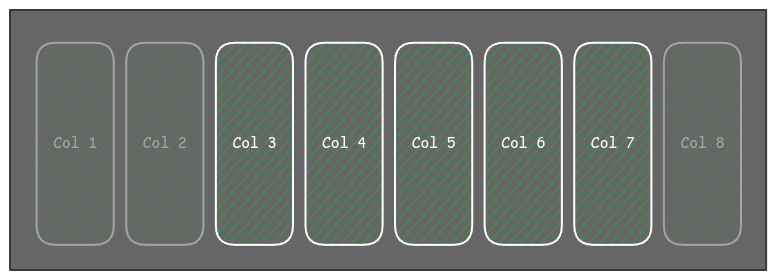

> Este post es parte de una serie: :astro-ref[Primera parte]{path="/blog/2024/2024-10-19-table-component"}, :astro-ref[Segunda parte]{path="/blog/2024/2024-10-21-table-component-ii"}, :astro-ref[Cuarta parte]{path="/blog/2024/2024-11-26-table-component-iv"} y un post extra relacionado: :astro-ref[Escribiendo un generador de consultas para filtrar datos]{path="/blog/2024/2024-10-24-query-builder"}

Quiero usar este último post de la serie para hablar de las funcionalidades relacionadas con las columnas, como el ordenamiento de columnas, columnas ocultas, columnas excluidas, columnas fijas, etc.

## Columnas definidas por el usuario vs columnas internas

Es importante saber que una cosa son las columnas definidas por el usuario (aquellas que son columnas de datos y se definen a través de la propiedad de definición de columnas) y otra cosa son las columnas en general, que incluyen las del usuario, pero también columnas definidas por otras props o funcionalidades de la tabla (columnas internas). Por ejemplo, la columna que renderiza los checkboxes en el caso de una tabla seleccionable, la columna que muestra una flecha para expandir la fila, la columna que renderiza los botones de acción, etc.

En los siguientes puntos, me referiré a las columnas definidas por el usuario, a menos que mencione lo contrario.

## Ordenamiento de columnas

Se trata del orden de las columnas en la tabla. Es muy conveniente (y común) renderizar las columnas en el mismo orden en que se definen en el array de definición, pero en algunos casos de uso, puede ser útil permitir al usuario reordenar las columnas para decidir cuáles son más relevantes.
Para ello, utilicé una propiedad en el objeto de definición de la columna, por ejemplo, `order`.

Siempre trato de evitar definir todas las definiciones usando un comportamiento por defecto; en este caso, el desarrollador puede decidir no establecer el orden en algunas columnas. El criterio para obtener el orden final que decidí aplicar es asignar un número alto a las columnas sin un orden explícito y luego ordenar todas las columnas por el valor del campo `order`. Si más de una columna tiene el mismo valor de orden, la primera en el array tiene prioridad y aparece antes en la tabla.

Hablando de la UI, hay múltiples formas de permitir al usuario decidir el orden, por ejemplo, arrastrando las columnas, con una acción en el menú de la columna, o arrastrando y soltando los nombres de las columnas en una sección de configuración de la tabla. En cualquier caso, debemos permitir al desarrollador bloquear algunas columnas en caso de que sea necesario; para eso podemos añadir una nueva propiedad a la definición de la columna: `noSortable`, que es false por defecto.

Algo importante sobre esto es que no tiene sentido permitir "bloquear" columnas en medio de la tabla, ya que aunque no pudieras arrastrar la columna bloqueada, podrías mover las columnas a su alrededor, lo cual es básicamente lo mismo que permitir ordenarla.



Decidí bloquear solo las columnas en los extremos de la tabla, y solo las que están entre ellas pueden ser ordenadas, sin permitir mover las columnas antes o después de las bloqueadas a la izquierda y derecha respectivamente. Esto también está relacionado con las columnas fijas (Fixed cols).



En cuanto a las columnas no definidas por el usuario, estas no forman parte de la lógica de ordenamiento; esas columnas deben estar en la posición que la tabla requiera por diseño. Para lograr esto, la tabla almacena internamente 2 listas de columnas: una con las columnas definidas por el usuario y otra con todas las columnas (que incluye tanto las columnas "internas" como las definidas por el usuario con metadatos extra).

## Columnas ocultas

Una funcionalidad que decidimos implementar fue la de las columnas ocultas. Quiero permitir al usuario seleccionar las columnas que desea ver en la tabla para adaptarla a su caso de uso.

Pero como antes, deberíamos tener una forma de controlar qué columnas pueden ser ocultadas por el usuario, y para ello debemos añadir una propiedad a la definición de la columna (`noHiddeable`) para establecer la columna como "visible obligatoria".

Para ocultar una columna, el usuario puede hacer clic en un menú desplegable en el encabezado de la columna, pero debemos proporcionar una forma de listar todas las columnas (incluidas las ocultas) y hacerlas visibles u ocultar cualquier columna; esto se puede hacer en un modal, panel lateral, etc. Como idea, pero no como solución única, utilicé la misma lista de nombres de columnas que permite ordenar la posición de las columnas para mostrar u ocultar una columna.

Recomiendo tratar las columnas ocultas como columnas visibles para el ordenamiento, de modo que sea consistente cuando el usuario las vuelva a mostrar.

## Columnas excluidas

En algunos casos necesitamos ocultar una columna del renderizado; por ejemplo, necesitamos el valor para definir un orden inicial de las filas, pero no queremos mostrar la columna. Podrías pensar que es lo mismo que una columna oculta, pero no lo es. Una columna oculta es una columna que mostramos en la lista de columnas (en otras palabras, es una columna que el usuario puede conocer), pero una columna excluida es para uso interno.
Para establecer una columna como excluida usamos de nuevo una propiedad de definición de columna (`excluded`) y debes recordar filtrar esta columna en cualquier cosa relacionada con la visualización: renderizado, orden de columnas, etc.

## Columnas fijas

Cuando la tabla contiene muchas columnas, puede ser útil fijar algunas de ellas. En este caso, decidí no establecer esto en la definición de las columnas; creo que es algo relacionado con la tabla en sí, así que añadí una propiedad en el componente de la tabla para establecer el número de columnas fijas.

Las columnas fijas deben estar en los "bordes" de la tabla; sí, en plural, ya que puedes tener columnas fijas en el lado izquierdo y en el lado derecho, y no solo una, puedes tener múltiples columnas fijas en cada lado.

En cuanto a la propiedad, creo que es muy conveniente aceptar un número, que represente el número de columnas fijas en el lado izquierdo, pero también aceptar un objeto o tupla para definir el número de columnas fijas en cada lado. Ej:

```tsx
<Table fixedCols={1}/>
<Table fixedCols={[1,3]}/>
```

Para definir qué columnas son las fijas, la tabla primero necesita ordenar las columnas y luego fijar las que están al principio y/o al final de la lista, siempre basándose en la propiedad.

Para las columnas internas, la propiedad de fijado no debería afectarlas, pero debemos tener en cuenta que esas columnas internas pueden estar fijas; por ejemplo, la columna con el check para seleccionar filas es una columna interna que, en nuestra implementación, está fija independientemente de la prop de la tabla.

Además, es importante forzar algunos flags o propiedades en las columnas fijas para sobrescribir la configuración del usuario; por ejemplo, una columna fija no es ordenable.

## En el próximo capítulo

Un componente de tabla es (o puede ser) un componente complejo, y prefiero proporcionar el máximo número de funcionalidades en la propia tabla, haciendo innecesario pensar en la implementación fuera de ella y facilitando la corrección de errores y el mantenimiento. Si te gusta este enfoque (frente a una tabla simple que solo renderiza datos de forma tabular), hay muchas cosas en las que pensar. Hablaré sobre la persistencia de la configuración de la tabla, filas anidadas, acciones de fila, barra de herramientas, barra de acciones, estado vacío, carga asíncrona y filas expandibles en el próximo post.
