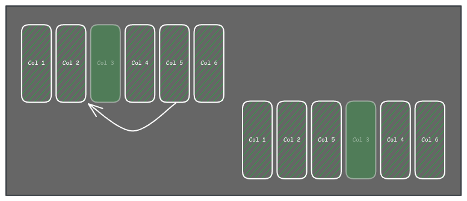
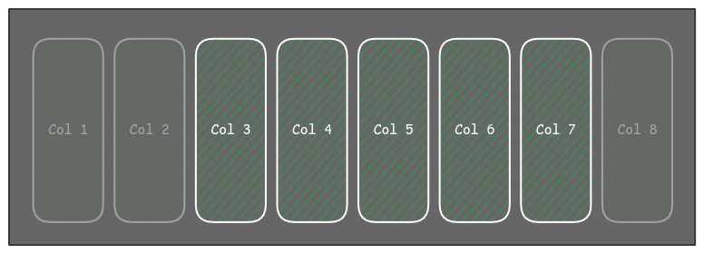

> This post is part of a post series: :astro-ref[First part]{path="/blog/2024/2024-10-19-table-component"}, :astro-ref[Second part]{path="/blog/2024/2024-10-21-table-component-ii"}, :astro-ref[Fourth part]{path="/blog/2024/2024-11-26-table-component-iv"} and an extra related post: :astro-ref[Writing a query builder to filter data]{path="/blog/2024/2024-10-24-query-builder"}

I want to use this last post in the series to discuss col-related features, such as col sorting, hidden cols, excluded cols, fixed cols, etc.

## User-defined cols vs internal cols

It's important to know that one thing is the cols defined by the user, those are data cols and are defined via the cols definition property, and another thing is the cols in general, which include the user cols, but also cols are defined by other props or features of the table (internal cols), for example the col that renders the checkboxes in the case of a selectable table, the col, that shows an arrow to expand the col, the col that renders the action buttons, etc.

In the next points, I will refer to user-defined cols except if I mention the opposite.

## Col sorting

This is about the order of the columns in the table, it is very convenient (and common) to render the columns in the same order as they are defined in the definition array, but in some use cases, it can be useful to let the user to reorder the columns to decide which ones are more relevant.
I used a property in the col definition object, for example, `order`.

I always try to avoid defining all the definitions using a default behavior, in this case, the developer can decide to don't set the order in some columns, the criteria to get the final order I decided to apply is to assign a big number to the cols without an explicit order and then order all the columns by the order field value. If more than one col has the same order value, the first in the array has priority and is before the orders on the table.

Talking about the UI there are multiple ways to let the user decide the order, for example dragging the cols, with a col's menu action, or dragging and dropping the cols' names in a config section of the table. In any case, we must let the developer block some columns in case it will be necessary, for that we can add a new property to the col's definition: `noSortable`, which is false by default.

One important thing about that is, makes no sense to let "block" columns in the middle of the table as you could not drag the blocked col but you can move the cols around it, and that is basically the same as allowing to sort it.



I decided to only block the columns at the ends of the table, and only the ones between them can be sorted don't let move the columns before or after the blocked ones on the left and right respectively, this is also related to Fixed cols.



Regarding the non-user-defined cols, those are not part of the order logic, those cols must be in the position the table requires by design. To achieve that, the table stores internally 2 lists of cols, one the user-defined cols, and all the cols (that included both "internal" cols and user-defined cols with extra metadata)

## Hidden cols

One feature we decided to implement was the hidden cols. I want to allow the user to select the cols she/he wants to see in the table to adapt the table to her/his use case.

But as before, we should have a way to control which cols can be hidden by the user, and for that, we must add a property to the col definition (`noHiddeable`) to set the column as "mandatory visible".

To hide a column the user can click in a dropdown menu on the col header, but we must provide a way to list all the columns (including the hidden ones) and make them visible or hide any column, you can do that in a modal, side panel, etc. As an idea, but not a unique solution, I used the same col names' list that allows to order of the cols' position to show or hide a column.

I recommend you treat hidden cols as visible col for the ordering to be consistent when the user unhides it.

## Excluded cols

In some cases we need to hide a col from the render, for example, we need the value to define an initial rows' sort, but we don't want to show the column. You can think that is the same as a hidden col, but is not. A hidden col is a col we show in the cols list in other words is a col the user can know about, but an excluded col is for internal use.
To set a col as excluded we use again a col's definition property (`excluded`) and you must remember to filter this column in anything related to the visualization: render, col order, etc.

## Fixed cols

When the table contains a lot of cols, it can be useful to fix some of them, in this case, I decided to not set this in the cols definition, I think is something related to the table itself, so I added a property in the table component to set the number of fixed cols.

The fixed cols must be in the "edges" of the table, yes, plural, as you can have fixed cols on the left side and the right side, and not just one, you can have multiple fixed cols on each side.

Regarding the property, I think is very convenient to accept a number, that represents the number of fixed cols on the left side, but also accept an object or tuple to define the number of fixed cols on each side. ex.:

```tsx
<Table fixedCols={1}/>
<Table fixedCols={[1,3]}/>
```

To define which cols are the fixed ones, the table first needs to order the cols and then fix the ones that are at the beginning and/or end of the list, always based on the property.

For the internal cols the fixed property should not affect them, but we need to bear in mind that those internal cols can be fixed, for example, the col with the check to select rows is an internal col, that in our implementation is fixed independently of the table prop.

Also, it is important to force some flags or properties in the fixed cols to overwrite the user config, for example, a fixed col is not sortable.

## In the next chapter

A table component is (or can be) a complex component, and I prefer to provide the maximum number of features in the table itself, making it unnecessary to think about the implementation outside of the table, and making it simple to fix bugs and maintain the table. If you like this approach (vs simple table that only renders data in a tabular way) there are a lot of things to think about, I will talk about Table settings persistence, nested rows, row actions, toolbar, action bar, empty state, async loading, expandable rows in the next post.
