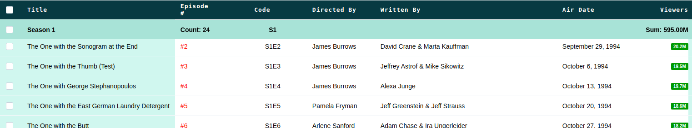
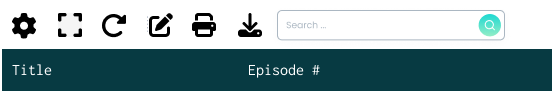
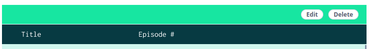

> Este post es parte de una serie: :astro-ref[Primera parte]{path="/blog/2024/2024-10-19-table-component"}, :astro-ref[Segunda parte]{path="/blog/2024/2024-10-21-table-component-ii"}, :astro-ref[Tercera parte]{path="/blog/2024/2024-10-27-table-component-iii"} y un post extra relacionado: :astro-ref[Escribiendo un generador de consultas para filtrar datos]{path="/blog/2024/2024-10-24-query-builder"}

Como mencioné en los capítulos anteriores de esta serie, prefiero ofrecer la mayor cantidad posible de funcionalidades en la tabla. Hay varias razones detrás de esta decisión, siendo estas las más relevantes:

- **Homogeneidad**: Misma solución para el mismo problema en diferentes lugares. Si no proporcionas una solución para las necesidades comunes o repetidas, corres el riesgo de tener diferentes soluciones para el mismo problema. Esto es muy común en aplicaciones grandes donde los equipos trabajan en diferentes partes de la aplicación y pueden ofrecer soluciones y experiencias de usuario distintas para casos de uso similares, lo que causa duplicación de trabajo y una mala experiencia de usuario.
- **Mantenibilidad**: En general, es más fácil mantener el código; si corriges un error, se solucionará en todos los lugares donde se use esa funcionalidad de la tabla, o si una característica cambia, cambiará en todos los sitios. Esto está muy relacionado con el punto anterior. Por ejemplo, si decidimos usar una vista reciclada (recycle view) para renderizar las filas de la tabla y obtener un mejor rendimiento, solo necesitamos hacerlo una vez y toda la implementación se beneficiará de ello.
- **Simplicidad de implementación**: Usar una tabla con muchos casos de uso y funcionalidades (basadas principalmente en configuraciones o props) hace que sea muy sencillo implementar la tabla para cualquier desarrollador, incluso si acaba de incorporarse o es junior.

Los trade-offs de esto son:

- **Cubrir todos los casos de uso no es fácil**: Encontrar una solución común para problemas similares requiere esfuerzo y tiempo, y puede ser difícil en algunos casos.
- **Encontrar un equilibrio**: No siempre es fácil decidir qué funcionalidades deben estar en la tabla o no.
- **Componente grande**: Incluir demasiadas funcionalidades puede hacer que el bundle size del componente sea grande.

## Otras funcionalidades que implementé

### Persistencia de la configuración de la tabla

Como mencioné en el capítulo anterior, permitimos que los usuarios seleccionen el orden de las columnas, lo cual es una característica excelente, pero no es muy útil si tienen que configurar el orden cada vez que cargan la página. Para solucionar esto, implementamos un sistema para persistir y restaurar la configuración de la tabla. En nuestro caso de uso, la configuración de la tabla incluye: orden de las columnas, visibilidad de las columnas, elementos por página y otros ajustes que la implementación de la tabla pueda definir para el caso de uso específico.

Creo que el componente de tabla no debería saber nada sobre cómo persistir los datos, porque en ese caso, estaríamos acoplando el componente de tabla con el backend, y eso limita la reutilización de la tabla. Este es un ejemplo del equilibrio que mencioné antes.

Para solucionar esto y evitar acoplar el componente a la infraestructura (backend), utilizamos providers. El componente de tabla define una interfaz para la persistencia (lectura y escritura), y la página que implementa la tabla puede inyectar ese provider a través de una prop para implementar la lógica de persistencia. Para que el código sea reutilizable, el provider es una utilidad común que solo necesita un ID para identificar la tabla. Este provider puede almacenar la configuración de la tabla en el local storage, en un backend, etc.

La tabla debe contener la lógica para manejar las inconsistencias entre la configuración y la definición de la tabla; por ejemplo, si una columna cambia y ahora es fija, debe ignorar el orden en la configuración para esa columna, o si eliminamos o añadimos una nueva columna, el componente de tabla contiene la lógica para colocar la nueva columna en un orden predeterminado junto con las demás.

### Filas anidadas (Nested rows)

Otra funcionalidad útil en nuestro caso de uso fueron las filas anidadas. Por ejemplo, tenemos una lista de episodios de la serie "Friends" y queremos mostrarlos agrupados por temporada e incluso mostrar información agregada como el recuento, total de visualizaciones, etc.

Hay otras sub-funcionalidades que puedes incluir: los grupos (cada fila con hijos) pueden ser colapsables o no, la cabecera puede ser un elemento sticky (siempre está arriba cuando los hijos son visibles), etc.

Aunque al principio parece una funcionalidad sencilla, hay muchas partes complicadas y decisiones no triviales que tomar:

- **¿Cómo agrupar las filas cuando cambia el orden?**. Hay múltiples formas de hacerlo y no hay una respuesta correcta, solo lo que tenga sentido para tu caso de uso.
  - Puedes ordenar primero las filas padre y luego ordenar los hijos dentro de cada fila. Esto mantendrá los grupos.
  - Puedes ordenar todos los hijos juntos y luego reagruparlos. Esto creará repeticiones en las filas padre ya que ahora los hijos están mezclados. Ej: A contiene: 3,4,7 y B contiene 1,2,5. Las filas ordenadas con los hijos a mostrar serían: B (1,2), A (3,4), B(5), A(7).
- **Cómo dividir las páginas**: ¿Debe el recuento de filas padre contar para la paginación, o solo los hijos, o ambos? ¿Cómo dividir las páginas cuando las filas padre son colapsables? Puedes recalcular la paginación cuando un grupo de hijos se expande o no, o simplemente contar los elementos aunque no estén expandidos.

En nuestro caso de uso, seleccionamos una de las soluciones para cada tema, ¡pero no la compartiré con vosotros! ;). No hay respuestas absolutamente correctas aquí, depende de lo que necesites.

#### Carga asíncrona de filas anidadas

Otra funcionalidad relacionada con las filas anidadas es la carga asíncrona. Esta característica solo tiene sentido cuando el usuario puede colapsar las filas padre (y están colapsadas por defecto); en este caso, los hijos solo se cargan cuando el usuario expande una fila. Esto es útil para que el tiempo de visualización de los datos iniciales en la tabla sea corto y reduce las peticiones al backend.

Esta funcionalidad requiere resolver cómo cargar los datos. Como mencioné antes, creo que las peticiones no deberían formar parte del componente de tabla, así que, al igual que en el caso de la persistencia de la configuración, definimos una interfaz de provider que cargará los datos y los devolverá a la tabla. La tabla invocará al provider cuando el usuario quiera expandir una fila y reciba la fila padre; tu implementación gestionará eso para solicitar las filas hijas y devolverlas a la tabla. La tabla debe manejar el estado de carga y, en nuestro caso, mostrar skeletons para las filas hijas mientras los datos se están cargando.

### Filas expandibles

Esta funcionalidad permite expandir una fila dejando que la implementación defina el contenido a mostrar en el espacio expandido. Esta característica puede parecer similar a las filas anidadas pero no lo es (y no es incompatible). En este caso, el contenido no forma parte de la tabla; en el caso de las filas anidadas, los hijos deben tener las mismas columnas que el padre (como la tabla), mientras que en la fila expandida podemos poner otra tabla (con columnas diferentes) o cualquier otro contenido, como un formulario, un gráfico, etc., cualquier cosa.

En nuestro caso, como el componente de tabla fue implementado en Vue, utilizamos una característica que me encanta de este framework, los [scoped slots](https://vuejs.org/guide/components/slots#scoped-slots), para permitirnos definir ese contenido, que puede ser el mismo para todas las filas expandidas o variar por fila.

### Acciones de fila

Un caso de uso muy común (al menos para nosotros) es tener acciones sobre las filas, por ejemplo, eliminar la entidad que representa la fila, editarla, ejecutar una acción sobre ella, etc. Para ello, permitimos pasar al componente de tabla un provider de acciones que define las acciones para cada fila (al ser una función, las acciones pueden ser diferentes o estar habilitadas o no para cada fila). Esas acciones se muestran en la tabla en una :astro-ref[columna interna]{path="/blog/2024/2024-10-27-table-component-iii" fragment="user-defined-cols-vs-internal-cols"} utilizando un componente de menú desplegable (este componente forma parte de nuestra biblioteca de componentes de UI).

### Barra de herramientas (Toolbar)

La barra de herramientas es un conjunto de iconos, situados visualmente sobre la cabecera de la tabla, que representan acciones para la tabla.

Implementé acciones integradas como:

- **Configuración (Settings)**: Para abrir el panel o modal de configuración de la tabla.
- **Pantalla completa (Fullscreen)**: Para mostrar la tabla en modo de pantalla completa.
- **Recargar (Reload)**: Lanza un evento para permitir que la implementación sepa que el usuario quiere refrescar los datos.
- **Editar (Edit)**: Para entrar en modo de edición; esto convierte el contenido de las filas en campos de entrada para cambiar los valores directamente desde la tabla.
- **Imprimir (Print)**: Imprime el contenido de la tabla.
- **Descargar (Download)**: Exporta el contenido de la tabla a CSV o XLS implementando toda la lógica en el lado del frontend. Esta es una funcionalidad interesante. La función integrada solo exporta los datos que contiene la tabla; si está en modo externo, solo puede exportar el contenido de la página actual, pero podemos proporcionar una forma de sobrescribir el comportamiento del botón y delegarlo en una implementación externa que pueda obtener todos los datos y descargarlos. En cualquier caso, este escenario es un buen ejemplo de lo útiles que son los formateadores, ya que, de nuevo, podemos renderizar los datos de exportación en el formato correcto.
- **Caja de búsqueda (Search box)**: Donde el usuario puede introducir el texto de búsqueda que expliqué en el primer capítulo.

Permito a los desarrolladores definir qué acciones integradas quieren usar, pero también les permito implementar sus acciones personalizadas para un caso de uso específico pasando los botones a renderizar como props y recibiendo un evento o callback cuando el usuario hace clic en ellos.

### Barra de acciones (Action bar)

Esta barra solo aparece cuando el usuario selecciona más de una fila y permite ejecutar acciones sobre las filas seleccionadas; esas acciones son definidas por el usuario, por ejemplo, eliminar o editar, o cualquier otra acción.

## Resumen

Crear un componente de tabla es una experiencia desafiante e interesante que requiere (como cualquier otro componente) prestar atención a los detalles, comprender, identificar y definir los conceptos involucrados en el proceso.

Mi objetivo con esta serie de posts era darte consejos y compartir las soluciones y decisiones que tomé (y por qué las tomé).

Mis soluciones no son necesariamente las correctas para ti, fueron las que cubrieron mis necesidades, pero espero que encuentres estos posts útiles para entender mejor las diferentes opciones.

Todavía quedan muchas cosas pequeñas a tener en cuenta (estado vacío, selector de elementos por página, estado de no se encontraron resultados,....) cuando implementas un componente de tabla, pero siento que puedes manejarlas.

Por favor, hazme saber si te ha gustado este post, si echas algo de menos, etc. Gracias por leer.
