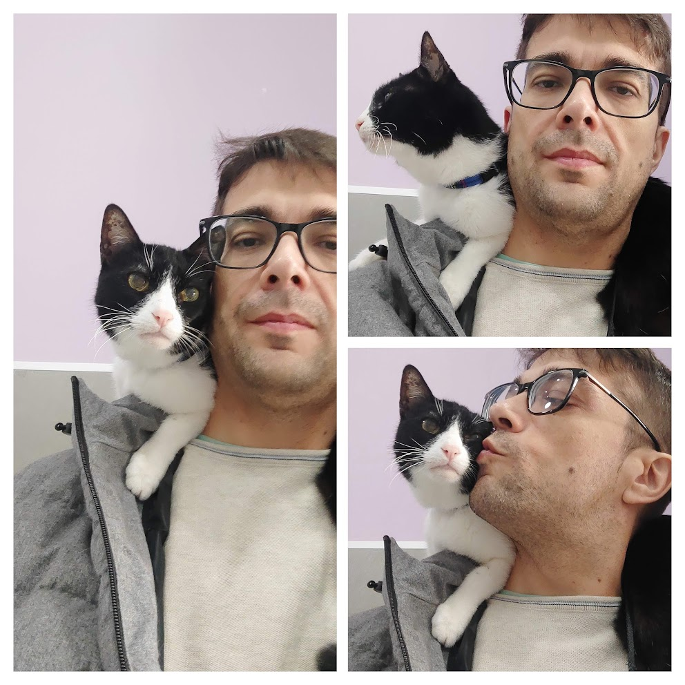
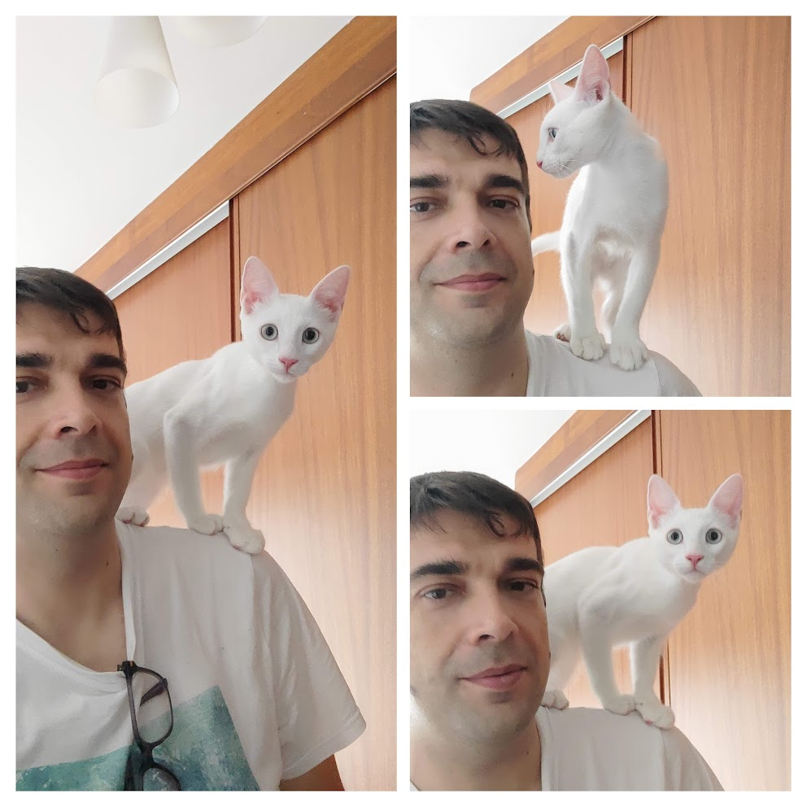

2024 ha terminado y es hora de echar la vista atrás y recordar los hitos y logros del año.

# Profesional

Este ha sido un año de cambios; me uní a [New Relic](https://newrelic.com) en junio como Senior Software Engineer en el equipo de UI tooling. El reto es grande para mí, ya que los objetivos del equipo al que me he unido son muy diferentes a los de mis roles anteriores: nos centramos en proporcionar herramientas a los equipos de frontend para mejorar la experiencia del desarrollador (developer experience) y asegurar la calidad de las aplicaciones frontend. Todos mis roles anteriores estaban enfocados en el desarrollo (backend y frontend) del producto en sí, pero este puesto no está centrado en el producto como antes. Este fue un gran cambio para mí y me enfrenté a muchos desafíos, pero estoy contento con los resultados y con el equipo, un equipo lleno de gente con talento, una gran gestión y, algo muy importante, personas a las que les gusta ayudar y con las que es fácil trabajar.

Antes de unirme a New Relic, trabajaba en [Nextail](https://nextail.co) como arquitecto frontend. Creo firmemente que mi equipo y yo logramos todos los objetivos que la empresa nos propuso, completando la migración del frontend a un framework de frontend moderno, reactivo y progresivo, creando una biblioteca de componentes de UI potente y flexible para homogeneizar la experiencia de usuario, acelerando el desarrollo y asegurando la calidad de las aplicaciones frontend, y sentando las bases para el futuro.

Profesionalmente hablando, estoy seguro de que 2025 será un año lleno de retos, y quizás cambios, pero seguiré trabajando duro para seguir mejorando mis habilidades profesionales y continuar aprendiendo.

# Post y Charlas

Este ha sido el tercer año en el ranking por número de posts escritos. Solo superado por 2020 y 2019.

Estoy muy orgulloso de la serie de artículos que escribí sobre mi experiencia :astro-ref[creando un componente de tabla]{path="/blog/2024/2024-10-19-table-component"}, y sobre :astro-ref[bibliotecas de componentes de UI]{path="/blog/2024/2023-12-02-ui-components-library"}. Esta lista aún no está completa, pero seguiré escribiendo sobre ello en 2025.

Sigo publicando artículos en [DZone](https://dzone.com/users/4846267/sergiocarracedo.html)

# Aprendizajes

Este año he vuelto a aprender (porque son básicamente los mismos aprendizajes que tuve el año pasado) cosas importantes:

- lo importante que es la gente con la que trabajas
- cómo la motivación puede marcar la diferencia tanto a nivel profesional como personal.
- cómo un buen manager marca la diferencia

# Personal

En febrero falleció nuestro querido gato **Gauss**. Lo echamos mucho de menos. Formó parte de nuestra familia durante 17 años y estoy muy feliz de haber compartido tantos años con él. Me enseñó muchas cosas sobre el comportamiento y la personalidad de los gatos, y lo importante que es confiar el uno en el otro. Le encantaba dormir en mi regazo mientras trabajaba, e ir al veterinario solo con una correa sobre mi hombro sin necesidad de transportín porque mi hombro era su lugar seguro. Lo extraño mucho, era muy especial.

Casi sin tiempo para recuperarnos de la pérdida de Gauss, en abril, unos amigos que saben cuánto me gustan los gatos me hablaron de un gato que necesitaba un hogar. Un gato bebé que alguien tiró a un contenedor de basura, incluso con el cordón umbilical. Le salvaron la vida, lo alimentaron durante un mes y lo adoptamos.
Lo llamamos **Weber** en honor a [Wilhelm Eduard Weber](https://en.wikipedia.org/wiki/Wilhelm_Eduard_Weber) porque Weber era amigo de [Carl Friedrich **Gauss**](https://en.wikipedia.org/wiki/Carl_Friedrich_Gauss), y como podéis ver en la foto de arriba, le enseño a confiar en mí y en mi hombro como hacía Gauss. Es un gato con mucha energía, muy juguetón y muy cariñoso.

# Música

Esta es la canción que más escuché en 2024:

::spotify[]{type="track" id="5aoBuRB9lHxCh1J25wTPhQ" width="100%" height="152"}

Realmente me encanta

Esta es la lista de reproducción de mis canciones favoritas de 2024 (las que añadí como favoritas en 2024), hay un par de "ganadoras"

::spotify[]{type="playlist" id="0DNZRbaJRTHU2BOHoDotCS" width="100%" height="352"}

> :tada: ¡¡Feliz 2025!! :tada:
