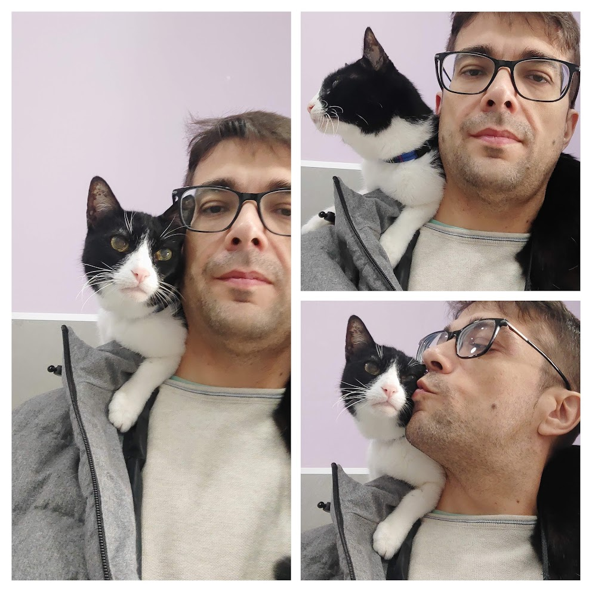
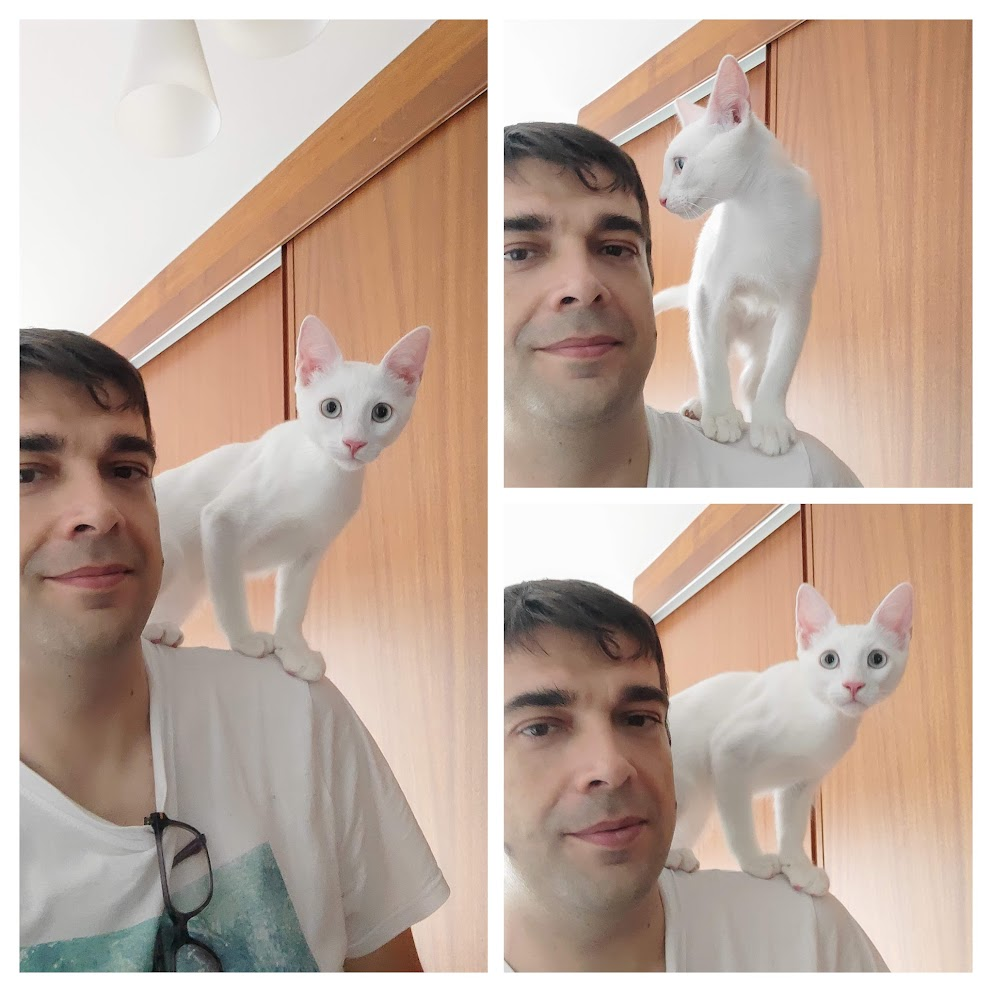

2024 is over and it is time to look back and remember the milestones and achievements of the year.

# Professional

This was a year of change, I joined [New Relic](https://newrelic.com) in June as a Senior Software engineer in the UI tooling team. The challenge is big for me as the goals of the team I joined are very different from the ones in my previous roles: we are focused on providing tools to the frontend teams to improve the developer experience and ensure the quality of the frontend applications. All my previous roles were focused on the development (backend and frontend) of the product itself, but this position is not focused on the product as before. This was a big change for me and I faced many challenges, but pleased with the results and the team, a team full of talented people, great management, and something very important people who like to help and who are easy to work with.

Before joining New Relic, I was working in [Nextail](https://nextail.co) as a frontend architect. I strongly believe my team and I achieved all the goals the company set for us, completing the migration of the frontend to a modern reactive and progressive frontend framework, creating a powerful and flexible UI components library to homogenize the user experience, accelerating the development and ensure the quality of the frontend applications, and building the foundations for the future.

Professionally speaking, I'm pretty sure 2025 will be a year full of challenges, and maybe changes, but I will still work hard to keep improving my professional skills and continue learning.

# Post and Talks

This was the third year in the ranking of number of posts written. Only surpassed by 2020 and 2019.

I am very proud of the series of articles I wrote about my experience :astro-ref[creating a table component]{path="/blog/2024/2024-10-19-table-component"}, and about :astro-ref[UI components library]{path="/blog/2024/2023-12-02-ui-components-library"}. This list is not complete yet, but I will continue writing about it in 2025.

I continue publishing articles in [DZone](https://dzone.com/users/4846267/sergiocarracedo.html)

# Learnings

This year I re-learned (because it is mostly the same learnings I had the last year) important things:

- how important is the people you work together
- how motivation can make a difference both professional and personal.
- how a good manager makes a difference

# Personal

In February our beloved cat **Gauss** passed away. We miss him a lot. He was part of our family for 17 years and I am very happy to have shared so many years with him. He taught me a lot of things about cat's behavior and personality, and how important is to trust each other. He loved to sleep on my lap while I was working, go to the vet just with one strap over my shoulder with need a pet carrier because my shoulder was his safe place. I miss him a lot he was very special.

With hardly any time to recover from the loss of Gauss, in April, friends who know how much I love cats, told me about a cat that needed a home. A baby cat someone threw in a trash container, even the umbilical cord. They saved his live and fed him for 1 month and adopted him.
We called him **Weber** in honor of [Wilhelm Eduard Weber](https://en.wikipedia.org/wiki/Wilhelm_Eduard_Weber) because Weber was a friend of [Carl Friedrich **Gauss**](https://en.wikipedia.org/wiki/Carl_Friedrich_Gauss), and you can see in the picture above, I teach him to trust in my and my shoulder as Gauss did. He is a cat with a lot of energy, very playful, and very affectionate.

# Music

This is the song I listened to the most in 2024:

::spotify[]{type="track" id="5aoBuRB9lHxCh1J25wTPhQ" width="100%" height="152"}

I really love it

This is the playlist of the my favourite songs of 2024 (the ones I added as favourites in 2024), the there is a couple of "winners"

::spotify[]{type="playlist" id="0DNZRbaJRTHU2BOHoDotCS" width="100%" height="352"}

> :tada: Happy 2025!! :tada:
