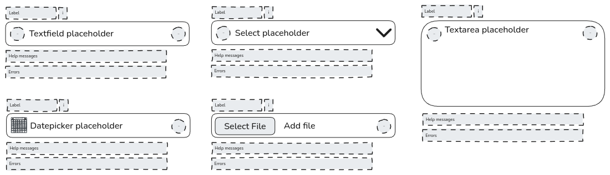

La reutilización y la consistencia son dos conceptos con los que estoy "obsesionado". Quizás sea porque conozco el esfuerzo y el dolor que supone mantener una biblioteca de componentes de UI sin tener esos conceptos en mente. También se trata de la experiencia del desarrollador (developer experience), y cuanto menos tiempo pases en tareas repetitivas, más tiempo tendrás para centrarte en los problemas reales y aportar valor a tus usuarios. Desde el punto de vista del usuario, la consistencia es un factor clave en la usabilidad de una aplicación.

## El problema

Cuando desarrollas una biblioteca de componentes de UI, es muy común tener diferentes componentes para permitir que los usuarios introduzcan información de distintas maneras: (voy a usar los componentes de [NextUI](https://nextui.org/) como ejemplo, pero puedes aplicar este concepto a cualquier biblioteca de UI)

- Text fields
- Text areas
- Selects o Dropdowns
- Date pickers
- File fields
- Checkboxes
- Radio buttons
- ....

Centrémonos en los campos que permiten al usuario introducir texto o un valor, como los campos de texto, áreas de texto, selects, date pickers, campos de archivo, etc.

**¿Ves el patrón?**

Todos estos tipos de campos tienen etiquetas (labels), mensajes de ayuda, mensajes de error y slots para iconos, y la mayor parte del comportamiento es el mismo: focus, blur, change, etc. Establecer el color del borde en rojo si hay un error, poner el color y el fondo en gris si está deshabilitado, etc.

Hay muchas cosas en común; implementarlas en cada componente es una pérdida de tiempo y una fuente de errores, ya que necesitas mantener el mismo comportamiento en diferentes componentes. Cuando necesitas cambiar algo, tienes que hacerlo en todos los componentes, y también es una fuente de inconsistencia, ya que puedes olvidar actualizar uno de los componentes.

Existen algunas diferencias entre los componentes, como la forma de introducir el valor o de renderizarlo; por ejemplo, un campo de texto utiliza un `input type="text"` para permitir que el usuario cambie el valor, y un componente select no necesita un input (no en este ejemplo, tal vez si es autocomplete, pero sí una lista de opciones), un date picker necesita un calendario, etc.

Esas son las diferencias que hacen que los componentes sean únicos, pero el comportamiento común es el mismo, con algunas excepciones o comportamientos predefinidos para los casos comunes. Por ejemplo, el dropdown utiliza el slot derecho para renderizar la flecha que abrirá el popover con las opciones, el date picker renderiza un calendario para identificarlo, etc.

## La solución

La solución es crear un helper component que encapsule el comportamiento común y la estructura común de los campos. Un helper component no tiene sentido usarlo tal cual; puedes pensar en él como una clase abstracta en OOP: no puedes crear una instancia de ella, pero puedes extenderla y crear una nueva clase que herede el comportamiento y la estructura de la clase abstracta.

Cada componente puede establecer un conjunto predefinido de propiedades o slots para el helper component, y el helper component renderizará la estructura y el comportamiento basándose en eso. Por ejemplo, el componente Textfield o Textarea expone el slot para los iconos izquierdo y derecho al desarrollador, pero el dropdown utiliza el slot derecho para la flecha y solo expone el slot izquierdo para el icono. Pero el helper component sigue siendo el mismo.

El helper component también puede exponer algunas propiedades para permitir al desarrollador personalizar el comportamiento, por ejemplo, para mostrar un botón de "limpiar" (clear) cuando el campo tiene un valor.

## La conclusión (The takeaway)

La conclusión es pensar en las similitudes para crear un helper component que encapsule el comportamiento y la estructura comunes, y dejar que los componentes lo extiendan y lo personalicen para crear el comportamiento y la estructura únicos. Esto se aplica no solo a los campos de entrada; en estos ejemplos podemos hacer algo similar con la etiqueta (puede incluir el tooltip de información), los mensajes, etc. Es muy gratificante poder corregir un error o añadir una nueva funcionalidad a los campos y hacerlo en un solo lugar.
