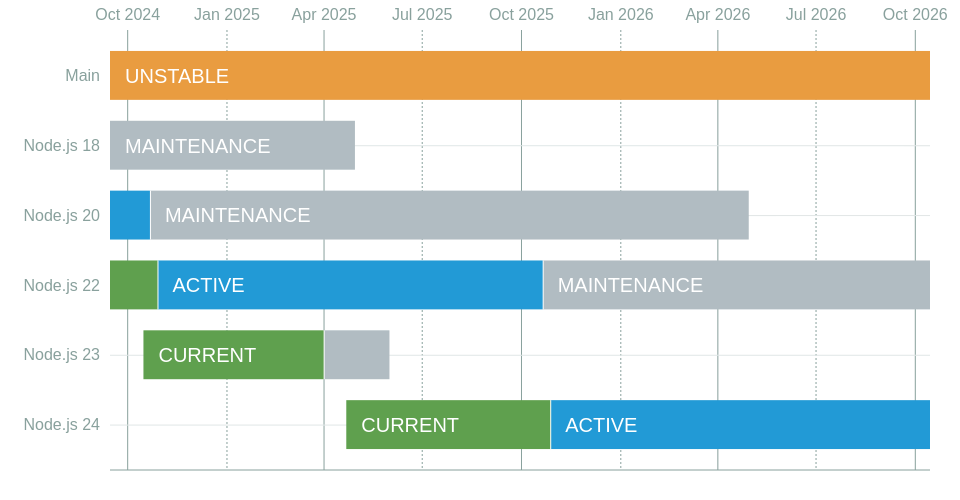

Cuando te enfrentas a la gestión de un proyecto de node.js / javascript, debes configurar un entorno replicable, la versión del motor (node), el gestor de paquetes, etc.

Para gestionar la versión de node, puedes usar [nvm](https://github.com/nvm-sh/nvm), que gestiona la versión de node en tu sistema (global y por proyecto). También puedes usar un archivo `.nvmrc` para especificar la versión de node que necesitas para ese proyecto y usar una (integración con la shell)[https://github.com/nvm-sh/nvm?tab=readme-ov-file#deeper-shell-integration] para cambiar automáticamente a la versión correcta cuando entres en el directorio del proyecto.

## ¿Pero qué pasa con el gestor de paquetes?

En el pasado (hace mucho tiempo), el único gestor de paquetes era `npm`, por lo que el mayor problema era asegurar que todos los desarrolladores estuvieran usando la misma versión de `npm` para evitar problemas. Pero ahora tenemos `yarn` y `pnpm` (mi favorito), que son más rápidos y tienen algunas características que `npm` no tiene. Eso hace que el problema sea mayor, ya que necesitas asegurar que todos los desarrolladores usen el mismo gestor de paquetes, para evitar problemas como tener diferentes archivos lock, diferentes formas en que el gestor de paquetes maneja las dependencias, etc.

## Corepack

[Corepack](https://nodejs.org/api/corepack.html) es una característica experimental de node.js añadida en v16.9.0 y v14.19.0, por lo que está presente en cualquier versión de node que deberías estar usando en tus proyectos ahora mismo (¡supongo que estás usando una versión de node con [soporte de seguridad](https://nodejs.org/en/about/previous-releases), si no, deberías hacerlo!).



Corepack es un gestor que te permite usar `yarn`, `pnpm` o `npm` "sin" instalarlos en tu sistema y, lo más importante, al igual que nvm, cada proyecto puede usar su propia versión del gestor de paquetes.

También define el gestor de paquetes del proyecto y su versión en el archivo `package.json`, por lo que ahora el gestor de paquetes es parte del proyecto.

## Cómo usarlo

corepack está incluido en node.js, así que no necesitas instalarlo, solo tienes que habilitarlo:

```sh
corepack enable
```

La primera vez para un proyecto necesitas definir el gestor de paquetes que quieres usar y la versión; por ejemplo, para usar `pnpm` versión `10.0.0` deberías ejecutar:

```sh
corepack use pnpm@10.0.0
```

Si esta versión del gestor de paquetes no está instalada en tu sistema, corepack la descargará y la usará para el proyecto. También actualizará el `package.json` añadiendo una línea para definir el gestor de paquetes y su versión para el proyecto:

```json
{
  ...
  "packageManager": "pnpm@10.0.0+sha512.b8fef5494bd3fe4cbd4edabd0745df2ee5be3e4b0b8b08fa643aa3e4c6702ccc0f00d68fa8a8c9858a735a0032485a44990ed2810526c875e416f001b17df12b",
  ...
}
```

Ahora debes ejecutar cualquier comando del gestor de paquetes usando corepack como proxy. Por ejemplo, `corepack pnpm i` para instalar las dependencias.

Si intentas ejecutar otro gestor de paquetes (vía corepack) obtendrás un error:

```sh
❯ corepack yarn i
UsageError: This project is configured to use pnpm because /works/test/corepack/package.json has a "packageManager" field
}
```

Si llamas a un comando del gestor de paquetes sin corepack, no obtendrás un error (excepto con yarn). Puedes solucionar esto añadiendo alias para los gestores de paquetes en tu archivo de configuración de la shell (`.bashrc`, `.zshrc`, etc.):

```sh
alias yarn="corepack yarn"
alias yarnpkg="corepack yarnpkg"
alias pnpm="corepack pnpm"
alias pnpx="corepack pnpx"
alias npm="corepack npm"
alias npx="corepack npx"
```

Te animo a usar corepack si aún no lo estás haciendo; es una gran herramienta lista para usar que evita problemas con el gestor de paquetes y asegura que todos los desarrolladores usen la misma versión del mismo.
