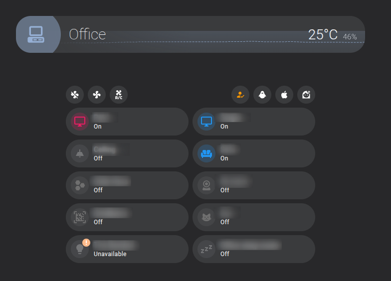

> El objetivo de este post es ofrecerte una breve introducción a la creación de tarjetas personalizadas para Home Assistant utilizando Lit elements, y compartiré contigo las lecciones aprendidas de mi experiencia aprendiendo a crear tarjetas personalizadas para Home Assistant.

Home Assistant es una plataforma potente, de código abierto, extensible (y mucho más) para la domótica. Si la utilizas, probablemente seas fan de los paneles (dashboards), y las tarjetas son una de las partes más importantes de los mismos.

Aunque Home Assistant ofrece muchas tarjetas integradas, a veces se necesita algo más específico o con un estilo gráfico concreto, ya que los paneles no sirven solo para mostrar una lista infinita de números o gráficos; la información debe mostrarse de forma jerárquica.

[HACS](https://hacs.xyz/) (Home Assistant Community Store) ofrece una forma sencilla de instalar elementos personalizados de Home Assistant (no solo tarjetas, sino también integraciones, temas, etc.) creados por la comunidad. Si buscas una forma sencilla de personalizar tu panel de Home Assistant, HACS es el camino a seguir. Estas tarjetas suelen ser muy configurables, pero en algunos casos o para ciertos usuarios, esa configuración puede no ser suficiente.

Para estos casos, existe un proyecto en HACS como [button-card](https://github.com/custom-cards/button-card) que permite añadir estilos, tarjetas dentro de tarjetas, etc., simplemente usando una configuración YAML.
Eso está muy bien, pero reutilizar las tarjetas implica copiar y pegar el código de la tarjeta y cambiar las "variables", pero cuando haces un cambio en el estilo o añades un nuevo elemento, necesitas volver a copiar el código manualmente.

Si estás familiarizado con YAML, quizá pienses que podrías usar fragmentos de YAML para reutilizar partes del código, pero eso no es posible en los paneles "controlados por la interfaz de usuario" (UI controlled).

## Paneles controlados por la interfaz vs YAML

En Home Assistant, existen dos tipos de paneles: los controlados por la interfaz de usuario (UI controlled) y los controlados por YAML. Los paneles controlados por la interfaz son los predeterminados y se pueden configurar mediante la interfaz de Home Assistant; puedes arrastrar y soltar las tarjetas para cambiar su posición, usar la interfaz para editar la configuración de la tarjeta, etc.
Pero aunque puedes exportar la configuración a YAML, no puedes usar fragmentos de YAML para reutilizar código. Si lo haces, Home Assistant aplicará los fragmentos y aplanará la configuración para almacenarla en la base de datos interna, no en un archivo real, por lo que la próxima vez que quieras editar el panel, los fragmentos de YAML no estarán disponibles.

Los paneles controlados por YAML son más flexibles; puedes usar fragmentos de YAML y plantillas para reutilizar el código, pero pierdes la sencillez de la interfaz de usuario; además, incluso usando plantillas Jinja2, en mi opinión, no es lo suficientemente flexible.

## Tarjetas personalizadas en Home Assistant

### Elementos personalizados (Custom elements)

Home Assistant te permite crear tarjetas personalizadas simplemente utilizando [Web Components](https://developer.mozilla.org/en-US/docs/Web/API/Web_components), un estándar web que permite crear componentes reutilizables mediante HTML, CSS y JavaScript.

Definir un elemento personalizado es tan sencillo como crear una clase que extienda la clase `HTMLElement` y definir los nodos del DOM que necesites.

```
class MessageCard extends HTMLElement {
  constructor() {
    super();
    this.message = this.getAttribute("message");
    this.template = document.createElement("template");
    this.template.innerHTML = `
      <h1 class="message">${this.message}</h1>`;
    this.shadow = this.attachShadow({ mode: "open" });
    this.shadow.appendChild(this.template.content.cloneNode(true));
  }
}
```

Para usarlo debes registrarlo:

```
customElements.define("message-card", MessageCard);
```

Y luego puedes usarlo en tu HTML como un elemento HTML normal.

```
<message-card message="Hello world"></message-card>
```

### Usar un elemento personalizado como tarjeta personalizada en Home Assistant

Para usar un elemento personalizado como una tarjeta personalizada en Home Assistant, necesitas registrarlo usando una variable global.

```javascript
window.customCards = window.customCards || [];
window.customCards.push({
  type: 'message-card', // This is the name you registered the custom element with
  name: 'Message Card',
  description: 'This is my first HA custom card',
});
```

Y ahora necesitamos que este código JS esté disponible para Home Assistant; para ello, debemos añadirlo como un recurso en el panel `Editar panel > Gestionar recursos > Añadir recurso` y añadir la ruta al archivo JS.
Podrías usar un alojamiento externo y cargar el recurso desde allí, por ejemplo, http://mypage/custom-card.js, pero no lo hagas, ya que es arriesgado en términos de seguridad y dependes de la conexión a internet para mostrar las tarjetas.

La mejor forma es usar la carpeta `www` de tu instalación de Home Assistant, que puedes encontrar en la raíz de la misma. Puedes crear una carpeta dentro de `www` para guardar tus tarjetas personalizadas y almacenar allí el archivo de la tarjeta, por ejemplo `/www/my-custom-cards/message-card.js`.

> Ten en cuenta que la ruta en la página de "gestionar recursos" es relativa a la carpeta `www`, por lo que debes añadir `/local/` antes de la ruta al archivo; en este caso, debes usar `/local/my-custom-cards/message-card.js` como ruta del recurso.

También puedes usar HACS para distribuir e instalar tus tarjetas personalizadas; HACS se encargará de añadir el recurso a los paneles, pero esto queda fuera del alcance de este post.

## Lit elements

Crear elementos personalizados usando la clase `HTMLElement` es un poco tedioso; necesitas crear los nodos del DOM manualmente y gestionar todos los cambios de eventos en el estado, etc., por tu cuenta.

Como las tarjetas personalizadas de Home Assistant son solo un elemento personalizado, puedes usar cualquier framework para crearlas, por ejemplo, Vue, React (desde la v19), Angular, etc., pero Home Assistant utiliza [Lit elements](https://lit.dev/) en el frontend, por lo que es una buena idea usar esta biblioteca ligera y agradable para crear tus tarjetas personalizadas.

Debo mencionar antes que Home Assistant intentará pasar algunas propiedades al elemento personalizado y espera algunos métodos para pasar y obtener información sobre tu tarjeta.

- Siempre que el estado cambie, actualizará el atributo `hass` con un objeto que incluye el estado de la instancia de Home Assistant, sensores, áreas, etc.
- Llamará a la función `setConfig(config)` para pasar la configuración de la tarjeta.

Hay más propiedades y métodos que Home Assistant llamará, pero los más importantes son esos dos. Puedes consultar la [documentación oficial](https://developers.home-assistant.io/docs/frontend/custom-ui/custom-card/).

Un ejemplo de una tarjeta personalizada usando Lit elements es el siguiente, que obtiene una lista de IDs de entidades de la configuración y devuelve una lista de los nombres descriptivos (friendly names) de las entidades.

```js
class MyCard extends LitElement {
  static get properties () {
    return {
      hass: {},
      config: {},
    };
  }

  render () {
    return html`
      <ha-card title="My Card">
        ${this.config.entities.map((ent) => {
      const stateObj = this.hass.states[ent];
      return stateObj
        ? html`
                <div class="state">
                  ${stateObj.attributes.friendly_name}
                </div>
              `
        : html` <div class="not-found">Entity ${ent} not found.</div> `;
    })}
      </ha-card>
    `;
  }
```

### Usar elementos personalizados de Home Assistant en tus tarjetas personalizadas

En el ejemplo anterior, probablemente te habrás fijado en que he utilizado el elemento `ha-card`, que es un elemento personalizado proporcionado por Home Assistant que renderiza un contenedor de tarjeta.

Home Assistant proporciona otros elementos personalizados que puedes usar en tus tarjetas personalizadas, por ejemplo, `ha-icon`, `ha-icon-button`, `ha-dialog`, etc.

Creo que es una buena idea usar los elementos personalizados proporcionados por Home Assistant en tus tarjetas personalizadas para crear una tarjeta coherente con el resto de las tarjetas de Home Assistant.

Puedes encontrarlos en el [repositorio del frontend](https://github.com/home-assistant/frontend/tree/dev/src/components).

Lamentablemente, no todos los elementos personalizados se cargan por defecto, pero puedes usar el paquete `@kipk/load-ha-components` ([Ver en GitHub](https://github.com/KipK/load-ha-components)) para forzar la carga de los elementos personalizados que necesites en tu tarjeta personalizada.

## Custom cards helpers

Como en cualquier otro proyecto web, te recomiendo usar TypeScript para crear tus tarjetas personalizadas, y puedes usar tus herramientas favoritas para transpilar y empaquetar el código, pero en este caso, te recomiendo encarecidamente usar [Custom cards helpers](https://github.com/custom-cards/custom-card-helpers), una biblioteca que proporciona algunos ayudantes y muchos tipos para crear tarjetas personalizadas.

### Recursos

Hay muchos recursos para aprender a crear tarjetas personalizadas para Home Assistant, pero no siempre son fáciles de encontrar. Quiero compartir contigo algunos enlaces que encontré mientras aprendía a crear tarjetas personalizadas, para que evites perder ese tiempo e inviertas en cosas más útiles.

- https://github.com/home-assistant-tutorials: Una colección de tutoriales paso a paso para entender las tarjetas personalizadas, comprender qué puedes hacer y cómo hacerlo.
- https://github.com/custom-cards/boilerplate-card/ Una base (boilerplate) para crear tarjetas personalizadas, con muchos ejemplos y una buena estructura para comenzar tu tarjeta personalizada.
- https://developers.home-assistant.io/blog/2023/07/07/action-event-custom-cards/ Un post del blog que explica cómo usar el nuevo evento de acción en las tarjetas personalizadas.

## Mi primera tarjeta personalizada


Quiero compartir contigo mi primera tarjeta personalizada, que creé para mostrar el estado de una habitación de mi casa. La tarjeta muestra la temperatura, la humedad y el resumen del estado de los dispositivos de la habitación por tipo, por ejemplo, el número de luces encendidas, si hay presencia o no en la habitación.
También permite definir entidades de alarma, que se mostrarán como alarmas en la tarjeta (por ejemplo, un detector de humo).

https://github.com/sergiocarracedo/sc-custom-cards

También se puede utilizar como una tarjeta de cabecera para mostrar el nombre de la habitación y un resumen de los dispositivos en esa habitación en un subpanel (subdashboard).


