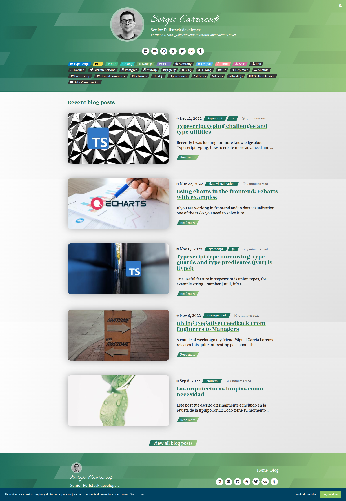

I started to write blog posts :astro-ref[around 2010]{path="blog/2010/usabilidad-notificaciones-en-el-titulo-de-la-pagina"} first under the umbrella of my company Opsou, later in 2018 I felt the need of writing and sharing my experience and learning during the :astro-ref[treatment of my cancer]{path="blog/2018/Cosas-que-he-aprendido-de-un-cancer"}, (:astro-ref[1]{path="blog/2018/Como-es-uno-de-mis-ciclos-de-quimioterapia"}, :astro-ref[2]{path="blog/2019/Accediendo-al-Sergas-y-al-eSaude-desde-linux"}, :astro-ref[3]{path="blog/2019/Accediendo-al-Sergas-y-al-eSaude-desde-linux"} and I love this one about the :astro-ref[day I was radioactive :radioactive:]{path="blog/2018/Una-prueba-radiologica-PET-CT-un-friki-Yo-y-un-contador-Geiger"}) and this kind of post has no fit in a corporate and technical blog, so I created this personal blog.

For that first iteration, I decided to use [Hexo](https://hexo.io/), a static site generator based on Node.js. This was a good choice at the time because it made it easy to write posts in Markdown and offered many themes and plugins to customize the blog.
In this period I change the visual theme a couple of times.


In 2022, I decided to try a new static site generator tool, [Hugo](https://gohugo.io/), which is written in Go, a language I like.



Hugo is nice and fast, but I don't like the template system. I think it is not very readable and intuitive. I think that can be solved by spending more time learning the template system, but for me, it is not worth it, so after changing the theme one more time, I decided to try something new.

# Astro

[Astro](https://astro.build/) is quite different from the previous tools, it's not a static site generator, it's a framework to build static sites. Hexo and Hugo provide all the features and behaviors you need to create a blog out of the box and there is a clear separation between the content and the theme, but Astro is a framework that allows you to do the same as Hexo and Hugo, but also allows you to create more complex sites, but requires more work to set up the blog.

## Problems, solutions and learnings

The first thing I did it was to move all the content from Hugo to Astro. The initial migration was very simple, I just copied the content from the `content` folder in Hugo to the `src/content` folder in Astro, with that I had all the content in the new blog with the basic features. 

### Enriched content 

But as my blog had some shortcuts, for example embedding YouTube videos, code sandbox iframes, Spotify, relationships between posts, etc... Those shortcodes was very coupled to Hugo and I needed to find a way to migrate that content too in Astro.

I didn't want just to create the same shortcuts for Astro and have the same issue in the future if I change the blog engine again.

I investigate the [markdown extended syntax](https://www.markdownguide.org/extended-syntax/) and as Astro uses [remark](https://github.com/remarkjs/remark) to parse the markdown. Remark has a lot of plugins to extend the markdown syntax, and one was very interesting and useful for me: [Remark directive](https://github.com/remarkjs/remark-directive). This plugin allows you to create custom directives in the markdown, for example:

```markdown
::youtube[]{id="oXgJ5cmOGQk"}\

:astro-ref[another post](/blog/2022/2022-12-31-2022-in-a-nutshell) # This is a ref to another post in the blog using the real path but it will use the slug

::spotify[]{id="3InlshVKFSitTRj76hUjyB"}

::iframe[]{src="https://codesandbox.io/embed/sergiocarracedo/vue-use-model-helpers?fontsize=14&hidenavigation=1&theme=dark" height="500px" width="100%"}

::asciinema[]{id="1234567"}

```
And create a plugin to replace this directive with a custom Astro component, in the frist case, a YouTube embed component is very simple: 

```js
/**
 * Remark plugin to replace ::youtube[DESCRIPTION](#YOUTUBEID): with a custom YouTube embed Astro component.
 */
export function remarkDirectiveYoutube() {
  return (tree, file) => {
    visit(tree, ['textDirective', 'leafDirective', 'containerDirective'], (node) => {
      if (node.name !== 'youtube') {
        return
 }

      const data = node.data || (node.data = {})
      const attributes = node.attributes || {}
      const id = attributes.id


      if (node.type === 'textDirective') {
        file.fail(
          'Unexpected `:youtube` text directive, use two colons for a leaf directive',
          node
 )
 }

      if (!id) {
        file.fail('Unexpected missing `id` on `youtube` directive', node)
 }

      node.type = 'mdxJsxFlowElement';
      node.name = 'YoutubeEmbed';
      node.attributes = [
 { type: 'mdxJsxAttribute', name: 'id', value: id }
 ];
      node.children = [];
 });
 }
}
```

> You can check the other directives I created [here](https://github.com/sergiocarracedo/blog/tree/main/src/remark-plugins)


### Migrating the shortcuts in the content

This was the easy part of the shortcuts migration, the boring and hard part was to migrate the uses, find them, and change the code. For this, I used GitHub co-pilot in agent mode with a prompt like this:

```Find all the uses of  in the markdown files in `content/blog`and replace it with ::youtube[]{id="XXXXX"}```

It worked but the AI forgot some use cases, so I need to ask again `Please review all the content again to be sure all the shortcodes were migrated` and it found the missing ones and migrated them.

I also used the AI to migrate the frontmatter format of all posts as there are things that are not easy to do with regex, like removing the date prefix I had in some posts, `2020/12/01/my-post` to `my-post`


## Tailwind CSS

I am not a big fan of Tailwind, but I wanted to force myself to use it in a project I had all the control of. The previous theme I used in Hugo was based on scss in order to have reusability and modularity, but Astro is based on components rather than HTML fragments, this makes it easy to delegate the reusability in the components instead of the CSS making Tailwind a good choice for this case.

I still want to have some utility classes, so I created a custom Tailwind config file to add some utility classes I use in the blog, like `link`, `background`, etc... and some custom colors.


# Conclusion

I am very happy with the result, I have a blog that is easy to maintain and flexible enough to add new features in the future mainly visual.
I hope you like it, and if you find any issues or have any suggestions, please let me know.


