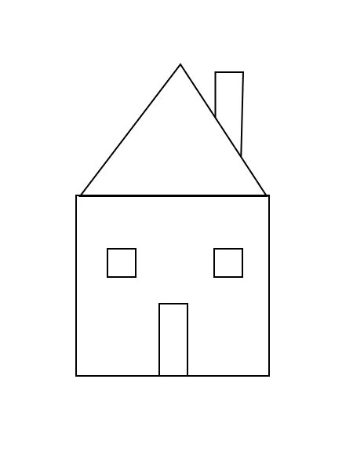
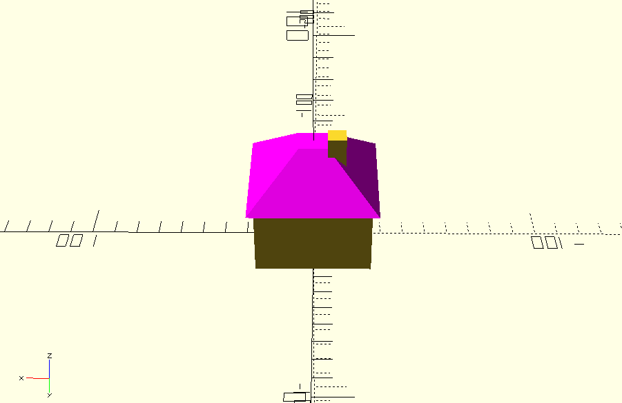

Cuando te conviertes en propietario de una impresora 3D, lo primero a lo que te enfrentas es a entender las herramientas que necesitas para imprimir (por ejemplo, Cura), además de conceptos como bed leveling, tipos de filamento, nozzle temperature, infill, raft, supports, etc.

El siguiente reto es encontrar modelos para imprimir. Probablemente empieces imprimiendo modelos descargados de internet, de repositorios como [Thingiverse](https://www.thingiverse.com/) o [Cults3D](https://cults3d.com/en). 

Es genial ver las cosas increíbles que la gente ha diseñado y compartido de forma gratuita, **pero tarde o temprano querrás diseñar tus propios modelos**, y ahí es donde empieza la parte compleja.

Diseñar modelos 3D no es trivial si no eres un diseñador 3D; necesitas aprender a usar software CAD 3D como Fusion360, Tinkercad, FreeCAD, Blender, etc. 

Cada de estas herramientas tiene una curva de aprendizaje pronunciada, y dominarlas requiere tiempo y esfuerzo. Incluso una tarea pequeña, como hacer una modificación menor a un modelo existente, puede ser un desafío si no estás familiarizado con la herramienta.

Pero hay otra forma de diseñar modelos 3D sin usar las herramientas CAD tradicionales, y es [OpenSCAD](https://openscad.org/), una herramienta de modelado 3D basada en texto donde defines tus modelos mediante código.

> Esto me recuerda mucho al [lenguaje de programación Logo](https://en.wikipedia.org/wiki/Logo_(programming_language)), donde controlas una tortuga con comandos para dibujar formas. OpenSCAD es similar pero en 3D.

Como esta herramienta se basa en código, y una de las cosas en las que los LLMs son buenos es generando código, puedes aprovechar los LLMs para generar código de OpenSCAD. No necesitas saber nada sobre modelado 3D, solo describe lo que quieres crear en lenguaje natural y el LLM generará el código de OpenSCAD por ti.

Por ejemplo, usé GitHub Copilot para generar un modelo de una casa, con el siguiente prompt:

```
I need an OpenSCAD model of a 3D home, based on the image provided, please infer the volume. The house is like a cube and the roof is a hipped roof.
The model should fit in 5x5cm
```


(style: max-width: 150px;)

(Sí, mis habilidades de dibujo no son las mejores :) )

Y solo con el prompt inicial, el modelo generado se ve así:




Puedes descargar el código de OpenSCAD [aquí](./demo.scad).

¿Increíble, verdad?

## Mejorando la experiencia con MCP

Esta forma es increíble, pero requiere usar la página del LLM para generar el código, o iterarlo, y luego copiar y pegar el código en OpenSCAD, lo cual no es el flujo de trabajo más conveniente.

Existen múltiples servidores MCP de código abierto que proporcionan una mejor integración entre los LLMs y OpenSCAD u otras herramientas como FreeCAD:

- Para OpenSCAD, puedes usar [OpenSCAD MCP Server](https://github.com/quellant/openscad-mcp)

Si usas VSCode, solo necesitas instalar el servidor MCP editando el archivo `mcp.json` en tu espacio de trabajo y añadiendo la siguiente entrada bajo `servers`:


```json
{
  "servers": {
    "openscad": {
      "command": "[PATH TO YOUR uv EXECUTABLE]",
      "args": [
        "run",
        "--with",
        "git+https://github.com/quellant/openscad-mcp.git",
        "openscad-mcp"
      ],
      "env": {
        "OPENSCAD_PATH": "/usr/bin/openscad"
      }
    },
    ....
  },
  ...
}
```

> Recuerda que estás ejecutando código de internet, así que revisa el código antes de ejecutarlo. O descarga el código y ejecútalo localmente.

Luego, haciendo clic en el icono "Configure tools" del chat, habilita el MCP de OpenSCAD si aún no está habilitado.

Esto te permitirá interactuar con OpenSCAD directamente desde VSCode, generando código, modificando código existente e incluso renderizando el modelo.


## Resumen

Usé este enfoque para diseñar un llavero paramétrico en 15 minutos (hice múltiples iteraciones para lograr exactamente lo que quería); de lo contrario, me habría llevado horas ajustar el modelo usando herramientas CAD tradicionales.
