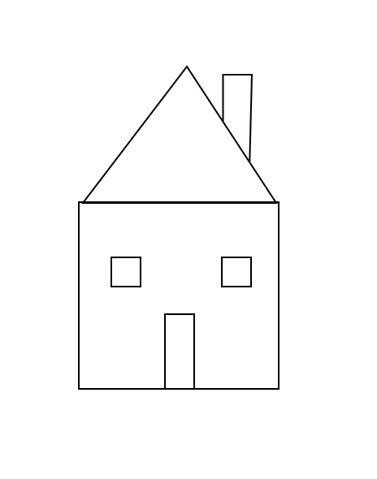
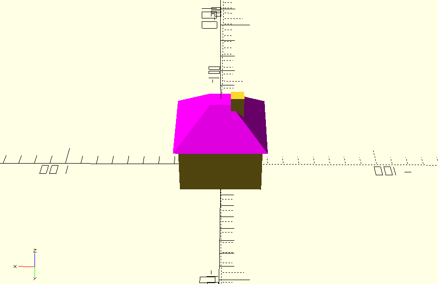

When you become an owner of a 3D printer, the first thing you face is to understand the tools you need to print (e.g. Cura), also concepts like bed leveling, filament types, nozzle temperature, infill, raft, supports, etc.

The next challenge is to find models to print. Probably you start printing models downloaded from the internet, from repositories like [Thingiverse](https://www.thingiverse.com/) or [Cults3D](https://cults3d.com/en). 

It's nice to see the amazing things people have designed and shared for free, **but sooner or later you want to design your own models**, and the complex part begins.

Designing 3D models is not trivial if you are not a 3D designer, you need to learn how to use 3D CAD software like Fusion360, Tinkercad, FreeCAD, Blender, etc. 

Each of these tools has a steep learning curve, and mastering them takes time and effort. Even a small task like doing a small modification to an existing model can be challenging if you are not familiar with the tool.

But there is another way to design 3D models without using the traditional CAD tools, and that is [OpenSCAD](https://openscad.org/), a text-based 3D modeling tool where you define your models using code.

> This reminds me a lot of the [Logo programming language](https://en.wikipedia.org/wiki/Logo_(programming_language)) where you control a turtle with commands to draw shapes. OpenSCAD is similar but in 3D.

As this tool is code-based, and one thing LLMs are good at is generating code, you can leverage LLMs to generate OpenSCAD code. You don't need to know anything about 3D modeling, just describe what you want to create in natural language and the LLM will generate the OpenSCAD code for you.

For example, I used GitHub Copilot to generate a house model, with the following prompt:

```
I need an OpenSCAD model of a 3D home, based on the image provided, please infer the volume. The house is like a cube and the roof is a hipped roof.
The model should fit in 5x5cm
```


(style: max-width: 150px;)

(Yes, my drawing skills are not the best :) )

And just with the initial prompt, the model generated looks like this:




You can download the OpenSCAD code [here](./demo.scad).

Amazing right?

## Improving the experience with MCP

This way is amazing, but it requires using the LLM page to generate the code, or iterate it, and then copy and paste the code into OpenSCAD, which is not the most convenient workflow.

There are multiple open-source MCP servers that provide a better integration between LLMs and OpenSCAD or other tools like FreeCAD:

- For OpenSCAD, you can use [OpenSCAD MCP Server](https://github.com/quellant/openscad-mcp)

If you use VSCode, you only need to install the MCP server by editing the `mcp.json` in your workspace and adding the following entry under `servers`:


```json
{
  "servers": {
    "openscad": {
      "command": "[PATH TO YOUR uv EXECUTABLE]",
      "args": [
        "run",
        "--with",
        "git+https://github.com/quellant/openscad-mcp.git",
        "openscad-mcp"
      ],
      "env": {
        "OPENSCAD_PATH": "/usr/bin/openscad"
      }
    },
    ....
  },
  ...
}
```

> Remember you are executing code from the internet, so review the code before running it. Or download the code and run it locally.

Then by clicking on the chat "Configure tools" icon, enable the OpenSCAD MCP if it's not already enabled.

This will allow you to interact with OpenSCAD directly from VSCode, generating code, modifying existing code, and even rendering the model.


## Summary

I used this approach to design a parametric keychain in 15m (I did multiple iterations to achieve exactly what I wanted), otherwise it would take me hours to adjust the model using traditional CAD tools.