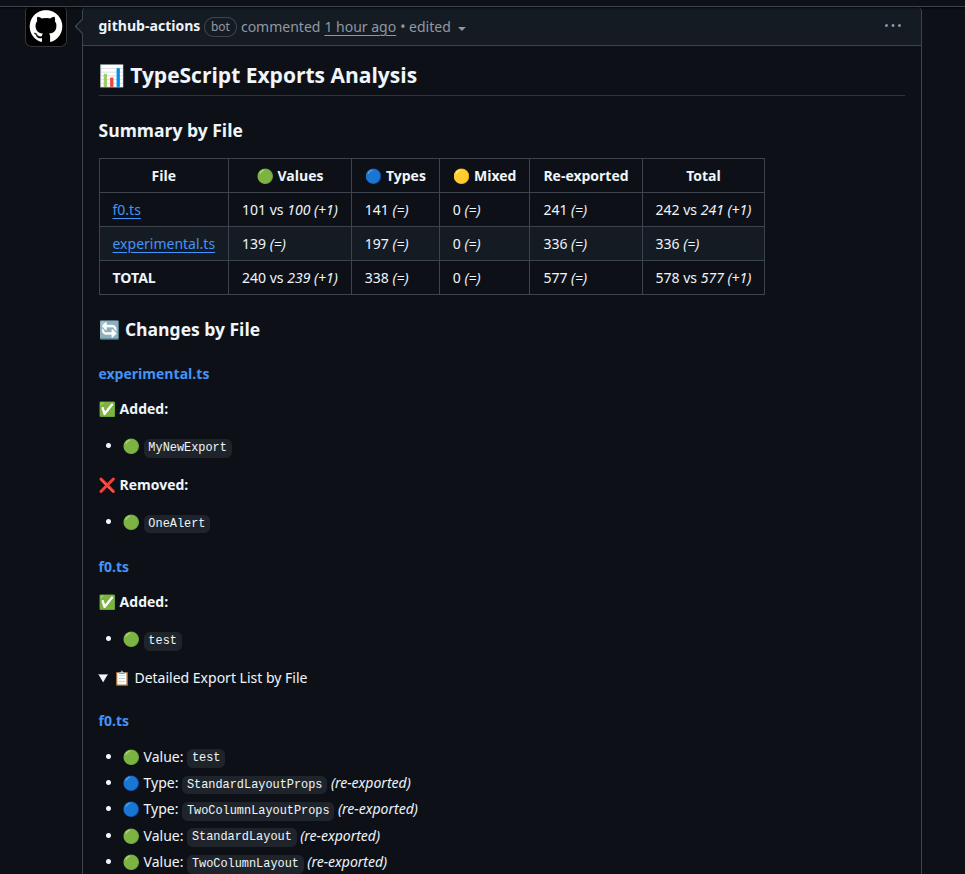

¿Alguna vez has pensado qué elementos (clases, funciones, variables, tipos, etc.) se exportan desde un archivo TypeScript en tu proyecto?

Normalmente, esto no es algo de lo que debas preocuparte en una aplicación, ya que si falta una exportación o es incorrecta, el IDE, el linter o el compilador de TypeScript lo detectarán. Sin embargo, al crear librerías es muy importante tener una visión clara de qué se está exportando, ya que estas exportaciones definen la API pública de la librería.

Sin el feedback que proporcionan el IDE, el linter o el compilador, es fácil cometer errores como olvidar exportar un elemento que debería formar parte de la API pública, o exportar algo que debería mantenerse privado, y el ciclo para solucionar eso implica crear una nueva versión, lo cual no es ideal.

Por eso, he creado una pequeña herramienta de CLI llamada [`ts-exported-info`](https://www.npmjs.com/package/ts-exported-info) que analiza archivos TypeScript y proporciona información sobre los elementos exportados.

## Cómo funciona
La herramienta utiliza la TypeScript Compiler API para parsear y analizar archivos TypeScript. Se ejecuta como un comando de CLI donde puedes proporcionar una o más rutas de archivos o patrones glob para especificar los archivos a analizar y te devolverá los resultados por consola o en formato JSON.

Puedes ejecutarla sin instalarla de esta manera:

```bash
npx ts-exported-info "src/lib/**/*.ts"
```

O puedes instalarla como una dependencia global:

```bash
pnpm install -g ts-exported-info
// and run it as
ts-exported-info "src/lib/**/*.ts"
```

El resultado se verá así:

::asciinema[]{id="bRnDCTnCeQt08KyQR3rHMEoLZ"}

Puedes ver que para cada archivo analizado, la herramienta proporciona una lista de elementos exportados, incluyendo sus nombres y tipos (value, type o mixed).

Puedes filtrar la salida para mostrar solo tipos específicos de exportaciones usando la opción `--kind`:

```bash
ts-exported-info "src/lib/**/*.ts" --kind type
``` 

Y también puedes obtener la salida en formato JSON, lo cual es útil para un procesamiento posterior o integración con otras herramientas, usando la opción `--json`:

```bash
ts-exported-info "src/lib/**/*.ts" --json
``` 

::asciinema[]{id="mR8jWWD39OCOM0HNO8cKFhdPG"}


Como puedes ver, esta herramienta es muy sencilla de usar y puede ser de gran ayuda al desarrollar librerías de TypeScript, asegurando que tu API pública esté bien definida y sea precisa. https://www.npmjs.com/package/ts-exported-info

> Para los ejemplos, ejecuté la herramienta contra el [sistema de diseño f0 de Factorial](https://github.com/factorialco/f0), que es un proyecto de código abierto lo suficientemente grande como para obtener resultados agradables y realistas.

## Yendo más allá: crear una GitHub Action para comprobar las exportaciones en las PRs

Para aprovechar aún más esta herramienta, he creado una GitHub Action que se apoya en ella para comprobar los elementos exportados en cada Pull Request (PR) para asegurar que la API pública de la librería no cambie accidentalmente, o que todos los elementos necesarios estén exportados. [ts-exported-info-action](https://github.com/sergiocarracedo/ts-exported-info-action)

Esta acción se puede integrar fácilmente en tu pipeline de CI/CD y se ejecutará automáticamente en cada PR, proporcionando feedback directamente en los comentarios de la PR. 

### Ejemplo de workflow de GitHub Action
```yaml
name: Analyze Exports

on:
  pull_request:
    types: [opened, synchronize, reopened]

jobs:
  analyze-exports:
    runs-on: ubuntu-latest
    steps:
      - uses: actions/checkout@v4
        with:
          fetch-depth: 0  # Important: fetch full history for comparison

      - uses: actions/setup-node@v4
        with:
          node-version: '20'

      - name: Analyze TypeScript Exports
        uses: sergiocarracedo/ts-export-info-action@v1
        with:
          path: src/**/*.ts
          detailed: false  # Set to true for detailed export list
          compare: false # Set to true to compare against base
          list-changes: false # Set to true to list the changes (needs compare true)
          github-token: ${{ secrets.GITHUB_TOKEN }}
```

Este workflow generará (y actualizará si ya existe) un comentario en la PR con la información de los elementos exportados, como:



Puedes personalizar los inputs de la acción para adaptarlos a tus necesidades, como especificar las rutas de los archivos a analizar y si deseas proporcionar listas detalladas de exportación o comparar con la rama base.

## Conclusión
 - ts-exported-info: https://www.npmjs.com/package/ts-exported-info
 - ts-exported-info-action: https://github.com/sergiocarracedo/ts-exported-info-action


Como de costumbre, el feedback es bienvenido; no dudes en abrir issues o PRs en los repositorios si tienes sugerencias o encuentras algún error.
