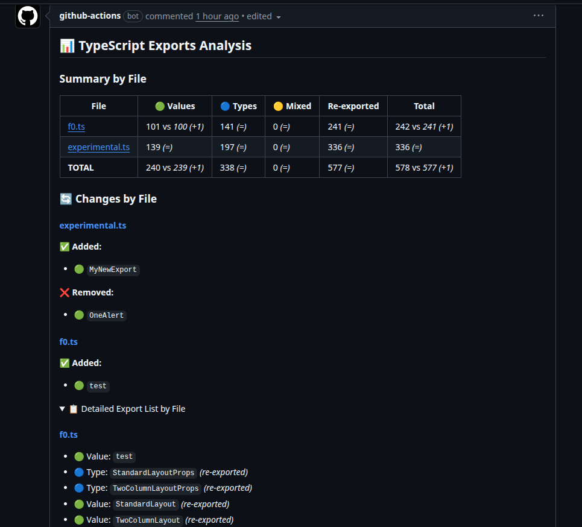

Have you ever thought about what items (classes, functions, variables, types, etc) are exported from a TypeScript file in your p  roject?

This is not typically something you need to worry about in an application, as if an export is missing or incorrect, the IDE, the linter or the TypeScript compiler will catch it. However, when building libraries is very important to have a clear view of what is being exported, as these exports define the public API of the library.

Without the feedback that the IDE, linter or compiler provide, it is easy to make mistakes like forgetting to export an item that should be part of the public API, or exporting something that should be kept private and the iteration to fix that involves to create a new release which is not ideal.

Because of that, I created a small CLI tool called [`ts-exported-info`](https://www.npmjs.com/package/ts-exported-info) that analyzes TypeScript files and provides information about the exported items.

## How it works
The tool uses the TypeScript Compiler API to parse and analyze TypeScript files. It runs as a CLI command where you can provide one or more file paths or glob patterns to specify the files to analyze and will return you the results via console or in JSON format

You can run it without install it like this:

```bash
npx ts-exported-info "src/lib/**/*.ts"
```

Or you can install it as a global dependency:

```bash
pnpm install -g ts-exported-info
// and run it as
ts-exported-info "src/lib/**/*.ts"
```

The output will look like this:

::asciinema[]{id="bRnDCTnCeQt08KyQR3rHMEoLZ"}

You can see that for each file analyzed, the tool provides a list of exported items, including their names and kinds (value, type or mixed).

You can filter the output to show only specific kinds of exports using the `--kind` option:

```bash
ts-exported-info "src/lib/**/*.ts" --kind type
``` 

And also you can get the output in JSON format, which is useful for further processing or integration with other tools, using the `--json` option:

```bash
ts-exported-info "src/lib/**/*.ts" --json
``` 

::asciinema[]{id="mR8jWWD39OCOM0HNO8cKFhdPG"}


As you can see, this tool is very simple to use and can be a great help when developing TypeScript libraries, ensuring that your public API is well-defined and accurate. https://www.npmjs.com/package/ts-exported-info

## Going further create a GitHub Action to check exports on PRs

To take advantage of this tool even more, I created a GitHub Action that relies on this tool to check the exported items on every Pull Request (PR) to ensure that the public API of the library is not accidentally changed, or that all necessary items are exported. [ts-exported-info-action](https://github.com/sergiocarracedo/ts-exported-info-action)

This action can be easily integrated into your CI/CD pipeline, and it will run automatically on every PR, providing feedback directly in the PR comments. 

### Example GitHub Action workflow
```yaml
name: Analyze Exports

on:
  pull_request:
    types: [opened, synchronize, reopened]

jobs:
  analyze-exports:
    runs-on: ubuntu-latest
    steps:
      - uses: actions/checkout@v4
        with:
          fetch-depth: 0  # Important: fetch full history for comparison

      - uses: actions/setup-node@v4
        with:
          node-version: '20'

      - name: Analyze TypeScript Exports
        uses: sergiocarracedo/ts-export-info-action@v1
        with:
          path: src/**/*.ts
          detailed: false  # Set to true for detailed export list
          compare: false # Set to true to compare against base
          list-changes: false # Set to true to list the changes (needs compare true)
          github-token: ${{ secrets.GITHUB_TOKEN }}
```

This workflow will generate (and update if exists) a comment in the PR with the exported items information, like:



You can customize the action inputs to fit your needs, such as specifying the file paths to analyze and whether to provide detailed export lists or compare against the base branch.

## Conclusion
 - ts-exported-info: https://www.npmjs.com/package/ts-exported-info
 - ts-exported-info-action: https://github.com/sergiocarracedo/ts-exported-info-action


As usual, feedback is welcome, feel free to open issues or PRs in the repositories if you have suggestions or find any bugs.