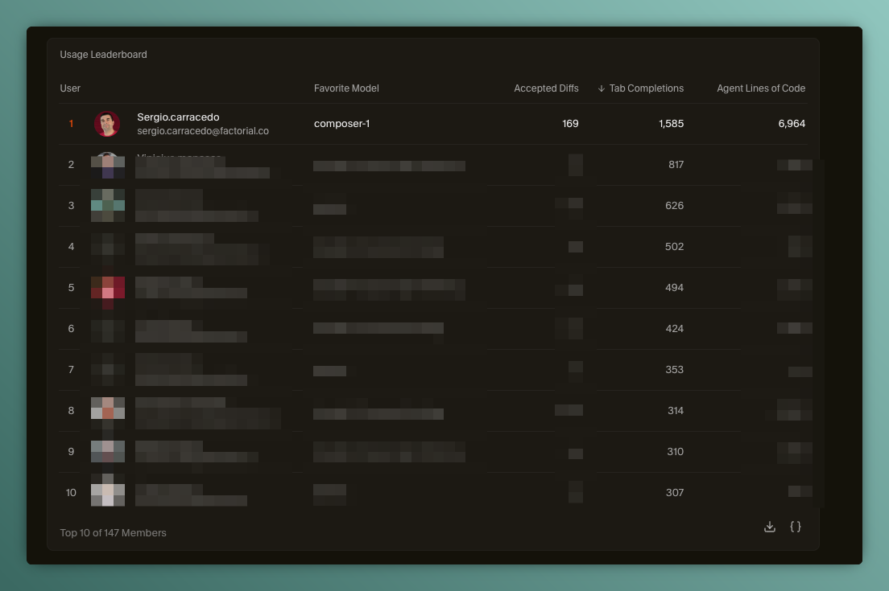
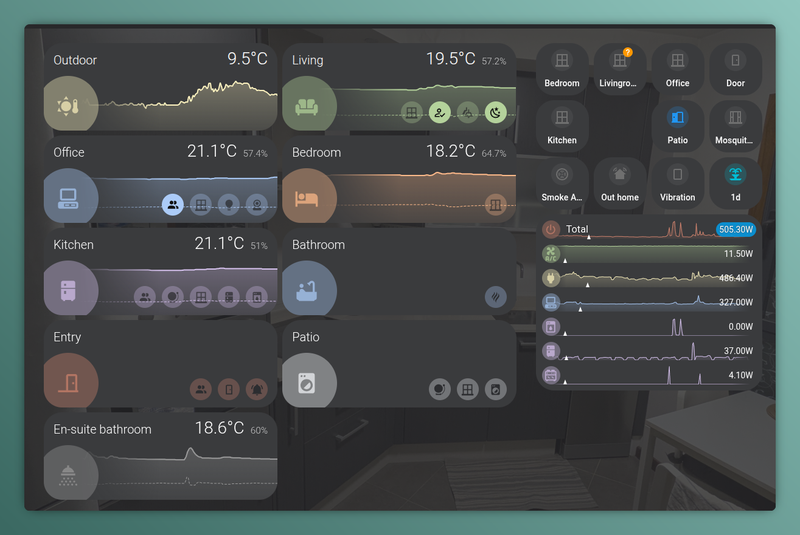
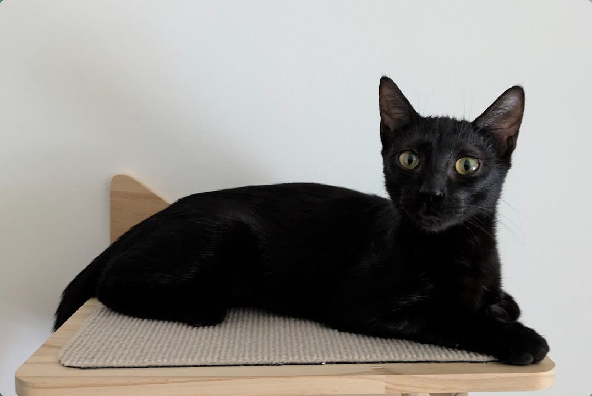
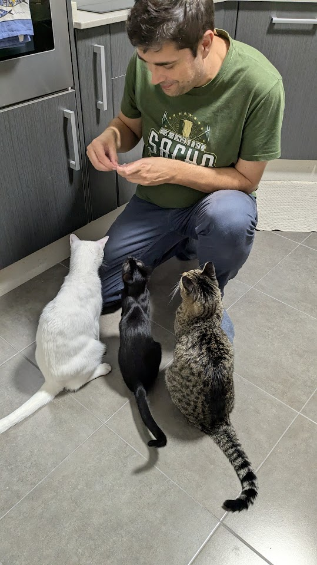

Otro año ha llegado a su fin y es hora de echar la vista atrás a lo que me trajo el 2025.

# Profesional

Este fue un año de cambios (otro más :disappointed_relieved:), ya que pasé de mi rol anterior en New Relic, un lugar donde "dejé" a grandes profesionales y buenas personas, a una nueva posición en Factorial como Staff Software Engineer en un área de especialización que realmente disfruto: Design Systems y librerías de componentes. Fue una gran oportunidad en una empresa grande que está creciendo rápido y tiene muchos retos que abordar en el espacio del frontend.

Personalmente fue un reto en el lado técnico, "cambié" mi querido Vue por React como framework principal, pero debo decir que tienen más similitudes que diferencias (y ahora que nadie nos oye, sigo prefiriendo Vue :stuck_out_tongue_closed_eyes:), y también en el lado cultural. 

Me uní al equipo de Foundations, que se encarga del [f0 design system](https://github.com/factorialco/f0) y de la librería de componentes que se utiliza en todos los productos de la compañía, y eso significa mucha responsabilidad y retos que afrontar, pero también una gran oportunidad para aprender y crecer como profesional, pero **fracasé**... 

:float-image[]{src="./failure.png" maxWidth="320px" float="right"}No fui capaz de completar todos los objetivos que me propuse a principios de año.

Es cierto que aprendí mucho y pude contribuir al equipo y a la empresa de manera significativa:

- manteniendo y mejorando el componente f0 data collection: https://ds.factorial.dev/?path=/docs/components-data-collection--documentation. Un componente core utilizado en muchas páginas de la compañía con un esfuerzo mínimo por parte del desarrollador, definiendo patrones de data fetching, extendidos más tarde a otros componentes.
- ayudando a mejorar la documentación técnica del design system y la librería de componentes, facilitando que los desarrolladores los usen y contribuyan a ellos.
- colaborando con otros equipos para asegurar la consistencia y calidad en todos los productos de la empresa.
- haciendo mentoría a desarrolladores junior y ayudándoles a crecer en sus carreras.

Pero también me enfrenté a algunos retos que no pude superar, y eso me hizo sentir frustrado y que no estaba aportando el valor esperado (por mí mismo).

Ahora es el momento de reflexionar sobre qué puedo hacer mejor el próximo año y cómo puedo seguir creciendo como profesional y contribuir al éxito de la empresa.

La parte más positiva es que encontré a gente increíble en el equipo (en todos los sentidos, profesional y personal), personas realmente especiales que me están dejando una huella duradera.

Y como curiosidad, descubrí que soy el desarrollador de mi empresa que más utiliza el tab completion en Cursor, por un amplio margen:

# Comunidad

Este año, mi implicación en las comunidades se mantuvo más o menos estable; ayudé a organizar una [conferencia de IA](https://aicollectiveconf.com/) en Barcelona, pero se retrasó a 2026.

# Entradas y Charlas

Este año publiqué **15 entradas de blog**, continuando con mi compromiso de compartir conocimientos y experiencias. Algunos de los aspectos más destacados incluyen:

¡Celebré **15 años blogueando**! desde mi primer post en 2010.

Escribí sobre una variedad de temas, incluyendo:

- **IA y Agentes**:
  - Una :astro-ref[introducción detallada al Bee Agent Framework]{path="blog/2025/2025-01-27-ai-agents-i-am-a-bee"}, explorando cómo construir flujos de trabajo multi-agente con TypeScript.
  - :astro-ref[Uso de LLMs para diseñar objetos físicos con OpenSCAD]{path="blog/2025/2025-11-16-designing-physical-items-with-llm"}.

- **Sistemas de Diseño**: 
  - Reflexiones sobre :astro-ref[equipos de sistemas de diseño]{path="blog/2025/2025-07-30-adesign-system-team"}: sus objetivos, dolores y éxitos basados en la experiencia del mundo real; un artículo que también fue publicado en [Dzone](https://dzone.com/articles/design-system-team).
  - :astro-ref[Presenté el concepto de input-field]{path="blog/2025/2024-12-19-input-fields"} para una mejor reutilización de componentes de formulario.

- **Herramientas de Desarrollo**:
  - Creé y compartí herramientas como :astro-ref[ts-exported-info]{path="blog/2025/2025-12-20-ts-exported-info"} para analizar las exportaciones de TypeScript.
  - Y exploré :astro-ref[Release Please]{path="blog/2025/2025-06-23-release-please"} para automatizar la gestión de versiones.
  - :astro-ref[Corepack]{path="blog/2025/2025-01-25-corepack"} para gestionar gestores de paquetes.
  - :astro-ref[git-publish]{path="blog/2025/2025-03-22-git-publish"} para lanzamientos efímeros de paquetes npm.

- **Exploré patrones de React** como el 
  - :astro-ref[hook useControllable]{path="blog/2025/2025-12-14-use-controllable"} y el :astro-ref[componente Await]{path="blog/2025/2025-07-13-await-component-in-react"}.

- **Home Assistant**:
  - :astro-ref[Creación de tarjetas personalizadas para Home Assistant]{path="blog/2025/2025-05-01-ha-custom-cards"} con Lit Elements.

- **Retos de UI/UX**:
  - Aplicación de los :astro-ref[principios poka-yokes (a prueba de errores)]{path="blog/2025/2025-11-09-poka-yokes"} al desarrollo de software.
  - :astro-ref[selección en datos fragmentados (chunked data)]{path="blog/2025/2025-07-06-selection-on-chunked-data"}.

:astro-ref[Migré este blog de Hugo a Astro]{path="blog/2025/2025-06-23-migrating-blog-to-astro"}, creando directivas de remark personalizadas por el camino.

En comparación con años anteriores, 15 posts sitúan al 2025 como un año sólido de creación de contenido, manteniendo una cadencia de publicación constante, especialmente durante los meses de verano.

También di algunas charlas internas en la empresa este año.

# Código abierto (Open source)

Este año creé 2 proyectos de código abierto:

- **[Home Assistant Custom Cards](https://github.com/sergiocarracedo/sc-custom-cards)**, una colección de tarjetas personalizadas para Home Assistant (construidas con Lit Elements) para renderizar múltiple información de una zona en la misma tarjeta. 

- **[ts-exported-info](https://github.com/sergiocarracedo/ts-exported-info)**, una herramienta de CLI para analizar las exportaciones de archivos TypeScript utilizando la API del compilador de TypeScript. Es particularmente útil para autores de librerías para verificar su superficie de API pública y detectar errores de exportación antes de los lanzamientos.

Y bifurqué (forked) y contribuí a otros proyectos:

- **[git-publish](https://github.com/sergiocarracedo/git-publish)**, una herramienta de CLI para automatizar el proceso de publicación de paquetes npm directamente desde etiquetas de git. Añadí la funcionalidad para usarlo en monorepos.

# Personal / Aprendizajes

Las actualizaciones personales más relevantes de 2025 estuvieron relacionadas con Ada, un nuevo miembro de la familia que se unió a nosotros en octubre. La adoptamos de un refugio de animales local y ha sido una incorporación maravillosa a nuestras vidas y también a la vida de Weber y Tesla.

(style: max-width: 50%; )

(style: max-width: 50%;)

# Música

En 2025, como de costumbre, añadí mucha música a mis listas de reproducción favoritas y descubrí nuevas canciones y artistas. Aquí están los favoritos que añadí este año:

::spotify[]{type="playlist" id="08DEaVZYIQkCFbbJEHfqZ8" width="100%" height="352"}

Descubrí algunos artistas nuevos que me gustaron mucho:

- Ghost: Tenía algunas canciones suyas en mis listas, pero realmente los descubrí este año, y me gustó mucho su estilo, una mezcla de rock, metal y pop con un toque teatral. "Spillways" es realmente increíble, y también me pareció muy bueno el remix de Carpenter Brut de "Dance Macabre".

::youtube[]{id="t8FHSNIc3wI"}

- Babymonster: Una banda de chicas de k-pop que descubrí este año, a través de [The First take](https://www.youtube.com/watch?v=06mCrMgv0zY)

And to close the year I discovered a musical style: "Cinematic covers", que son versiones de canciones famosas con un estilo cinematográfico/orquestal. Es música perfecta para trabajar.

::spotify[]{type="playlist" id="4vfa4rbEvFyWidfReIgd4R" width="100%" height="352"}

# Mirando hacia el 2026

Para 2026, mi principal objetivo es seguir creciendo como profesional y como ser humano, estando cerca de mi familia (que incluye a mis gatos), amigos y cualquier persona que me importe.

También quiero aprender de las lecciones de 2025, de los fracasos y los éxitos, y utilizarlos para mejorarme a mí mismo y a mi trabajo.

> 🎉 ¡¡Feliz 2026!! 🎉
