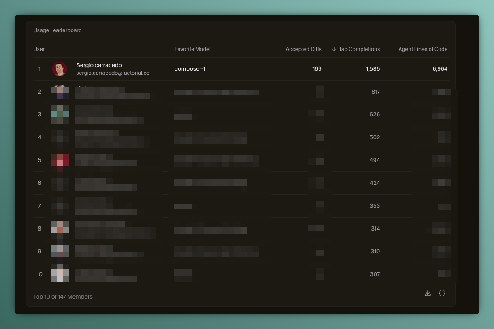
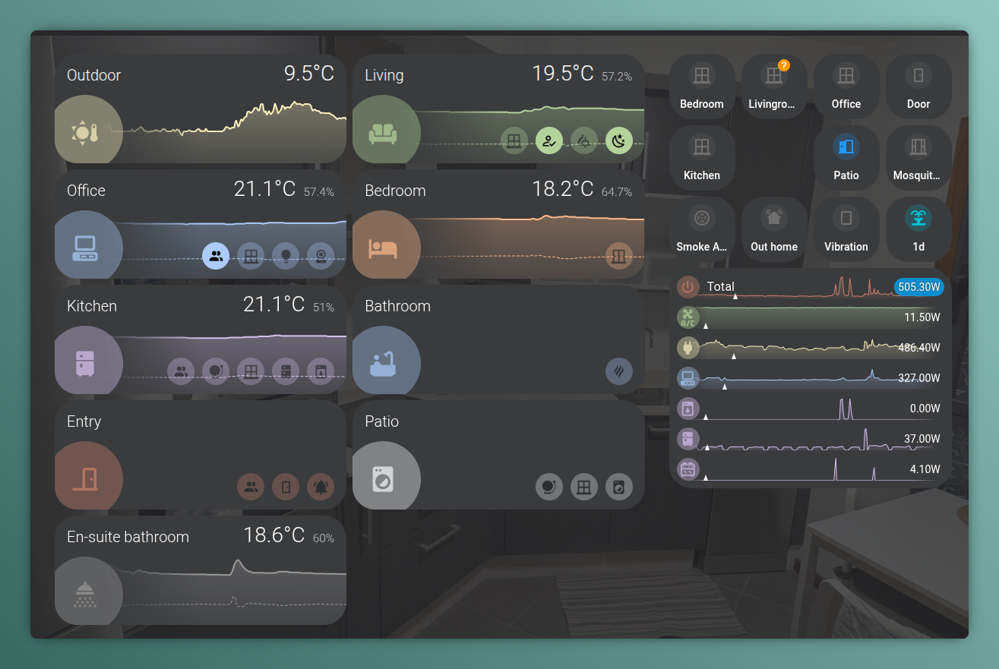
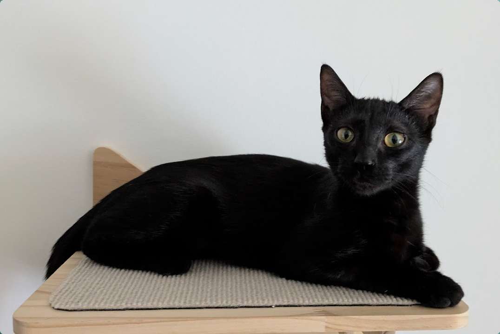
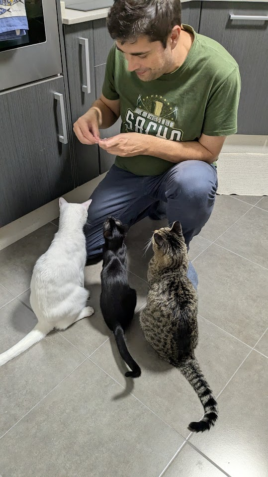

Another year has come to an end, and it's time to look back at what 2025 brought me.

# Professional

This was a year of change (another one :disappointed_relieved:), as I moved from my previous role at New Relic, a place where I "left" big professionals and nice people, to a new position at Factorial as a Staff Software Engineer in an expertise area I really enjoy: Design Systems and Component Libraries. It was a great opportunity in a big company that is growing fast and has a lot of challenges to tackle in the frontend space.

It was personally a challenge in the technical side, I "changed" my beloved Vue for React as a main framework, but I should say that they have more similarities than differences (and now no one can hear us, I still prefer Vue :stuck_out_tongue_closed_eyes:), and also in the cultural side. 

I joined the Foundations team, which is in charge of the [f0 design system](https://github.com/factorialco/f0) and component library that is used across all the company products, and that means a lot of responsibility and challenges to tackle, but also a great opportunity to learn and grow as a professional, but **I failed**... 

:float-image[]{src="./failure.png" maxWidth="320px" float="right"}I was not able to complete all the goals I set for myself at the beginning of the year.

It is true that I learned a lot, and I was able to contribute to the team and the company in a meaningful way:

- maintaining and improving the f0 data collection component: https://ds.factorial.dev/?path=/docs/components-data-collection--documentation. A core component used in many pages across the company with minimal effort from the developer side, defining patterns of data fetching, extended later to other components.
- helping to improve the technical documentation of the design system and component library, making it easier for developers to use and contribute to it.
- collaborating with other teams to ensure consistency and quality across the company's products.
- mentoring junior developers and helping them to grow in their careers.

But I also faced some challenges that I was not able to overcome, and that made me feel frustrated and that I was not providing the expected (by myself) value.

Now it's time to reflect on what I can do better in the next year, and how I can continue to grow as a professional and contribute to the success of the company.

The most positive part is that I found awesome people in the team (in all senses, professional and personal), really special people who are leaving a lasting impression on me.

And as a curiosity, I discovered that I'm the developer in my company who uses tab completion on Cursor the most, by a large margin:

# Community

This year, my involvement in the communities remained more or less steady, I helped to organize an [AI conference](https://aicollectiveconf.com/) in Barcelona, but it was delayed to 2026.

# Post and Talks

This year I published **15 blog posts**, continuing my commitment to sharing knowledge and experiences. Some of the highlights include:

I celebrated **15 years of blogging**! since my first post in 2010

I wrote about a variety of topics, including:

- **AI and Agents**:
  - An in-depth :astro-ref[introduction to the Bee Agent Framework]{path="blog/2025/2025-01-27-ai-agents-i-am-a-bee"}, exploring how to build multi-agent workflows with TypeScript
  - :astro-ref[Using LLMs to design physical items with OpenSCAD]{path="blog/2025/2025-11-16-designing-physical-items-with-llm"}

- **Design Systems**: 
  - Reflections on :astro-ref[design system teams]{path="blog/2025/2025-07-30-adesign-system-team"} - their goals, pains, and successes based on real-world experience, an article was published also in [Dzone](https://dzone.com/articles/design-system-team)
  - :astro-ref[Introduced the input-field concept]{path="blog/2025/2024-12-19-input-fields"} for better form component reusability

- **Developer Tooling**:
  - Created and shared tools like :astro-ref[ts-exported-info]{path="blog/2025/2025-12-20-ts-exported-info"} for analyzing TypeScript exports, 
  - and explored :astro-ref[Release Please]{path="blog/2025/2025-06-23-release-please"} for automating version management
  - :astro-ref[Corepack]{path="blog/2025/2025-01-25-corepack"} for managing package managers
  - :astro-ref[git-publish]{path="blog/2025/2025-03-22-git-publish"} for ephemeral npm package releases

- **Explored React patterns** like the 
  - :astro-ref[useControllable hook]{path="blog/2025/2025-12-14-use-controllable"} and :astro-ref[Await component]{path="blog/2025/2025-07-13-await-component-in-react"}

- **Home Assistant**:
  - :astro-ref[Creating custom cards for Home Assistant]{path="blog/2025/2025-05-01-ha-custom-cards"} with Lit Elements

- **UI/UX Challenges**:
  - Applying :astro-ref[poka-yokes (mistake-proofing) principles]{path="blog/2025/2025-11-09-poka-yokes"} to software development
  - :astro-ref[selection on chunked data]{path="blog/2025/2025-07-06-selection-on-chunked-data"}

:astro-ref[I migrated this blog from Hugo to Astro]{path="blog/2025/2025-06-23-migrating-blog-to-astro"}, creating custom remark directives along the way

Compared to previous years, 15 posts puts 2025 as a solid year of content creation, maintaining a consistent publishing cadence especially through the summer months.

I also gave some internal company talks this year

# Open source

This year I created 2 open source projects 

- **[Home Assistant Custom Cards](https://github.com/sergiocarracedo/sc-custom-cards)**, a collection of custom cards for Home Assistant (built with Lit Elements) to render multiple information from a zone in the same card. 

- **[ts-exported-info](https://github.com/sergiocarracedo/ts-exported-info)**, a CLI tool for analyzing TypeScript file exports using the TypeScript Compiler API. It's particularly useful for library authors to verify their public API surface and catch export mistakes before releases.

And forked and contributed to other projects:

- **[git-publish](https://github.com/sergiocarracedo/git-publish)**, a CLI tool to automate the process of publishing npm packages directly from git tags. I added the feature to use it in monorepos.

# Personal / Learnings

The most relevant personal updates of 2025 were related to Ada, a new member of the family, who joined us in October. We adopted her from a local animal shelter, and she has been a wonderful addition to our lives and to Weber and Tesla's life too.

(style: max-width: 50%; )

(style: max-width: 50%;)

# Music

In 2025 as usual I added a lot of music to my favourite playlists, and discovered new songs and artists. Here are the favourites I added this year:

::spotify[]{type="playlist" id="08DEaVZYIQkCFbbJEHfqZ8" width="100%" height="352"}

I discovered some new artists that I really liked:

- Ghost: I had some songs from them in my playlists but I really discovered them this year, and I really liked their style, a mix of rock, metal and pop with a theatrical touch. "Spillways" is really amazing, and I also found the remix by Carpenter Brut of "Dance Macabre" really good.

::youtube[]{id="t8FHSNIc3wI"}

- Babymonster: A k-pop girl band that I discovered this year, via [The First take](https://www.youtube.com/watch?v=06mCrMgv0zY)

And to close the year I discovered a musical style: "Cinematic covers", which are covers of famous songs with a cinematic/orchestral style. It is perfect music to work with

::spotify[]{type="playlist" id="4vfa4rbEvFyWidfReIgd4R" width="100%" height="352"}

# Looking forward to 2026

For 2026, my main goal is to continue growing as a professional and a human being, being close to my family (which includes my cats), friends and anyone I care about.

I also want to learn from the lessons of 2025, from the failures and the successes, and use them to improve myself and my work.

> 🎉 Happy 2026!! 🎉
