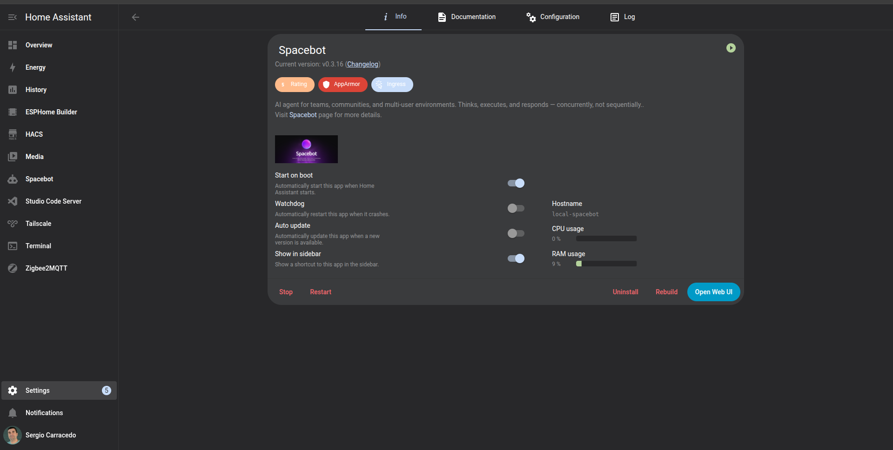

When I created the :astro-ref[gym AI-trainer agent]{path="blog/2026/2026-03-08-opencode-gym-agent"} using Opencode, I felt I needed to be able to interact with the agent from anywhere, and the natural next step was to use my phone. I explored different options, like [Kimaki](https://github.com/remorses/kimaki), a way to integrate Opencode inside Discord, but I didn't want to use my computer as a server. I wanted to use my Raspberry Pi, which is always on and has low power consumption, to run Opencode and Kimaki, but then I found a better option: [SpaceBot](https://spacebot.sh/).

# SpaceBot
 
Spacebot is an advanced AI agent manager (yes, plural), built in Rust and designed for multi-user platforms like Discord, Telegram, Slack, and more. It allows you to create, manage, and interact with multiple AI agents simultaneously.

Unlike standard chatbots or agents like OpenClaw that handle one request at a time, Spacebot is built to:

- **Handle Concurrency**: It can engage in dozens of conversations simultaneously across different channels without "blocking" or slowing down, using the concept of branches to manage different conversations or different requests within the same conversation.

- **Retain Memory**: It maintains a memory graph, can learn from interactions, or you can ingest information into it and use that information in future interactions.

- **Task Execution**: It can execute tasks, like browsing the web, running code, or interacting with APIs, making it a powerful tool for automating complex workflows.

- **Schedule Tasks**: You can schedule tasks to run at specific times or intervals, allowing for automation of routine tasks. For example, ask it to send a summary of the news every morning at 8 a.m.

- **UI/Assistant**: Spacebot has a web UI where you can see and manage the agents, the workers, their interactions, the memory graph, configure the providers, the channels, and more. It also has a built-in AI assistant that can help you create agents, configure them, and more, just by asking it.

## Agents

Each agent in Spacebot can be customized with its own IDENTITY, SOUL, and ROLE, allowing you to create agents with different personalities. Each agent also has its own memory, workspace, and data, isolated from the others.

## Agents orchestration (hierarchy)

Despite other tools that can run agents, Spacebot is designed to run multiple agents at the same time and define a hierarchy among them, with a clear graph of interactions.

You can define the links between agents, and the direction of the information flow, allowing agents to delegate tasks to other agents, and receive the results back, creating a powerful orchestration of agents.

## An example

In my case, I have a main agent called "AmbrosIA", an agent specialized in controlling my home via Home Assistant called "Teixugo", an agent specialized in fitness called Gym AI Trainer, and a joke agent called "Grumpy Sergio", which is an even grumpier version of me that I use for fun.

I can interact with each agent independently via Discord (and in some cases via Telegram), but AmbrosIA (the main agent) can use Teixugo and Gym AI Trainer for specific tasks. For example, if I ask AmbrosIA a question related to fitness, it can delegate the question to Gym AI Trainer and then return the answer to me. It can also handle more complex interactions, for example, if I ask AmbrosIA to say "Go to the gym" on my Google Nest speaker, controlled by Home Assistant, if I didn't exercise that day. That task involves asking Gym AI Trainer if I exercised that day, and if the answer is no, then asking Teixugo to say "Go to the gym" on the Google Nest speaker.

## Cortex and memories

Cortex is an LLM process that runs in the background and is responsible for deciding which information in each conversation is important for the future, and for storing that information in the memory graph, allowing the agents to have long-term memory of interactions and use that information in future interactions.

But you can also manually ingest information into the memory graph by just dropping files into the UI, and Spacebot will chunk them, process them via LLM memory tools, and produce the memory graph.

For example, imagine you are creating a support agent for a product. You can ingest the product documentation into the memory graph, and the agent will be able to use that information to answer questions related to the product, or even use the browser to follow the instructions in the documentation to solve problems.

## Skills and MCPs

You can define skills (including a UI to install and manage them from skills.sh in just one click) and MCPs for each agent, empowering them with specific capabilities. For example, I have defined an MCP for Teixugo to interact with Home Assistant, allowing it to control my smart home devices, and a skill for Gym AI Trainer to interact with the Hevy API, allowing it to answer questions about my workouts.

## Providers, Models and model routing

Spacebot supports multiple providers and models. At the moment of writing this post: OpenRouter, Kilo Gateway, OpenCode Zen, OpenCode Go, Anthropic, Azure, OpenAI, ChatGPT Plus, Z.AI Coding plan, Z.ai, Groq, Together AI, Fireworks AI, DeepSeek, xAI, Mistral AI, Google Gemini, NVIDIA NIM, Minimax, Minimax CN, Moonshot AI, GitHub Copilot, and Ollama.

As you can see, there are probably more providers and models than I can remember, but that is necessary for flexibility. Each agent can be configured to use a specific provider and model. Also, for each model you can define the routing for specific tasks: channels, branches, workers, compactors, Cortex, and even voice (yes, you can also send voice messages).

## Channels

As I mentioned before, Spacebot is designed for multi-user platforms, and it supports multiple channels, like Discord, Telegram, Slack, Twitch, email, and webhooks at this moment, but they are working to add more channels: WhatsApp, Matrix, iMessage, IRC, Lark, DingTalk, etc.

You can configure each channel to be bound to specific agents, with specific conditions. For example, you can configure Discord as a channel and bind it to AmbrosIA, but only for direct messages from a specific user, or for a specific channel in a server, allowing different interactions in different channels.

You can also configure the channel to require a mention or reply to trigger the agent and avoid unwanted interactions.

# Home Assistant add-on

As I mentioned before, I wanted to run Spacebot on my Raspberry Pi, and the simplest way to do it was by using the Home Assistant add-on (now called apps). This is, simplifying it, a Dockerfile that runs Spacebot in a container and allows you to configure it via the Home Assistant UI, while also letting you use Home Assistant features like secrets and more.

:::center
:btn[Check the addon at GitHub]{url="https://github.com/sergiocarracedo/spacebot-ha-addon"}
:::

The add-on is available in my repository, and you can install it in your Home Assistant instance via HACS by adding my repository as a custom repository and then searching for Spacebot in the add-ons section:

1. Open Home Assistant.
2. Go to **Settings** → **Apps** → **App store**.
3. Click the three-dot menu (top right) → **Repositories**.
4. Add this repository URL:
   https://github.com/sergiocarracedo/spacebot-ha-addon
5. Find Spacebot in the store and install it.

Once installed, you can start the add-on, access the Spacebot dashboard via the "Open Web UI" button on the add-on page, and start creating your agents, configuring the providers, channels, and more.

All the configuration is stored in the Home Assistant shared folder, so Home Assistant backups will include the Spacebot configuration, agents, memories, and more.

To simplify the management of Spacebot via terminal, I included a web terminal in the add-on, which you can access via the "Open Web Terminal" button on the add-on page to get access to the container shell.

**With this simple setup, you can have your own AI agent manager running 24/7 on your Raspberry Pi, always on and ready to interact with you via your preferred channels, and with the ability to create complex orchestrations of agents to automate tasks, control your smart home, or just have fun chatting with your custom agents.**

I left some screenshots of the dashboard, the memory graph, and the agent hierarchy to give you an idea of how it looks, but I encourage you to check it out and try it yourself, it's a powerful tool that can open up a lot of possibilities for AI agents in your daily life.

:::gallery{cols="4"}
./image01.png
./image09.png
./image02.png
./image03.png
./image04.png
./image05.png
./image06.png
./image07.png
./image08.png
:::
