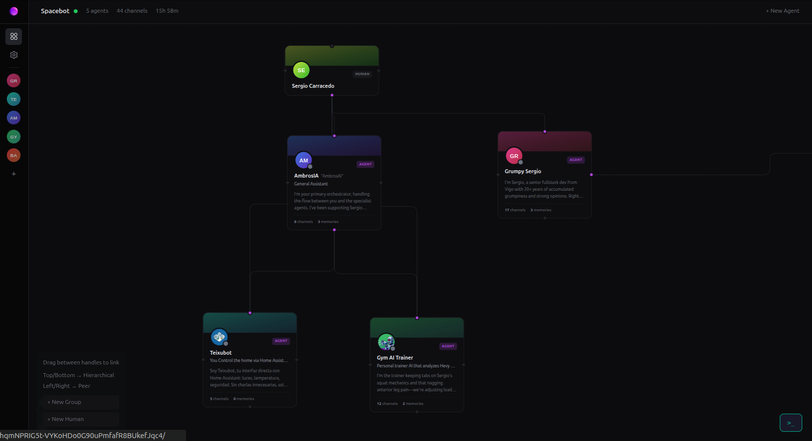
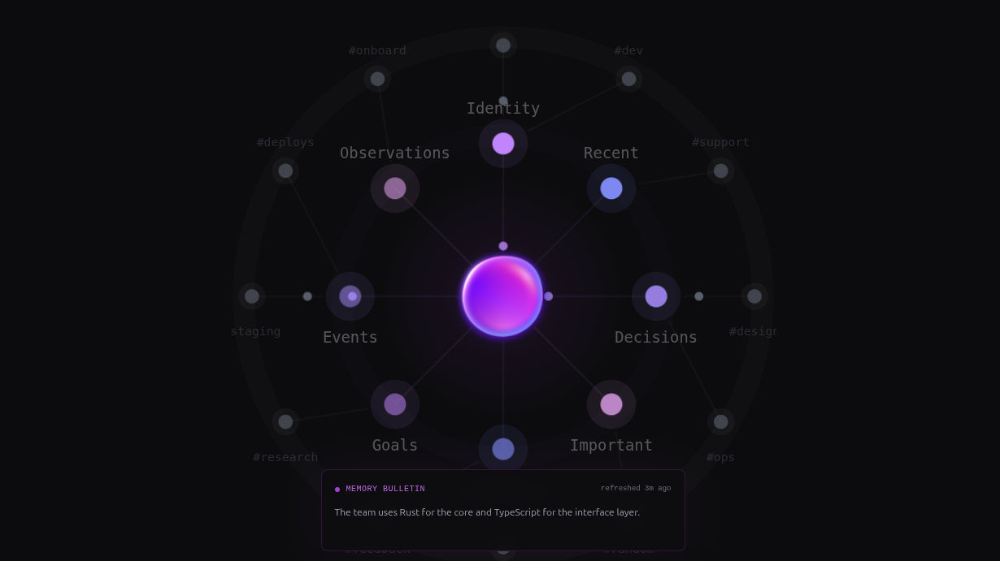

When I created the :astro-ref[gym AI-trainer agent]{path="blog/2026/2026-03-08-opencode-gym-agent"} using Opencode, I felt I need to be able to interact with the agent from anywhere, and the natural step was to use the mobile, I was exploring different options, like [Kimaki](https://github.com/remorses/kimaki), a way to integrate opencode inside Discord, but I don't wanted to use my computer as server, I wanted to use my Raspberry Pi, that is always on and with low power consumption to run opencode and kimaki, but I found that there was a better option, [SpaceBot](https://spacebot.sh/).

# SpaceBot
 
Spacebot is an advanced AI agents manager (yes plural), built in Rust, designed for multi-user platforms like Discord, Telegram, Slack, and more. It allows you to create, manage, and interact with multiple AI agents simultaneously.

Unlike standard chatbots or agents like openclaw that handle one request at a time, Spacebot is built to:

- **Handle Concurrency**: It can engage in dozens of conversations simultaneously across different channels without "blocking" or slowing down, using the concept of branches to manage different conversations or different requests within the same conversation.

- **Retain Memory**: It maintains a memory graph, can learn from interactions or you can ingest information to it, and use that information in future interactions.

- **Task Execution**: It can execute tasks, like browse the web, run code, or interact with APIs, making it a powerful tool for automating complex workflows.

- **Schedule Tasks**: You can schedule tasks to run at specific times or intervals, allowing for automation of routine tasks. For example ask to send a summary of the news every morning at 8 am.

- **UI/Assistant**: Spacebot has a web UI where you can see and manage the agents, the workers, their interactions, the memory graph, configure the providers, the channels and more. Also it has a built-in AI assistant, that can help you to create agents, configure them, and more, just by asking it.

## Agents

Each agent in Spacebot can be customized with its own IDENTITY, SOUL and ROLE allowing to create agents with different personalities. Each each agent also have its own memory, workspace and data, isolated from the others.

## Agents orchestration (hierarchy)

Depite other tools that can run agents, Spacebot is designed to run multiple agents at the same time, and define a hierarchy among them, with a clear graph of interactions you can define

You can define the links between agents, and the direction of the information flow, allowing agents to delegate tasks to other agents, and receive the results back, creating a powerful orchestration of agents.

## An example

In my case I have a main agent, called "AmbrosIA", an agent specialized in control my Home via Home Assistant called (Teixugo), and an agent specialized in fitness called Gym AI Trainer and a joke agent called "Grumpy Sergio", which is a grumpy (event more) version of me I use for fun.

I can interact with each agent independently via Discord (and in some cases via Telegram), but AmbrosIA (the main agent) can use Teixugo and Gym AI Trainer for specific tasks, for example, if I ask AmbrosIA a question related to fitness, it can delegate the question to GymBro, and then return the answer to me. Even doing more complex interactions, for example, if I ask AmbrosIA to say "Go to the gym" in my Google Nest speaker, controlled by Home Assistant if I didn't do exercise that day. A task which involbes to ask Gym Ai Trainer if I did exercise that day, and if the answer is no, then ask Teixugo to say "Go to the gym" in the Google Nest speaker.

## Cortex and memories

Cortex is a LLMprocess that runs in the background, and is responsible decide which information in each conversation is important for the future, and store that information in the memory graph, allowing the agents to have a long-term memory of the interactions, and use that information in future interactions.

But you can also just manually ingest information to the memory graph just dropping files via UI, and Spacebot will chunk it, process it via LLM memory tools and produce the memory graph.

For example, imagine you are creating a support agent for a product, you can ingest the product documentation to the memory graph, and the agent will be able to use that information to answer questions related to the product, or even use the broswer to follow the instructions in the documentation to solve problems.

## Skills and MCPs

You can define skills (includes an UI interface to install and manage them from skills.sh in just one click) and MCPs for each agent, empowering them with specific capabilities, for example, I have defined a MCP for Teixugo to interact with Home Assistant, allowing it to control my smart home devices, and a skill for Gym AI Trainer to interact with Hevy API, allowing it to answer questions about my workouts.

## Providers, Models and model routing

Spacebot supports multiple providers and models. At the moment of writting this post: OpenRouter, Kilo Gateway, OpenCode Zen, OpenCode Go, Anthropic, Azure, OpenAI, ChatGPT Plus, Z.AI Coding plan, Z.ai, Groq, Together AI, Fireworks AI, DeepSeek, xAI, Mistral AI, Google Gemini, NVIDIA NIM, Minimax, Minimax CN, Moonshot AI, GitHub Copilot, and Ollama.

As you can see probably are more providers and models that I can remember, but necesary for flexibily. Each agent can be configured to use a specific provider and model, also in each model you can define the routing for specific tasks: For channel, Branches, Workers, Compactators, Cortex, and even for voice (yes you can also send voice messages).

## Channels

As I mentioned before, Spacebot is designed for multi-user platforms, and it supports multiple channels, like Discord, Telegram, Slack, Twich, Email and webhook at this moment, but they are working to add more channels: WhatsApp, Matrix, iMessage, IRC, LArk, DingTalk, etc.

You can configure each channel to be binded to specific agents, with specific conditions, for example, You can configure Discord as channel, and bind it to AmbrosIA, but only for direct messages of specific user, or for a specific channel in a server, allowing to have different interactions in different channels.

You can also configure the channel to require a mentions or reply to trigger the agent to avoid unwanted interactions.

# Home Assistant addon

As I mentioned before, I wanted to run Spacebot in my Raspberry Pi, and the simplest way to do it was using the Home Assistant addon (now called apps), This is, simplifiying a Dockerfile which runs Spacebot in a container, and allows to configure it via Home Assistant UI, and also allows to use Home Assistant features like secrets, and more.

https://github.com/sergiocarracedo/spacebot-ha-addon

The addon is available in my repository, and you can install it in your Home Assistant instance via HACS, just adding my repository as custom repository, and then searching for Spacebot in the addons section:

1. Open Home Assistant.
2. Go to **Settings** → **Apps** → **App store**.
3. Click the three-dot menu (top right) → **Repositories**.
4. Add this repository URL:
   https://github.com/sergiocarracedo/spacebot-ha-addon
5. Find Spacebot in the store and install it.

Once installed, you can start the addon, and then access the Spacebot dashboard via the "Open Web UI" button in the addon page, and start creating your agents, configuring the providers, channels, and more.

All the configuration is stored in Home Assistant shared folder, so Home Assistant backups will include the Spacebot configuration, agents, memories, and more.

To simplify the management of spacebot via terminal, I included a web terminal in the addon, that you can access via the "Open Web Terminal" button in the addon page to get access to the container shell.

