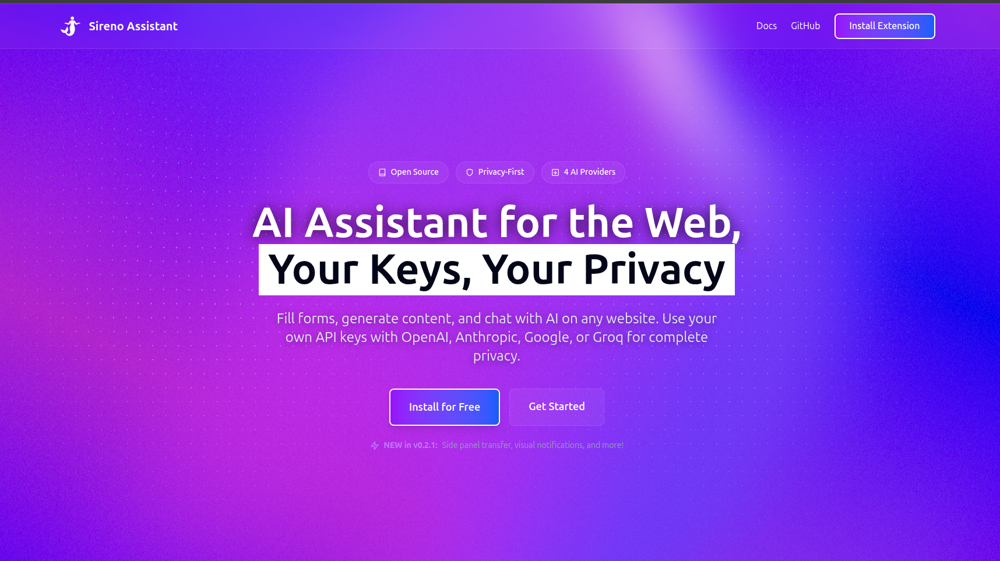
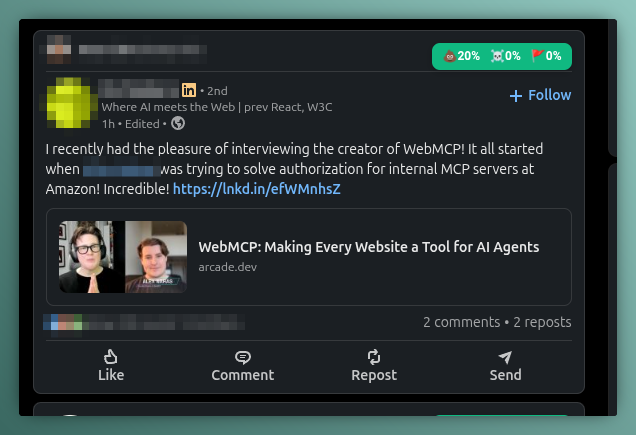
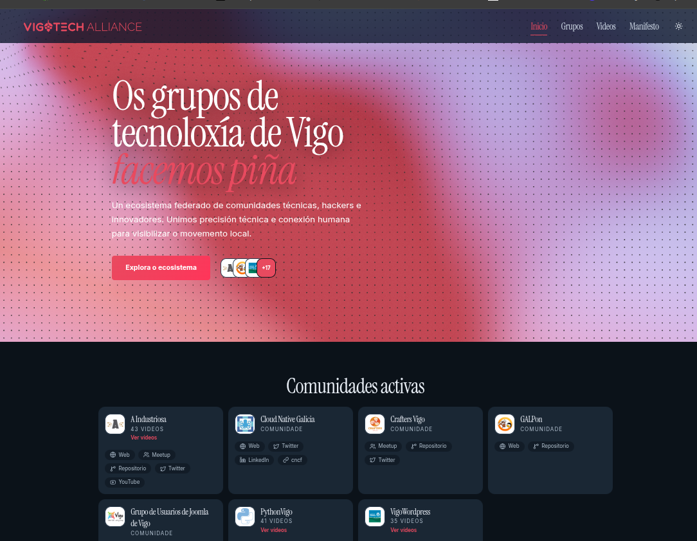
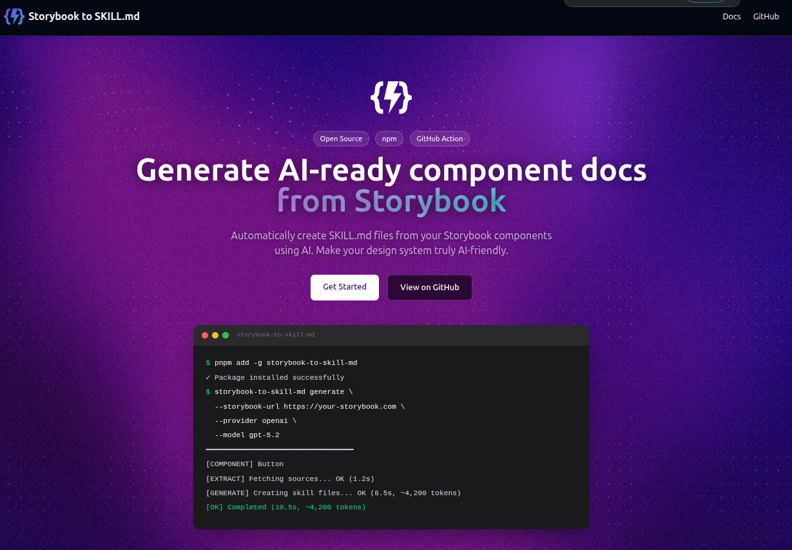
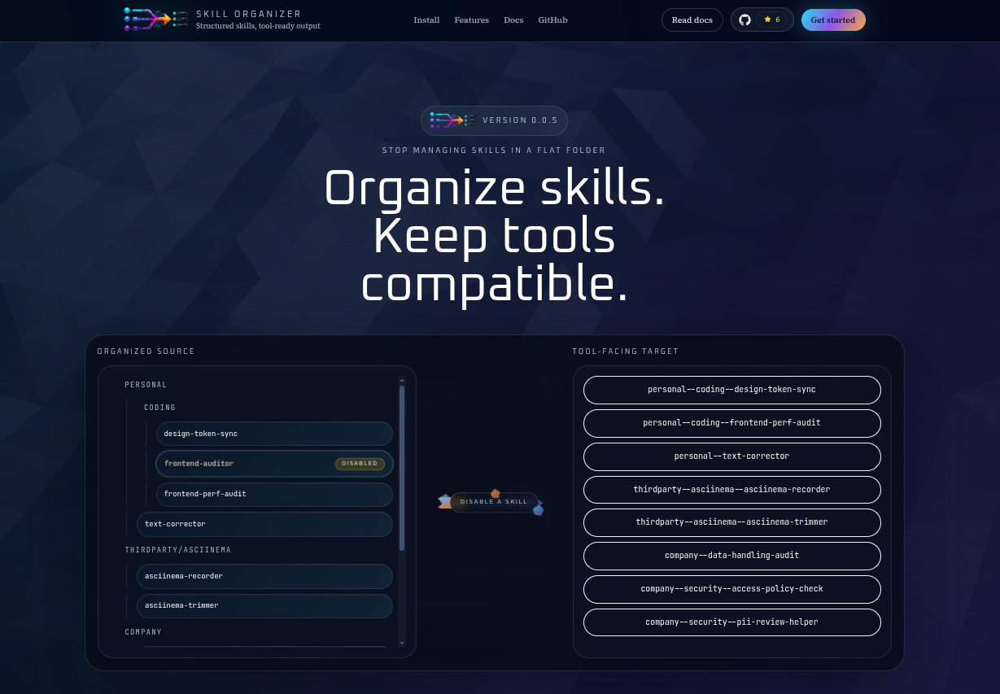

> This article was originally published in [Fika](https://sergiocarracedo.fika.bar/la-tik-tok-izacio-n-del-desarrollo-con-ai-01KR3VY1WZNVF0C8GKFNG0XNMK).

Over the last 2 months, I've focused on improving my skills as an AI Engineer (if that even means anything), improving workflows, testing different methodologies, etc. To do this, I started with a pet project I had abandoned 6 years ago, and I thought it would be a good idea to use it as a laboratory, since I was quite clear on how the product worked.

While iterating and learning with that project, it occurred to me that I could create a Chrome extension that described all the “inputs” on a page and, using AI, could autofill or correct the content of those inputs. In a short time, I had something functional: I called it Sireno Assistant:

After that, I said to myself, why not make an extension that analyzes LinkedIn posts and visually scores them for *red flags*, toxicity, etc. (LinkedIn content is something else)?

It didn't end up working well, and it was forgotten because my attention shifted to another project: Rebuilding the [vigotech.org](https://vigotech.org/) website, the site for the meta-community of tech communities in Vigo, a site I had made 7 years ago and that needed a good visual and functional facelift. Boom, a few Claude tokens, and the site was rebuilt:

I think of a way to create SKILL.md from Storybook documents, more tokens:

I think of a way to organize skills by folders, 1 week to polish it up, with its CLI, its website, its documentation, etc.

And I could keep adding and counting another 10 tools or websites that I've made and/or abandoned to jump to the next one. And others

**# Getting somewhere**

Where I'm going with all this is that we are at a point where it's so easy to start a project or idea from those I had in my “backlog,” it's so simple and fast to get that dopamine hit from seeing something done—like someone swiping through TikToks or Instagram stories—that there comes a moment when you don't even remember what you've done, nor do you iterate on it, improve it, promote it, collect feedback, etc., the less rewarding parts of a project, but very important ones. If you let yourself go, you only think about the next project or idea; to a certain extent, like someone addicted to a substance, as soon as the “high” passes, they are already thinking about the next dose.
It's something I've discussed with several colleagues and they also have that feeling of anxiety for the next project, to see the result their favorite AI produces in each iteration.

This isn't something new; there have always been distractions and it has always been important to stay focused and be clear about what you want to do and what you want to achieve. AI just multiplies the distractions and loss of focus for us, giving us those little dopamine hits.

To paraphrase a legendary quote from the first seasons of Big Brother, "With AI everything (the good and the bad) is magnified.”

> I have deliberately not included links to the projects I'm talking about, because I don't want to turn this post into spam; the important thing here is something else.