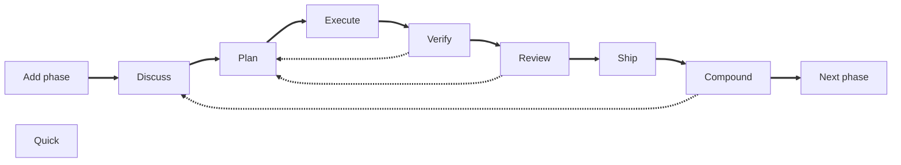

## Some context

Looking back, we started chating with the AI to get help with coding, then IDEs start to use AI models start to autocomplete the code in the IDE, later we start to use agents those could get project context reading multiple files, executing tools, etc, to find a better solution than just autocomplete the code or read a single file. And also we start to do vibecoding, delegating the whole task of writting code to the AI, but without put too much attention to the code itself only in the result.

But, if you have been vibecoded, probably you felt the results are relative good when you start a new project, but as the project grows, you start to see limitations: you need to iterate a lot of times before to get the desired outcome, the code is not always good quality, the agent breaks a previously working code and you need to ask explicitly to fix it, etc.

Then we started to use subagents to delegate specific tasks like the testing, documentation, code review, etc. and to reduce the scope of the task and provide a very detailed instructions: coding standards, team agreements, tools or libraries to use, etc. 

Persistent memory between sessions, so the agent can remember from previous sessions the decisions taken, the agreements, the coding standards, etc.

## What is AI harness 

AI harness engineering is the practice of **wrapping a non-deterministic AI agent in a structured framework of automated controls to safely govern its output for production**. 

One of the main concepts is the feedback loop which uses architecturalrules, context, and other guides defined by you or your team to steer the AI agent even before it writes code

It also defines "sensors" (like automated tests and linters) to catch errors  and force the agent to apply a correction before give you a "final" result. 

This appoach is a significant step forward in the evolution of AI-assisted software development, as creates a safety net catches defects early and significantly reduces the need for constant, manual human oversight.

## AI harness frameworks (agentic engineering frameworks)

You can define your own AI harness (called sometimes "agentic engineering") framework, and maybe it is a good idea to do it when you need an specific way to work with your agents, but there are a lot open source frameworks that you can use as is or as starting point for your needs.

- [Gstack](https://github.com/garrytan/gstack): probably one of the most popular. Created by Garry Tan the President and CEO of Y Combinator [Opencode version](https://github.com/yandong2023/gstack-opencode)
- [Superpowers](https://github.com/obra/superpowers): 
- [nanostack](https://www.nanostack.sh/)
- [get-shit-done](https://github.com/gsd-build/get-shit-done)
- [Compound Engineering](https://github.com/EveryInc/compound-engineering-plugin)
- [Learnship](https://github.com/FavioVazquez/learnship)

## Learnship

[Learnship](https://faviovazquez.github.io/learnship/) is not the one with more stars on github, or the most "famous", but is the one I felt confortable working with.

It [gets a lot of ideas](https://faviovazquez.github.io/learnship/contributing/?h=cre#credits) from the other projects I mentioned to create a comprehensive framework for AI harness engineering.

One core concept is to register everything (the roadmap, phases, tasks, discussions, etc.) in markdown files (in the folder `.planning`), the other one is to extract learning after every step.

### Getting started

Install Learnship is easy, just to run `npx learnship`, this will starts the onboard process and will ask you which agentic coding tool you want to use, about your local environment andif you want to install it goblally or per proyect.

Then in your agentic coding tool just use the commandd `learnship-ls` to start, as it detects no previous usage, will guide you through the project onboarding process, asking you about the project, the roadmap, the phases, etc., the agent will research about the stack, architecture patterns, etc and creates the corresponding markdown files in the `.planning` folder.

<small>Image from Learnship documentation</small>

This will also create a roadmap divided in phases. Let's understand the phase workflow in the next section.

### Learnship workflow (basic)

This is the basic workflow Learnship introduces

- `add-phase` (:man:): Adds a phase as a part of a roadmap, for example "add a new feature about....",
- `discuss-phase [phase]` (:man:): After define the phase goals, you will discuss with the agent about the best approach to achieve those goals, architecture decisions, doubts. This step is very important as you ensures the agent understand the task, the possible issues, and no gaps in the knowledge.
- `plan-phase [phase]`: After the discussion, the agent will create a plan which sumarizes the phase goals and the discussions. And defines all the tasks to be done in the next step.
- `execute-phase [phase]`: The agent will execute the tasks defined in the previous step,
- `verify-work [phase]` (:man:): The agent will present you the User Acceptance Tests (UATs) to verify the work is correct, if you find something wrong, you can ask the agent to fix it but it will note it, not execute the fix at this moment, it will complete all the UATs and then create a new "wave" for the phase with the issues to solve and execute them, doing the verification again until all the UATs are correct.

At this point you can do multiple things:

- `review-phase [phase]`: The agent will execute the deterministic tests, and also do a "smart" code review, checking for code quality, architecture decisions, security, etc. If it finds any issue, will categorize it from P0 (higher priority) to P3 (lower priority) and create a new wave for the phase with the issues to solve and execute them, doing the verification again until all the issues are solved.

- `ship-phase [phase]`: The agent will execute the tasks to ship the code to production, like creating a PR, merging it, etc.

- `compound[phase]`: It uses the current fresh context to get learnings from the phase, learning, it can use in other phases, for example a bug it found, an architecture decision was not in the document, etc. Agent will create a document to store those learnings.

- `next-phase [phase]`: Jumps to the the next phase starting the workflow again, but now with the learnings from the previous phase.

- `quick [Task to do]`: As Learnship "takes control" of the `AGENTS.md` teach the agent not "just do" without a plan or without registering that, so if you want to do something quick, you can use the `quick` command, for example to fix a bug, or to do a refactor or small feature. It will create for you an small plan from the tasks description without discussion (by default, you can use the --discuss flag if you want to discuss it before) and execute it.

Note you are the key piece (:man:) to define the roadmap, the phases, the goals, to discuss and take some decissions and the review of the functionality, but the agent is in charge of the execution, the review, get the learnings, ship, sumarize the work, etc. You are working together but with very defined roles and responsibilities.

## Agentic engineering vs Vibecoding

As I mentioned before, vibecoding is delegating the whole task of writting code to the AI, but in a not very structured way. You can create plans using the agent "Plan" mode, even you can store some data in the agent memory, but you are not using a structured framework to control the output of the agent, to catch errors, to learn from the process, etc.

Most of times vibecoding can not remember past decisions you made, or the way the agent solved an issue. For the agent is hard to build (without creating a mesh) to build over existing code, as it needs to infer the stack and the architecture from the code itself.

Agentic engineering frameworks like Learnship, Gstack, Superpowers, etc. are some steps futher than vibecoding, proviging a valuable and clear context for the agent anytime, even month before.

Each step in this pattern adds structured context that flows into the next. By the time the executor agent runs, it knows:

As the Learnship documentation says: "Nothing is guessed. Everything is engineered."

| Dimension | Vibecoding | Agentic engineering |
| --- | --- | --- |
| Context | Only data agents gets on every session | Evolved (from previous sessions) and persistent across sessions |
| Decisions | Implicit, forgotten or in rules | Tracked in DECISIONS.md |
| Plans | Ad-hoc prompts | Spec-driven, verifiable, wave-ordered |
| Regressions | Frequent, hard to trace as no context is preserved | Logged in AGENTS.md, patterns detected |
| Scale | Falls apart at complexity or big projects | Designed for multi-phase, multi-session projects |
<small>Table inspired by Learnship documentation</small>

## Conclusion

This only the iceber's tip, I strongly recommend you to check the documentation of Learnship and the other frameworks, to get the [core concepts](https://faviovazquez.github.io/learnship/core-concepts/phase-loop/) and try them by yourself, there much more than i can write in a blog post. I also recomend you to install Learnship and just run the `/new-project` command in your agentic coding tool, to see how it works and the markdown files's content.

I was using it for a while, and for me is a game changer, it is able to even change the project architecture in the middle of the project, and still stable and generating a code a human can understand, opposite to the vibecoding approach that the code quality and stability degrades as the project grows. Maybe it seems you are slower than doing vibecoding, but you think in deep, doing vibecoding is typical to skips some steps, like the UATs, the code review from different roles point of view, the learnings extraction, etc. and you will need to do a lot of iterations to get the desired result with worse coding quality.

## References

https://martinfowler.com/articles/harness-engineering.html
https://cobusgreyling.medium.com/the-rise-of-ai-harness-engineering-5f5220de393e

