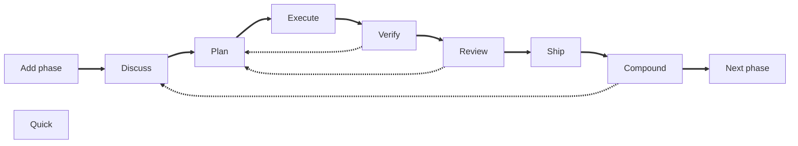

## Some context

Looking back, we started chatting with the AI to help with coding. Then IDEs started using AI models to autocomplete code in the IDE. Later, we started using agents that could get project context by reading multiple files, executing tools, etc., to find better solutions than just autocompleting code or reading a single file. We also started vibecoding—delegating the entire task of writing code to the AI without carefully reviewing the code quality, only the result.

However, if you have used vibecoding, you probably felt the results are relatively good when starting a new project. As the project grows, you begin to see limitations: you need to iterate many times to achieve the desired outcome, code quality degrades, the agent breaks previously working code, and you must explicitly ask it to fix issues, among other problems.

Then we started to use subagents to delegate specific tasks like the testing, documentation, code review, etc. and to reduce the scope of the task and provide a very detailed instructions: coding standards, team agreements, tools or libraries to use, etc. 

Persistent memory between sessions, so the agent can remember from previous sessions the decisions taken, the agreements, the coding standards, etc.

## What is AI harness 

AI harness engineering is the practice of **wrapping a non-deterministic AI agent in a structured framework of automated controls to safely govern its output for production**. 

One of the main concepts is the feedback loop, which uses architectural rules, context, and other guides defined by you or your team to steer the AI agent before it even writes code.

It also defines "sensors" (like automated tests and linters) to catch errors and force the agent to apply corrections before giving you a "final" result. 

This approach is a significant step forward in the evolution of AI-assisted software development, as it creates a safety net that catches defects early and significantly reduces the need for constant, manual human oversight.

## AI harness frameworks (agentic engineering frameworks)

You can define your own AI harness (sometimes called an "agentic engineering" framework). It may be a good idea when you need a specific way to work with your agents, but there are many open source frameworks you can use as-is or as a starting point for your needs.

- [Gstack](https://github.com/garrytan/gstack): probably one of the most popular. Created by Garry Tan the President and CEO of Y Combinator [Opencode version](https://github.com/yandong2023/gstack-opencode)
- [Superpowers](https://github.com/obra/superpowers): 
- [nanostack](https://www.nanostack.sh/)
- [get-shit-done](https://github.com/gsd-build/get-shit-done)
- [Compound Engineering](https://github.com/EveryInc/compound-engineering-plugin)
- [Learnship](https://github.com/FavioVazquez/learnship)

## Learnship

[Learnship](https://faviovazquez.github.io/learnship/) is not the one with more stars on github, or the most "famous", but is the one I felt confortable working with.

It [gets a lot of ideas](https://faviovazquez.github.io/learnship/contributing/?h=cre#credits) from the other projects I mentioned to create a comprehensive framework for AI harness engineering.

One core concept is to register everything (the roadmap, phases, tasks, discussions, etc.) in markdown files (in the folder `.planning`), the other one is to extract learning after every step.

### Getting started

To install Learnship, simply run `npx learnship`. This starts the onboarding process and asks which agentic coding tool you want to use, your local environment details, and whether you want to install it globally or per project.

Then in your agentic coding tool, use the command `learnship-ls` to start. Since it detects no previous usage, it will guide you through the project onboarding process, asking about your project, roadmap, phases, etc. The agent will research your stack and architecture patterns, then create the corresponding markdown files in the `.planning` folder.

<small>Image from Learnship documentation</small>

This will also create a roadmap divided in phases. Let's understand the phase workflow in the next section.

### Learnship workflow (basic)

This is the basic workflow Learnship introduces

- `add-phase`: Adds a phase as part of a roadmap (e.g., "add a new feature about...")
- `discuss-phase [phase]`: After defining the phase goals, you discuss with the agent about the best approach to achieve those goals, architecture decisions, and any doubts. This step is important because it ensures the agent understands the task, potential issues, and has no knowledge gaps.
- `plan-phase [phase]`: After the discussion, the agent creates a plan that summarizes the phase goals and discussions, then defines all the tasks for the next step.
- `execute-phase [phase]`: The agent will execute the tasks defined in the previous step,
- `verify-work [phase]`: The agent presents User Acceptance Tests (UATs) to verify the work is correct. If you find something wrong, you can ask the agent to fix it, but it will note the issue without executing the fix immediately. It will complete all UATs first, then create a new "wave" for the phase with issues to solve and execute them, doing the verification again until all UATs pass.

At this point you can do multiple things:

- `review-phase [phase]`: The agent executes the deterministic tests and performs a "smart" code review, checking code quality, architecture decisions, security, and more. If issues are found, they are categorized from P0 (highest priority) to P3 (lowest priority), and a new wave is created for the phase with the issues to solve and execute them, doing the verification again until all issues are resolved.

- `ship-phase [phase]`: The agent will execute the tasks to ship the code to production, like creating a PR, merging it, etc.

- `compound-phase [phase]`: Uses the current fresh context to extract learnings from the phase that can be applied to other phases (e.g., bugs found, architectural decisions not in documentation, etc.). The agent creates a document to store these learnings.

- `next-phase [phase]`: Moves to the next phase and starts the workflow again, now with the learnings from the previous phase.

- `quick [Task to do]`: Since Learnship "takes control" of the `AGENTS.md`, the agent is taught not to "just do" something without a plan or without recording it. With this command, you can do something quickly (e.g., fix a bug, refactor, or add a small feature). It creates a small plan from the task description without discussion by default (you can use the `--discuss` flag to discuss it first) and executes it.

Note: You are the key piece in defining the roadmap, phases, and goals, and in discussing and making decisions and reviewing the functionality. The agent is responsible for execution, code review, learning extraction, shipping, and summarizing the work. You work together, but with clearly defined roles and responsibilities.

## Agentic engineering vs Vibecoding

As mentioned earlier, vibecoding delegates the entire task of writing code to the AI but without a structured approach. You can create plans using the agent's "Plan" mode and store data in agent memory, but you are not using a structured framework to control the agent's output, catch errors, learn from the process, etc.

Most of the time, vibecoding cannot remember past decisions you made or how the agent solved issues. It is difficult for the agent to build on existing code without creating a mess, since it must infer the stack and architecture from the code itself.

Agentic engineering frameworks like Learnship, Gstack, Superpowers, etc. go several steps further than vibecoding, providing valuable and clear context for the agent at any time, even months later.

Each step in this pattern adds structured context that flows into the next.

By the time the executor agent runs, it knows:

As the Learnship documentation says: "Nothing is guessed. Everything is engineered."

| Dimension | Vibecoding | Agentic engineering |
| --- | --- | --- |
| Context | Only data the agent obtains each session | Evolved (from previous sessions) and persistent across sessions |
| Decisions | Implicit, forgotten or in rules | Tracked in DECISIONS.md |
| Plans | Ad-hoc prompts | Spec-driven, verifiable, wave-ordered |
| Regressions | Frequent, hard to trace as no context is preserved | Logged in AGENTS.md, patterns detected |
| Scale | Falls apart at complexity or big projects | Designed for multi-phase, multi-session projects |
<small>Table inspired by Learnship documentation</small>

## Conclusion

This is only the tip of the iceberg. I strongly recommend you check the documentation of Learnship and other frameworks to understand the [core concepts](https://faviovazquez.github.io/learnship/core-concepts/phase-loop/) and try them yourself. There is much more than I can write in a blog post. I also recommend installing Learnship and running the `/new-project` command in your agentic coding tool to see how it works and view the markdown files' content.

I have been using it for a while, and for me it is a game changer. It can even change the project architecture mid-project while remaining stable and generating code a human can understand. This is unlike vibecoding, where code quality and stability degrade as the project grows. While Learnship may initially seem slower, you think deeper and skip fewer critical steps, whereas vibecoding typically skips steps like UATs, code review from different perspectives, and learning extraction. Vibecoding requires many iterations to achieve the desired result with lower code quality.

## References

https://martinfowler.com/articles/harness-engineering.html
https://cobusgreyling.medium.com/the-rise-of-ai-harness-engineering-5f5220de393e

