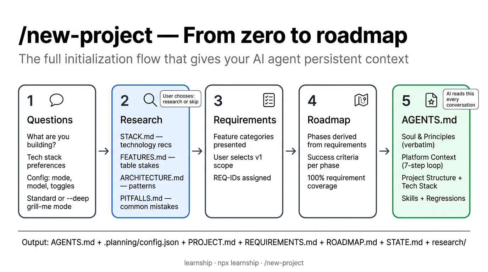
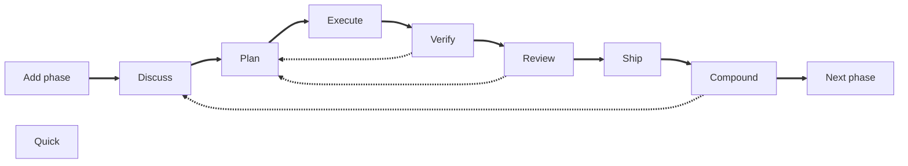

## Un poco de contexto

Mirando hacia atrás, empezamos chateando con la IA para que nos ayudara a programar. Luego, los IDE empezaron a usar modelos de IA para autocompletar código. Más tarde, comenzamos a usar agentes que podían obtener el contexto del proyecto leyendo múltiples archivos, ejecutando herramientas, etc., para encontrar mejores soluciones que simplemente autocompletar código o leer un solo archivo. También empezamos con el vibecoding: delegar toda la tarea de escribir código a la IA sin revisar cuidadosamente la calidad del código, solo el resultado.

Sin embargo, si has practicado el vibecoding, probablemente hayas sentido que los resultados son relativamente buenos al empezar un proyecto nuevo. A medida que el proyecto crece, empiezas a ver limitaciones: necesitas iterar muchas veces para lograr el resultado deseado, la calidad del código se degrada, el agente rompe código que antes funcionaba y debes pedirle explícitamente que corrija los errores, entre otros problemas.

Entonces empezamos a usar subagentes para delegar tareas específicas como las pruebas, la documentación, la revisión de código, etc., y para reducir el alcance de la tarea y proporcionar instrucciones muy detalladas: estándares de programación, acuerdos de equipo, herramientas o librerías a usar, etc.

Memoria persistente entre sesiones, para que el agente pueda recordar de sesiones anteriores las decisiones tomadas, los acuerdos, los estándares de programación, etc.

## ¿Qué es AI harness?

La ingeniería de AI harness es la práctica de **envolver a un agente de IA no determinista en un marco estructurado de controles automatizados para gobernar de forma segura su salida para producción**.

Uno de los conceptos principales es el bucle de retroalimentación (feedback loop), que utiliza reglas arquitectónicas, contexto y otras guías definidas por ti o tu equipo para dirigir al agente de IA incluso antes de que escriba código.

También define "sensores" (como pruebas automatizadas y linters) para detectar errores y obligar al agente a aplicar correcciones antes de entregarte un resultado "final".

Este enfoque es un paso significativo en la evolución del desarrollo de software asistido por IA, ya que crea una red de seguridad que detecta defectos de forma temprana y reduce significativamente la necesidad de una supervisión humana manual y constante.

## Frameworks de AI harness (frameworks de ingeniería agéntica)

Puedes definir tu propio AI harness (a veces llamado framework de "ingeniería agéntica"). Puede ser una buena idea cuando necesitas una forma específica de trabajar con tus agentes, pero existen muchos frameworks de código abierto que puedes usar tal cual o como punto de partida para tus necesidades.

- [Gstack](https://github.com/garrytan/gstack): probablemente uno de los más populares. Creado por Garry Tan, el presidente y CEO de Y Combinator [Versión Opencode](https://github.com/yandong2023/gstack-opencode)
- [Superpowers](https://github.com/obra/superpowers): 
- [nanostack](https://www.nanostack.sh/)
- [get-shit-done](https://github.com/gsd-build/get-shit-done)
- [Compound Engineering](https://github.com/EveryInc/compound-engineering-plugin)
- [Learnship](https://github.com/FavioVazquez/learnship)

## Learnship

[Learnship](https://faviovazquez.github.io/learnship/) no es el que tiene más estrellas en GitHub, ni el más "famoso", pero es con el que me he sentido más cómodo trabajando.

[Toma muchas ideas](https://faviovazquez.github.io/learnship/contributing/?h=cre#credits) de los otros proyectos que mencioné para crear un framework integral para la ingeniería de AI harness.

Un concepto central es registrar todo (el roadmap, las fases, las tareas, las discusiones, etc.) en archivos markdown (en la carpeta `.planning`); el otro es extraer aprendizajes después de cada paso.

### Primeros pasos

Para instalar Learnship, simplemente ejecuta `npx learnship`. Esto inicia el proceso de onboarding y te pregunta qué herramienta de programación agéntica quieres usar, los detalles de tu entorno local y si quieres instalarlo de forma global o por proyecto.

Luego, en tu herramienta de programación agéntica, usa el comando `learnship-ls` para comenzar. Como detectará que no se ha usado antes, te guiará a través del proceso de onboarding del proyecto, preguntándote sobre tu proyecto, roadmap, fases, etc. El agente investigará tu stack y patrones de arquitectura, y luego creará los archivos markdown correspondientes en la carpeta `.planning`.

<small>Imagen de la documentación de Learnship</small>

Esto también creará un roadmap dividido en fases. Entendamos el flujo de trabajo de las fases en la siguiente sección.

### Flujo de trabajo de Learnship (básico)

Este es el flujo de trabajo básico que introduce Learnship:

- `add-phase`: Añade una fase como parte de un roadmap (por ejemplo, "añadir una nueva funcionalidad sobre...").
- `discuss-phase [phase]`: Después de definir los objetivos de la fase, discutes con el agente sobre el mejor enfoque para lograr esos objetivos, decisiones de arquitectura y cualquier duda. Este paso es importante porque asegura que el agente comprenda la tarea, los problemas potenciales y que no tenga lagunas de conocimiento.
- `plan-phase [phase]`: Después de la discusión, el agente crea un plan que resume los objetivos de la fase y las discusiones, y luego define todas las tareas para el siguiente paso.
- `execute-phase [phase]`: El agente ejecutará las tareas definidas en el paso anterior.
- `verify-work [phase]`: El agente presenta Pruebas de Aceptación de Usuario (UATs) para verificar que el trabajo es correcto. Si encuentras algo mal, puedes pedirle al agente que lo arregle, pero este anotará el problema sin ejecutar la corrección de inmediato. Completará primero todas las UATs y luego creará una nueva "ola" (wave) para la fase con los problemas a resolver y los ejecutará, realizando la verificación nuevamente hasta que todas las UATs pasen.

En este punto puedes hacer varias cosas:

- `review-phase [phase]`: El agente ejecuta las pruebas deterministas y realiza una revisión de código "inteligente", comprobando la calidad del código, las decisiones de arquitectura, la seguridad y más. Si se encuentran problemas, se categorizan de P0 (prioridad más alta) a P3 (prioridad más baja), y se crea una nueva ola para la fase con los problemas a resolver y ejecutar, repitiendo la verificación hasta que se resuelvan todos los problemas.

- `ship-phase [phase]`: El agente ejecutará las tareas para enviar el código a producción, como crear una PR, fusionarla, etc.

- `compound-phase [phase]`: Utiliza el contexto fresco actual para extraer aprendizajes de la fase que puedan aplicarse a otras fases (por ejemplo, errores encontrados, decisiones arquitectónicas que no estaban en la documentación, etc.). El agente crea un documento para almacenar estos aprendizajes.

- `next-phase [phase]`: Pasa a la siguiente fase e inicia el flujo de trabajo de nuevo, ahora con los aprendizajes de la fase anterior.

- `quick [Task to do]`: Dado que Learnship "toma el control" de `AGENTS.md`, se le enseña al agente a no "simplemente hacer" algo sin un plan o sin registrarlo. Con este comando, puedes hacer algo rápidamente (por ejemplo, corregir un error, refactorizar o añadir una pequeña funcionalidad). Crea un pequeño plan a partir de la descripción de la tarea sin discusión por defecto (puedes usar el flag `--discuss` para discutirlo primero) y lo ejecuta.

Nota: Tú eres la pieza clave al definir el roadmap, las fases y los objetivos, y al discutir, tomar decisiones y revisar la funcionalidad. El agente es responsable de la ejecución, la revisión del código, la extracción de aprendizajes, el envío y el resumen del trabajo. Trabajáis juntos, pero con roles y responsabilidades claramente definidos.

## Ingeniería agéntica vs Vibecoding

Como se mencionó anteriormente, el vibecoding delega toda la tarea de escribir código a la IA pero sin un enfoque estructurado. Puedes crear planes usando el modo "Plan" del agente y almacenar datos en la memoria del agente, pero no estás usando un framework estructurado para controlar la salida del agente, detectar errores, aprender del proceso, etc.

La mayoría de las veces, el vibecoding no puede recordar decisiones pasadas que tomaste o cómo el agente resolvió problemas. Es difícil para el agente construir sobre el código existente sin crear un desastre, ya que debe inferir el stack y la arquitectura a partir del propio código.

Los frameworks de ingeniería agéntica como Learnship, Gstack, Superpowers, etc., van varios pasos más allá del vibecoding, proporcionando un contexto valioso y claro para el agente en cualquier momento, incluso meses después.

Cada paso en este patrón añade un contexto estructurado que fluye hacia el siguiente.

Para cuando el agente ejecutor se pone en marcha, ya sabe:

Como dice la documentación de Learnship: "Nada se adivina. Todo se diseña mediante ingeniería".

| Dimensión | Vibecoding | Ingeniería agéntica |
| --- | --- | --- |
| Contexto | Solo los datos que el agente obtiene en cada sesión | Evolucionado (de sesiones anteriores) y persistente entre sesiones |
| Decisiones | Implícitas, olvidadas o en reglas | Registradas en DECISIONS.md |
| Planes | Prompts ad-hoc | Basados en especificaciones, verificables, ordenados por olas |
| Regresiones | Frecuentes, difíciles de rastrear al no preservarse el contexto | Registradas en AGENTS.md, patrones detectados |
| Escala | Se desmorona ante la complejidad o proyectos grandes | Diseñado para proyectos de múltiples fases y múltiples sesiones |
<small>Tabla inspirada en la documentación de Learnship</small>

## Conclusión

Esto es solo la punta del iceberg. Te recomiendo encarecidamente que consultes la documentación de Learnship y otros frameworks para comprender los [conceptos básicos](https://faviovazquez.github.io/learnship/core-concepts/phase-loop/) y probarlos por ti mismo. Hay mucho más de lo que puedo escribir en una entrada de blog. También recomiendo instalar Learnship y ejecutar el comando `/new-project` en tu herramienta de programación agéntica para ver cómo funciona y observar el contenido de los archivos markdown.

Lo he estado usando durante un tiempo y, para mí, ha supuesto un cambio radical. Incluso puede cambiar la arquitectura del proyecto a mitad del mismo manteniendo la estabilidad y generando un código que un humano puede entender. Esto es diferente al vibecoding, donde la calidad del código y la estabilidad se degradan a medida que el proyecto crece. Aunque Learnship pueda parecer más lento al principio, piensas con más profundidad y te saltas menos pasos críticos, mientras que el vibecoding suele omitir pasos como las UATs, la revisión de código desde diferentes perspectivas y la extracción de aprendizajes. El vibecoding requiere muchas iteraciones para lograr el resultado deseado con una menor calidad de código.

## Referencias

https://martinfowler.com/articles/harness-engineering.html
https://cobusgreyling.medium.com/the-rise-of-ai-harness-engineering-5f5220de393e