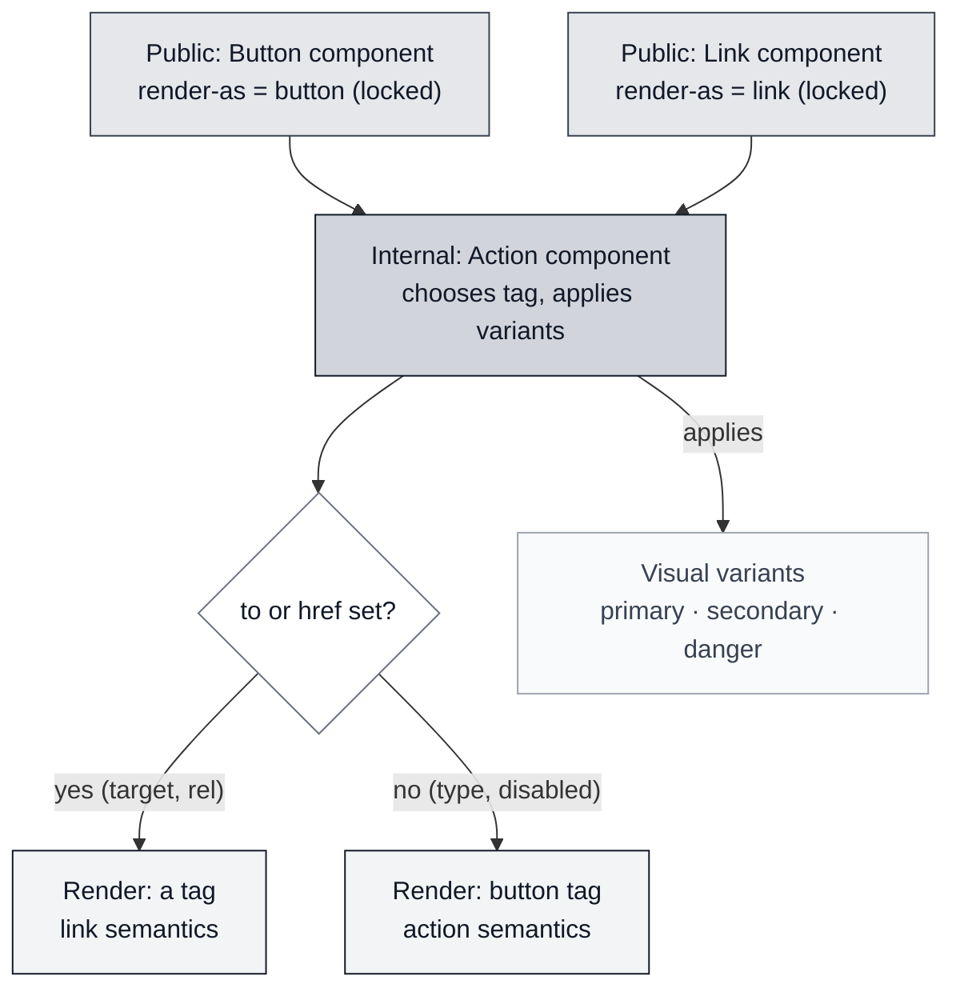

When we have a SPA, or any app running in a browser-like environment, we usually don't pay attention to links and buttons beyond the visual part—most UI kits include them as two different components: [HeroUI Button](https://heroui.com/en/docs/react/components/button) and [HeroUI Link](https://heroui.com/en/docs/react/components/link)


As you can see, both look different and at first glance I guess you know when to use one and when to use the other. Really?


## What are buttons and links?

According to the W3C ARIA, *"[A button is a widget that enables users to trigger an action or event, such as submitting a form, opening a dialog, canceling an action](https://www.w3.org/WAI/ARIA/apg/patterns/button/)"*.

Regarding the link: *"[A link widget provides an interactive reference to a resource.](https://www.w3.org/WAI/ARIA/apg/patterns/link/)"*


Links (using an anchor, `a`) can also contain any other element inside (except another `a`), but buttons should only contain some inline elements according to the standard: `strong`, `em`, `span`, `small`, `br`, `img`, `svg`, `canvas`, etc.

**But further than that, the standard doesn't define how a button or link should look; the standard defines the semantic meaning and the behavior.**

We see them differently because the browser applies the "User Agent stylesheet" — default CSS the browser applies to the tags. That is why a button (without any user CSS) looks different across browsers or devices.


## A common use case

Imagine this example, which represents a detail page of an element. In the header we have the action buttons: the arrows allow navigation to the previous and next item, a button to delete the item, and another to add a new item.


But are you sure all should be buttons? They look like buttons, but not all should behave as buttons in the same way the W3C defines a button.

A typical mistake is to do the navigation programatically: `<button onClick="navigateTo('/item/23')">`

That seems to work, **but you are losing a lot and degrading the user experience:**

- The user can not use mouse middle button to open the link in a new tab
- Browser's back button will not go back to the previous page (this will depend on how your router adds the navigation to the navigation history)
- User can not do right click and share the link
- In general any behavior the native link can provide


### "But that looks like a button...": button/link semantics vs button/link visuals

Talking about a button or a link is not just about a single thing — we can talk about the behavior or talk about the visuals. This is important. Looking back at the example:

- The arrow buttons are visually buttons but semantically links.
- The "Delete" button is visually and semantically a button as it triggers an action.
- The "Add new" button depends; if it navigates to a new page or changes the URL to force open a popup, it should be semantically a link.

You could wrap the button in an anchor but in my opinion that is not an ideal solution.


## A solution

The solution I like to implement in the design systems I create or maintain is to have an internal `Action` component which uses `<button>` or `a` (or the framework's router tag you use) as content wrapper depending on the props passed:

If the prop `to` (or `href` for pure links) is set, that means we want to navigate, so it should be semantically a link; otherwise, it should be a button.

And regarding the visual part, it is also useful to provide visual variants to the links like the buttons: `primary`, `secondary`, `danger`, etc.

For this internal component we expose a prop to decide if the visuals must be as a button or as a link (`render-as`).

This component should accept more props related to button behavior or link behavior, so if we are using TypeScript we can use discriminated unions:

```ts
type ActionProps = {
  // Here the common props

} & (
 | {
  href: string
  target?: '_blank' | 'self' | '_parent' | '_top'
  rel?: string  
 } | {
  type?: ButtonType
  href?: never
  target?: never
  }
)
```

The idea is to provide the same behavior for the button and link content, for example icons, loading state, disabled, etc.

Theoretically you can create a button behavior with the link visuals, but it can be confusing for the users, so I prefer to avoid this case by exposing two public components:

- A `Button` component is always rendered as a button, but can behave as a link depending on the presence of the `to` or `href` prop.
- A `Link` component behaves and visually renders as a link.

As I mentioned, both components are just a proxy which limits the props exposed and wires them to the internal Action component.


The full decision flow looks like this:



### Accessibility

As the button behaves as a button and the link behaves as a link, you don't need to do anything special — no need to add a `role` attribute. A screen reader will announce the link as any other link and the button as a button.


### Other considerations

- **Style reset**: You must be very careful resetting the styles of `<button>` and `<a>` in the Action component as the user should not notice any visual difference between them (including the alignment when you have both on the same line).


## Summary

Understanding the difference between the visuals and the semantics regarding buttons and links allows you to create better applications. At least for me, trying to open something that navigates in a new tab and not being able to do so is very frustrating. This is the kind of detail that reduces the perceived quality of a product.


