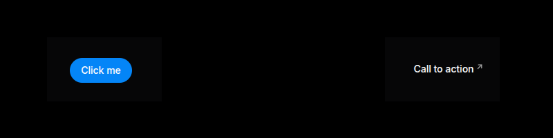
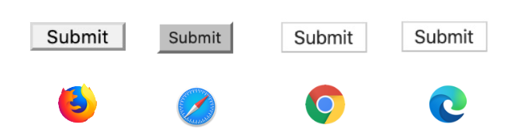
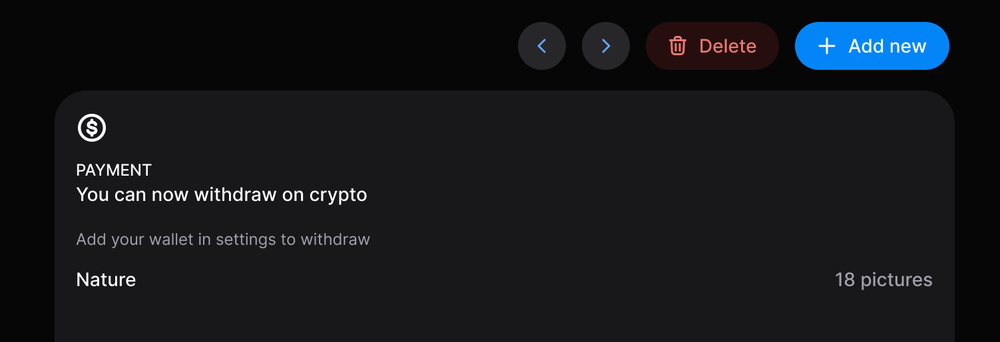
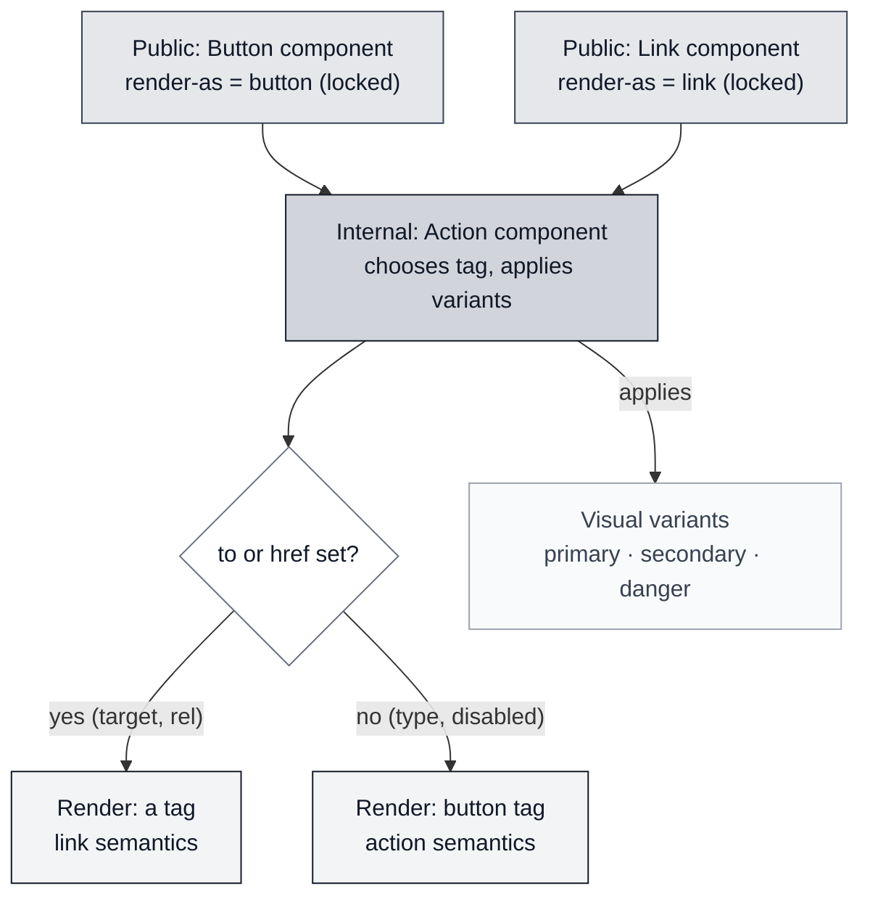

Cuando tenemos una SPA, o cualquier aplicación que se ejecute en un entorno similar a un navegador, solemos no prestar atención a los enlaces y botones más allá de la parte visual; la mayoría de los UI kits los incluyen como dos componentes diferentes: [HeroUI Button](https://heroui.com/en/docs/react/components/button) y [HeroUI Link](https://heroui.com/en/docs/react/components/link)




Como puedes ver, ambos lucen diferentes y, a primera vista, supongo que sabes cuándo usar uno y cuándo usar el otro. ¿Seguro?


## ¿Qué son los botones y los enlaces?

Según el W3C ARIA, *"[Un botón es un widget que permite a los usuarios activar una acción o evento, como enviar un formulario, abrir un diálogo o cancelar una acción](https://www.w3.org/WAI/ARIA/apg/patterns/button/)"*.

En cuanto al enlace: *"[Un widget de enlace proporciona una referencia interactiva a un recurso.](https://www.w3.org/WAI/ARIA/apg/patterns/link/)"*


Los enlaces (usando un ancla, `a`) también pueden contener cualquier otro elemento en su interior (excepto otro `a`), pero los botones solo deberían contener algunos elementos inline según el estándar: `strong`, `em`, `span`, `small`, `br`, `img`, `svg`, `canvas`, etc.

**Pero más allá de eso, el estándar no define cómo debe verse un botón o un enlace; el estándar define el significado semántico y el comportamiento.**

Los vemos de forma diferente porque el navegador aplica la "User Agent stylesheet" — el CSS por defecto que el navegador aplica a las etiquetas. Por eso un botón (sin ningún CSS de usuario) se ve diferente en distintos navegadores o dispositivos.




## Un caso de uso común

Imagina este ejemplo, que representa una página de detalle de un elemento. En la cabecera tenemos los botones de acción: las flechas permiten la navegación al elemento anterior y siguiente, un botón para eliminar el elemento y otro para añadir uno nuevo.




Pero, ¿estás seguro de que todos deberían ser botones? Parecen botones, pero no todos deberían comportarse como botones de la misma manera que el W3C define un botón.

Un error típico es realizar la navegación de forma programática: `<button onClick="navigateTo('/item/23')">`

Eso parece funcionar, **pero estás perdiendo mucho y degradando la experiencia de usuario:**

- El usuario no puede usar el botón central del ratón para abrir el enlace en una nueva pestaña.
- El botón de retroceso del navegador no volverá a la página anterior (esto dependerá de cómo tu router añada la navegación al historial de navegación).
- El usuario no puede hacer clic derecho y compartir el enlace.
- En general, cualquier comportamiento que el enlace nativo pueda proporcionar.


### "Pero eso parece un botón...": semántica de botón/enlace vs visual de botón/enlace

Hablar de un botón o de un enlace no se trata solo de una cosa: podemos hablar del comportamiento o hablar de lo visual. Esto es importante. Volviendo al ejemplo:

- Los botones de flecha son visualmente botones pero semánticamente enlaces.
- El botón "Eliminar" es visual y semánticamente un botón, ya que activa una acción.
- El botón "Añadir nuevo" depende; si navega a una nueva página o cambia la URL para forzar la apertura de un popup, debería ser semánticamente un enlace.

Podrías envolver el botón en un ancla, pero en mi opinión esa no es una solución ideal.


## Una solución

La solución que me gusta implementar en los sistemas de diseño que creo o mantengo es tener un componente interno `Action` que utilice `<button>` o `a` (o la etiqueta del router del framework que uses) como contenedor de contenido dependiendo de las props pasadas:

Si la prop `to` (o `href` para enlaces puros) está definida, eso significa que queremos navegar, por lo que debería ser semánticamente un enlace; de lo contrario, debería ser un botón.

Y en cuanto a la parte visual, también es útil proporcionar variantes visuales a los enlaces como a los botones: `primary`, `secondary`, `danger`, etc.

Para este componente interno, exponemos una prop para decidir si el aspecto visual debe ser el de un botón o el de un enlace (`render-as`).

Este componente debería aceptar más props relacionadas con el comportamiento de botón o de enlace, por lo que si estamos usando TypeScript podemos usar uniones discriminadas:

```ts
type ActionProps = {
  // Here the common props

} & (
 | {
  href: string
  target?: '_blank' | 'self' | '_parent' | '_top'
  rel?: string  
 } | {
  type?: ButtonType
  href?: never
  target?: never
  }
)
```

La idea es proporcionar el mismo comportamiento para el contenido del botón y del enlace, por ejemplo iconos, estado de carga, deshabilitado, etc.

Teóricamente puedes crear un comportamiento de botón con el aspecto visual de un enlace, pero puede ser confuso para los usuarios, así que prefiero evitar este caso exponiendo dos componentes públicos:

- Un componente `Button` siempre se renderiza como un botón, pero puede comportarse como un enlace dependiendo de la presencia de la prop `to` o `href`.
- Un componente `Link` se comporta y se renderiza visualmente como un enlace.

Como mencioné, ambos componentes son solo un proxy que limita las props expuestas y las conecta con el componente interno Action.


El flujo de decisión completo se ve así:



### Accesibilidad

Como el botón se comporta como un botón y el enlace se comporta como un enlace, no necesitas hacer nada especial; no es necesario añadir un atributo `role`. Un lector de pantalla anunciará el enlace como cualquier otro enlace y el botón como un botón.


### Otras consideraciones

- **Style reset**: Debes tener mucho cuidado al resetear los estilos de `<button>` y `<a>` en el componente Action, ya que el usuario no debería notar ninguna diferencia visual entre ellos (incluyendo la alineación cuando tienes ambos en la misma línea).


## Resumen

Comprender la diferencia entre lo visual y la semántica en relación con los botones y enlaces te permite crear mejores aplicaciones. Al menos para mí, intentar abrir algo que navega en una nueva pestaña y no poder hacerlo es muy frustrante. Este es el tipo de detalle que reduce la calidad percibida de un producto.