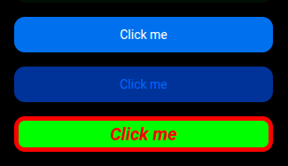

An issue I see a lot in UI component libraries is exposing a `className` prop, `style` prop, or any other way to modify the component's appearance so developers can customize it to suit "their needs" (I will explain what those needs are). But this **is a bad practice and you should avoid it**.

In this post, I will explain why.

## What kinds of UI component libraries does this apply to?

Before diving in, I want to clarify that there are different types of UI component libraries. We can group them in multiple ways, but for this post:

- **General-purpose component libraries**: Libraries that provide a set of slightly opinionated components designed to work across projects with minimal configuration. For example, [HeroUI](https://heroui.com/en/docs/react/components/button) or [Radix UI](https://www.radix-ui.com/primitives/docs/components/button).

- **Brand / app component libraries**: These are fully opinionated — they represent the company's UX language and patterns, and should be part of the brand identity. In other words, they are not just a set of components but also define a design system.

For the general-purpose ones, it is perfectly fine to expose `className` or `style` props. But **for brand/app libraries, you must avoid them**. That is the type of library I will be talking about in this post.

## Why `className` and `style` are a problem

As I mentioned before, a brand or app component library represents the company's UX language and patterns, and it should be part of the brand identity. Nothing else. If you allow modifying the component's appearance via `className` or `style` props, you are opening the door to breaking the consistency of the app and the brand identity.

### Semantic (and enumerated value) props vs styling props

As an opinionated component library, you should only allow modifying the component behavior or appearance via semantic and enumerated value props.

A semantic prop is a prop that modifies the behavior or visuals of the component — for example, `color`, `size`, `variant`, or `disabled`. The value represents more than just a style. For example, a `color` prop that accepts enumerated values like `primary`, `secondary`, `danger`, etc. is a semantic prop, because the value represents a meaning — an intention behind the choice.

If danger is red, that is just a color. But it could also be orange or any other color — it will always represent the same meaning: danger. Furthermore, this can be used for more than just a color: for example, to add ARIA attributes, to change the icon of the button, or to make the button require a hold action instead of a click to execute the action.

Also, for a typical component, a prop like `color` or `size` affects more than a single CSS property. For example, the `color` prop can affect the background color, the text color, and the border color, and the `size` prop can affect the padding, the font size, the icon size, and more.

**The complexity and the patterns are in the component implementation, not in the API.**

The opposite of semantic props are styling props like `className` or `style`, or direct props like `textColor` or `backgroundColor`. They are just a way to modify the style of the component without any meaning or intention behind it, making it impossible to define good patterns and to maintain the consistency of the app and the brand identity.

One of the goals of semantic props is to reduce incorrect usage. If a developer picks `secondary` when `danger` would be more appropriate, the component still works correctly — it just conveys the wrong semantic meaning. The logic stays inside the component. The developer needs to know less about the component and has limited options to choose from, forcing them to use the component the way it was designed to be used, which maintains the consistency of the app and the brand identity.

The same applies to children — you should not allow arbitrary elements as children of the component.

#### Examples (from real experience)

A button component *(I should pick a different component for examples someday, but buttons are universally understood — and deceptively complex internally)*,

You should allow changing the button's color via a `color` prop, or even better, via a `variant` prop that accepts enumerated values: `primary`, `secondary`, `danger`, etc. But never accept arbitrary values like a hex color or a CSS class name.

Suppose you allow arbitrary values — a hex color: `<Button color="#ff0000">` or a CSS class name: `<Button className="my-custom-class">`.

Even if the rendered color is the same as the `danger` variant, problems arise when your design team later decides the icon should use a color derived from the main color. If that derivation cannot be calculated automatically — because it must follow accessibility contrast rules — you will need to add a new prop to the API to allow specifying the color of the icon. This is just one example of how the complexity and the patterns are in the component implementation, not in the API.

The inevitable outcome: a prop API that mirrors every CSS property.

(style: max-width: 400px;)

## Evolving the component library

> "But I need a new state or behavior that is not provided by the component. We should be able to modify the component to adapt it to our needs."

There is another misconception here. A design system or component library should not cover a single team's needs — it should cover the needs of the company and maintain consistency across the app, regardless of which team implements the features. Customers experience the product as a single entity. They don't know — or care — which team built which screen. Inconsistency reads as incompetence.

The component library should evolve and adapt, but always with the full picture in mind, not just a single feature or a single team's requirements.

You can ignore this, but you will end up with a mess: different behaviors for the same thing in different parts of the app. That might be acceptable in the short term, but in the long term, the customers' perception of the product will suffer.

## Why not allow `className` and `style`? The short version

- ❌ **Breaks brand consistency** — any developer can override styles and diverge from the design system
- ❌ **Makes refactoring very hard** — changing a component's internal markup/classes breaks consumer overrides, creating fear of touch
- ❌ **Shifts complexity to the API** — instead of keeping logic inside the component, you must repeat the logic at every usage place
- ❌ **Eliminates semantic intent** — a className conveys nothing about _why_ the style was applied, only _what_ it looks like
- ❌ **Increases cognitive load** — developers must read the implementation to know which classes to override
- ❌ **Encourages one-off hacks** — easy overrides lead to bespoke styles that never get cleaned up
- ❌ **Defeats design tokens** — custom styles bypass the token system, so theme updates no longer propagate
- ❌ **Hinders accessibility** — overrides can accidentally break contrast, focus indicators, or reduced-motion handling

